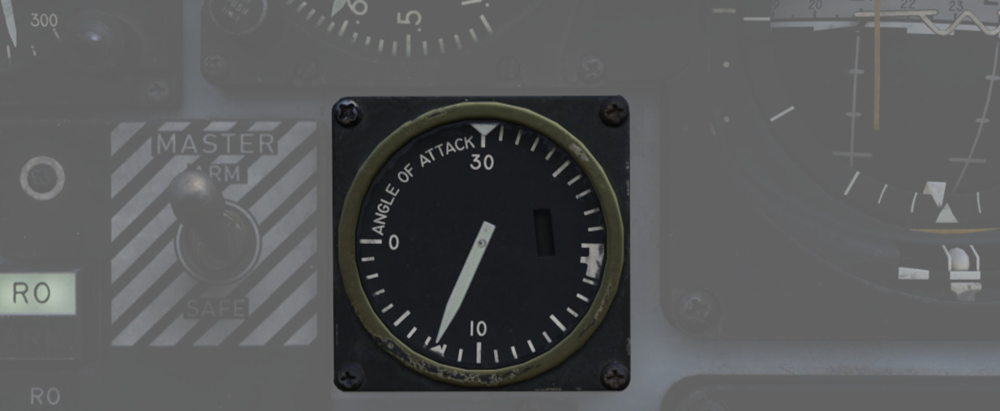
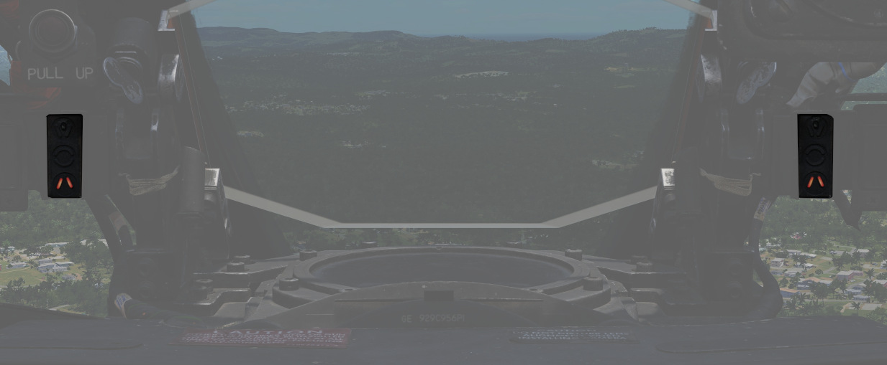

# Flight Control Surfaces and System

The flight controls include the slats seen in front of the wing in extended position, the flaps, the
rudder, the aileron-spoiler seen on top of the right wing in the picture and rearward stabilizers.

## Control Sticks

A control stick is provided in both cockpits, with near-uniform switchology
between the two. A Trim Control is found on both sticks to provide force
reduction and minor flight path correction in the pitch and roll axis. Weapons
are deliverable through both a Trigger
(for [air-to-air missiles](../../stores/air_to_air/overview.md) and the [gun](../../stores/guns.md))
and a Bomb Release Switch. Both sticks carry
a [Nose Wheel Steering button](gear_ground_handling.md#nose-gear-steering) that
doubles as a [radar](../radar.md) auto-acquisition control for the [radar](../radar.md) in visual
range combat, and sensor focus control for
video-directed [air to ground weapons](../../stores/air_to_ground/overview.md). An
[Emergency Quick Release lever](gear_ground_handling.md#emergency-anti-skid-quick-release-lever) on
each stick is available to immediately deactivate the anti-skid system, the automatic
flight control system, stab aug and the aileron-rudder
interconnect. Unique to the front cockpit control stick is
the [Air Refueling Release Button](../utility.md#air-refueling-release-button) - a dual-role
control that performs the boom disconnect function its name implies, as well as
a number of weapon selection functions.

Also, unique to the front cockpit stick is a force transducer, to allow the pilot
fine adjustment control of the AFCS with the autopilot functionality engaged. In the event the force
applied to the stick exceeds the AFCS breakout limit, autopilot will be turned off.

## Aileron-Spoiler Control and Stabilator Control Feel and Trim Systems

The Aileron-Spoiler Control System and the Stabilator Control System both offer
trim following; the former through a screw jack actuator, the latter using a
servo directed by the AFCS.
These functions cause the stick to position relative
to the current trim and autopilot position when the crew member in control goes
"hands off". It is therefore advisable to maneuver the stick to the same
position, or to gently move the stick to "breakout force" prior to disengaging
the autopilot system to reduce the chance for an abrupt return to pilot control.

To confirm current state of the stabilator trim, a Stabilator Trim Position
Indicator is provided on
the [front cockpit left vertical panel](../../cockpit/pilot/left_sub_panel.md#stabilator-trim-indicator)
.

## Rudder Control System

Yaw axis control is directed by the rudder pedals found in both cockpits. To
offset any relative skidding due to wind effect, stores imbalance, or minor
[engine](../engines_and_fuel_systems/engines.md) output deviation,
a [Rudder Trim Switch](../../cockpit/pilot/left_console/front_section.md#rudder-trim-switch) is
found on
the [engine control panel](../../cockpit/pilot/left_console/front_section.md#inboard-engine-control-panel)
in the front cockpit. On the ground, the pedals themselves can be pressed
independently for differential braking, and the rudder axis itself functions as
the nose wheel steering directional control when
the [Nose Wheel Steering button](gear_ground_handling.md#nose-gear-steering)
on either control stick is pressed.

## Aileron-Rudder Interconnect (ARI)

The aileron-rudder interconnect system causes rudder
displacement proportional to aileron displacement to
provide coordinated turns at low airspeeds. It is engaged automatically with the
[Slats Flap Switch](../../cockpit/pilot/left_console/wall.md#slatsflaps-control-panel)
in the OUT AND DOWN
position, and the airspeed below the flap blowup speed (230
knots).

The limits of
the system are 15° of rudder displacement when the
automatic flight control system is in the stability
augmentation or autopilot mode, and 10° rudder
displacement when the yaw stab aug switch is disengaged.

The circuit breaker for the ARI is located right of the
Emergency stores release.

> 💡 To permanently disengage the ARI, the circuit
> breaker on the left utility panel must be pulled
> and the yaw stab aug switch must be disengaged.
> Pulling the circuit breaker with the yaw stab aug
> engaged will still provide 5° of ARI rudder
> authority. When the ARI circuit breaker is
> pulled, the anti-skid system is disabled.

> 💡 Rudder jump will occur when the ARI system cuts
> in or out with a lateral control stick input. This
> will normally occur when the flaps are raised or
> lowered during a turn.

### Emergency disconnect

In the event either seat in command requires the ARI deactivated, the system can be disconnected by
pulling
the [Emergency Quick Release Lever](gear_ground_handling.md#emergency-anti-skid-quick-release-lever)
on their respective control stick. When the
switch is released the ARI (10°) and the yaw stab aug (5°)
rudder authority is regained. Function of the ARI
can always be overridden through the rudder pedals.

## Automatic Flight Control System (AFCS) - AN/ASA-32

<!-- ## Stability Augmentation System -->

The automatic flight control system (AFCS) is an
electro-hydraulic system designed to provide stable,
accurate, and coordinated flight maneuvers without
interferring with manual control. The automatic flight
control system is capable of performing two modes of
operation, **stability augmentation** and **AFCS**.

**Stability augmentation** improves airplane stability in pitch, roll,
and yaw; it opposes any change of attitude but does not
return the airplane to a given attitude or ground track.
This mode of operation may be used while the aircraft is
under manual control. Stability augmentation can be
engaged individually or in any combination for pitch, roll,
or yaw axis. The **AFCS mode** of operation maintains any
aircraft heading and/or attitude selected within the AFCS
limits and corrects for any deviation from the selected
heading or attitude of the aircraft within the AFCS limits.
The AFCS switch can be engaged with only
the pitch stab aug switch engaged; however, to provide full
AFCS operation, all three stab aug switches must be
engaged. The **altitude hold mode** of operation holds any altitude
selected while in the **AFCS mode**.

> 💡 The AFCS system can be engaged and hold maneuvers and
> attitudes within a range of ±70° pitch, 70° in bank and 360°
> in azimuth, providing the G limits are not being exceeded.
> Rapid stabilator movements, whether pilot induced or
> uncommanded, will cause the AFCS switch to disengage.

> 💡 In the altitude hold mode, altimeter fluctuations  while accelerating
> through the transonic range (0.9 to 1.0 Mach) will produce
> transient fluctuations which, although not violent, may
> cause the reference altitude to slip. Engaging the altitude
> hold mode in climbs greater than 1000 feet per minute
> may result in a reference altitude other than the engage
> altitude.

### Force Transducer

The force transducer senses the physical force applied to
the control stick. This unit actually comprises the visible
portion of the control stick with the stick grip mounted on
top of it. The force transducer contains pressure sensitive
switches which react to longitudinal and lateral stick
forces. A lateral stick force of approximately 1.5 pounds
closes a force switch. When a roll force switch closes the
roll rate gyro signal in stab aug and the roll rate and
attitude gyro signals in AFCS mode are cut out so that
pilot initiated maneuvers are not opposed while in the
AFCS mode. The pilot maneuvers the aircraft by
mechanical linkages until the lateral stick force is reduced
to less than approximately 1.5 pounds. At this time the roll
channel is returned to normal AFCS operation. A forward
stick force of 3.75 ±0.25 pounds or an aft stick force of 2.55
±0.25 pounds closes switches to operate certain AFCS
components, and cause a force sensing device to send a
signal, proportional to the applied stick force, to the servo
amplifier and stabilator position is controlled through the
AFCS. If the pitch or roll limits of the AFCS (±70°) are
exceeded, the AFCS will disengage. The AFCS switch may
or may not disengage. If the switch does not disengage, the
AFCS will immediately reengage when the aircraft
returns to within the AFCS limits.

### G-Limit Accelerometer

The normal load factor interlock (G-disengage) feature of
the AFCS is designed to inhibit the system from
commanding excessive load factors on the airplane. The
system reverts automatically from whatever mode is
engaged to stability augmentation in the event that +4 or
-1 G is sensed by the G-disengage
accelerometer switch. This switch is mounted forward on
the radar bulkhead so that if the airplane is rotated
rapidly into a maneuver, disengagement occurs at lower
values of normal load factor due to the anticipation
resulting from the forward location sensing a component
of pitching acceleration. The G-disengage feature is
inoperative outside the ±70° limits of the autopilot.

> ⚠️ The G switch does not disengage the autopilot
> under conditions of low airspeed or heavy gross
> weight before the aircraft stalls. If the autopilot
> remains engaged during a stall, the autopilot
> provides pro-spin controls.

### Emergency Quick Release Lever

A spring-loaded emergency quick release lever is on each
control stick. This lever operates in the same manner from
both the front and the rear cockpits. Depressing the lever
causes the AFCS and altitude hold switch to return to
OFF. The stability augmentation mode, ARI and
anti-skid, are disengaged as long as the lever is held
depressed. When the lever is released, the stability
augmentation, anti-skid, and ARI are again in operation,
but the AFCS is no longer engaged. To permanently
disengage. the stability augmentation mode, the pitch, roll,
and yaw stab aug switches must be placed off. To
permanently disengage the ARI and anti-skid, the yaw
stab aug switch must be off and the ARI circuit breaker,
on the front cockpit left subpanel, must be pulled.

### Autopilot Disengage Indicator Light

An AUTOPILOT DISENGAGE indicator light is on the
telelight panel. After initial engagement of the AFCS
mode, the AUTOPILOT DISENGAGE indicator light and
the MASTER CAUTION light illuminates when the AFCS
is disengaged. Both lights are extinguished by pressing the
master caution reset switch. The lights remain
extinguished until the AFCS is again engaged and
disengaged.

### Pitch Aug Off Indicator Light

The PITCH AUG OFF indicator light is on the telelight
panel. The PITCH AUG OFF and MASTER CAUTION
lights illuminate when power is on the airplane and the
pitch stab aug switch is not engaged. Depressing the
master caution reset button extinguishes the MASTER
CAUTION light; however, the PITCH AUG OFF light
remains illuminated until the pitch stab aug is engaged.

### Automatic Pitch Trim

An automatic pitch trim feature is included in the AFCS
which attempts to keep the airplane longitudinally
trimmed to the flight conditions experienced while in
AFCS mode. Thus, an out-of-trim condition (which would
not be sensed while in autopilot mode) is prevented,
ensuring against an excessive pitch transient when
disengaging the autopilot. The automatic pitch trim
operates at approximately 40% the speed of the normal
trim system, resulting in a slight delay after changing
flight conditions before the basic airplane is properly
trimmed. During control stick steering maneuvering, the
auto-trim is inoperative. Auto-trim operation can be
observed on the pitch trim indicator after changing flight
conditions in the AFCS mode.

### Autopilot Pitch Trim Light

An AUTOPILOT PITCH TRIM indicator light is on the
telelight panel. This light illuminates during AFCS
operation if the automatic pitch trim follow up is
inoperative or lagging sufficiently behind airplane
maneuvering to cause an out-of-trim condition in the
basic airplane. Ilu

### Normal Operation

1. To engage the stability augmentation mode, place
the pitch, roll, and yaw stab aug switches to
ENGAGE.
2. Trim aircraft in the stability augmentation mode
before engaging AFCS mode.
3. To engage AFCS mode, establish an aircraft
attitude within AFCS limits. Place the AFCS switch
to ENGAGE.
4. When aititude hold mode is desired, place altitude
hold switch to ENGAGE.

> ⚠️ Do not attempt to change pitch attitude of the
> aircraft from the rear cockpit in the AFCS mode.
> Since no force, transducer is in the rear cockpit
> control stick, applying force will cause pitch trim
> to run up and down depending on pressure
> applied. If the pilot attempts to take control at
> that point, violent transients may be
> encountered.

> 💡 Do not operate manual trim button while in the
> AFCS mode unless the AUTOPILOT PITCH
> TRIM light is illuminated. Use a small amount of
> manual trim to extinguish the AUTOPILOT
> PITCH TRIM light.

> 💡 To change altitude when operating in altitude
> hold, use the control stick. This disengages the
> altitude hold circuits and the altitude hold switch
> moves to OFF. Re-engage altitude hold at the
> new altitude if altitude hold is desired.

> 💡 The AFCS is disengaged when the emergency
> quick release lever on the control stick is
> depressed. The stability augmentation and ARI
> are disengaged as long as the lever is held
> depressed but returns to operation when the lever
> is released.

<!-- OPERATIONAL PRECAUTIONS -->

<!-- * Because the stability augmentation system can misinterpret roll oscillation in
high AoA maneuvering and inadvertently invoke adverse roll, it is suggested to
disable the Roll channel prior to aerobatics or combat to alleviate this
possibility. -->

## Slats Flap System

The Slats Flap system is manually selected for takeoff and landing, then
automatically controlled relative to AoA for best handling performance in all
other flight regimes. Control is through
a [three position switch](../../cockpit/pilot/left_console/wall.md#slatsflaps-control-panel) found
outboard of the left [throttle](../../cockpit/pilot/left_console/front_section.md#throttles)
handle in the front cockpit and driven by the aircraft hydraulic system.
The [three switch positions](../../cockpit/pilot/left_console/wall.md#slatsflaps-control-panel) are
Norm, Out, and Out and Down, and the resulting command can be moderated based on whether or not the
landing gear is being deployed.

Norm is the standard in-flight position, locking the Flaps and automatically
programming the Slat deployment as a function of AoA.

Out deploys the Slats to their fully deployed position. Should the landing gear
be deployed, both the Slats and Flaps will deploy.

Out and Down fully deploys both the Slats and the Flaps. Should the landing gear
not be down, the Wheels Light on
the [telelight](../../cockpit/pilot/right_sub_panel.md#telelight-annunciator-panel) Panel will
illuminate and flash.

Both cockpits have
a [Slats Flap Indicator](../../cockpit/pilot/left_sub_panel.md#slatsflaps-indicators), which read In
and Out, along with a
barber-pole reading when the surfaces are in transition.

In the Norm position, Maneuvering Slat deployment is a function of AoA; above
11.5 units they will extend, then retract when the aircraft is reduced below
10.5 units. Maneuvering Slat operation includes a speed-induced blowback; slats
will retract due to air pressure between 568 and 602 knots.

To the rear of the Fuel Control Panel in the front cockpit is the Slat Override Switch. Guarded,
this switch has two positions: NORM and IN. Defaulted to NORM under the guard, switching to IN
forces the retraction of the slats, no matter the current aircraft AoA or state of the Slats Flap
Switch position; this action will trigger the SLATS IN warning on
the [telelight](../../cockpit/pilot/right_sub_panel.md#telelight-annunciator-panel) Panel and
illuminate the [Master Caution](../../cockpit/pilot/right_main_panel.md#master-caution-light).

The Slats Flaps system also has an Emergency system; handles are found on the
[Slats Flaps control panel](../../cockpit/pilot/left_console/wall.md#slatsflaps-control-panel) in
the front cockpit, and next to the rear cockpit
[throttle](../../cockpit/wso/left_console/front_section.md#throttles) pair. The emergency system
uses pneumatic pressure, and does not
require electrical power to force deployment. The emergency system can only
function once, and can be actuated at any airspeed; however, above 230 knots,
the Flaps will retract based on air pressure, and the normal Slat retraction
speeds also apply.

## Speed Brakes

Underneath the aircraft and close to the rear [Sparrow](../../stores/air_to_air/aim_7.md) recesses
are the [speed
brakes](../..), installed on the wings. The speed brakes are driven by the aircraft's
hydraulic system and actuated by
a [three position switch](../../cockpit/pilot/left_console/front_section.md#throttles) found on the
inboard [throttle](../../cockpit/pilot/left_console/front_section.md#throttles) in both cockpits.
Either switch will actuate the brakes. The positions
are Out, Stop, and In; the Out position is momentary and reverts back to Stop when released.

Brake actuation illuminates the Speed Brake Out Indicator Light found on the
[telelight Panel](../../cockpit/pilot/right_sub_panel.md#telelight-annunciator-panel). Brake
deployment and illumination of the Indicator does not
trigger the [Master Caution](../../cockpit/pilot/right_main_panel.md#master-caution-light).

## Angle of Attack System

To precisely monitor and control aircraft flight performance, the Angle of
Attack System (AoA) provides visual and audio confirmation of current
parameters. Included in the system are the Angle of Attack Indicators found in
both cockpits, the illuminated Angle of Attack Indexers, as well as the AoA
Aural Tone System.

The angle of attack is typically measured in degrees (°). It represents the deviation from the
alignment of the chord line of the airplane with the oncoming air or relative wind.

### Indicators

The Angle of Attack Indicator dials register AoA values from 0 to 30 units, with
indications for weight-relative optimum altitude cruise (7.9 units), approach
(19.2 units), and stall (30 units). The AoA Indexer only works when the gear is in the down
position.

AoA units do not directly translate to degrees, one unit of AoA is
the same as roughly 0.95 degrees and the measured AoA is also offset
by about 4 degrees. This way, the indicator displays a more natural and useful
value to the crew.

> 💡 Extension of the landing gear and thus the nose
> gear door changes the airflow around the probe causing to indicate higher
> angles by 1 unit. The approach airspeeds account for that. Therefore, performing
> an approach with the gear retracted, will cause the indicators to show
> approximately 1 unit low, and the aircraft will be roughly 5 knots fast for an
> on-speed approach.

### Indexers

The AoA Indexers, found on the windshield frame of the front cockpit, and above
the instrument panel in the rear, display color coded and directional symbology
for the on-speed approach value of 19.2 units once the landing gear have been
lowered.

## Aural Tone System

The Aural Tone System provides audible feedback in maneuvering flight and during
landing configuration. Beginning above 15 units AoA with gear down, and 21 units
AoA with the gear up and slats in, a pulse will be heard by both crew-members.

The rate of the pulse can vary from 1.5 to 20 pulses per second, with increasing
frequency based on higher AoA values.

This tone can be lowered in volume below 20.3 units AoA gear down/25 units gear
up with controls in each cockpit; exceeding these values will cause the system
to override the volume limits and deliver the warning pulses at a minimum
volume to ensure they are audible regardless of volume setting.

> 💡 The respective knobs are labelled STALL WARNING and can be found on the right
> side in either cockpit. They must not to be confused with the AURAL TONE CONTROL
> knobs, which control weapon related tones.

Due to limited forward visibility, the tones are a crucial aid during landing.
If a low pitch tone playing at a pulse is heard, the aircraft is too fast.
If a high pitch tone playing at a pulse is heard, the aircraft is too slow.
For the proper on-speed configuration, a steady tone at a medium pitch is played.

## Stall Warning Vibrator

The left front cockpit pedal includes a Stall Warning Vibrator, which is
activated over 22.3 units Angle of Attack. This physical (and in DCS audible)
indication is given to make the pilot aware of the potential of an impending
stall and provide enough time to reduce AoA and prevent the loss of control of
the aircraft. Reducing AoA below the threshold will deactivate the warning.
