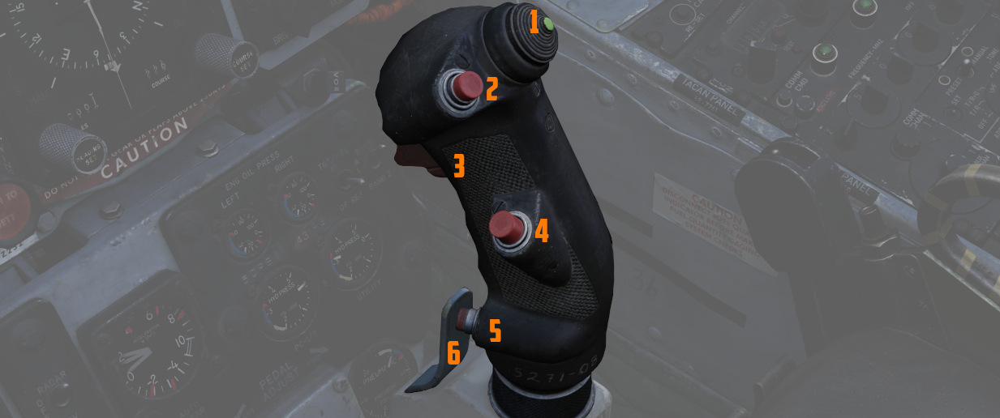
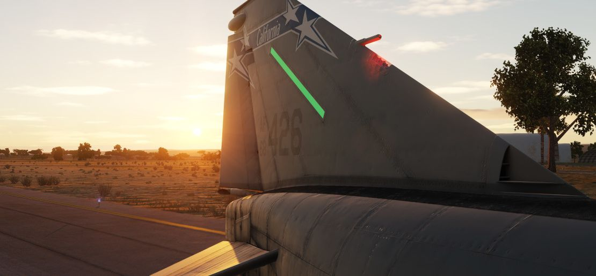
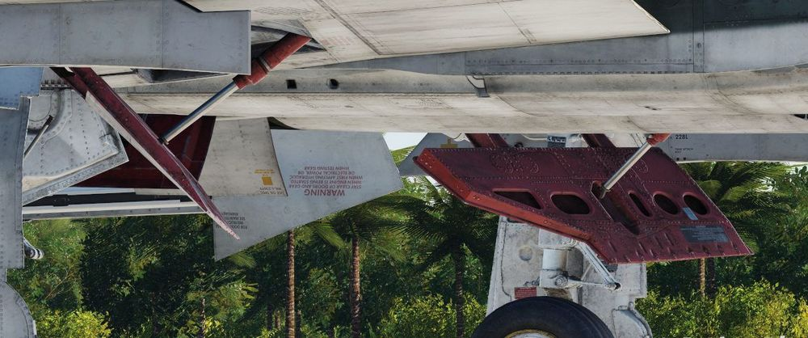

# 飞行操纵系统

鬼怪的飞行操纵面主要由
[平尾](./flight_controls.md#aileron-spoiler-control-and-stabilator-control-feel-and-trim-systems)
、[方向舵](./flight_controls.md#rudder-control-system)、[副翼](./flight_controls.md#aileron-spoiler-control-and-stabilator-control-feel-and-trim-systems)和[扰流板](./flight_controls.md#aileron-spoiler-control-and-stabilator-control-feel-and-trim-systems)组
成。飞机上的人感系统为驾驶杆和方向舵脚蹬提供了气动力模拟。次要操纵面
为[前缘襟翼/缝翼](./flight_controls.md#slats-flap-system)、[后缘缝翼](./flight_controls.md#slats-flap-system)和
安装在机翼上的[减速板](./flight_controls.md#speed-brakes)。

<iframe width="560" height="315" src="https://www.youtube.com/embed/EXsTlmokAlQ?si=QZfuCaOXcLmS9g1Z" title="F-0005 Flight Control Systems for the F-4" frameborder="0" allow="accelerometer; autoplay; clipboard-write; encrypted-media; gyroscope; picture-in-picture; web-share" referrerpolicy="strict-origin-when-cross-origin" allowfullscreen></iframe>

## 摆重与膜盒

驾驶杆和操纵面的连接、与配平系统相互作用以及 AFCS，各种力的复杂组合并形成相互平
衡。

连接到驾驶杆的摆重将将根据当前过载前推驾驶杆来实现增加移动驾驶杆所需的力。例如：
当拉杆并出现正过载时，摆重将变得“更重”，使得向后拉杆越发困难，自然导致驾驶杆趋向
回中。

位于垂尾的膜盒进口通过感测冲压空气压力来驱动膜盒系统工作来反向抵消摆重系统。

膜盒根据空速向后拉杆。例如，手离开杆并且飞机出现非预期压机头时，空速增加并且膜盒
系统将向后拉杆、自然让飞机抬头并再次稳定水平飞行。

配平改变连接膜盒和驾驶杆之间的杠杆臂的长度，致使改变可施加的有效力。

> 🟡 膜盒进口堵塞或结冰将导致系统功能失常。出现这种情况，将导致配平失效并且取决
> 于膜盒和摆重的平衡状况，可能会出现突然抬/压机头。为避免堵塞疏通后再次出现俯仰
> 变化，请保持配平中立。

在正常空速下，水平飞行时，两个相反的力精密平衡使驾驶杆保持在中立位。不过，由于系
统的动态特性，飞行员需要不断对飞机进行配平来应对极小的飞行条件变化导致的平衡改变
，特别是在过载或空速变化时，驾驶杆感受特性将大幅改变。

## 驾驶杆

两个驾驶舱都配备了驾驶杆，两根驾驶杆的开关设置几乎一致。每根驾驶杆上都有配平控制
(<num>1</num>)，用于减少杆力和在俯仰及横滚轴上进行微小的飞行路径修正。扳机
(<num>3</num>)（用于[空对空导弹](../../stores/air_to_air/overview.md)和
[航炮](../../stores/guns.md)）和航弹投放按钮(<num>2</num>)用于进行武器投放。两根
驾驶杆上都有一
个[前轮转向按钮(<num>5</num>)](gear_ground_handling.md#nose-gear-steering)，该按
钮在视距内战斗中作为[雷达](../radar/overview.md)自动截获，以及用于电视制
导[空对地武器](../../stores/air_to_ground/overview.md)的传感器焦点控制。每根驾驶
杆上都有一
个[应急快速释放杆(<num>6</num>)](gear_ground_handling.md#emergency-anti-skid-quick-release-lever)，
用于立即停用防滑、ARI、自动驾驶和增稳系统。前座驾驶杆独有开关的
是[空中受油断开按钮(<num>4</num>)](../engines_and_fuel_systems/fuel_system.md#air-refueling-release-button)——
一个双功能的控制开关，用于执行字面意思的断开硬管功能，以及多种武器选择功能。

前座驾驶杆上独占的还有一个力传感器，允许飞行员在接通自动驾驶功能时对 AFCS 进行微
调控制。如果施加在驾驶杆上的力超过 AFCS 断开限制，自动驾驶将被临时关闭。

## 副翼-扰流板控制和平尾操纵感受和配平系统

副翼-扰流板操纵系统和平尾操纵系统都提供跟随配平功能；前者通过螺旋千斤顶作动器实
现，后者使用由 AFCS 控制的伺服电机实现。这些功能会在飞行员松手时，使驾驶杆相对于
当前的配平位置和自动驾驶仪位置进行定位。因此，在断开自动驾驶系统之前，建议将驾驶
杆移至相同位置，或轻轻移动驾驶杆至“断开力”位置，以减少驾驶杆突然回到飞行员手中的
可能性。

如需确认当前平尾的配平状态，可以查看位
于[前座左垂直面板](../../cockpit/pilot/left_sub_panel.md#stabilator-trim-indicator)
中的平尾配平位置指示器。

## 方向舵操纵系统

偏航轴控制由位于两个驾驶舱中的方向舵脚蹬负责。前座的发动机控制面板上设有一
个[方向舵配平开关](../../cockpit/pilot/left_console/front_section.md#rudder-trim-switch)来
抵消由于风效应、挂载不平衡或轻微
的[发动机](../engines_and_fuel_systems/engines.md)输出差异导致的侧滑。在地面上，
脚蹬可以独立踩下来实现差动刹车，飞行员可通过按下任一根驾驶杆上
的[前轮转向按钮](gear_ground_handling.md#nose-gear-steering)现实前轮转向控制功能
。

## 副翼-方向舵交联系统

为了协助在低速进行协调转弯，“鬼怪”II 战机安装有副翼-方向舵交联系统。该系统
在[缝翼襟翼开关](../../cockpit/pilot/left_console/wall.md#slatsflaps-control-panel)处
于伸出和下放档位，且低于襟翼吹起空速（230 节）时自动接通。

当自动飞行控制系统处于增稳或自动驾驶模式时，系统的方向舵位移限制在 15° 内，当偏
航增稳开关断开时，系统的方向舵位移限制为 10°。

ARI 的断路器位于挂载应急抛弃的右边。

> 💡 如需永久断开 ARI，抽出位于左侧子面板中的断路器并断开偏航增稳开关。仅抽出断
> 路器但不断开增稳开关将使 ARI 仍有 5° 方向舵权限。抽出 ARI 断路器后，防滑系统也
> 将被禁用。

> 💡 当 ARI 系统接通或断开时存在横向驾驶杆输入，方向舵将出现摆动。通常在襟翼收上
> 或放襟翼转弯时发生。

### 应急断开

如果任一驾驶舱中需要停用 ARI，机组可以通过拉动各自驾驶杆上
的[应急快速释放杆](gear_ground_handling.md#emergency-anti-skid-quick-release-lever)
来断开该系统。重新松开开关将会重新接通 ARI(10°)和偏航增稳 (5°)的方向舵权限。机组
始终可以通过方向舵脚蹬来超控 ARI 功能。

## 自动飞行控制系统（AFCS） - AN/ASA-32

自动飞行控制系统（AFCS）是一套电-液系统，旨在不干扰手动控制同时，提供稳定、准确
且协调的飞行机动。AFCS 有两种工作模式，**增稳**和**AFCS**。

> 💡 术语“AFCS”为整个系统的名称但同样还是一种飞机子模式，用来激活姿态保持和/或航
> 向保持以及高度保持。

**增稳** 将提高飞机在俯仰、横滚和偏航方向上的稳定性；增稳模式下将补偿姿态变化，
但不会使飞机返回到指定的姿态或地面航迹。这种工作模式可以在飞机处于手动控制状态时
使用。飞行员可单独接通增稳通道，也可以使用俯仰、横滚和偏航轴中的任何组合。

**AFCS 模式**是在 AFCS 限制内保持选定的飞机航向和/或姿态，并在 AFCS 限制内纠正设
定的航向或姿态偏差。AFCS 开关(<num>2</num>)可以在仅接通俯仰增稳开关时使用；但是
，要使用完整的 AFCS 操作，必须接通所有增稳开关。

> 💡 接通 AFCS 工作模后，系统将在限制（±70° 俯仰，70° 横滚和 360° 方位）内保持机
> 动和姿态，前提是不超过过载值限制。无论飞行员是否有意进行快速转动平尾，都会使
> AFCS 断开。

在飞机坡度保持在 ±5° 内时，接通 AFCS 开关后系统将保持一个 **机翼水平姿态**，并保
持接通时的 **航向**。按住前轮转向按钮（驾驶杆上）时，系统将断开航向保持并 **姿态
保持** 将可用。飞行员可通过再次按下前轮转向按钮来重新建立航向保持。在接通 AFCS
开关时如果坡度超过 ±5°，系统将保持接通时所处的坡度。

**高度保持模式** 工作模式(<num>3</num>)将使飞机保持在进入 **AFCS 模式** 后，选择
的任意高度。

> 💡 在加速通过跨声速区间(0.9 至 1.0 马赫)时，高度表可能会短暂出现波动，这种波动
> 虽然不剧烈，但可能导致基准高度滑动。在爬升速度超过 1000 FPM 时接通高度保持模式
> 可能导致基准高度超过接通的高度。

### 力传感器

力传感器感测施加在驾驶杆上的物理力。装置包括驾驶杆的可见部分和安装在其顶部的杆握
。

力传感器包含对纵向和横向力作出反应的压敏开关。大约施加 1.5 磅的横向力可以关闭力
开关。当横滚力开关断开增稳中的横滚速率陀螺信号，以及断开在 AFCS 模式中使用的横滚
速率和姿态陀螺信号时，飞行员可在 AFCS 模式下进行机动，此时 AFCS 不会对偏离进行补
偿。在横向杆力降至小于大约 1.5 磅前，飞行员将通过机械连接操纵飞机。在横向杆力小
于 1.5 磅后，横滚通道将恢复正常 AFCS 操作。

在向前施加 3.75±0.25 磅或向后施加 2.55±0.25 磅杆力时，开关将关闭来操作某些 AFCS
部件，并使力感应设备发送一个与施加杆力成比例的信号到伺服放大器，AFCS 将控制平尾
位置。

后座并未安装力传感器。AFCS 和横滚增稳将对抗后座驾驶杆输入。不要在接通 AFCS 时在
后座操纵飞机。在接通了横滚增稳时且同时横滚中时务必注意操纵移交。

### 过载限制加速度计

AFCS 的正常过载互锁(G-disengage)功能旨在禁止系统指令使用过多的过载。当加速度计开
关感测到+4 或-1G 时，系统会自动从接通的任意模式自动回退至增稳模式。

这个开关安装在雷达隔框前方，这样一来如果飞机快速转动进入机动，由于靠前安装可以更
好感测到俯仰加速度的分量，使得系统可以在较低的过载值断开。

在自动驾驶 ±70° 限制外，G-disengage 功能无法使用。

> 🔴 警告：在低空速或重载情况下，在飞机失速前过载开关都不会断开自动驾驶。如果在
> 失速时自动驾驶仍保持接通，自动驾驶将施加尾旋倾向控制。

### 应急快速释放杆

每跟驾驶杆上都有一个弹簧复位的应急快速释放杆。这个杠杆在前后驾驶舱的操作方式相同
。

按下释放杆将使 AFCS 和高度保持开关退回至 OFF。增稳模式、ARI 和防滑，只要握住释放
杆，这些功能都将断开。松开释放杆后，增稳、防滑和 ARI 将再次工作，但 AFCS 不会重
新接通。

要永久断开增稳模式，俯仰、横滚和偏航增稳开关必须拨至关闭。要永久断开 ARI 和防滑
，必须关闭偏航增稳开关，并且抽出位于飞行员驾驶舱左侧子面板中的 ARI 断路器。

### 自动驾驶断开指示灯

远传信号灯面板中有一个 AUTOPILOT DISENGAGE 指示灯。在接通 AFCS 模式后，后续断开
AFCS 将使 AUTOPILOT DISENGAGE 指示灯和主注意灯亮起。

飞行员可按下主注意复位开关来复位灯光。在 AFCS 再次接通并断开前，灯光将保持熄灭姿
态。

### 俯仰增稳关断指示灯

当飞机通电且未接通俯仰增稳时，远传信号灯面板中的 PITCH AUG OFF 指示灯将和主注意
灯一起亮起。

按下主注意复位按钮将使主注意灯熄灭。而 PITCH AUG OFF 灯将保持亮起，直到接通
PITCH STAB AUG 开关。

### 自动俯仰配平

AFCS 拥有自动俯仰配平功能，配平功能将尝试在纵向配平飞机与在 AFCS 模式下的飞行状
态保持一致。

因此，在断开自动驾驶模式时，可以防止出现未配平情况（在自动驾驶模式时不会感测），
确保在断开后不会出现过大俯仰振荡。

自动俯仰配平的工作速度大约为正常配平的 40%，所以在飞行状态改变后，飞机在正确配平
之前会有一定的延迟。在驾驶杆转向期间，自动配平不起作用。飞行员可以在 AFCS 模式下
调整飞行状态，然后查看平尾配平指示器来观察自动配平工作。

### 自动驾驶俯仰配平灯

在 AFCS 工作期间，如果自动俯仰配平跟随不起作用或在飞机机动后明显滞后，从而导致飞
机出现未配平姿态，远传信号灯面板中的 AUTOPILOT PITCH TRIM 灯将亮起。

### 正常操作

1. 如需接通增稳模式，需要将俯仰、横滚和偏航增稳开关拨至 ENGAE。2. 在接通 AFCS 模
   式前，在增稳模式下使飞机配平。3. 如需接通 AFCS 模式，将飞机姿态调整至 AFCS 限
   制内。将 AFCS 开关拨至 ENGAGE。4. 如果想要接通高度保持模式，将高度保持开关拨
   至 ENGAGE 档位。

> 🔴 警告：在 AFCS 模式下不要试图从后座改变飞机的俯仰姿态。由于后座驾驶杆上没有
> 力传感器，因此施加杆力会导致俯仰配平上下运动，具体取决于施加的力。如果飞行员试
> 图同时进行控制，可能会遇到剧烈的振荡。

> 🔴 警告：在选择 AFCS 模式时，手要放在驾驶杆上来消除任何在 AFCS 出现功能失常时
> 导致的突然操纵移动。

> 💡 扣动驾驶杆上的应急快速释放杆时，AFCS 将断开。只要握住释放杆，增稳和 ARI 将
> 保持断开，在松开后将恢复工作。

### 操作注意事项

#### 滚转反逆

自动飞行控制系统在 AFCS 模式下工作时有可能出现滚转反逆情况。这种情况下并不会经常
出现并且仅会在小幅改变坡度时出现。滚转反逆和横向通道中存在小幅未配平情况有关，并
且将以向杆力反方向进行缓慢横滚形式显现。例如，如果飞机在接通 AFCS 模式时存在未配
平向左横滚，那么在向右压杆时将可能会出现滚转反逆。在 AFCS 模式下操作手动横向配平
按钮加上向配平反方向小幅压感也有可能导致滚转反逆。在飞行状态出现变化的同时改变飞
机配平就会出现这一情况。鉴于上述情况，应遵守以下说明：

1. 在增稳模式配平，配平完成后再接通 AFCS 模式。 2. 接通 AFCS 模式时不要使用横向
   手动配平。如果由于飞行状态发生变化遭遇滚转反逆；消除横滚，重新配平，重新横滚
   。

#### 俯仰振荡

在使用高度保持模式时，飞机在跨声速区域可能因大气数据计算机空速系统波动而发生俯仰
振荡。此类振荡的性质可能从驾驶杆升级到发散性俯仰振荡。建议若在跨声速空速下发生俯
仰振荡，尝试采取以下纠正措施：

1. AFCS 开关 – 断开 2. 静压补偿器开关 – OFF 3. AFCS 开关 – 接通 4. 接通高度保持
   模式

如果在采取上述措施后振荡仍持续，或在超声速空速下遇到振荡：

1. 断开高度保持模式。

> 🔴 警告：不应该放任发散性俯仰振荡增长。如果注意到有发散性俯仰运动，应该立刻做
> 出修正。

## 襟缝翼系统

在起飞和降落时，飞行员需要手动选择缝翼襟翼系统，然后系统自动根据迎角进行控制，以
在所有其它飞行状态下获得最佳操纵性能。飞行员可通过位于前
座[左侧](../../cockpit/pilot/left_console/front_section.md#throttles)油门握把外
侧
的[三档位开关](../../cockpit/pilot/left_console/wall.md#slatsflaps-control-panel)来
控制缝翼襟翼系统，并由飞机的液压系统驱动
。[开关](../../cockpit/pilot/left_console/wall.md#slatsflaps-control-panel)有三
个档位，分别是： Norm、Out 和 Out and Down，根据起落架是是否放下，对应的档位的控
制指令可能有所不同。

Norm 是飞行时的标准档位，锁定襟翼，并根据迎角自动调度缝翼伸缩。

Out 档位将完全伸出缝翼。如果放下起落架，那么缝翼和襟翼都会伸出/放下。

Out and Down 将完全伸出缝翼和完全放下襟翼。如果未放下起落架，那
么[远传信号灯面板](../../cockpit/pilot/right_sub_panel.md#telelight-annunciator-panel)上
的 Wheels 灯将会亮起并闪烁。

两个驾驶舱都
有[缝翼襟翼指示器](../../cockpit/pilot/left_sub_panel.md#slatsflaps-indicators)，
指示器将显示 In 和 Out，以及在过渡时显示条状纹。

在 Norm 档位时，系统将根据迎角伸出机动缝翼；当迎角超过 11.5 个单位时，系统将伸出
机动缝翼，然后当迎角降至 10.5 个单位以下时收回。机动缝翼工作还包括一种由空速引起
的吹回现象；当空速在 568 到 602 节之间时，缝翼将因气压而收回。

缘缝翼超控开关位于前座燃油控制面板的后方。这个带保护盖的开关有两个档位： NORM 和
IN。保护盖关闭时开关处在默认 NORM 档位，切换到 IN 档位，无论当前飞机迎角或缝翼襟
翼开关所处档位如何，都会强制收起缝翼；这个动作会触
发[远传信号灯](../../cockpit/pilot/right_sub_panel.md#telelight-annunciator-panel)面
板中的 SLATS IN 警告灯，并
使[主注意灯](../../cockpit/pilot/right_main_panel.md#master-caution-light) 亮起
。

缝翼襟翼系统还有一个应急系统；位于前
座[缝翼襟翼控制面板](../../cockpit/pilot/left_console/wall.md#slatsflaps-control-panel)上
应急操作手柄，以及后
座[油门握把](../../cockpit/wso/left_console/center_section.md#throttles)旁边。应
急系统使用气动力，无需电力即可强制伸出。应急系统只能使用一次，并且可以在任何空速
下启动；然而，空速超过 230 节时，襟翼将受到气压影响收上，同样影响适用于缝翼。

## 减速板

[减速板](../..)安装在飞机底部，靠近后
部[“麻雀”](../../stores/air_to_air/aim_7.md)导弹的半埋挂点附近。减速板由飞机的液
压系统驱动，机组可通过两个驾驶舱中，内侧油门握把上
的[三档位开关](../../cockpit/pilot/left_console/front_section.md#throttles)进行
控制。任意一个开关都可以让减速板动作。三档位分别是 Out、Stop 和 In；Out 档位为弹
簧复位，在松开开关时恢复到 stop 档位。

展开减速板将
使[远传信号灯面板](../../cockpit/pilot/right_sub_panel.md#telelight-annunciator-panel)中
的 Speed Brake Out 指示灯亮起。展开减速板或 SBO 指示灯亮起不会触
发[主注意灯](../../cockpit/pilot/right_main_panel.md#master-caution-light)。

## 迎角系统

为了能够精确监控和控制飞机飞行性能，迎角系统（AoA）为飞行员提供了当前参数的视觉
和音频提示。该系统包括位于两个驾驶舱中的迎角指示器、迎角分度器以及迎角音调提示系
统。

迎角通常以度（°）为单位测量。迎角为翼弦与来流矢量在飞机对称面内投影的夹角。

### 指示器

迎角指示器的刻度显示区间在 0 到 30 单位迎角，其中包括与重量相关的最佳巡航迎角指
示（7.9 个单位）、进近（19.2 个单位）和失速（30 个单位）。

> 💡 迎角分度器仅在起落架处于放下档位时工作。

迎角单位不直接转换为度。1 个单位迎角大约相当于 0.95 度迎角，并且测量的迎角还有大
约 4 度的偏置。这样，指示器才能向机组显示更自然、更有用的迎角数值。

> 💡 放下起落架，特别是前起落架舱门打开后，流经传感器的气流会发生变化，这会导致
> 迎角指示增加大约 1 个单位。进近空速已经考虑到了这一点。因此，若在收起起落架的
> 状态下进近，将导致迎角指示器显示的数值比实际低大约 1 个单位，从而导致在最佳进
> 近迎角时，比正常快出 5 节。

### 分度器

迎角分度器位于飞行员驾驶舱的风挡玻璃框架上，以及 WSO 驾驶舱的仪表板上方，在放下
起落架后，以颜色编码和方向标识符显示 19.2 个单位最佳进近迎角。

## 音调提示系统

音调提示系统在机动飞行和着陆构型期间提供可听觉反馈。当迎角超过 15 个单位（起落架
放下）和 21 个单位（起落架收起且缝翼收起）时，两名机组成员都会听到脉冲声。

脉冲的频率可以从每秒 1.5 到 20 次不等，频率随着迎角的增加而升高。

在迎角低于 20.3 个单位（起落架放下）/25 个单位（起落架收起）时，可以通过两个驾驶
舱中的控制开关/旋钮调低音调的音量；超过上述单位，系统将超控音量限制，并以最小音
量发出警告脉冲音，以确保无论音量设置如何都能听到。

> 💡 调整音量旋钮分别标有 STALL WARNING 并且可以在前后驾驶舱中的右侧面板中找到音
> 量调整旋钮。不要与 AURAL TONE CONTROL 旋钮相混淆，后者用于控制跟武器相关的音调
> 提示。

由于前向视野有限，这些音调提示是在降落时至关重要的辅助。如果听到低音的脉冲声，表
示飞机空速过快。如果听到高音的脉冲声，表示飞机空速过低。在正确的最佳进近迎角下，
将播放连续地中音音调。

## 失速警告振动器

飞行员驾驶舱左侧脚蹬中有失速警告振动器，当迎角超过 22.3 单位时，振动器开始振动。
这种物理（在 DCS 中是可听到的）提示旨在让飞行员意识到潜在的即将失速的风险，并提
供足够的时间来降低迎角，防止飞机失控。将迎角降至阈值以下将停用该警告。
