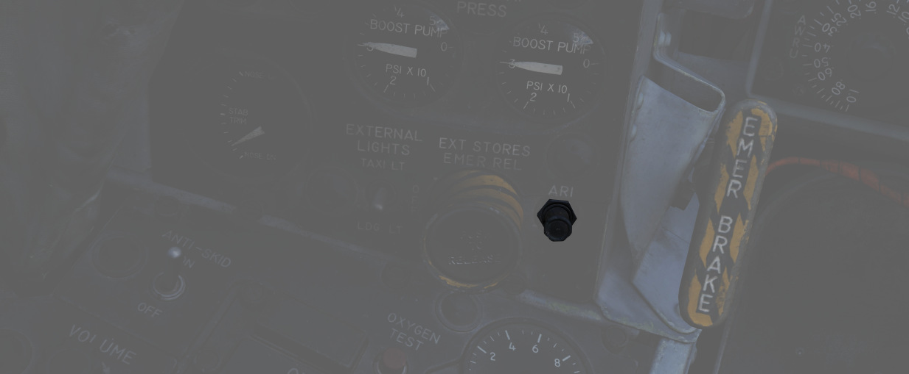
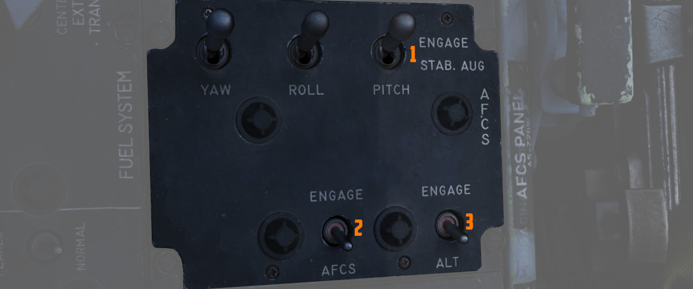

# 飞行操纵面与系统

飞行操纵装置包括图中位于机翼前缘的缝翼、襟翼、方向舵以及右侧机翼上的副翼-扰流板和位于后方的平尾。

## 驾驶杆

两个驾驶舱都配备了驾驶杆，两根驾驶杆的开关设置几乎一致。每根驾驶杆上都有配平控制，用于减少杆力和在
俯仰及横滚轴上进行微小的飞行路径修正。扳机（用于[空对空导弹](../../stores/air_to_air/overview.md)和
[航炮](../../stores/guns.md)）和航弹投放按钮用于进行武器投放。两根驾驶杆上都有一
个[前轮转向按钮](gear_ground_handling.md#nose-gear-steering)，该按钮在视距内战斗中作
为[雷达](../radar/overview.md)自动截获，以及用于电视制
导[空对地武器](../../stores/air_to_ground/overview.md)的传感器焦点控制。每根驾驶杆上都有一
个[应急快速释放杆](gear_ground_handling.md#emergency-anti-skid-quick-release-lever)，用于立即停用防
滑、ARI、自动驾驶和增稳系统。前座驾驶杆独有开关的
是[空中受油断开按钮](../utility.md#air-refueling-release-button)——一个双功能的控制开关，用于执行字
面意思的断开硬管功能，以及多种武器选择功能。

前座驾驶杆上独占的还有一个力传感器，允许飞行员在接通自动驾驶功能时对 AFCS 进行微调控制。如果施加在
驾驶杆上的力超过 AFCS 断开限制，自动驾驶将被关闭。

## 副翼-扰流板控制和平尾操纵感受和配平系统

副翼-扰流板操纵系统和平尾操纵系统都提供跟随配平功能；前者通过螺旋千斤顶作动器实现，后者使用由 AFCS
控制的伺服电机实现。这些功能会在飞行员松手时，使驾驶杆相对于当前的配平位置和自动驾驶仪位置进行定位
。因此，在断开自动驾驶系统之前，建议将驾驶杆移至相同位置，或轻轻移动驾驶杆至“断开力”位置，以减少驾
驶杆突然回到飞行员手中的可能性。

如需确认当前平尾的配平状态，可以查看位
于[前座左垂直面板](../../cockpit/pilot/left_sub_panel.md#stabilator-trim-indicator) 中的平尾配平位
置指示器。

## 方向舵操纵系统

偏航轴控制由位于两个驾驶舱中的方向舵脚蹬负责。前座的发动机控制面板上设有一
个[方向舵配平开关](../../cockpit/pilot/left_console/front_section.md#rudder-trim-switch)来抵消由于
风效应、挂载不平衡或轻微的[发动机](../engines_and_fuel_systems/engines.md)输出差异导致的侧滑。在地
面上，脚蹬可以独立踩下来实现差动刹车，飞行员可通过按下任一根驾驶杆上
的[前轮转向按钮](gear_ground_handling.md#nose-gear-steering)现实前轮转向控制功能。

## 副翼-方向舵交联系统

为了协助在低速进行协调转弯，“鬼怪”II 战机安装有副翼-方向舵交联系统。该系统
在[缝翼襟翼开关](../../cockpit/pilot/left_console/wall.md#slatsflaps-control-panel)处于伸出和下放档
位，且低于襟翼吹起空速（230 节）时自动接通。

当自动飞行控制系统处于增稳或自动驾驶模式时，系统的方向舵位移限制在 15° 内，当偏航增稳开关断开时，系
统的方向舵位移限制为 10°。

ARI 的断路器位于挂载应急抛弃的右边。

> 💡 如需永久断开 ARI，抽出位于左侧子面板中的断路器并断开偏航增稳开关。仅抽出断路器但不断开增稳开关
> 将使 ARI 仍有 5° 方向舵权限。抽出 ARI 断路器后，防滑系统也将被禁用。

> 💡 当 ARI 系统接通或断开时存在横向驾驶杆输入，方向舵将出现摆动。通常在襟翼收上或放襟翼转弯时发生
> 。

### 应急断开

如果任一驾驶舱中需要停用 ARI，机组可以通过拉动各自驾驶杆上
的[应急快速释放杆](gear_ground_handling.md#emergency-anti-skid-quick-release-lever) 来断开该系统。
重新松开开关将会重新接通 ARI(10°)和偏航增稳 (5°)的方向舵权限。机组始终可以通过方向舵脚蹬来超控 ARI
功能。

## 自动飞行控制系统（AFCS） - AN/ASA-32

自动飞行控制系统（AFCS）是一套电-液系统，旨在不干扰手动控制同时，提供稳定、准确且协调的飞行机动
。AFCS 有两种工作模式，**增稳**和**AFCS**。

**增稳** 将提高飞机在俯仰、横滚和偏航方向上的稳定性；增稳模式下将补偿姿态变化，但不会使飞机返回到指
定的姿态或地面航迹。这种工作模式可以在飞机处于手动控制状态时使用。飞行员可单独接通增稳通道，也可以
使用俯仰、横滚和偏航轴中的任何组合。

### 自动驾驶

**AFCS 模式**是在 AFCS 限制内保持选定的飞机航向和/或姿态，并在 AFCS 限制内纠正设定的航向或姿态偏差
。AFCS 开关可以在仅接通俯仰增稳开关时使用；但是，为了提供完整的 AFCS 操作，必须接通所有增稳开关
。**高度保持模式** 工作模式将使飞机保持在进入 **AFCS 模式** 后，选择的任意高度。

> 💡 接通 AFCS 工作模后，系统将在限制（±70° 俯仰，70° 横滚和 360° 方位）内保持机动和姿态，前提是不
> 超过过载值限制。无论飞行员是否有意进行快速转动平尾，都会使 AFCS 断开。

> 💡 在高度保持模式下，在加速通过跨声速区间(0.9 至 1.0 马赫)时，高度表可能会短暂出现波动，这种波动
> 虽然不剧烈，但可能导致基准高度滑动。在爬升速度超过 1000 FPM 时接通高度保持模式可能导致基准高度超
> 过接通的高度。

### 力传感器

力传感器感测施加在驾驶杆上的物理力。装置包括驾驶杆的可见部分和安装在其顶部的杆握。

力传感器包含对纵向和横向力作出反应的压敏开关。大约施加 1.5 磅的横向力可以关闭力开关。当横滚力开关断
开增稳中的横滚速率陀螺信号，以及断开在 AFCS 模式中使用的横滚速率和姿态陀螺信号时，飞行员可在 AFCS
模式下进行机动，此时 AFCS 不会对偏离进行补偿。

飞行员通过机械连接操纵飞机，在横向杆力输入小于大约 1.5 磅后将重新接通开关。此时横滚通道恢复正常
AFCS 操作。在向前施加 3.75±0.25 磅或向后施加 2.55±0.25 磅杆力时，开关将关闭来操作某些 AFCS 部件，并
使力感应设备发送一个与施加杆力成比例的信号到伺服放大器，AFCS 将控制平尾位置。

如果超出 AFCS 的俯仰或横滚限制(±70°)，AFCS 将会断开。AFCS 开关可能断开，也可能不断开。如果开关没有
断开，当飞机回到 AFCS 限制内时，AFCS 将立即重新接通。

### 过载限制加速度计

AFCS 的正常过载互锁(G-disengage)功能旨在禁止系统指令使用过多的过载。当加速度计开关感测到+4 或-1G 时
，系统会自动从接通的任意模式自动回退至增稳模式。

这个开关安装在雷达隔框前方，这样一来如果飞机快速转动进入机动，由于靠前安装可以更好感测到俯仰加速度
的分量，使得系统可以在较低的过载值断开。

在自动驾驶 ±70° 限制外，G-disengage 功能无法使用。

> 🔴 警告：在低空速或重载情况下，在飞机失速前过载开关都不会断开自动驾驶。如果在失速时自动驾驶仍保持
> 接通，自动驾驶将施加尾旋倾向控制。

### 应急快速释放杆

每跟驾驶杆上都有一个弹簧复位的应急快速释放杆。这个杠杆在前后驾驶舱的操作方式相同。

按下释放杆将使 AFCS 和高度保持开关退回至 OFF。增稳模式、ARI 和防滑，只要握住释放杆，这些功能都将断
开。松开释放杆后，增稳、防滑和 ARI 将再次工作，但 AFCS 不会重新接通。

要永久断开增稳模式，俯仰、横滚和偏航增稳开关必须拨至关闭。要永久断开 ARI 和防滑，必须关闭偏航增稳开
关，并且抽出位于飞行员驾驶舱左侧子面板中的 ARI 断路器。

### 自动驾驶断开指示灯

远传信号灯面板中有一个 AUTOPILOT DISENGAGE 指示灯。在接通 AFCS 模式后，后续断开 AFCS 将使 AUTOPILOT
DISENGAGE 指示灯和主注意灯亮起。

飞行员可按下主注意复位开关来复位灯光。在 AFCS 再次接通并断开前，灯光将保持熄灭姿态。

### 俯仰增稳关断指示灯

当飞机通电且未接通俯仰增稳时，远传信号灯面板中的 PITCH AUG OFF 指示灯将和主注意灯一起亮起。

按下主注意复位按钮将使主注意灯熄灭。而 PITCH AUG OFF 灯将保持亮起，直到接通 PITCH STAB AUG 开关。

### 自动俯仰配平

AFCS 拥有自动俯仰配平功能，配平功能将尝试在纵向配平飞机与在 AFCS 模式下的飞行状态保持一致。

因此，在断开自动驾驶模式时，可以防止出现失去配平情况（在自动驾驶模式时不会感测），确保在断开后不会
出现过大俯仰振荡。

自动俯仰配平的工作速度大约为正常配平的 40%，所以在飞行状态改变后，飞机在正确配平之前会有一定的延迟
。在驾驶杆转向期间，自动配平不起作用。飞行员可以在 AFCS 模式下调整飞行状态，然后查看平尾配平指示器
来观察自动配平工作。

### 自动驾驶俯仰配平灯

在 AFCS 工作期间，如果自动俯仰配平跟随不起作用或在飞机机动后明显滞后，从而导致飞机出现失去配平姿态
，远传信号灯面板中的 AUTOPILOT PITCH TRIM 灯将亮起。

### 正常操作

1. 如需接通增稳模式，需要将俯仰、横滚和偏航增稳开关拨至 ENGAE。2. 在接通 AFCS 模式前，在增稳模式下
   使飞机配平。3. 如需接通 AFCS 模式，将飞机姿态调整至 AFCS 限制内。将 AFCS 开关拨至 ENGAGE。4. 如
   果想要接通高度保持模式，将高度保持开关拨至 ENGAGE 档位。

> 🔴 警告：在 AFCS 模式下不要试图从后座改变飞机的俯仰姿态。由于后座驾驶杆上没有力传感器，因此施加杆
> 力会导致俯仰配平上下运动，具体取决于施加的力。如果飞行员试图同时进行控制，可能会遇到剧烈的振荡。

> 💡 在 AFCS 模式下，除非 AUTOPILOT PITCH TRIM 指示灯亮起，否则请勿使用配平按钮。使用少量配平按钮来
> 让 AUTOPILOT PITCH TRIM 指示灯熄灭。

> 💡 在使用高度保持模式时，可使用驾驶杆来改变高度。使用驾驶杆改变高度将断开高度保持回路并将高度保持
> 开关退回 OFF 档位。如有需要，在新高度重新接通高度保持。

> 💡 扣动驾驶杆上的应急快速释放杆时，AFCS 将断开。只要握住释放杆，增稳和 ARI 将保持断开，在松开后将
> 恢复工作。

<!-- OPERATIONAL PRECAUTIONS -->

<!-- * Because the stability augmentation system can misinterpret roll oscillation in high AoA 
maneuvering and inadvertently invoke adverse roll, it is suggested to 
disable the Roll channel prior to aerobatics or combat to alleviate this possibility. -->

## 襟缝翼系统

在起飞和降落时，飞行员需要手动选择缝翼襟翼系统，然后系统自动根据迎角进行控制，以在所有其它飞行状态
下获得最佳操纵性能。飞行员可通过位于前
座[左侧](../../cockpit/pilot/left_console/front_section.md#throttles)油门握把外侧
的[三档位开关](../../cockpit/pilot/left_console/wall.md#slatsflaps-control-panel)来控制缝翼襟翼系统
，并由飞机的液压系统驱动
。[开关](../../cockpit/pilot/left_console/wall.md#slatsflaps-control-panel)有三个档位，分别是：
Norm、Out 和 Out and Down，根据起落架是是否放下，对应的档位的控制指令可能有所不同。

Norm 是飞行时的标准档位，锁定襟翼，并根据迎角自动调度缝翼伸缩。

Out 档位将完全伸出缝翼。如果放下起落架，那么缝翼和襟翼都会伸出/放下。

Out and Down 将完全伸出缝翼和完全放下襟翼。如果未放下起落架，那
么[远传信号灯面板](../../cockpit/pilot/right_sub_panel.md#telelight-annunciator-panel)上的 Wheels
灯将会亮起并闪烁。

两个驾驶舱都有[缝翼襟翼指示器](../../cockpit/pilot/left_sub_panel.md#slatsflaps-indicators)，指示器
将显示 In 和 Out，以及在过渡时显示条状纹。

在 Norm 档位时，系统将根据迎角伸出机动缝翼；当迎角超过 11.5 个单位时，系统将伸出机动缝翼，然后当迎
角降至 10.5 个单位以下时收回。机动缝翼工作还包括一种由空速引起的吹回现象；当空速在 568 到 602 节之
间时，缝翼将因气压而收回。

缘缝翼超控开关位于前座燃油控制面板的后方。这个带保护盖的开关有两个档位： NORM 和 IN。保护盖关闭时开
关处在默认 NORM 档位，切换到 IN 档位，无论当前飞机迎角或缝翼襟翼开关所处档位如何，都会强制收起缝翼
；这个动作会触发[远传信号灯](../../cockpit/pilot/right_sub_panel.md#telelight-annunciator-panel)面
板中的 SLATS IN 警告灯，并
使[主注意灯](../../cockpit/pilot/right_main_panel.md#master-caution-light) 亮起。

缝翼襟翼系统还有一个应急系统；位于前
座[缝翼襟翼控制面板](../../cockpit/pilot/left_console/wall.md#slatsflaps-control-panel)上应急操作手
柄，以及后座[油门握把](../../cockpit/wso/left_console/front_section.md#throttles)旁边。应急系统使用
气动力，无需电力即可强制伸出。应急系统只能使用一次，并且可以在任何空速下启动；然而，空速超过 230 节
时，襟翼将受到气压影响收上，同样影响适用于缝翼。

## 减速板

[减速板](../..)安装在飞机底部，靠近后部[“麻雀”](../../stores/air_to_air/aim_7.md)导弹的半埋挂点附近
。减速板由飞机的液压系统驱动，机组可通过两个驾驶舱中，内
侧[油门握把](../../cockpit/pilot/left_console/front_section.md#throttles)上
的[三档位开关](../../cockpit/pilot/left_console/front_section.md#throttles)进行控制。任意一个开关都
可以让减速板动作。三档位分别是 Out、Stop 和 In；Out 档位为弹簧复位，在松开开关时恢复到 stop 档位。

展开减速板将
使[远传信号灯面板](../../cockpit/pilot/right_sub_panel.md#telelight-annunciator-panel)中的 Speed
Brake Out 指示灯亮起。展开减速板或 SBO 指示灯亮起不会触
发[主注意灯](../../cockpit/pilot/right_main_panel.md#master-caution-light)。

## 迎角系统

为了能够精确监控和控制飞机飞行性能，迎角系统（AoA）为飞行员提供了当前参数的视觉和音频提示。该系统包
括位于两个驾驶舱中的迎角指示器、迎角分度器以及迎角音调提示系统。

迎角通常以度（°）为单位测量。迎角为翼弦与来流矢量在飞机对称面内投影的夹角。

### 指示器

迎角指示器的刻度显示区间在 0 到 30 单位迎角，其中包括与重量相关的最佳巡航迎角指示（7.9 个单位）、进
近（19.2 个单位）和失速（30 个单位）。迎角分度器仅在起落架处于放下档位时工作。

迎角单位不直接转换为度。1 个单位迎角大约相当于 0.95 度迎角，并且测量的迎角还有大约 4 度的偏置。这样
，指示器才能向机组显示更自然、更有用的迎角数值。

> 💡 放下起落架，特别是前起落架舱门打开后，流经传感器的气流会发生变化，这会导致迎角指示增加大约 1
> 个单位。进近空速已经考虑到了这一点。因此，若在收起起落架的状态下进近，将导致迎角指示器显示的数值
> 比实际低大约 1 个单位，从而导致在最佳进近迎角时，比正常快出 5 节。

### 分度器

迎角分度器位于飞行员驾驶舱的风挡玻璃框架上，以及 WSO 驾驶舱的仪表板上方，在放下起落架后，以颜色编码
和方向标识符显示 19.2 个单位最佳进近迎角。

## 音调提示系统

音调提示系统在机动飞行和着陆构型期间提供可听觉反馈。当迎角超过 15 个单位（起落架放下）和 21 个单位
（起落架收起且缝翼收起）时，两名机组成员都会听到脉冲声。

脉冲的频率可以从每秒 1.5 到 20 次不等，频率随着迎角的增加而升高。

在迎角低于 20.3 个单位（起落架放下）/25 个单位（起落架收起）时，可以通过两个驾驶舱中的控制开关/旋钮
调低音调的音量；超过上述单位，系统将超控音量限制，并以最小音量发出警告脉冲音，以确保无论音量设置如
何都能听到。

> 💡 调整音量旋钮分别标有 STALL WARNING 并且可以在前后驾驶舱中的右侧面板中找到音量调整旋钮。不要与
> AURAL TONE CONTROL 旋钮相混淆，后者用于控制跟武器相关的音调提示。

由于前向视野有限，这些音调提示是在降落时至关重要的辅助。如果听到低音的脉冲声，表示飞机空速过快。如
果听到高音的脉冲声，表示飞机空速过低。在正确的最佳进近迎角下，将播放连续地中音音调。

## 失速警告振动器

飞行员驾驶舱左侧脚蹬中有失速警告振动器，当迎角超过 22.3 单位时，振动器开始振动。这种物理（在 DCS 中
是可听到的）提示旨在让飞行员意识到潜在的即将失速的风险，并提供足够的时间来降低迎角，防止飞机失控。
将迎角降至阈值以下将停用该警告。
