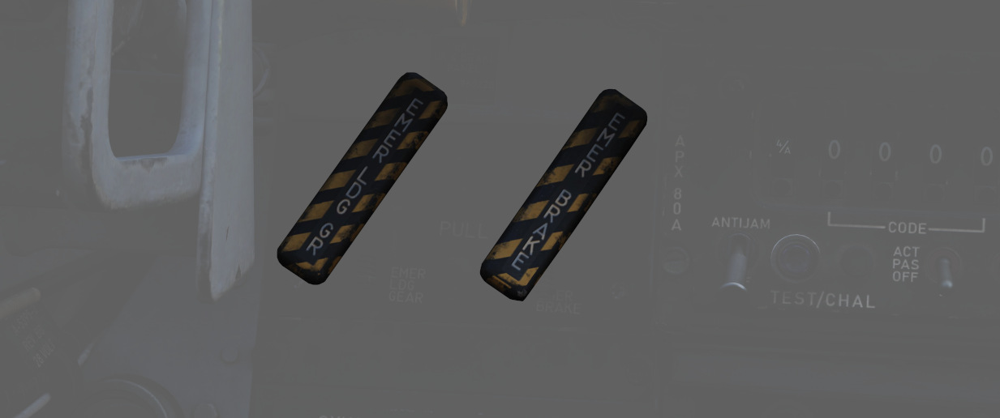
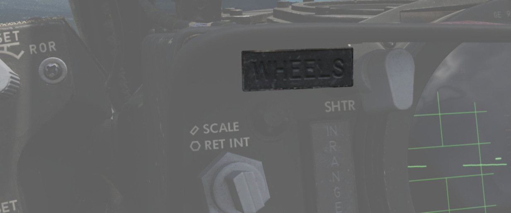
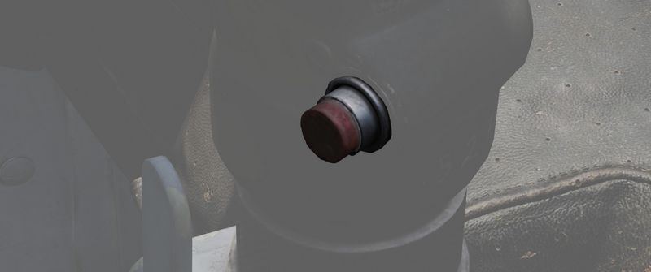
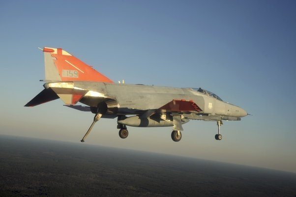
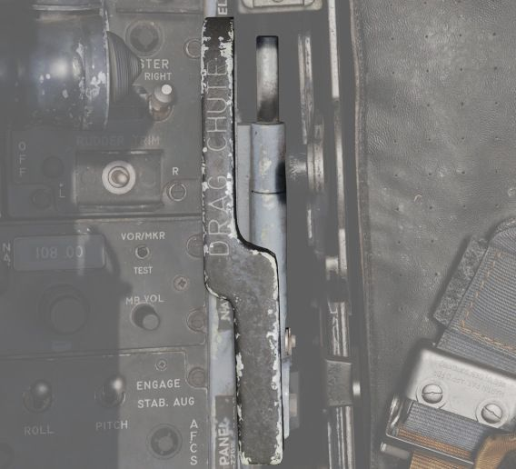

# 起落架系统和地面操纵控制系统

F-4 鬼怪使用传统的三点式起落架布局，起落架收放由公用液压系统驱动。起落架采用电控并通过公用液压系统
进行作动。主起落架上的安全开关可防止飞机在地面时意外收起起落架。起落架通过钩锁进行锁定，需要液压压
力才能放下。位于起落架轮舱内的接近开关用来自动禁用前轮转向和防滑系统功能。如果公用液压系统离线，可
用压缩空气的应急放下系统来放下起落架进行着陆。

## 起落架控制手柄

起落架控制手柄位于飞行员驾驶舱中的左仪表板上，手柄制作成红色滚轮形状开关来方便识别。

## 应急放下起落架手柄

应急放下起落架系统由一对装有足够压缩空气的气瓶组成，这些气瓶的压力足够放下一回起落架。在飞行员驾驶
舱中，通过起落架控制手柄来执行应急放下操作；在任意档位向后拉动手柄都将释放压缩空气进入起落架液压系
统，迫使轮舱舱门打开，起落架放下并锁定。在紧急情况下，后座也可以通过左侧子面板上标有“EMERG LDG
GEAR”的手柄来执行应急放下动作，拉动手柄的效果和在飞行员驾驶舱中相同。

## 起落架告警灯

在飞行员驾驶舱仪表板的左上角有一个 WHEELS 告警灯，当飞机空速低于 230 节且起落架未放下时警告灯将亮起
。在 WHEELS 告警灯亮起时选择放下或收起起落架，将会导致安装在起落架控制手柄中的告警灯亮起红色灯光。

## 起落架位置指示器

起落架系统的位置指示器位于两名机组驾驶舱中的左侧子面板上。指示器有三个窗口，对应三个起落架。窗口显
示对应的起落架的档位，当起落架收起且轮舱舱门关闭时显示“UP”字样，当起落架和轮舱舱门在关闭或打开过程
中时显示条状纹（白黑斜条纹），当起落架放下并锁定时显示机轮图案。

## 前轮转向

通过位于任意驾驶舱中驾驶杆上的基准按钮来激活。按住按钮将允许机组使用脚蹬来进行转向。前轮转向的限制
为从中心线向两侧偏转 70 度。

方向舵转向在大约在 70 节时生效。在此速度下，应断开前轮转向且不再使用。

## 机轮刹车

机轮负重时，可以通过偏转方向舵脚蹬来实现差动转向。在飞机轮速超过 30 节时，防滑系统将提供刹车性能辅
助。防滑系统包含延迟启用刹车功能，在右侧主起落架接地 3 秒，或轮速到 50 节时，才可使用刹车。

## 防滑系统

在轮速超过 30 节时，电控防滑系统将为机组提供防滑保护。系统检测到打滑时，会根据打滑的严重程度按比例
地松开刹车。在 30 节以下，系统将自动断开防滑，刹车力度将和脚蹬偏转度成比例关系。系统内还包括了一个
接地保护功能，该功能会在右侧主起落架接地 3 秒，或轮速到 50 节之前禁用刹车。请注意，跑道和轮胎之间的
摩擦系数低（如在积水或冰面跑道）可能导致轮子不旋转或转速低于 30 节。在这种情况下，系统会错误地检测
到飞机速度低于 30 节，并恢复到手动制动模式。

### 防滑控制开关

防滑控制开关位于飞行员驾驶舱中，氧气储量表的旁边，飞行员可以使用控制开关来开启或关闭防滑系统。

### ANTI-SKID INOPERATIVE 灯

在飞行员驾驶舱左侧控制台上，当防滑开关设置为 OFF、按下应急快速释放杆，或系统出现问题时，ANTI-SKID
INOPERATIVE 指示灯将会亮起。

### 应急快速释放杆

如果怀疑防滑系统在滑行过程中功能失常，机组可以通过按住驾驶杆上的应急快速释放杆来立即断开防滑系统。
断开防滑系统后 ANTI-SKID INOPERATIVE 告警灯将会亮起。

## 应急液压刹车系统

如果公用液压系统出现故障，机组可以通过拉动位于驾驶舱仪表板左下方的应急刹车手柄来进行应急差动刹车。
拉动手柄使用备用蓄压器中的压力来进行刹车，备用蓄压器的压力足够使用大约 10 次刹车。

## 拦阻钩系统

鬼怪装备有可收放拦阻钩，可在应急中断起飞和着陆情况下使用，以免飞机冲出跑道升降带。将飞行员驾驶舱中
的拦阻钩手柄拨到放下档位后，拦阻钩将在大约五秒内放下。放下拦阻钩后手柄中的红色告警灯将会亮起，并且
远传信号灯面板中的 HOOK DOWN 告警灯将会亮起。

该拦阻钩系统并非用于舰上作业。

## 减速伞系统

F-4E 装备有减速伞以在必要时减少着陆滑跑的距离。减速伞也可用于尾旋改出。旋转位于飞行员驾驶舱中的手柄
来放出减速伞。减速伞通过一个较小的引导伞将其从伞舱中拉出。一旦放出减速伞并充分减速，或飞机已恢复到
可控状态，通过按下按钮接着抽出手柄然后放下来弃伞，完成后会释放伞绳，让其自由脱落。

着陆时不要在指示空速（IAS）超过 200 节时使用减速伞。

在尾旋改出时，可以通过前压满杆，中立副翼和方向舵并放减速伞来进行改出。

## 机翼折叠系统

F-4E 中装有机翼折叠系统，来方便进行维修和地面拖动。与之前的型号不同，F-4E 的机翼折叠装置无动力源，
需要地勤人员在激活折叠控制来松开锁定机构后，手动移动外侧机翼。
