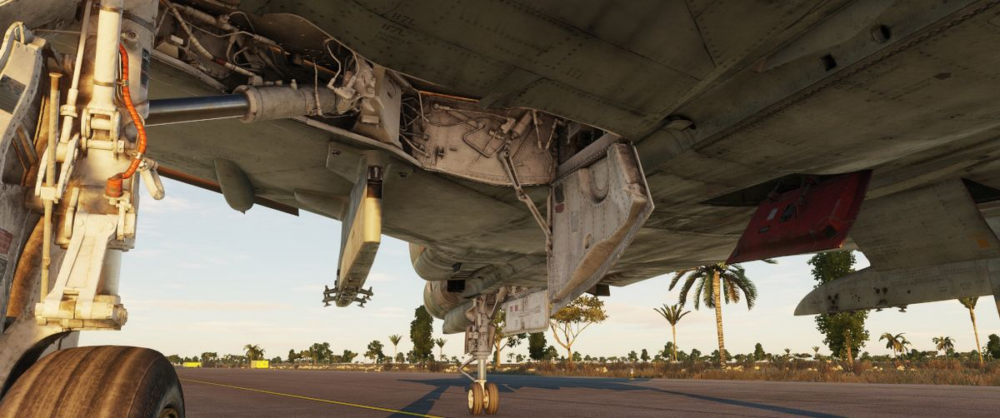
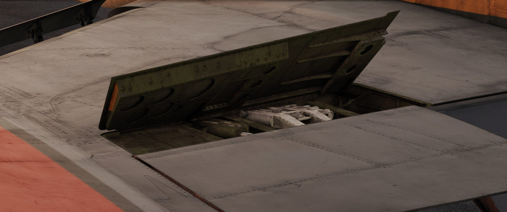

# 飞控系统

飞控系统章节包含了有关F-4E“鬼怪”战机 [三点式起落架](./gear_ground_handling.md)、[主要飞行仪表](./primary_flight_instruments.md) 以及F-4E上不同 [飞行操纵设备](./flight_controls.md) 的所有必要信息。

飞机的主要飞行操纵包括[平尾](./flight_controls.md#aileron-spoiler-control-and-stabilator-control-feel-and-trim-systems)、[方向舵](./flight_controls.md#rudder-control-system)、[副翼](./flight_controls.md#aileron-spoiler-control-and-stabilator-control-feel-and-trim-systems) 和[扰流板](./flight_controls.md#aileron-spoiler-control-and-stabilator-control-feel-and-trim-systems)，以及用于模拟驾驶杆和方向舵脚蹬气动力的人感系统。

