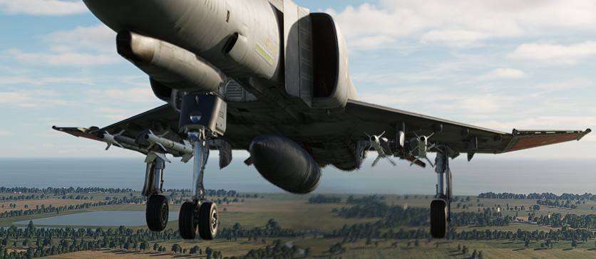

# Flight Control System

The Flight controls chapter contains all necessary information about
the [tricycle landing gear](./gear_ground_handling.md) of
the F-4E, the [primary flight instruments](./primary_flight_instruments.md) as well as the
different [flight controls](./flight_controls.md) on the F-4E.

The primary flight controls of the aircraft include
the [stabilator](./flight_controls.md#aileron-spoiler-control-and-stabilator-control-feel-and-trim-systems),
[rudder](./flight_controls.md#rudder-control-system),
[ailerons](./flight_controls.md#aileron-spoiler-control-and-stabilator-control-feel-and-trim-systems),
and [spoilers](./flight_controls.md#aileron-spoiler-control-and-stabilator-control-feel-and-trim-systems),
with artificial feel systems simulating aerodynamic forces for the control stick and rudder pedals.

