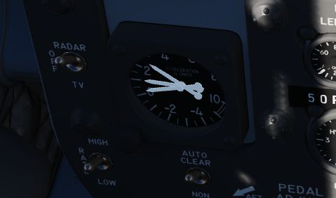
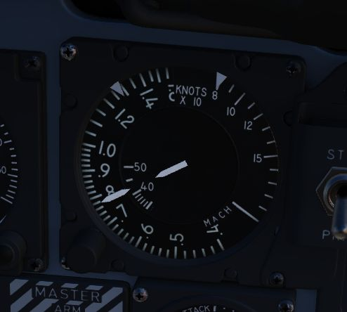
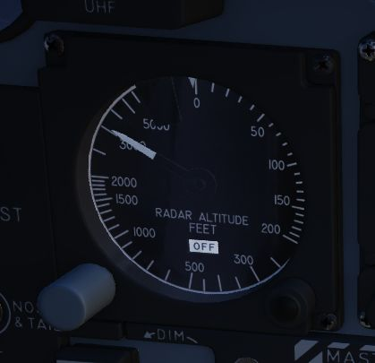
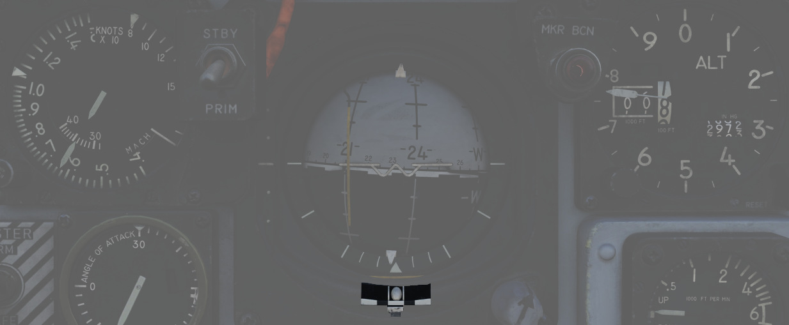
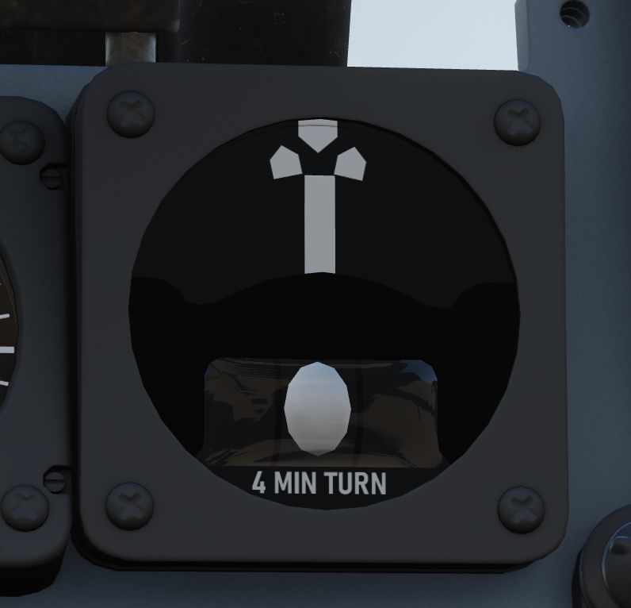
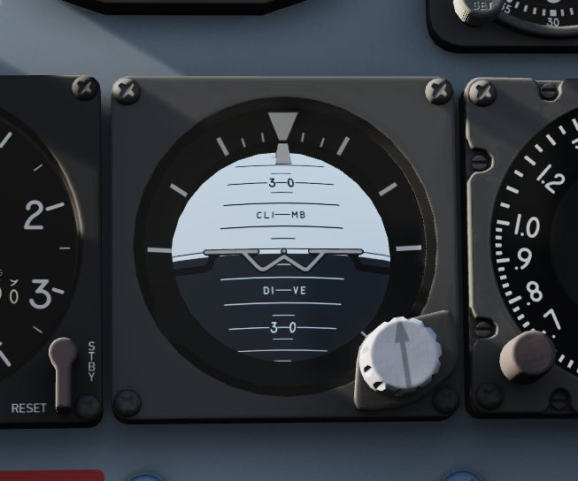
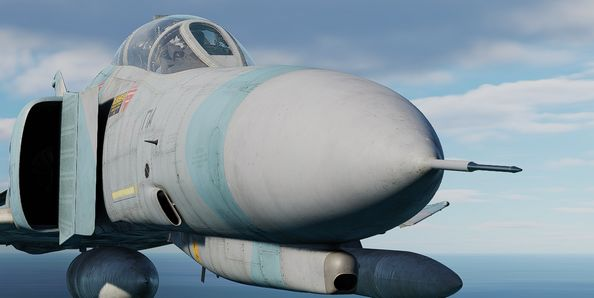
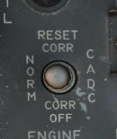
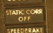
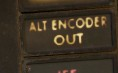

# Primary Flight Instruments

The Primary flight instruments include every instrument needed for basic flight of the F-4E.
Included are the True Airspeed Indicator (TAS), the ground speed indicator, Accelerometers,
combined Airspeed and Mach Indicators, radar and barometric Altimeters, a backup magnetic compass,
vertical velocity indicators, different turn and slip indicators as well as cockpit attitude
indicators.

## True Airspeed Indicators

True Airspeed Indicators are provided in both cockpits, and carry a calibrated
range from 150 to 1500 knots. While the indicators can read as low as 0 knots,
the lack of calibration below the stated range means values less than 150 knots
are inaccurate. At high rates of airspeed change, there may be a lag of up to
+-10 knots in measurement.

The rear True Airspeed Indicator is removed for DMAS equipment in aircraft so
configured; however, TAS is provided as a DMAS function.

## Ground Speed Indicator

A ground speed indicator is provided in the rear cockpit, with a range from 0 to
1999 knots. Ground speed is provided by the navigation computer, with the source
dependent on INS function. If the INS online, the ground speed value calculated
is based on the provided velocity, and can display correct information as low as
0 knots. When the INS is offline, the air data computer performs a calculation
using crew-entered wind information, which can cause errors of up to 150
displaying while the aircraft is on the ground with the parking brake set.

With DMAS installed, the rear ground speed indicator is removed, as GS is a DMAS
function.

## Accelerometers

Both cockpits retain accelerometers for monitoring G load; the accelerometers
carry 3 needles - one for current G loading, and a positive and negative G
loading needle for the highest load G-load detected since the accelerometer was
reset. To reset the gauge, the PUSH TO SET button will return the recording
pointers to positive 1 G.

## Airspeed/Mach Indicators

Found in both cockpits is a combination Airspeed/Mach indicator. The indicators
provide a fixed airspeed scale at the middle of the indicator, reading values
from 80 to 850 knots, and a rotating Mach number scale to the outside,
with readings from 0.4 to 2.5 Mach. A two position push-and-rotate knob offers both an airspeed
index with a functional range between 80 and 195 knots, and a Mach index pointer
with a range between 225 knots and 850 knots.

## Altimeter

Altimeters in both cockpits provide a functional range from 0 to 80,000 feet. To
the outside of the indicator is a pointer scale, gradation in 50 foot units with
markings every 100 feet (from 1 to 10). Left of center is the counter,
increasing and decreasing in value in thousand foot increments on the black pair
of rollers, hundred foot increments on the white. Barometric scale adjustment
can be performed using a dial. A three position switch provides the RESET
function for the altimeter to draw signals from the air data computer for normal
operation, and the STBY (standby) option to only use the pneumatic pressure to
determine altitude. Standby mode is noted with a red flag in the indicator. In
the event of an altimeter or air data computer failure in normal operation, the
STBY flag will appear, and cannot be reset. This can also be followed by
warnings on the telelight panel.

## Magnetic Compass

A magnetic compass is provided in each cockpit for use in the event of a
navigation or electrical system failure.

## Vertical Velocity Indicators (VVI)

VVI Indicators are provided in both cockpits, and show the rate of climb or
descent of the aircraft, calculated via atmospheric pressure change using the
static pressure system.

## Radar Altimeter

Found in the front cockpit, the Radar Altimeter has a functional range of 0 to
5000 feet above ground level. The radar altimeter functions from 0 to 30 degrees
in bank angle, or 0 to 35 degrees angle in pitch. The dial scale reads from 0 to
100 feet, and the system includes a red low altitude warning light that
illuminates when the aircraft is detected below a pilot-set altitude.

Activation and setting of the radar altimeter warning height is done with the
same knob; turning the knob clockwise initially activates the indicator,
removing the displayed OFF flag; continuing to rotate the knob moves the
reference marker that will determine the altitude which triggers the low
altitude warning. A self-test, initiated by pressing the function control
switch, shows 35 +-15 feet. Above 5000 feet or with unreliable signals, the
pointer hides behind a mask, showing the OFF flag. The OFF appears also when
power is lost; the indicator will then present the last altitude detected above
ground level at the time of this occurring.

## Turn and Slip Indicators

| Pilot                                                            | WSO                                                          |
|------------------------------------------------------------------|--------------------------------------------------------------|
|  |  |

In the front cockpit, a turn and slip indicator is added to the ADI on the
instrument panel; while the needle provides correct direction of turn, it does
not provide proper turn rate information.

A conventional 4-minute turn and slip
indicator is found on the rear cockpit panel.

To execute a controlled turn (360° in 4 minutes), place the vertical needle
over one of the indicators on either side (turn rate of 1.5 degrees per second) and ensure
the slip indicator at the bottom is centered to prevent over- or under-turning due to
incorrect bank.

## Rear Cockpit Attitude Indicator

The AHRS provides attitude information to the Attitude Indicator found on the
rear cockpit instrument panel regardless of the Reference System Selector Switch
position. A trim knob provides the ability to adjust the attitude sphere to
reference the aircraft correctly. Should power be disconnected from the
indicator or AHRS, the OFF flag will display.

## Pitot-Static System

The Pitot-Static system provides impact and static pressure to flight
instrumentation, the Air Data Computer, and airspeed-driven switches. To
alleviate icing of the pitot head, a Pitot Heat Switch is found in the front
cockpit right console.

The Pitot Heat switch should always be turned on before takeoff but not for
longer than one minute as it could damage the instrument.

## Air Data Computer System

Using a variety of static, attitude, and environmental inputs, the Air Data
Computer (ADC) provides the pneumatic and electrical inputs to the AFCS, Fire
Control System, Air Induction System, the INS, the LCOSS, navigational computer,
and manages the variable bypass bell mouth system for the engines. Flight
through weather such as ice or rain can induce errors in the performance of
these systems until the condition has cleared, and this should be taken into
account.

## Static Pressure Compensator

The Static Pressure Compensator (SPC) performs correction of altimeter lag
caused by rapid altitude change. The SPC must be reset after engine startup on
each flight; this is performed using the CADC switch near the throttles by
selecting RESET CORR, then selecting NORM. Should an issue occur during flight
causing a STATIC CORR OFF warning, an attempt to reset the SPC can be performed
with RESET CORR. Should the STATIC CORR OFF warning fail to clear, care must be
taken in all diving maneuvers, as substantial altimeter lag will occur.

## ALT ENCODER OUT Light

The Altitude Encoder Unit provides precise (to 100 feet) altitude data to the
IFF for Mode C traffic control, as well as performs the correction relative to
the pneumatic input at the altimeter. Should the SPC be offline, the ALT ENCODER
OUT light will also illuminate to confirm lagged altimeter performance, and
potential Mode C issues.

