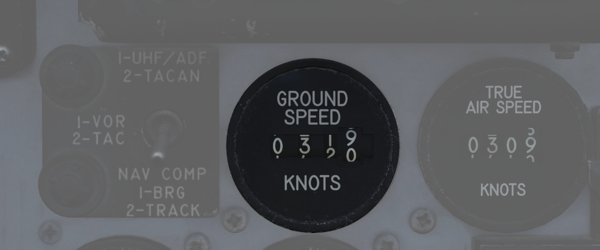
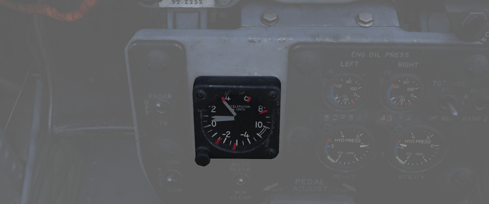
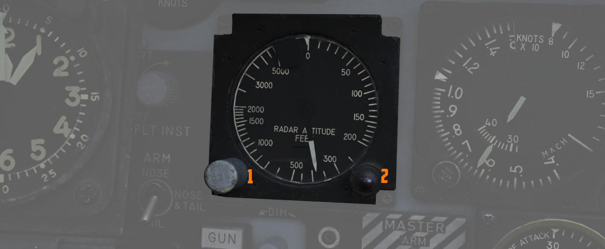

# 主要飞行仪表

F-4E“鬼怪”战机的主要飞行仪表包括了所有进行基本飞行必要的仪表。其中包括真空速表（TAS）、地速指示器、
加速度表、空速马赫数表、雷达和气压高度表、备用罗盘、垂直速度表、转弯侧滑仪以及驾驶舱姿态指示器。

## 真空速表

两个驾驶舱中都装有真空速表，有效读数区间在 150 节到 1500 节。虽然仪表的读数低至 0 节，但由于低于有
效读数区间，150 节以下的数值是不准确的。在空速变化较快的情况下，测量值可能会有高达 ±10 节的滞后。

在装备了 DMAS 设备的飞机中，后座的真空速表被移除；然而，DMAS 功能仍然可提供真空速信息。

## 地速表

后座中装有地速表，显示区间在 0 到 1999 节。地速由导航计算机提供，具体来源取决于惯性导航系统（INS）
的功能。如果 INS 在线，计算得出的地速值基于 INS 提供的速度，即使在 0 节时也能显示正确信息。当 INS
离线时，大气数据计算机将使用机组输入的风速信息进行计算，这可能导致飞机处在地面并且已设置停放刹车的
情况下，显示误差高达 150 节。

安装了 DMAS 后，后座的地速表被移除，因为提供地速是 DMAS 的功能之一。

## 加速度表

两个驾驶舱都保留了加速度表，用于监控过载值；加速度表有 3 根指针——一根显示当前 G 值，另外两个分别显
示自加速度计复位以来检测到的最高正过载和负过载。如需复位仪表，按下“PUSH TO SET”按钮将会使记录指针回
到正 1G 位置。

## 空速/马赫数表

纯机械仪表，使用皮托管静态系统的全压和大气数据计算机的静压，由静压补偿器校正进行现实。

仪表的空速表组件通过测量动压——即全压与静压之间的差。这个动压与飞机空速的平方密切相关。仪表内部有一
个膜片或无液胶囊，对动压的变化作出反应。随着飞机空速的变化，膜片相应地膨胀或收缩。然后，这些机械运
动被转换成显示在空速表盘上的读数，显示出飞机相对于周围空气的速度。

马赫数的确定方式类似于测量空速，主要是通过比较动态和静压。马赫数表将显示飞机空速与声速的比值。

两个驾驶舱中都配备了空速/马赫数表。仪表中有固定的空速刻度，读数区间在 80 节到 850 节，并在外侧有一
个旋转的马赫数刻度，读数区间在 0.4 马赫到 2.5 马赫。仪表上的两档推拉旋钮可用来设置空速游标，可在 80
节到 195 节之间调整，以及马赫数游标——调整区间在 225 节到 850 节之间。

如果仪表故障，空速指针和马赫数刻度都将卡在他们的最后所处的位置。仪表的平均故障间隔时间为 1000 小时
。

## 高度表

AAU-19 型高度表，可在两种模式下工作——基于来自高度编码器的校正静压信号，或机械式（STBY）模式——经过静
压补偿器校正的大气数据计算机输入。仪表的误差为 80 节以下 ±3 节，80 节以上 ±5 节。

在 STBY 模式下，高度表基于空盒气压表工作，其内部有一个密封的金属胶囊，称为无液胶囊片。随着外部气压
的变化，这个金属胶囊会相应地膨胀或收缩。随着飞机的爬升，气压的下降导致胶囊膨胀。相反，在下降过程中
，气压的增加导致胶囊收缩。这些机械运动通过弹簧和杠杆系统转换，使高度表的指针和滚筒的运动。机组可将
高度表校正至大气海平面压力来确保读数准确。

在主要操作模式下，高度表使用一个电动伺服机构来实现准确显示高度。

两个驾驶舱的高度表显示区间在 0 到 80000 英尺。仪表外圈一个指针刻度，每 50 英尺一个刻度标记，每 100
英尺（从 1 到 10）标有数字标记。位于左侧中部是计数器，在黑色的一对滚筒上以千英尺为单位增减，白色的
滚筒上以百英尺为单位增减。机组可以使用旋钮来调整基准气压。仪表中的三档位开关用于对高度表进行
RESET，以便从大气数据计算机中取得正确的数据来正常工作， STBY 档位仅使用气压来确定高度。进入备用模式
时仪表将显示红色警示旗。如果在正常工作时，大气数据计算机或高度表中出现故障，STBY 旗将出现，并且无法
进行复位。同时远传信号灯面板中的告警灯可能会亮起。

设备常见故障包括:

- 高度表卡住:完全损坏，所有指示都失效
- 电动伺服失效:设备被迫进入 STBY(压力)操作模式。
- 指针卡死:指针不动。
- 高度滚筒卡死:高度滚筒不动。
- 基准压力滚筒卡死:基准压力滚筒不动。
- 基准压力旋钮故障:自动旋钮对设备没有影响。
- 三挡开关故障:转动开关对设备没有影响

## 备用罗盘

每个驾驶舱都装有备用罗盘，以便在导航或电力系统故障时使用。

由于它的设计，罗盘容易出现一些误差。首先，它有一定程度的惯性，这往往导致指示滞后。因此，可以经常观
察到指针在振荡以及摆动运动。

为了保持和地球重力垂线垂直，罗盘可以在俯仰轴和滚轴上转动约 10 度。然而，由于地球的磁场线与地球表面
并不平行，指针倾向于向磁极略微向上或向下“倾斜”。特别是在转弯和加速时，这种“倾斜”效应会导致显示错误
。

在北半球，罗盘从北向起转会滞后，向北方向转去时超前。南半球的情况正好相反。

当在北半球当沿东/西方向加速时，罗盘会错误地向北转动；而在减速时，则会向南转动。在南半球，效果相反。

## 垂直速度表 (VVI)

每个驾驶舱都装有垂直速度表，用来显示飞机的爬升或下降速度，VVI 通过静压系统计算气压变化得出。

该装置由一个密封内的隔膜组成。隔膜及其周围的空间都连接到飞机的静压源。然而，隔膜设计有一个校准漏孔
，导致其内部的压力变化比周围区域的压力变化更慢。这种设计的延迟导致隔膜内部和外部之间出现的压力差
。VVI 将这种压力差转化为指针的机械运动，然后显示飞机的爬升或下降速度。

由于设计原因，与飞机的实际垂直运动速度相比，仪表上显示的爬升或下降速度会有轻微的延迟。F-4 的滞后时
间在 4 到 7 秒之间。仪表的测量范围在-6000 至 6000 英尺/分钟（FPM），且其位置误差最多可达 50 fpm，当
速度接近 5000 fpm 时，刻度误差可达 300 fpm，摩擦误差最大可达 ±150 fpm。仪表出现故障时，仪表可能卡死
，或由于其中一个气压进出被堵塞导致。如果静压被堵塞，当压力差平衡并保持不变时，指针将逐渐移动到 0
fpm。相反，如果漏孔被堵塞，延迟压力将不会改变，导致指针随着高度变化移动，类似于高度表，但很快达到其
工作极限。仪表的平均故障间隔时间为 1000 小时。

## 雷达高度表

在前座，雷达高度表的工作区间在 0 到 5000 英尺 AGL。雷达高度表在 0 到 30 度坡度或 0 到 35 度的俯仰角
内可正常工作。刻度盘读数从 0 读到 100 英尺，系统包括一个红色低高度警告灯，当飞机探测到低于飞行员设
定的高度时亮起。

开启和设置雷达高度表低高度告警通过同一旋钮完成；顺时针转动旋钮将首先开启仪表， 开启后 OFF 旗将被移
除；继续旋转旋钮将移动基准游标，游标的位置决定触发低高度告警的高度。按下功能控制开关来启动自检功能
，自检显示的读数为 35±15 英尺。当高于 5000 英尺或信号不可靠时，指针会隐藏在挡板后面并显示 OFF 旗
。OFF 旗在断电时也会出现；此时，仪表将显示最后探测到的离地高度。

## 转弯侧滑仪

| 飞行员                                                              | WSO                                                   |
| ------------------------------------------------------------------- | ----------------------------------------------------- |
|  |  |

在前座，仪表板上的 ADI 中增加了一个转弯侧滑仪；指针信号来自 AJB-7 系统速率陀螺提供的数据来显示正确
的转向方向，但它并不提供正确的转弯速度信息。

在后座驾驶舱面板上，则安装了一个传统的 4 分钟转弯侧滑仪。

如需执行一个标准转弯（360° 转弯用时 4 分钟），使垂直指针对准转弯侧滑仪任一侧（每秒转弯 1.5 度），并
确保底部的侧滑球居中，以防止由于不正确的坡度导致转向过度或不足。

## 后座姿态仪

无论基准系统选择开关处在哪个档位，AJB-7 都将为后座仪表板上的姿态仪提供姿态信息。仪表中的调平旋钮用
于调整姿态球以正确反应机身的姿态。如果仪表或 AJB-7 断电，仪表中将显示 OFF 旗。

仪表采用电动并配备了两个伺服电机：一个俯仰伺服电机和一个横滚伺服电机。俯仰指示限制在 ±90 度内，而横
滚指示允许在整个 360 度的圆圈内连续转动。如果伺服系统发生故障(平均故障间隔时间为 800 小时)，受影响
的伺服系统将卡在其最后所处位置或方向上。

## 皮托静压管系统

皮托静压管系统为飞行仪表、大气数据计算机以及由空速驱动的开关提供全压和静压。飞机装有一个皮托管，可
提供全压读数，而静压是通过位于机头皮托管上的两个静压孔测得的。皮托管和静压孔都容易因积冰导致阻塞。
为了防皮托管结冰，在前座的右侧控制台上设有一个皮托管加热开关。

> 🟡 CAUTION: 皮托管加热开关应在起飞前保持打开，但不要打开超过一分钟，因为长时间加热可能导致皮托管
> 损坏。

## 大气数据计算机

大气数据计算机利用各种静态、姿态和环境输入，为 AFCS、火控系统、发动机引气系统、惯性导航系统（INS）
、LCOSS、导航计算机提供气动和电信号输入，并管理发动机的可变收敛放气系统。穿越如冰雹或雨雪等天气环境
可能会导致这些系统性能出现误差。直到条件消除为止，飞行员应注意这点。

## 静压补偿器

静压补偿器（SPC）用于修正由高度快速变化引发的高度表滞后。每次飞行时，在起动发动机后都必须对 SPC 进
行复位；通过选择油门握把附近的 CADC 开关，选择 RESET CORR，然后选择 NORM 来复位 SPC。如果在飞行时出
现问题导致 STATIC CORR OFF 灯亮起，可以尝试使用 RESET CORR 进行复位。如果未能消除 STATIC CORR OFF
灯，在后续的所有俯冲机动中都必须格外小心，因为仪表将出现明显的高度滞后。

## ALT ENCODER OUT Light

高度编码器装置向 Mode C 空管控制提供精确（到 100 英尺）的高度数据，并执行相对于高度表气动输入的数据
修正。如果 SPC 脱机，ALT ENCODER OUT 灯也会亮起，以确认高度表滞后和可能的 Mode C 问题。

