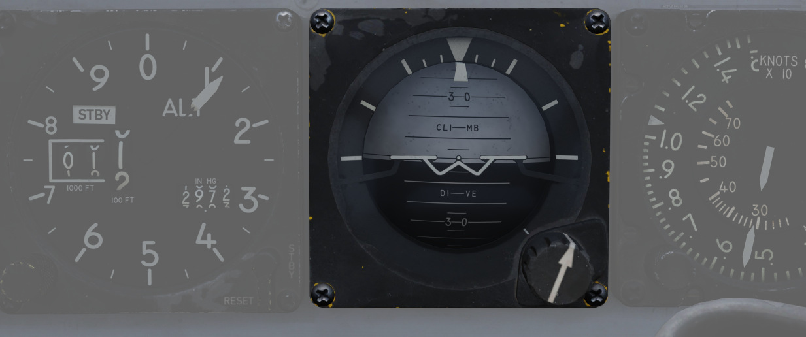

# Primary Flight Instruments

The Primary flight instruments include every instrument needed for basic flight of the F-4E.
Included are the True Airspeed Indicator (TAS), the ground speed indicator, Accelerometers,
combined Airspeed and Mach Indicators, radar and barometric Altimeters, a backup magnetic compass,
vertical velocity indicators, different turn and slip indicators as well as cockpit attitude
indicators.

## True Airspeed Indicators

True Airspeed Indicators are provided in both cockpits, and carry a calibrated
range from 150 to 1500 knots. The velocity signal is calculated in the Air Data Computer,
based on the temperature and pressures input. While the indicators can read as low as 0 knots,
the lack of calibration below the stated range means values less than 150 knots
are inaccurate. At high rates of airspeed change, there may be a lag of up to
±10 knots in measurement. During normal operation, an error up to ±5 knots
may be present. If failed, the rollers will be stuck on their position.

The rear True Airspeed Indicator is removed for DMAS equipment in aircraft so
configured; however, TAS is provided as a DMAS function.

## Ground Speed Indicator

A ground speed indicator is provided in the rear cockpit, with a range from 0 to
1999 knots. Ground speed signal is provided by the Navigation Computer, with the source
dependent on INS function. If the is INS online, the ground speed value calculated
is based on the provided velocity, and can display correct information as low as
0 knots. When the INS is offline, the air data computer performs a calculation
using crew-entered wind information, which can cause errors of up to 150
displaying while the aircraft is on the ground with the parking brake set.
If failed, the rollers will be stuck on their position.

With DMAS installed, the rear ground speed indicator is removed, as GS is a DMAS
function.

## Accelerometers

Both cockpits retain accelerometers for monitoring G load; the accelerometers
carry 3 needles - one for current G loading, and a positive and negative G
loading needle for the highest load G-load detected since the accelerometer was
reset. To reset the gauge, the PUSH TO SET button will return the recording
pointers to positive 1 G.

## Airspeed/Mach Indicators

Purely mechanical instruments that use total pressure from the Pitot-Static system
and static pressure from the Air Data Computer, previously corrected by the Static
Pressure Compensator.

The airspeed indicator component of this instrument functions by measuring the dynamic
air pressure, which is the difference between the total and the static pressure.
This dynamic pressure is closely related to the square of the aircraft's airspeed.
Inside the indicator, there is a diaphragm or aneroid capsule that reacts to changes
in this dynamic pressure. As the aircraft's speed varies, this diaphragm expands or
contracts accordingly. These mechanical movements are then converted into a reading
displayed on the airspeed dial, showing the aircraft's velocity relative to the air
around it.

The Mach number is determined in a manner akin to measuring airspeed, primarily through
the comparison of dynamic and static air pressures. This comparison reveals the aircraft's
speed relative to the speed of sound.

Found in both cockpits is a combination Airspeed/Mach indicator. The indicators
provide a fixed airspeed scale at the middle of the indicator, reading values
from 80 to 850 knots, and a rotating Mach number scale to the outside,
with readings from 0.4 to 2.5 Mach. A two position push-and-rotate knob offers both an airspeed
index with a functional range between 80 and 195 knots, and a Mach index pointer
with a range between 225 knots and 850 knots. A small friction error of the needle,
up to 5 kts might sometimes be noticed.

If failed, both the airspeed needle and the mach scale will be stuck in their remaining position.
Mean time to failure is 1000 hours.

## Altimeter

An AAU-19 Type of altimeter, may operate in both electric - based on corrected electric
static pressure signal from the Altitude Encoder, or mechanical (STBY) mode - from
Air Data Computer, previously corrected by the Static Pressure Compensator.
The errors tolerance of the instrument is ±3 knots below 80kts and ±5 knots above that airspeed.

In STBY mode, the altimeter operates based on an aneroid barometer, featuring a flexible
metal capsule known as an aneroid wafer. This wafer expands or contracts with changes
in external air pressure. As the aircraft ascends, the decrease in air pressure causes
the wafer to expand. Conversely, during descent, the increased air pressure leads
to the wafer's contraction. These mechanical movements are translated via a system
of springs and levers, resulting in the movement of the altimeter's needle and rollers.
The altimeter can be calibrated to the current sea level pressure for accurate altitude
readings.

In the primary mode of operation, the altimeter utilizes an electric servo mechanism
to achieve a precise indication.

Devices in both cockpits provide a functional range from 0 to 80,000 feet. To
the outside of the indicator is a pointer scale, gradation in 50 foot units with
markings every 100 feet (from 1 to 10). Left of center is the counter,
increasing and decreasing in value in thousand foot increments on the black pair
of rollers, hundred foot increments on the white. Barometric scale adjustment
can be performed using a dial. A three position switch provides the RESET
function for the altimeter to draw signals from the air data computer for normal
operation, and the STBY (standby) option to only use the pneumatic pressure to
determine altitude. Standby mode is noted with a red flag in the indicator. In
the event of an altimeter or air data computer failure in normal operation, the
STBY flag will appear, and cannot be reset. This can also be followed by
warnings on the telelight panel.

Common failures of the device include:

- Altimeter Stuck: total damage, all indications are frozen
- Electric Servo Failed: the device is forced to turn to the STBY (pressure) mode of operation.
- Needle Stuck: needle remains in its position
- Altitude Rollers Stuck: altitude rollers remain in their position
- Reference Pressure Rollers Stuck: reference pressure rollers remain in their position
- Reference Pressure Knob Broken: rotating the knob has no effect on the device
- Three Position Switch Broken: rotating the switch has no effect on the device

## Magnetic Compass

A magnetic compass is provided in each cockpit for use in the event of a
navigation or electrical system failure.

Due to its design, the compass is subject to several errors. Firstly, it exhibits
a degree of inertia, which often results in a lagging indication. As a result,
oscillations of the needle and its swinging movements may frequently be observed.

To maintain alignment with the Earth's gravity field, it can rotate about 10 degrees
in both the pitch and roll axes. However, because the Earth's magnetic field lines are not
parallel to its surface, the needle tends to 'dip' slightly upward or downward towards the
magnetic poles. This 'dipping' effect causes errors, particularly noticeable during turns
and acceleration.

In the northern hemisphere, the compass will lag when turning from north and
lead when turning towards north. The opposite is true in the southern hemisphere.

When accelerating
on east or west headings in the northern hemisphere, the compass will erroneously turn towards
the north, and while decelerating, it will turn towards the south. In the southern hemisphere,
the opposite effects occur during acceleration and deceleration.

## Vertical Velocity Indicators (VVI)

VVI Indicators are provided in both cockpits, and show the rate of climb or
descent (in feet per minute) of the aircraft, calculated via atmospheric pressure
change using the pneumatically corrected static pressure from the Air Data Computer.

The device consists of a diaphragm housed within a sealed case. Both the diaphragm
and the space surrounding it are connected to the aircraft's static pressure source.
However, the diaphragm is designed with a calibrated leak, causing the pressure inside
it to change more slowly than that of the surrounding area. This intentional delay results
in a pressure differential between the inside and outside of the diaphragm. The VVI translates
this pressure difference into mechanical movement of a needle, which then displays
the aircraft's rate of climb or descent.

Due to its design, the rate of climb or descent displayed on the indicator is subject to a slight
delay compared to the aircraft's actual vertical movement. This lag in the F-4 ranges between
4 and 7 seconds. The gauge, which measures between -6,000 and 6,000 feet per minute, can have
a positional error of up to 50 fpm, scale errors of up to 300 fpm for rates nearing 5,000 fpm,
and friction errors of a maximum of ±150 fpm. In case of failure, the indicator may become stuck,
or one of its leaks may become clogged. If the Pressure Leak is blocked, the needle will gradually
move to a 0 fpm indication as the pressures equalize and remain constant. Conversely, if the
calibrated leak is clogged, the delayed pressure will not change, causing the needle to move with
altitude changes, similar to an altimeter, but quickly reaching its operational limits.
The mean time between failures for this instrument is 1,000 hours.

## Radar Altimeter

Found in the front cockpit, the Radar Altimeter has a functional range of 0 to
5000 feet above ground level. The radar altimeter functions from 0 to 30 degrees
in bank angle, or 0 to 35 degrees angle in pitch. The dial scale reads from 0 to
5000 feet, and the system includes a red low altitude warning light that
illuminates when the aircraft is detected below a pilot-set altitude.

Activation and setting of the radar altimeter warning height is done with the
same knob; turning the knob clockwise initially activates the indicator,
removing the displayed OFF flag; continuing to rotate the knob moves the
reference marker that will determine the altitude which triggers the low
altitude warning. A self-test, initiated by pressing the function control
switch, shows 35 ±15 feet. Above 5000 feet or with unreliable signals, the
pointer hides behind a mask, showing the OFF flag. The OFF appears also when
power is lost; the indicator will then present the last altitude detected above
ground level at the time of this occurring.

## Turn and Slip Indicators

| Pilot                                                               | WSO                                                   |
|---------------------------------------------------------------------|-------------------------------------------------------|
|  |  |

In the front cockpit, a turn and slip indicator is added to the ADI on the
instrument panel; while the needle provides correct direction of turn,
based on the signal from a Rate Gyroscope in the AJB-7 system, it does
not provide proper turn rate information.

A conventional 4-minute turn and slip indicator with its own conventional
horizontally mounted gyro is found on the rear cockpit panel.

To execute a controlled turn (360° in 4 minutes), place the vertical needle of the rear
turn indicator over one of the marks on either side (turn rate of 1.5 degrees per second)
and ensure the slip indicator at the bottom is centered to prevent over- or under-turning
due to incorrect bank.

## Rear Cockpit Attitude Indicator

The AJB-7 provides attitude information to the Attitude Indicator found on the
rear cockpit instrument panel regardless of the Reference System Selector Switch
position. A trim knob provides the ability to adjust the attitude sphere to
reference the aircraft correctly. Should power be disconnected from the
indicator or AJB-7, the OFF flag will display.

The device operates electronically and features two servos: a pitch servo and a roll servo.
The pitch indication is limited to a range of ±90 degrees, while the roll indication
allows for continuous movement throughout the entire 360-degree circle. In the event
of a servo failure (with a mean time between failures of 800 hours), the affected servo
will become stuck in its last position or direction.

## Pitot-Static System

The Pitot-Static system provides impact and static pressure to flight
instrumentation, the Air Data Computer, and airspeed-driven switches.
A single pitot tube, mounted on the aircraft, provides the total pressure
reading, while static pressure is measured by two static ports situated
on a single boom on the aircraft's nose. Both the pitot tube and static ports
are prone to blockages caused by ice accumulation. To alleviate icing of the pitot head,
a Pitot Heat Switch is found in the front cockpit right console.

> 🟡 CAUTION: The Pitot Heat switch should always be turned on before takeoff but not for
> longer than one minute as it could damage the instrument.

## Air Data Computer System

Using a variety of static, attitude, and environmental inputs, the Air Data
Computer (ADC) provides the pneumatic and electrical inputs to primary flight instruments,
AFCS, Fire Control System, Air Induction System, the INS, the LCOSS, navigational computer,
and manages the variable bypass bell mouth system for the engines. Flight
through weather such as ice or rain can induce errors in the performance of
these systems until the condition has cleared, and this should be taken into
account.

## Static Pressure Compensator

The Static Pressure Compensator (SPC) performs correction of altimeter lag
caused by rapid altitude change. The SPC must be reset after engine startup on
each flight; this is performed using the CADC switch near the throttles by
selecting RESET CORR, then selecting NORM. Should an issue occur during flight
causing a STATIC CORR OFF warning, an attempt to reset the SPC can be performed
with RESET CORR. Should the STATIC CORR OFF warning fail to clear, care must be
taken in all diving maneuvers, as substantial altimeter lag will occur.

## ALT ENCODER OUT Light

The Altitude Encoder Unit provides precise (to 100 feet) altitude data to the
IFF for Mode C traffic control, as well as performs the correction relative to
the pneumatic input at the altimeter. Should the SPC be offline, the ALT ENCODER
OUT light will also illuminate to confirm lagged altimeter performance, and
potential Mode C issues.

