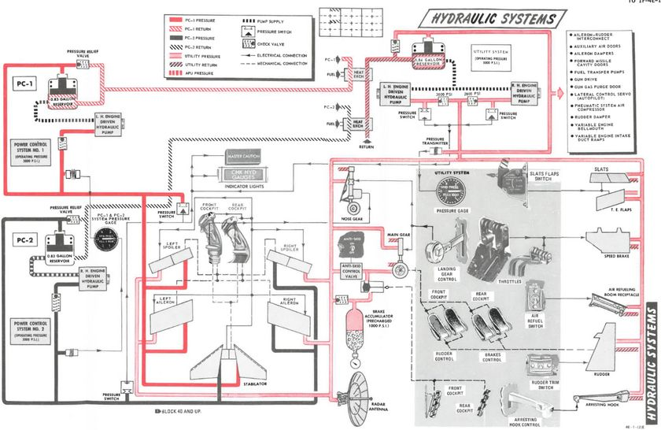
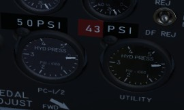

# Hydraulics

The hydraulic power system of the F-4E consists of three, completely
independent, closed hydraulic systems:

* Power Control System 1 (PC-1)
* Power Control System 2 (PC-2)
* Utility System

The systems have an operating pressure of approximately 3000 psi
and are pressurized any time the engines are running.

Ailerons, spoilers, and the stabilator have two hydraulic actuators.
The PC systems are the primary hydraulic delivery to the flight control systems,
with PC-1 powering the left side of the aircraft, and PC-2
powering the right; these supply pressure to one of the two actuators on each flight control surface.
PC-1 is using left engine pump and PC-2 is using right engine pump.

The Utility Hydraulic System is pressurized by a hydraulic pump on each engine. To prevent the
utility hydraulic pumps from resonating, check valves
with different operating pressures are installed on the
pump output lines. As a result, the right engine utility
hydraulic pump will deliver 2775 +225 psi at idle rpm,
and the left engine utility hydraulic pump will deliver
approximately 3000 ±250 psi at idle rpm.
The Utility System supplies hydraulic
pressure to all aircraft systems (which need hydraulic pressure) except the stabilator actuator.
It drives the second actuator on every flight
control surface (except stabilator), acting as both a power assist and backup.

The first stabilator actuator is powered through PC-1 and the second one by PC-2.
Additionally on aircraft after *TO 1F-4-903*,
an Stabilator Auxiliary Power Unit (APU)
is installed to provide backup hydraulic pressure for
longitudinal control. An electrically driven hydraulic
pump pressurizes the APU system to 1700 ±100 psi. The
APU supplies pressure to the PC-1 side of the stabilator
if PC-1 pressure drops below 1000 psi.

> 💡 The PC-1, PC-2, and Utility hydraulic system
> are independent of each other; therefore, each
> aileron and spoiler has two independent sources
> of hydraulic pressure and one system functions as
> a backup for the other.

## Hydraulic Pressure Indicators

On the [pedestal panel](../cockpit/pilot/pedestal_group.md) in the front cockpit is a pair of
[Hydraulic Pressure Indicators](../cockpit/pilot/pedestal_group.md#hydraulic-pressure-indicators).
One for the PC systems and the other for the Utility system. The PC system gauge has two
pointers, labeled PC-1 and PC-2. Nominal operating power for all three systems
is 3000 ±250 PSI.

## Hydraulic Systems Indicator Lights

In the event of a pressure loss on PC-1 or PC-2 or the Utility system below 1500 PSI, or a detected
definite pump failure, CHK HYD GAGES will illuminate on
the telelight panel along with
the Master Caution warning.

> 💡 In the event of a Utility system failure on the right side, no apparent pressure loss will be
> shown to underline the illumination of the CHK HYD GAGES light, whereas a left side failure will
> show a loss of 200 PSI or more on the Utility system pressure indicator. In any case, if the
> pressure recovers back to above 1750 PSI, the CHK HYD GAGES light will turn off. In the event of a
> Utility system failure on the right side, no apparent pressure loss will display to
> match the CHK HYD GAGES light, whereas a left side failure will show a loss of
> 200 PSI or more on the Utility system pressure indicator. In the event system
> pressure recovers back to above 1750 PSI, the CHK HYD GAGES light will turn off.

With a CHK HYD GAGES warning, the Master Caution can be cleared by reseting; however, be aware that
if the CHK HYD GAGES light is still on at that certain moment, a subsequent hydraulic system failure
will not re-trigger the Master Caution warning, with the consequence of not taking notice.

Also, the Master Caution and CHK HYD
GAGES lights can illuminate momentarily during extension of the
landing gear, or during intense maneuvering due to system load. In such situations, check the
pressure indicators: should they return to nominal values, disregard the warnings as they will reset
momentarily.
