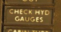

# Hydraulics

The hydraulic power system of the F-4E consists of three closed hydraulic
systems: Power Control System 1 (PC-1), Power Control System 2 (PC-2), and the
Utility System. Each aileron, spoiler, and stabilators have two hydraulic
actuators. The PC systems are the primary hydraulic delivery to the flight control systems, with
PC-1 powering the left side of the aircraft, and PC-2
powering the right; these actuate one of the two actuators on each flight
control surface. The Utility System drives the second actuator on the flight
control surfaces, acting as both a power assist and backup. Control is retained
in the event of a failure of one PC or the Utility System. One exclusion to this
is the stabilators - rather than using the Utility System as the secondary power,
an APU unit in the tail provides the additional and backup power for the
stabilators should PC system PSI to the stabilator actuators fall below 1000.

## Hydraulic Pressure Indicators

On the [pedestal panel](../cockpit/pilot/pedestal_group.md) in the front cockpit is a pair of PSI
indicators, one for the PC systems and the other for the Utility system. The PC system gauge has two
pointers, labeled PC-1 and PC-2. Nominal operating power for all three systems
is 3000 PSI ±250 PSI.

## Hydraulic Systems Indicator Lights

In the event of a pressure loss on PC-1 or PC-2 or the Utility system below 1500 PSI, or a detected
definite pump failure, CHK HYD GAGES will illuminate on
the telelight panel along with
the Master Caution warning.

> 💡 In the event of a Utility system failure on the right side, no apparent pressure loss will be
> shown to underline the illumination of the CHK HYD GAGES light, whereas a left side failure will
> show a loss of 200 PSI or more on the Utility system pressure indicator. In any case, if the
> pressure recovers back to above 1750 PSI, the CHK HYD GAGES light will turn off. In the event of a
> Utility system failure on the right side, no apparent pressure loss will display to
> match the CHK HYD GAGES light, whereas a left side failure will show a loss of
> 200 PSI or more on the Utility system pressure indicator. In the event system
> pressure recovers back to above 1750 PSI, the CHK HYD GAGES light will turn off.

With a CHK HYD GAGES warning, the Master Caution can be cleared by reseting; however, be aware that
if the CHK HYD GAGES light is still on at that certain moment, a subsequent hydraulic system failure
will not re-trigger the Master Caution warning, with the consequence of not taking notice.

Also, the Master Caution and CHK HYD
GAGES lights can illuminate momentarily during extension of the
landing gear, or during intense maneuvering due to system load. In such situations, check the
pressure indicators: should they return to nominal values, disregard the warnings as they will reset
momentarily.
