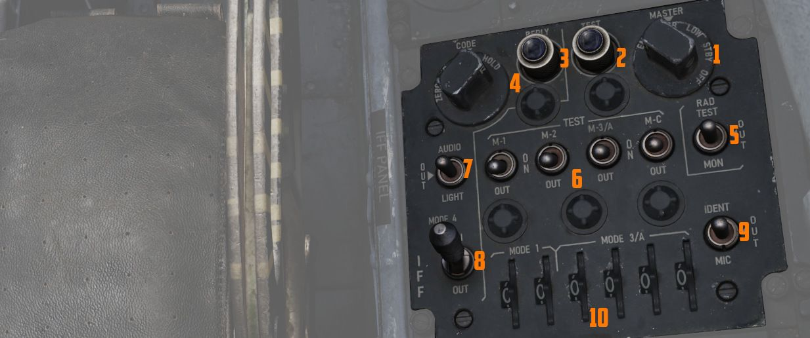
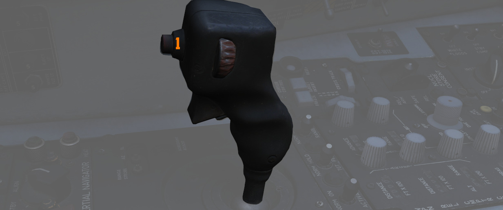

# Identification Systems

The aircraft is equipped with a set of interrogator systems AN/APX-76, -80A and -81A,
as well as with a transponder to react to interrogations from other aircraft.

The interrogator can be controlled by the WSO with a panel
on the [left sub-panel](../cockpit/wso/left_sub_panel.md#apx-80-control-panel).
The transponder is set up by the pilot on
the [right console](../cockpit/pilot/right_console/center_section.md#iff-control-panel).

## Transponder System

The transponder automatically responds to challenges from surface or airborne radar sets
and serves supplementary purposes such as providing momentary identification of position upon
request and transmitting a specially coded response to indicate an emergency.

The system operates by
receiving coded interrogation signals and transmitting coded response signals to the source of the
challenge, with a proper reply indicating the target is friendly.

The system features four modes. Mode 1, Mode 2, and Mode 3/A—are provided
for security identification, personal identification, and traffic identification, respectively.

Mode 4 is controlled through the interrogator panel by the WSO.
Codes for Modes 1 and 3/A can be set in the cockpit, while the code
for Mode 2 must be set on the ground, ranging from 0000 to 7777.

> 💡 Due to engine limitations, the settings on the panel have no effect for DCS.
> However, they are exposed to external tools, such as SRS.

### Self Test operation

To self test Modes 2 and 3/A, place the master switch to NORM and hold the switch for the desired
test mode to the upper position. If the test light on the IFF control panel illuminates, this
indicates the mode is operating properly.

Mode 1 and Mode C do not have self testing capabilities.

### Normal Operation

To operate the IFF system, start by rotating the master switch to STBY. After an approximate
80-second warmup delay, the system receives full power, but interrogations are blocked.

Set the Mode 1, Mode 2, Mode 3/A, Mode 4, and Mode C switches as directed,
along with the Mode 1 and Mode 3/A code selector switches and Mode 4 function switch.
Set the master switch to NORM to make the system
ready for operation on the selected modes. If the master switch is rotated from OFF directly to an
operating mode, it also has to go through the warmup period first before it is fully operational.

#### Interrogation of Position

For Interrogation of Position (I/P) switch operation,
place the I/P switch in the IDENT position or place it in the MIC position
and press the UHF microphone. The IFF system responds with special I/P signals.

If the IFF warning
light and MASTER CAUTION light come on momentarily, check the Mode 4 selector switch ON and the
master switch NORMAL. Repeated illumination of the MASTER CAUTION light may be stopped only by
placing the master switch OFF, resulting in the loss of all IFF capability, or by placing the Mode 4
function switch to ZERO. Before or during flight, if the master switch is placed OFF, the IFF and
MASTER CAUTION lights will not illuminate upon interrogation.

Normal IFF operation will be
available, after an 80-second warm-up, when the master switch is again placed to NORMAL. If the Mode
4 function switch is placed to ZERO, the IFF light will come on steady, and the MASTER CAUTION may
then be reset. Mode 4 will not be available during the remainder of the flight.

### Emergency Operation

Upon ejection from either cockpit, the IFF emergency operation automatically becomes active.

If the master switch is in the OFF position before ejection, the system will
begin operation after an
approximate 80-second delay.

In an emergency, rotate the master switch to EMER. The replies for
Modes 1 and 2 are special emergency signals of the codes selected on the applicable dials, while
Mode 3/A replies are special emergency signals of code 7700.

## Interrogator Systems

The Phantom combines three systems, AN/APX-76, -80A and -81A, for interrogating and
challenging other aircraft to detect whether they are friend or foe.

### Operation

Controls are combined on a panel, accessible to the WSO on the left sub-panel area.

The interrogation mode is set on the first roller-display and can be set to
OFF or Mode 1, 2, 3, 4/A or 4/B.

> 💡 In DCS, only Mode 4 (either A or B) is effective and can be used for
> interrogation.

The other four digits are used to set the IFF code to interrogate for Modes 1
to 3.

Regular interrogation based on transponder codes is accomplished by the AN/APX-76 system.
To use it, the _Test/Challenge Code_-switch has to be placed in CHAL CODE.

Additionally, the AN/APX-81A Combat-Tree system can identify targets beyond
their transponder responses, enabling to identify likely-hostile aircraft.
The Combat-Tree System can be enabled by placing the Mode 2 and Mode 3
switches to ACTIVE respectively.

Once setup, interrogation can be initiated by pressing the
Challenge Button on the Antenna Hand Control Stick.

The radar screen will now display lines next to each radar return if
it was able to detect that a contact is friendly.

### Indications

#### Challenge Lights

The control panel features two lamps that indicate active interrogation
by either interrogation system:

* TEST/CHAL lamp in lower left corner - active APX-81A Combat-Tree Interrogation
* CHAL lamp in upper right corner - active APX-76 Interrogation

#### Activity Lights

Right next to either AoA Indexer in the WSO cockpit is a light that indicates activity
detected by the APX-81A Combat Tree system.

Illuminated each time the system detects being interrogated by other aircraft.

> 💡 Due to DCS limitations, the activity lights are not simulated in-game.
