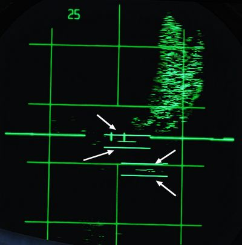
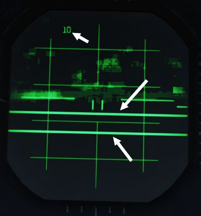
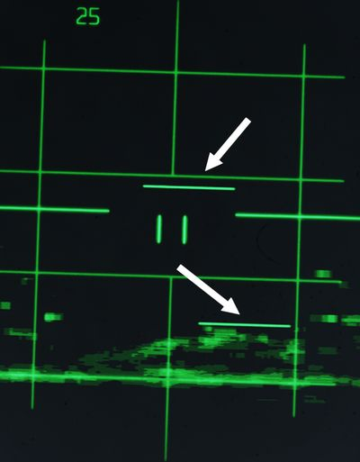

# Identification Systems

The aircraft is equipped with a set of interrogator systems AN/APX-76, -80A and
-81A, as well as with a transponder to react to interrogations from other
aircraft.

The interrogator can be controlled by the WSO with a panel on the
[left sub-panel](../cockpit/wso/left_sub_panel.md#apx-80-control-panel). The
transponder is set up by the pilot on the
[right console](../cockpit/pilot/right_console/center_section.md#iff-control-panel).

<iframe width="560" height="315" src="https://www.youtube.com/embed/H_Gkn_Re548?si=QVjKK29KbDhpPh0l"
title="How To Use the IFF in the F-4E Phantom | DCS World" frameborder="0"
allow="accelerometer; autoplay; clipboard-write; encrypted-media; gyroscope; picture-in-picture; web-share"
referrerpolicy="strict-origin-when-cross-origin" allowfullscreen></iframe>

## Transponder System

The transponder automatically responds to challenges from surface or airborne
radar sets and serves supplementary purposes such as providing momentary
identification of position upon request and transmitting a specially coded
response to indicate an emergency.

The system operates by receiving coded interrogation signals and transmitting
coded response signals to the source of the challenge, with a proper reply
indicating the target is friendly.

The system features four modes. Mode 1, Mode 2, and Mode 3/A—are provided for
security identification, personal identification, and traffic identification,
respectively.

Mode 4 is controlled through the interrogator panel by the WSO. Codes for Modes
1 and 3/A can be set in the cockpit, while the code for Mode 2 must be set on
the ground, ranging from 0000 to 7777.

> 💡 Due to engine limitations, the settings on the panel have no effect for
> DCS. However, they are exposed to external tools, such as SRS.

### Self Test operation

To self test Modes 2 and 3/A, place the master switch (<num>1</num>) to NORM and
hold the switch for the desired test mode to the upper position. If the test
light on the IFF control panel illuminates, this indicates the mode is operating
properly.

Mode 1 and Mode C do not have self testing capabilities.

### Normal Operation

To operate the IFF system, start by rotating the master switch (<num>1</num>) to
STBY. After an approximate 80-second warmup delay, the system receives full
power, but interrogations are blocked.

Set the Mode 1, Mode 2, Mode 3/A, Mode 4, and Mode C switches (<num>6</num>) as
directed, along with the Mode 1 and Mode 3/A code selector switches
(<num>10</num>) and Mode 4 function switch (<num>8</num>). Set the master switch
(<num>1</num>) to NORM to make the system ready for operation on the selected
modes. If the master switch (<num>1</num>) is rotated from OFF directly to an
operating mode, it also has to go through the warmup period first before it is
fully operational.

#### Interrogation of Position

For Interrogation of Position (I/P) switch operation, place the I/P switch
(<num>9</num>) in the IDENT position or place it in the MIC position and press
the UHF microphone. The IFF system responds with special I/P signals.

If the IFF warning light and MASTER CAUTION light come on momentarily, check the
Mode 4 selector switch (<num>8</num>) ON and the master switch (<num>1</num>)
NORMAL. Repeated illumination of the MASTER CAUTION light may be stopped only by
placing the master switch (<num>1</num>) OFF, resulting in the loss of all IFF
capability, or by placing the Mode 4 function switch (<num>8</num>) to ZERO.
Before or during flight, if the master switch (<num>1</num>) is placed OFF, the
IFF and MASTER CAUTION lights will not illuminate upon interrogation.

Normal IFF operation will be available, after an 80-second warm-up, when the
master switch (<num>1</num>) is again placed to NORMAL. If the Mode 4 function
switch (<num>8</num>) is placed to ZERO, the IFF light will come on steady, and
the MASTER CAUTION may then be reset. Mode 4 will not be available during the
remainder of the flight.

### Emergency Operation

Upon ejection from either cockpit, the IFF emergency operation automatically
becomes active.

If the master switch (<num>1</num>) is in the OFF position before ejection, the
system will begin operation after an approximate 80-second delay.

In an emergency, rotate the master switch (<num>1</num>) to EMER. The replies
for Modes 1 and 2 are special emergency signals of the codes selected on the
applicable dials, while Mode 3/A replies are special emergency signals of
code 7700.

## Interrogator Systems

The Phantom combines three systems, AN/APX-76, -80A and -81A, for interrogating
and challenging other aircraft to detect whether they are friend or foe.

The AN/APX-76 system enables regular interrogation with friendly transponder
systems.

Further, the US reverse-engineered some Soviet transponder systems actively used
between 1960 and 1980 enough to be able to develop the spoofing system
AN/APX-81A _Combat-Tree_. Combat-Tree sends compatible interrogation requests to
Soviet systems which they would identify as friendly systems, hence sending back
a valid response. This allows the Phantom to not only identify friendly systems,
but also some likely-hostile aircraft.

> 💡 Soviets quickly realized the problem and patched their IFF transponder
> systems, while also encrypting the communication to prevent another breach.

Controls are combined on a panel, accessible to the WSO on the left sub-panel
area.

The upper half consists of controls for the AN/APX-76 system, while the lower
half controls the AN/APX-81A.

### AN/APX-76

To challenge friendly or civilian aircraft using the AN/APX-76, the WSO sets the
interrogation mode on the first roller-display. It can be set to either OFF, or
Mode 1, 2, 3, 4/A or 4/B (<num>3</num>).

> 💡 In DCS, only Mode 4 (either A or B) is effective and can be used for
> interrogation using the AN/APX-76.

The other four digits are used to set the IFF code to interrogate for Modes 1 to
3 (<num>3</num>). The code for Mode 4/A and 4/B is set by the ground personal.

Once setup, interrogation can be initiated by either pressing the Challenge
Button on the Antenna Hand Control Stick or moving the Test/Challenge Switch
(<num>2</num>) to the CHAL CODE position.

> 💡 The Test/Challenge switch will only send a challenge via the AN/APX-76
> system, while the Challenge Button includes an interrogation by Combat-Tree,
> if activated.

The radar screen presents the results of the interrogation with lines around the
contacts position:

- line above; the aircraft has a matching transponder mode
- line below; the aircraft has a matching transponder code

> 💡 In DCS, a line above and below the contact means it is friendly. A single
> line represents a neutral, e.g. civilian, aircraft.

Each time the AN/APX-76 is sending an interrogation, the challenge light
(<num>1</num>) illuminates.

#### Test

The interrogation system can be tested by holding the Test/Challenge Switch
(<num>2</num>) in the TEST position.

During the test, the system will inject two artificial transponder responses at
ranges 3.5 NM and 4.5 NM.

The test is successful if the challenge lamp (<num>1</num>) illuminates and the
DSCG screen shows two lines at the corresponding distances that span over the
entire screen.

### AN/APX-81A Combat-Tree

Combat-Tree is designed to spoof hostile IFF transponders by sending
interrogation requests compatible with these systems. The hostile transponder
will then send back a response, revealing the position of the aircraft.

> 💡 Spoofable systems that can be exploited by the AN/APX-81A can be configured
> in the [Mission Editor](../dcs/mission_editor.md#combat-tree-spoofable).

The system is activated by moving both, the Mode 2 and Mode 3 switch
(<num>5</num>) to the ACTIVE position.

Once setup, interrogation can be initiated by pressing the Challenge Button on
the Antenna Hand Control Stick.

> 💡 If AN/APX-76 is setup, pressing the Challenge Button will also send an
> interrogation request by AN/APX-76.

Responses to a spoofed request are indicated by a single line below the contact.

> 💡 The indication is almost identical to responses to an AN/APX-76
> interrogation with only a matching transponder mode, but different code. To
> differentiate to which challenge the response belongs, it is necessary to
> either deactivate one interrogation system, or to send a AN/APX-76-only
> challenge by using the Test/Challenge Switch (<num>2</num>) in the CHAL CODE
> position and compare results.

Each time the AN/APX-81A is sending an interrogation, the TEST/CHAL light
(<num>6</num>) illuminates.

#### Activity Lights

Right next to either AoA Indexer in the WSO cockpit is a light that indicates
activity detected by the APX-81A Combat Tree system.

Illuminated each time the system detects IFF responses by hostile aircraft.

> 💡 Due to engine limitations, the activity lights only illuminate if a
> transponder responds to a Combat-Tree challenge send by the own aircraft.

#### Self-Test

The Test button (<num>6</num>) can be used to initiate a self-test of the
Combat-Tree system.

The test is successful if the TEST/CHAL lamp (<num>6</num>) right next to the
button illuminates.
