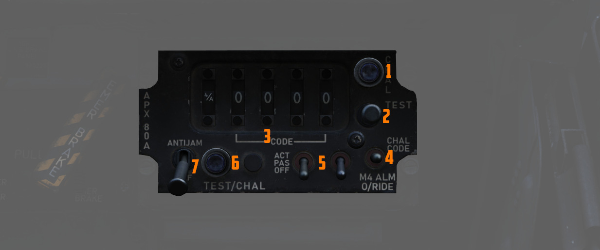

# 敌我识别系统

飞机配备了一套 AN/APX-76、-80A 和 -81A 问询系统，以及一台应答机来响应其它飞机的敌我识别问询。

问询系统由 WSO 使用位于 [左侧子面板](../cockpit/wso/left_sub_panel.md#apx-80-control-panel) 上的面
板来控制。应答机由飞行员在
[右侧控制台](../cockpit/pilot/right_console/center_section.md#iff-control-panel) 上控制。

## 应答器系统

应答机会自动恢复地面或机载雷达套件的问询，并起到辅助飞行员提供信息的作用，例如应要求提供临时位置识
别，以及发送特殊编码的回应来宣告紧急情况。

应答机系统的工作原理是接收经过编码的问询信号，并向问询信号源发送经过编码的应答信号——正确进行应答则
将表明本机为友机。

该系统拥有四种模式。模式 1、模式 2 和模式 3/A，其分别用于安全识别、个人识别和交通识别。

模式 4 由 WSO 通过问询面板控制。模式 1 和 模式 3/A 的编码可在驾驶舱内设置，而模式 2 的编码必须在地
面上设置，区间从 0000 到 7777。

> 💡 由于游戏引擎的限制，这些面板上的设置对 DCS 没有影响。> 但是，它们留有对外部工具的接口，例如
> SRS。

### 自检

若要对模式 2 和 3/A 进行自检，需将主开关置于 NORM 档位，并将所需测试模式的开关按在上方位置。如果
IFF 控制面板上的测试灯亮起，则表明模式运行正常。

模式 1 和模式 C 无自检能力。

### 正常操作

如需操作 IFF 系统，首先要将主开关旋转到 STBY 档位。经过大约 80 秒的预热延迟后，系统将完整通电，但屏
蔽问询功能。

按指示设置模式 1、模式 2、模式 3/A、模式 4 和模式 C 开关，以及模式 1 和模式 3/A 编码选择开关和模式
4 功能开关。将主开关调至 NORM 档位，使系统可以在所选模式下运行。如果直接将主开关从 OFF 转到工作模式
，也必须先经过预热才能完全投入运行。

#### 位置问询

如需使位置识别（I/P）开关工作，将 I/P 开关拨至 IDENT 档位或将其拨至 MIC 并按下 UHF 传声。IFF 系统将
使用特殊 I/P 信号进行应答。

如果 IFF 告警灯和 MASTER CAUTION 灯短暂亮起，请检查 Mode 4 选择开关是否打开并且主开关设置为
NORMAL。MASTER CAUTION 灯重复亮起只能通过将主开关转至 OFF 来停止，这将导致丧失所有 IFF 功能，或者将
Mode 4 功能开关拨至 ZERO。在飞行前或飞行中，如果主开关拨至 OFF，在被询问时 IFF 和 MASTER CAUTION 灯
不会亮起。

再次将主开关转至 NORMAL 时，经过 80 秒的预热后，IFF 将出现正常工作。如果 Mode 4 功能开关拨至
ZERO，IFF 灯将常亮，然后即可复位 MASTER CAUTION。在后续的飞行期间，Mode 4 将不可用。

### 应急操作

从任意驾驶舱启动弹射，系统将自动激活 IFF 应急操作。

如果在弹射前主开关处于 OFF 档位，系统将在大约 80 秒延迟后开始操作。

在应急情况下，将主开关旋转至 EMER。模式 1 和模式 2 应答将为所选拨轮上的特殊紧急信号码，而模式 3/A
应答为特殊应急信号码 7700。

## 问询系统

“鬼怪”结合了三套系统：AN/APX-76、-80A 和 -81A，用于问询其它飞机，以便进行敌我识别。

### 操作

控制开关/按钮都位于 WSO 的左侧子面板中，便于操作。

问询模式在第一个滚轮显示器中进行设置，可以设置为 OFF 或模式 1、2、3、4/A 或 4/B。

> 💡 在 DCS 中，只有模式 4（A 或 B）是有效的，可以用于问询。

其他四位数字用于为模式 1 到 3 设置 IFF 编码。

基于应答机编码的常规问询通告 AN/APX-76 系统完成。

此外，AN/APX-81A 战斗树系统可以识别超出其应答机响应的目标，使得能够识别可能具有敌意的飞机。

设置完毕后，通过按天线手控杆上的问询按钮即可开始询问。

问询后雷达显示器将在识别为友机的目标回波旁显示线条。

> 🚧 本部分正在施工中。 >
>
> - Switchology, how to enable either mode, details > \* Radar picture and link to radar section
>   with further details

### 指示

#### 问询灯

控制面板上有两个灯，分别指示两个问询系统的主动问询状态：

- 左下角的 TEST/CHAL 灯 - 激活 APX-81A “战斗树”问询
- 右上角 CHAL 灯 - 激活 APX-76 问询

#### 激活灯

位于 WSO 驾驶舱仰角分度器的是 APX-81A “战斗树”系统的指示灯，在探测到主动照射时亮起。

系统每探测到其它飞机问询本机时亮起一次。

由于 DCS 限制，游戏中未模拟该功能。
