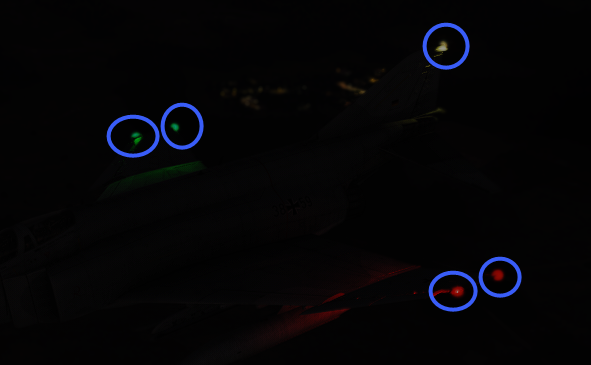
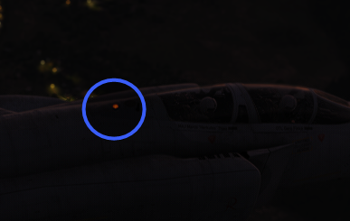
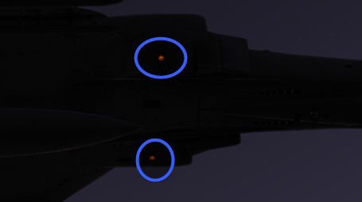
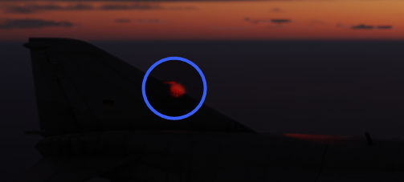

# Lighting Equipment

## Exterior Lighting

Exterior lights on the F-4E include position lights found on the wings and tail,
join-up lights on the wings, fuselage lights, the anti collision light, and the
inflight refueling receptacle light; the control for these are found on the
right console. Additional in-flight lighting is provided by the formation
lights, which have a separate set of controls above the right console. Further
lighting is available for landing and taxi when the gear are lowered, and the
controls for these are found on the left sub-panel.

### Position and Join-Up Lights

The wing and join-up lights are controlled by a single switch, with options for
OFF, DIM, and BRT. These lights do not have a flash function. The tail light is
controlled by the Flasher Switch in STEADY or FLASH position.

### Anti-Collision and Fuselage Lights

Three white anti-collision lights are found behind the rear cockpit canopy, and
one below each of the engine intakes.

A red anti-collision light is found on the vertical stabilizer.

These are all controlled by the three position FUS switch, which can be set to
OFF, DIM, and BRT. The red light on the stabilizer only illuminates when this
switch is selected to BRT. The fuselage lights only function with the Flasher
Switch in STEADY or FLASH, and cycle when in the latter setting.

### Landing and Taxi Lights

The landing and taxi lights are found on the nose gear door, and only illuminate
when the gear are in the down position.

### IFR Receptacle Lights

To assist operators with boom alignment, lights illuminating the IFR receptacle
will power on when it is raised by placing the Air Refuel Switch into EXTEND.

### Formation Lights

Electroluminescent formation lighting is found along the fuselage, wing tips,
and vertical stabilizer. These are activated using the control panel above the
right console, and have options for ON, OFF, and MOM (for momentary).

## Interior Lighting

Lighting for instruments and controls, as well as a white utility lamp and red
floodlights are found in both cockpits. Barring the utility lamp and floodlight
controls (which are found on their respective lamps), all cockpit lighting
controls are found on the Flight Instrument Lights Control panel in each
cockpit. The sole difference between the two control panels is the intensity
control for the Warning Control knob in the front cockpit, which controls
brightness for all warning lights in both cockpits.
