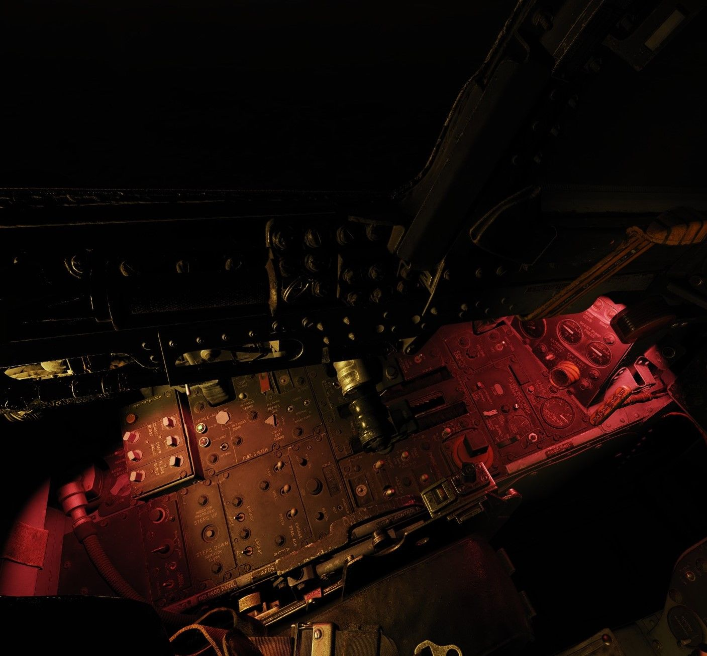

# Lighting Equipment

## Exterior Lighting

Exterior lights on the F-4E include position lights found on the wings and tail,
join-up lights on the wings, fuselage lights, the anti collision light, and the
inflight refueling receptacle light; the control for these are found on the
right console. Additional in-flight lighting is provided by the formation
lights, which have a separate set of controls above the right console. Further
lighting is available for landing and taxi when the gear are lowered, and the
controls for these are found on the left sub-panel.

 _Pilot
Exterior Lighting Panel_

### Position and Join-Up Lights

The wing and join-up lights are controlled by a single switch, with options for
OFF, DIM, and BRT. These lights do not have a flash function. The tail light is
controlled by the Flasher Switch in STEADY or FLASH position.

### Anti-Collision and Fuselage Lights

Three white anti-collision lights are found behind the rear cockpit canopy, and
one below each of the engine intakes.

A red anti-collision light is found on the vertical stabilizer.

These are all controlled by the three position FUS switch, which can be set to
OFF, DIM, and BRT. The red light on the stabilizer only illuminates when this
switch is selected to BRT. The fuselage lights only function with the Flasher
Switch in STEADY or FLASH, and cycle when in the latter setting.

### Landing and Taxi Lights

The landing and taxi lights are found on the nose gear door, and only illuminate
when the gear are in the down position.

### In-Flight-Refueling Receptacle Lights

To assist operators with boom alignment, lights illuminating the IFR receptacle
will power on when it is raised by placing the Air Refuel Switch into EXTEND.

### Formation Lights

Electroluminescent formation lighting is found along the fuselage, wing tips,
and vertical stabilizer. These are activated using the control panel above the
right console, and have options for ON, OFF, and MOM (for momentary).

## Interior Lighting

Interior lighting consists of several floodlights, panel back-lighting, gauge
edge lighting, and several dimmable warning and indicator lamps.

Both cockpits are fully night-capable and have separate controls for adjusting
brightness.

Most controls for interior lighting can be found at the aft end of the right
consoles.

| Pilot                                                  | WSO                                                    |
|--------------------------------------------------------|--------------------------------------------------------|
|  |  |

### Floodlights

For general cockpit illumination, the aircraft features several red floodlights
and also a battery-powered white floodlight.

#### White Floodlight

The White Floodlight switch acts independent of all other controls on the panel,
and is either ON or OFF. It activates a separate emergency floodlight (also
called _Thunderstorm Light_) that illuminates the cockpit in white. The lamp is
energized through the Battery Bus to ensure it is always operational, even in
case of total power loss.

> 🟡 CAUTION: Do not forget to turn off the light before parking the aircraft for a
> longer time, as it will otherwise drain the battery.

#### Red Floodlights

Red floodlights can be switched individually for the consoles and the instrument
panel. Controls are found on the right console and the right wall.

> 💡 The WSO has no controls for the instrument floodlight. The light is also
> controlled by the pilots switch on the right wall.

All three positions of the switches are powered by different buses to ensure
maximal availability:

| Lamp   | Bus                   |
|--------|-----------------------|
| Bright | Essential 28V DC Bus  |
| Medium | Left Main 14V AC Bus  |
| Dim    | Left Main 115V AC Bus |

### Panel Lighting

To ensure that all panels and gauges are readable during night, back- and
edge-lighting can be enabled by either crew-member individually for the consoles
and instrument panel.

Controls are located on the right console.

Console lighting is provided by the Left Main 115V AC bus, while instrument
panel lighting is powered through the Right Main 115V AC bus.

### Flight Instrument Lighting

Additionally to general panel lighting, the brightness for the following six
flight instruments can be controlled individually by the pilot using the Flight
Instrument Brightness Knob on the front panel, and the six knobs on the right
wall.

- AoA Indicator
- Airspeed Indicator
- HSI
- ADI
- VVI
- Altimeter

| Flight instrument brightness                                                  | Flight instrument light intensity                                                      |
|-------------------------------------------------------------------------------|----------------------------------------------------------------------------------------|
|  |  |

The Flight Brightness Knob acts as master control. On the fully CCW position,
lighting of all six instruments is turned off.

The knobs on the wall can be used to tweak brightness for instruments
individually, where the fully CCW position turns them off and moving the knob CW
progressively increases brightness until it reaches the level dictated by the
Flight Brightness Knob.

> 💡 The WSO has no controls for the instrument lighting. Instead, the
> brightness is also controlled by the pilots knobs.

### Warning and Indicator Brightness

Additionally to controlling Flight Instrument Brightness, the pilots Flight
Brightness Knob also controls the intensity of all warning and indicator lamps
in both cockpits.

In the fully CCW position, all indications are given at full brightness. Moving
the knob out of this position will result in dimmed lamp intensity. No variable
brightness setting is available.

Some lamps, such as the Fire and Overheat lights are excluded from the circuit
and will always show at full brightness.

> 💡 Warning and Indicator lamps can not be turned off fully, only a bright or
> dimmed setting is available.

### Rotate-To-Dim Lamps

Both cockpits feature multiple lamps that can be dimmed individually by rotating
the lamp. Rotation will move a shutter in front of the lamp, resulting in a
reduced intensity.

Some of those lamps can also be pushed-to-test.

For the pilot, these lamps include:

| Name            | Location              |
|-----------------|-----------------------|
| CMS Indicator   | Left Console          |
| Flare Indicator | Left Console          |
| Recorder        | Left Sub-Panel        |
| Marker Beacon   | Flight Director Group |
| Pull-Up         | Overhead Indicators   |
| KY-28 Mode P    | Right Sub-Panel       |
| KY-28 Mode C    | Right Sub-Panel       |
| Radio Command   | Right Console         |
| TACAN Command   | Right Console         |
| IFF Reply       | Right Console         |
| IFF Test        | Right Console         |

The WSO cockpit has the following rotate-to-dim lamps:

| Name                  | Location           |
|-----------------------|--------------------|
| Radio Command         | Left Console       |
| TACAN Command         | Left Console       |
| Chaff Indicator       | Left Console       |
| Flare Indicator       | Left Console       |
| APX Challenge         | Left Sub-Panel     |
| Combat-Tree Challenge | Left Sub-Panel     |
| Marker Beacon         | Upfront Indicators |
| KY-28 Mode P          | Upfront Indicators |
| KY-28 Mode C          | Upfront Indicators |
| INS Align             | Right Console      |
| INS Heat              | Right Console      |

### Other

Some panels and systems have individual lighting controls not tied to the
general console or instrument brightness knobs.

For the pilot, these additional brightness controls are:

| Name                    | Location          |
|-------------------------|-------------------|
| SAI                     | Left Wall         |
| Station Lamps           | Weapon Management |
| Range Indicator Display | Weapon Management |
| HUD Reticle             | DSCG Controls     |
| DSCG Screen             | DSCG Controls     |
| RWR Display             | Right Main Panel  |
| RWR Buttons             | Right Main Panel  |
| Standby Compass Light   | Right Console     |
| AoA Indexer             | Right Wall        |

While the WSOs brightness controls are as follows:

| Name                  | Location           |
|-----------------------|--------------------|
| RWR Display           | Upfront Indicators |
| RWR Buttons           | Upfront Indicators |
| Standby Compass Light | Right Console      |
| AoA Indexer           | Right Console      |
| Pave Spike Reticle    | Pedestal Group     |
| Pave Spike Panel      | Pedestal Group     |
