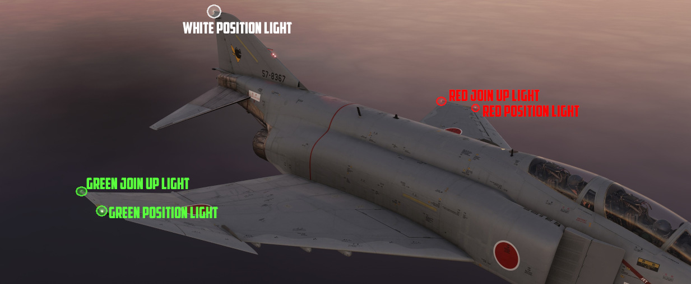
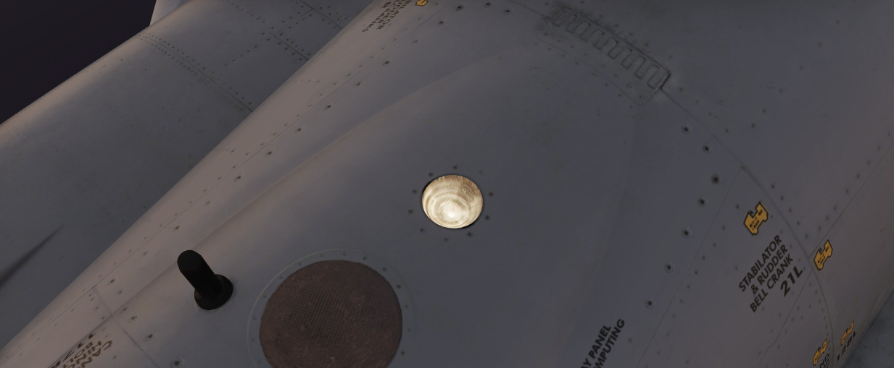

# 照明设备

## 机外照明

F-4E 的机外照明包括位于机翼和垂尾的航行灯、翼尖会合灯、机身灯和防撞灯和受油口灯；这些灯光的控制开关
可在右侧控制台中找到。此外，F-4E 还可以使用编队灯进行空中照明，其在右侧控制台上方右单独的一组控制开
关/旋钮。放下起落架后，着陆和滑行时还可获得更多照明，这些照明的控制开关位于左侧子面板上。

 _Pilot Exterior Lighting Panel_

### 航行和会合灯

机翼和会合灯由单个开关进行控制，档位有 OFF、DIM 和 BRT。这些灯光无闪烁功能。垂尾灯可将闪光器开关拨
至 STEADY 或 FLASH 档位进行控制。

### 防撞灯和机身灯

| 顶部机身灯                                             | 底部机身灯                                                   |
| ------------------------------------------------------ | ------------------------------------------------------------ |
|  |  |

在后座驾驶舱座舱盖的后方装有三个机身灯，其中每台发动机的进口下方有一盏。

垂尾上则为红色防撞灯。

这些防撞灯都由三档位机身开关 (<num>1</num>) 进行控制，可设置档位为 OFF、DIM 和 BRT。位于垂尾的红色
防撞灯仅在开关选择 BRT 时亮起。机身灯仅在闪光器开关设置到 STEADY 或 FLASH 档位时生效，并跟随档位设
置进行闪烁常亮变化。

### 着陆和滑行灯

着陆和滑行灯安装在前轮轮舱盖上，仅在起落架放下时可亮起。

### 受油口灯

将空中加油开关置于 EXTEND 档位，受油口抬起时，受油口灯将亮起来辅助加油机硬管操作员进行空加操作。

### 编队灯

电致发光编队灯沿机身、翼尖和垂尾进行安装。编队灯使用右侧控制台上方的控制面板进行控制，有 ON、OFF 和
MOM（自复位）档位。

## 机内照明

机内照明由数个泛光灯、面板背光照明、仪表边缘照明和数个可调告警和指示灯灯光组成。

两个驾驶舱都有完整夜间作业能力以及有单独的控制开关/旋钮来调整亮度。

大多数机内照明控制开关/旋钮位于右侧控制台的后部。

| 飞行员                                                 | WSO                                                    |
| ------------------------------------------------------ | ------------------------------------------------------ |
|  |  |

### 泛光灯

用于常规驾驶舱照明，飞机配备了多个红色泛光灯和一个电池供电的白色泛光灯。

#### 白色泛光灯

白色泛光灯开关（1 飞行员，4 WSO）可独立于所有其它面板中的控制开关进行工作，开关有 ON 或 OFF 两个档
位。开关拨至 ON 将打开一个单独的应急泛光灯（也称为 _雷暴灯_）来用白光照亮驾驶舱。白色泛光灯灯通过电
池总线供电，以确保即使在完全断电的情况下也能保持工作。

🟡 注意：在长时间停放飞机前别忘了关掉灯光，否则将耗光电池电量。

#### 红色泛光灯

控制台和仪表板的红色泛光灯可单独开关。控制开关位于右侧控制台和右侧墙板上。

💡 WSO 没有仪表泛光灯的控制开关。WSO 仪表泛光灯由飞行员右侧墙板上的开关进行控制。

开关的所有三个档位都由不同的总线供电，以确保最大的可用性：

| 灯光   | 总线              |
| ------ | ----------------- |
| Bright | 应急 28V DC 总线  |
| Medium | 左主 14V AC 总线  |
| Dim    | 左主 115V AC 总线 |

💡 选择 DIM 档位并将控制台亮度旋钮转至 OFF，即可关闭泛光灯。

### 面板照明

为确保所有面板和仪表在夜间也可读，任意一名机组人员都可单独启用控制台和仪表板的背光和边缘照明。

控制开关全都位于右侧控制台上。

控制台照明由左主 115V AC 母线提供电力，而仪表板照明由右主 115V AC 母线供电。

### 飞行仪表照明

除了常规面板照明外，飞行员还可以使用前面板上的飞行仪表亮度旋钮和右侧墙板上的六个旋钮单独控制以下六
个飞行仪表的亮度。

- 迎角指示器
- 空速表
- HSI
- ADI
- VVI
- 高度表

| 飞行仪表亮度                                                                  | 飞行仪表灯光亮度                                                                       |
| ----------------------------------------------------------------------------- | -------------------------------------------------------------------------------------- |
|  |  |

飞行仪表亮度旋钮作为主控制使用。在转动到最大逆时针档位时，所有六个仪表照明将关闭。

墙板的旋钮用来单独调整仪表的亮度，转动到最大逆时针档位时将关闭照明，顺时针转动来逐步增加亮度，直到
到达飞行仪表亮度旋钮决定的最高亮度。

💡 WSO 驾驶舱没有仪表照明的控制开关，而是全部由飞行员进行控制。

🚧 飞行仪表照明目前与右侧控制台上的
[仪表版旋钮](../cockpit/pilot/right_console/center_section.md#instrument-panel-knob) 相连。正确的控
制旋钮将在抢先体验后期中提供。

### 告警和指示器亮度

除了控制飞行仪表亮度外，飞行仪表亮度旋钮还可控制两个驾驶舱内所有告警灯和指示器灯的亮度。

在转动到最大逆时针档位时，所有指示将提供最高亮度。将旋钮往回转动时将降低灯光亮度。旋钮无亮度可调设
置功能。

某些灯光，例如失火和过热灯处在控制电路外，将始终以最高亮度显示。

💡 告警和指示器灯无法完全关闭，只能设置为亮或暗。

💡 SHOOT 灯无调光设置，将在旋钮移出 OFF 档位时完全关闭。

### 转动调光灯

两个驾驶舱都有多盏灯，可以通过转动灯泡来单独调光。转动时，灯前面的光栅会移动，从而降低灯的亮度。

其中一些灯还可以按下来进行测试。

飞行员驾驶舱中，这些灯光为：

| 名称             | 位置             |
| ---------------- | ---------------- |
| CMS 指示灯       | 左侧控制台       |
| 红外干扰弹指示灯 | 左侧控制台       |
| 录制灯           | 左侧子面板       |
| 指点信标灯       | 飞行指引指示器组 |
| 拉起灯           | 抬头指示器       |
| KY-28 模式 P     | 右侧子面板       |
| KY-28 模式 C     | 右侧子面板       |
| 电台指令         | 右侧控制台       |
| TACAN 指令       | 右侧控制台       |
| IFF 应答         | 右侧控制台       |
| IFF 测试         | 右侧控制台       |

WSO 驾驶舱中有以下可转动进行调光的灯：

| 名称         | 位置         |
| ------------ | ------------ |
| 电台指令     | 左侧控制台   |
| TACAN 指令   | 左侧控制台   |
| 箔条指示灯   | 左侧控制台   |
| 红外指示灯   | 左侧控制台   |
| APX 问询     | 左侧子面板   |
| 战斗树问询   | 左侧子面板   |
| 指点信标     | 前上方指示器 |
| KY-28 模式 P | 前上方指示器 |
| KY-28 模式 C | 前上方指示器 |
| INS 对准     | 右侧控制台   |
| INS 加热     | 右侧控制台   |

### 其它

一些面板和系统有独立的照明控制，与常规控制台或仪表亮度旋钮无关。

飞行员驾驶舱中，这些额外的亮度控制开关/旋钮为：

| 名称       | 位置               |
| ---------- | ------------------ |
| SAI        | 左侧墙板           |
| 挂点灯     | 武器管理           |
| 距离灯     | 武器管理           |
| HUD 准星   | DSCG 控制开关/按钮 |
| DSCG 屏幕  | DSCG 控制开关/按钮 |
| DSCG 标度  | DSCG 控制开关/按钮 |
| RWR 显示器 | 右侧主面板         |
| RWR 按钮   | 右侧主面板         |
| 备用罗盘灯 | 右侧控制台         |
| AoA 分度器 | 右侧墙板           |

WSO 的亮度控制开关/旋钮如下：

| 名称            | 位置         |
| --------------- | ------------ |
| RWR 显示器      | 前上方指示器 |
| RWR 按钮        | 前上方指示器 |
| 备用罗盘灯      | 右侧控制台   |
| AoA 分度器      | 右侧控制台   |
| DSCG 屏幕       | 底座组       |
| DSCG 标度       | 底座组       |
| Pave Spike 准星 | 底座组       |
| Pave Spike 面板 | 底座组       |
