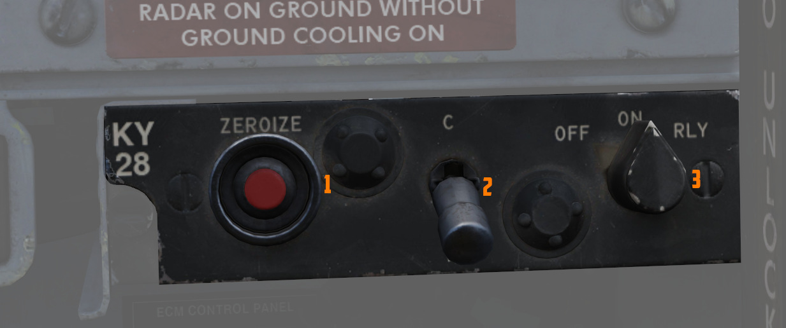

# KY-28 保密话音装置

## 保密话音装置 KY-28

UHF 通信系统能够提供传统的或加密的话音传输和接收功能。如果在战术或敌对环境中，UHF 和内话系统都可以
结合 KY-28 保密话音装置使用。KY-28 可以对发出的话音传输进行加密，或者对收到的话音传输进行解密，但是
这些功能不能同时执行。机组人员可以选择使用明文或密文工作模式。在密文工作模式中，KY-28 通过传声器将
话音输入转换为加密传输，并将收到的加密回复解密到机组人员的头戴中。在明文模式操作中，UHF 充当传统的
话音收发器。

## KY-28 控制开关/按钮和显示

KY-28 通过 KY-28 控制面板以及传统的 UHF 或内话控制开关进行控制。前后驾驶舱的仪表板上都会显示每种模
式的指示灯。如果模式灯 P 亮起，表示 KY-28 和 UHF/内话正在以明文模式运行。如果模式灯 C 亮起，则表示
KY-28 和 UHF/内话正在以密文模式运行。

## KY-28 控制面板

KY-28 控制面板位于后舱。面板中有一个电源旋钮、一个模式开关和一个销密按钮。电源旋钮用来控制 KY-28 电
源，可以设置为 OFF、ON 或 RLY（中继）单位。当旋钮在 OFF 档位时，KY-28 断电。在 ON 和中继档位时
，KY-28 供电。如果希望 KY 装置之间进行直接通信，则应选择 ON 档位。

💡 RLY 档位使 KY-28 可以作为转播设备，DCS 中未模拟。

模式开关可以设置为 P（明文）或 C（密文）工作模式。要调整工作模式，需要向外抽出开关。如果 KY-28 已经
通电，并且模式开关设置在 C 档位，那么 UHF 发射器会自动被选定用于飞行员驾驶舱传输。按下销密按钮会清
除 KY-28 中的预设编码。销密按钮带有保护盖，只应在应急情况下或在飞机关车后根据需要使用。由于编码只能
在地面进行设置，因此在飞行中按下销密按钮会使机组人员在剩余飞行时间内无法使用密文模式。

💡 如需使用传统的 UHF 通信，即使 KY-28 的电源旋钮处于 OFF 档位，模式开关也必须设置为 P（明文）。如
果模式设置为 C（密文），则会在前后舱中禁用传统的 UHF 通信。但是救生或辅助接收机上的传输和接收，不受
开关设置的影响。

## KY-28 工作模式

所有传输和接收的信号都会路由通过 KY-28 装置。当 KY-28 模式设置为 P（明文）时，无论 KY-28 是否供电
，UHF 收发器都以传统的话音方式工作。

要使用 KY-28 的 C（密文）模式操作 UHF 收发器，机组必须为 KY-28 通电。在密文模式下操作时，KY-28 装置
可处于待机、接收或传输状态。

所有 KY-28 装置在激活传声开关或接收到信号之前，都将保持在待机状态。一旦完成密文消息的传输或接收
，KY-28 会自动回到待机状态。当 KY-28 处于待机状态时，电台设备也会像传统接收机一样工作，所有传入的非
密文传输都会直接传递到头戴中。

每当接收到前同步码时，KY-28 会切换到密文接收状态。前同步码是由其它 KY-8、KY-28 或 KY-38 装置在收发
机操作员使用传声开关时生成的。前同步码确保网络中的所有装置都处于密文接收状态。紧随前同步码其后的是
将被接收的加密消息，并且 KY-28 将消息解码并以明文的形式播放至机组头戴中。

当 UHF 传声开关拨至 UHF 档位时，KY-28 会切换到传输状态。前同步码将被传输到所有能接收的 KY 设备来将
其切换到密文接收状态。在激活传输开关之后，机组人员将在头戴中会听到一个提示单音。这个提示单音表示前
同步码已经生成并传输，之后 KY-28 准备好传输机组人员的话音输入。当再次松开传声开关时，KY-28 将恢复到
待机状态。WSO 必须使用无线电台选择开关来选择 UHF 通信来传输加密消息。如果 KY-28 在 C 模式下工作
，UHF 发射器将被自动选定至由飞行员驾驶舱进行传输。

💡 选择 C（密文）模式后，传输状态会超控密文接收状态。因此，在密文接收操作期间，在消息接收完成之前，
不应拨动 UHF 传声开关。

相关操作程序，请参见 [KY-28 操作章节](../../procedures/ky_28_operations.md).
