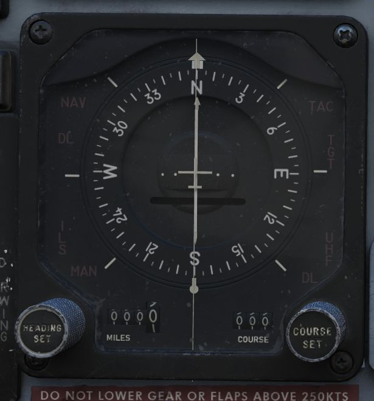

# Flight Director Group

Accurate course navigation is provided by
the [Flight Director Group](../../cockpit/pilot/flight_director_group.md), which
includes the Flight Director Computer,
the [Horizontal Situation Indicator (HSI)](../../cockpit/pilot/flight_director_group.md#horizontal-situation-indicator)
along with
the [Navigation Function Selector Panel](../../cockpit/pilot/flight_director_group.md#navigation-function-selector-panel)
in the front cockpit, and
the [Bearing Distance Heading Indicator (BDHI)](../../cockpit/wso/upfront_indicators.md#bearing-distance-heading-indicator-bdhi)
together with
the [Navigation Mode Selector Switch](../../cockpit/wso/upfront_indicators.md#navigation-mode-selector-switch)
in the rear cockpit.

## Navigation Function Selector Panel

Found on the [front cockpit instrument panel](../../cockpit/pilot/flight_director_group.md),
the [Navigation Function Selector Panel](../../cockpit/pilot/flight_director_group.md#navigation-function-selector-panel)
has two knobs - a Bearing/Distance Selector Knob and a Mode Selector Knob.

## Bearing Distance Selector Knob (BRG/DIST)

The Bearing Distance Selector Knob sets the bearing pointer and range indication
displays on the [HSI](../../cockpit/pilot/flight_director_group.md/#horizontal-situation-indicator).
Positions are [VOR](vor_ils.md)/[TAC](tacan.md), [TAC](tacan.md), ADF/[TAC](tacan.md), and NAV COMP.

In [VOR](vor_ils.md)/[TAC](tacan.md) mode, magnetic and relative bearing to the [VOR](vor_ils.md)
station and range to the [TACAN](tacan.md) station are provided on
the [HSI](../../cockpit/pilot/flight_director_group.md#horizontal-situation-indicator) bearing
pointer and range indicator.

With [TAC](tacan.md) mode, magnetic and relative bearing and range to the selected [TACAN](tacan.md)
station are displayed.

In ADF/[TAC](tacan.md) mode, magnetic and relative bearing to the selected ADF station and
range to the [TACAN](tacan.md) station are displayed.

And in NAV COMP mode, magnetic and relative bearing and range are provided to
the destination set in the navigation computer.

## Mode Selector Knob (MODE)

The Mode Selector Knob controls the remaining informational displays on
the [HSI](../../cockpit/pilot/flight_director_group.md#horizontal-situation-indicator) (outer
knob), as well as the pitch and bank steering bars on
the [ADI](../../cockpit/pilot/flight_director_group.md#attitude-director-indicator) (inner knob
labelled FD). The mode selector knob operates independently of the bearing pointer and range
indicator, and the selector positions are [VOR/ILS](vor_ils.md), [TAC](tacan.md), NAV COMP, and HDG.
Navigation modes set by this knob will be indicated by an illuminated word message when the
instrument panel lights are on; available mode word messages are [TAC (TACAN)](tacan.md), NAV
(navigation computer), [UHF](uhf.md) (ADF), MAN (HDG entry), [ILS](vor_ils.md) (instrument landing
system), and TGT (target). TGT illuminates that the WSO has provided a target
entry and pressed TGT on the Cursor Control Panel.

## Flight Director Switch (FD)

The Flight Director Switch turns ON and OFF the Flight Director Computer pitch
and bank angle steering clues, visible on
the [ADI](../../cockpit/pilot/flight_director_group.md#attitude-director-indicator). Selecting OFF
removes these
bars from view.

## Horizontal Situation Indicator (HSI)

The Horizontal Situation Indicator displays a top-down plan view of current
navigation, with cues provided relative to the selected navigation mode selector
position.

In [VOR/ILS](vor_ils.md), the Heading Set Knob is used to enter the desired magnetic heading.
The Course Set knob is used to set the [VOR](vor_ils.md) radial or inbound localizer. Once
set, the Deviation Indicator shows current deviation from the selected course.

[TACAN](tacan.md) mode presents information relative to the current selected [TACAN](tacan.md)
beacon.
To provide full information, the Bearing/Distance Switch should be set to [TAC](tacan.md).
The course arrow and course selector window are set using the Course Set knob to
the desired [TACAN](tacan.md) course. Once set, the Deviation Indicator and aircraft symbol
provide the top down display relative to the set course, with a maximum
deviation deflection of 10 degrees. The Heading Set knob is used to set a
desired [TACAN](tacan.md) course for bank steering presentation on
the [ADI](../../cockpit/pilot/flight_director_group.md#attitude-director-indicator). If the heading
marker is not set, bank steering on
the [ADI](../../cockpit/pilot/flight_director_group.md#attitude-director-indicator) will not be
correct to intercept the
desired course. A To-From indicator displays when the mode selector is in [TACAN](tacan.md)
or [VOR/ILS](vor_ils.md) mode when either are tuned and received; once the course is
intercepted, the indication references whether the current course is taking the
aircraft to or from the tuned station.

NAV COMP mode displays magnetic ground track on the course arrow and the course
selector window relative to the current navigation computer fix. The bank
steering bar provides steering information to direct an approach to the command
heading.

With HDG mode active, the course arrow and deviation are slaved to the lubber
line and aircraft magnetic heading. The course selector window displays the
current selected magnetic heading, which is adjusted using the Heading Set knob.
The given course information is applied for
an [ADI](../../cockpit/pilot/flight_director_group.md#attitude-director-indicator) bank steering
command.

## Attitude Director Indicator (ADI)

The [ADI](../../cockpit/pilot/flight_director_group.md#attitude-director-indicator) provides command
steering to intercept selected headings, [TACAN](tacan.md)
stations, tracks, [VOR](vor_ils.md) radials, or navigation computer destinations. Bank
steering instruction is presented using the bank steering bar, which can
reference angles up to 35 degrees. Should a bank angle in excess of 35 degrees
be desired, the instructed angle can be disregarded during the turn. When the
Heading Set knob has been used to enter the correct target heading, the
intercept presentation is accurate within a 60 degree field of a [TACAN](tacan.md) course,
or 90 degrees for a [VOR](vor_ils.md) radial. Additionally, a Glide-slope Pointer is provided
for relative glide-slope position indication during an [ILS](vor_ils.md) approach.

Upon startup of the [ADI](../../cockpit/pilot/flight_director_group.md#attitude-director-indicator),
an OFF warning flag will be displayed until the
AN/AJB-7 gyro has aligned. This can also appear due to power loss or a signal
failure. The flag does not present if a system failure occurs outside of the
AN/AJB-7.

## Bearing Distance Heading Indicator (BDHI)

The [Bearing Distance Heading Indicator (BDHI)](../../cockpit/wso/upfront_indicators.md#bearing-distance-heading-indicator-bdhi)
displays navigation information using two needles, referred to as the No. 1 and No. 2 pointers,
which receive inputs controlled by the WSO Navigation Mode Selector Switch.

When the upper position is selected to [TACAN](tacan.md)/ADF/UHF, the no. 1 pointer
indicates UHF bearing, and the no. 2 pointer indicates the [TACAN](tacan.md) bearing. If
there is no [TACAN](tacan.md) signal, both pointers indicate the ADF bearing.

With the middle position selected- [VOR](vor_ils.md)/TAC, the no. 1 pointer indicates
the [VOR](vor_ils.md)
bearing, the no. 2 pointer indicates the [TACAN](tacan.md) bearing, and the range indicator
provides distance to the [TACAN](tacan.md) station. In the absence of a [TACAN](tacan.md) signal,
both
pointers indicate the [VOR](vor_ils.md) station.

In the lower position, NAV COMP, the no. 1 pointer indicates bearing to the
navigation computer target coordinates, and the no. 2 pointer indicates magnetic
ground track. The range indicator notes distance to the target coordinates.
