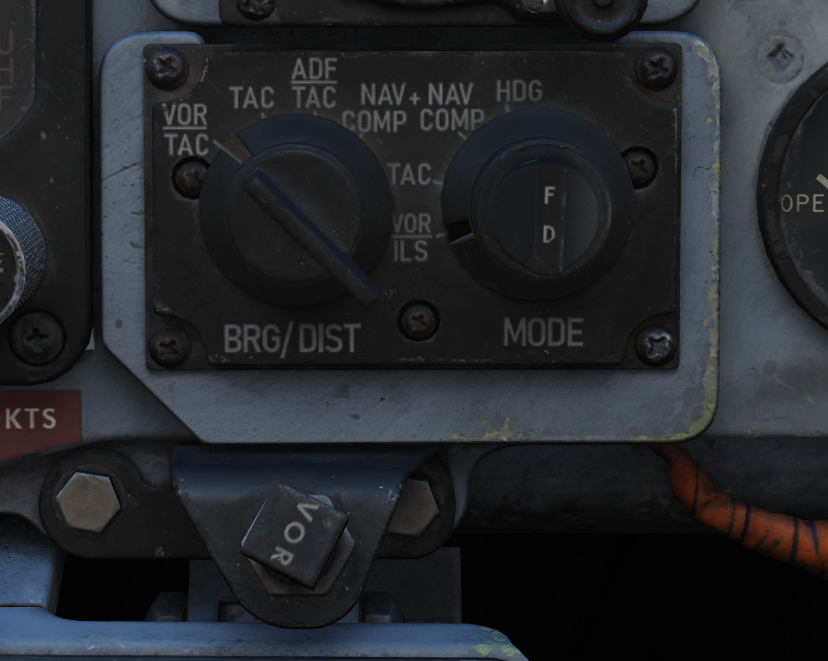
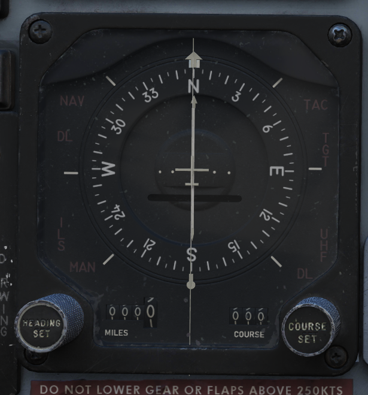
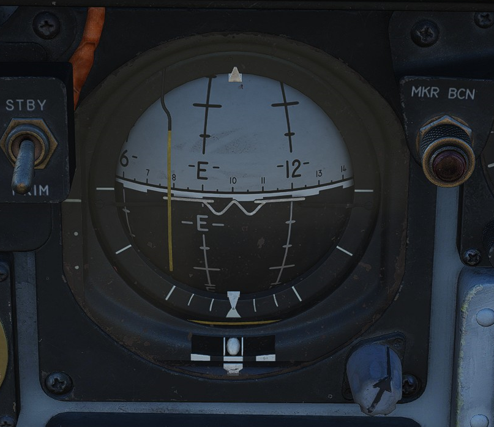

# Flight Director Group

Accurate course navigation is provided by the Flight Director Group, which
includes the Flight Director Computer, the Horizontal Situation Indicator (HIS)
along with the Navigation Function Selector Panel in the front cockpit, and the
Bearing Distance Heading Indicator (BDHI) together with the Navigation Mode
Selector Switch in the rear cockpit.

## Navigation Function Selector Panel

Found on the front cockpit instrument panel, the Navigation Function Selector
Panel has two knobs- a Bearing/Distance Selector Knob and a Mode Selector Knob.

## Bearing Distance Selector Knob

The Bearing Distance Selector Knob sets the bearing pointer and range indication
displays on the HSI. Positions are VOR/TAC, TAC, ADF/TAC, and NAV COMP.

In VOR/TAC mode, magnetic and relative bearing to the VOR station and range to
the TACAN station are provided on the HSI bearing pointer and range indicator.

With TAC mode, magnetic and relative bearing and range to the selected TACAN
station are displayed.

In ADF/TAC mode, magnetic and relative bearing to the selected ADF station and
range to the TACAN station are displayed.

And in NAV COMP mode, magnetic and relative bearing and range are provided to
the destination set in the navigation computer.

## Mode Selector Knob

The Mode Selector Knob controls the remaining informational displays on the HSI,
as well as the pitch and bank steering bars on the ADI. The mode selector knob
operates independently from the bearing pointer and range indicator, and the
selector positions are VOR/ILS, TAC, NAV COMP, and HDG. Navigation modes set by
this knob will be indicated by an illuminated word message when the instrument
panel lights are on; available mode word messages are TAC (TACAN), NAV
(navigation computer), UHF (ADF), MAN (HDG entry), ILS (instrument landing
system), and TGT (target). TGT illuminates that the WSO has provided a target
entry and pressed TGT on the Cursor Control Panel.

## Flight Director Switch

The Flight Director Switch turns ON and OFF the Flight Director Computer pitch
and bank angle steering clues, visible on the ADI. Selecting OFF removes these
bars from view.

## Horizontal Situation Indicator

The Horizontal Situation Indicator displays a top-down plan view of current
navigation, with cues provided relative to the selected navigation mode selector
position.

In VOR/ILS, the Heading Set Knob is used to enter the desired magnetic heading.
The Course Set knob is used to set the VOR radial or inbound localizer. Once
set, the Deviation Indicator shows current deviation from the selected course.

TACAN mode presents information relative to the current selected TACAN beacon.
To provide full information, the Bearing/Distance Switch should be set to TAC.
The course arrow and course selector window are set using the Course Set knob to
the desired TACAN course. Once set, the Deviation Indicator and aircraft symbol
provide the top down display relative to the set course, with a maximum
deviation deflection of 10 degrees. The Heading Set knob is used to set a
desired TACAN course for bank steering presentation on the ADI. If the heading
marker is not set, bank steering on the ADI will not be correct to intercept the
desired course. A To-From indicator displays when the mode selector is in TACAN
or VOR/ILS mode when either are tuned and received; once the course is
intercepted, the indication references whether the current course is taking the
aircraft to or from the tuned station.

NAV COMP mode displays magnetic ground track on the course arrow and the course
selector window relative to the current navigation computer fix. The bank
steering bar provides steering information to direct an approach to the command
heading.

With HDG mode active, the course arrow and deviation are slaved to the lubber
line and aircraft magnetic heading. The course selector window displays the
current selected magnetic heading, which is adjusted using the Heading Set knob.
The given course information is applied for an ADI bank steering command.

## Attitude Director Indicator

The ADI provides command steering to intercept selected headings, TACAN
stations, tracks, VOR radials, or navigation computer destinations. Bank
steering instruction is presented using the bank steering bar, which can
reference angles up to 35 degrees. Should a bank angle in excess of 35 degrees
be desired, the instructed angle can be disregarded during the turn. When the
Heading Set knob has been used to enter the correct target heading, the
intercept presentation is accurate within a 60 degree field of a TACAN course,
or 90 degrees for a VOR radial. Additionally, a Glideslope Pointer is provided
for relative glideslope position indication during an ILS approach.

Upon startup of the ADI, an OFF warning flag will be displayed until the
AN/AJB-7 gyro has aligned. This can also appear due to power loss or a signal
failure. The flag does not present if a system failure occurs outside of the
AN/AJB-7.

## Bearing Distance Heading Indicator

The Bearing Distance Heading Indicator (BDHI) displays navigation information
using two needles, referred to as the No. 1 and No. 2 pointers, which receive
inputs controlled by the WSO Navigation Mode Selector Switch.

When the upper position is selected to TACAN/ADF/UHF, the no. 1 pointer
indicates UHF bearing, and the no. 2 pointer indicates the TACAN bearing. If
there is no TACAN signal, both pointers indicate the ADF bearing.

With the middle position selected- VOR/TAC, the no. 1 pointer indicates the VOR
bearing, the no. 2 pointer indicates the TACAN bearing, and the range indicator
provides distance to the TACAN station. In the absence of a TACAN signal, both
pointers indicate the VOR station.

In the lower position, NAV COMP, the no. 1 pointer indicates bearing to the
navigation computer target coordinates, and the no. 2 pointer indicates magnetic
ground track. The range indicator notes distance to the target coordinates.
