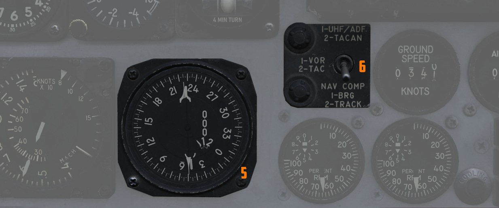

# Flight Director Group

Accurate course navigation is provided by
the Flight Director Group, which includes the Flight Director Computer (1), the Horizontal Situation
Indicator (HSI) (2) along with the Navigation Function Selector Panel (3), the Attitude Director
Indicator (ADI) (4), in the front cockpit, and the
Bearing Distance Heading Indicator (BDHI) (5) together with the Navigation Mode Selector Switch (6)
in the rear cockpit.

## Navigation Function Selector Panel

Found on the front cockpit instrument panel, the Navigation Function Selector Panel has two knobs -
a Bearing/Distance Selector Knob and a Mode Selector Knob.
Stacked on the Mode Selector Knob is the Flight Director Switch.

### Bearing Distance Selector Knob (BRG/DIST)

The Bearing Distance Selector Knob sets the bearing pointer and range indication
displays on the HSI.
Positions are VOR/TAC, TAC, ADF/TAC, and NAV COMP.

In VOR/TAC mode, magnetic and relative bearing to the [VOR](vor_ils.md)
station and range to the [TACAN](tacan.md) station are provided on
the [HSI](../../cockpit/pilot/flight_director_group.md#horizontal-situation-indicator) bearing
pointer and range indicator.

With TAC mode, magnetic and relative bearing and range to the selected TACAN
station are displayed.

In ADF/TAC mode, magnetic and relative bearing to the selected ADF station and
range to the TACAN station are displayed.

And in NAV COMP mode, magnetic and relative bearing and range are provided to
the destination set in the navigation computer.

### Mode Selector Knob (MODE) and Flight Director Switch

The Mode Selector Knob controls the remaining informational displays on
the HSI (outer knob), as well as the pitch and bank steering bars on the ADI (inner knob
labelled FD). The mode selector knob operates independently of the bearing pointer and range
indicator, and the selector positions are [VOR/ILS](vor_ils.md), [TAC](tacan.md), NAV COMP, and HDG.
Navigation modes set by this knob will be indicated by an illuminated word message when the
instrument panel lights are on; available mode word messages are TAC (TACAN), NAV
(navigation computer), [UHF](uhf.md) (ADF), MAN (HDG entry), ILS (instrument landing
system), and TGT (target). TGT illuminates that the WSO has provided a target
entry and pressed TGT on the Cursor Control Panel.

The Flight Director Switch toggles the Flight Director Computer pitch
and bank angle steering clues, visible on
the [ADI](../../cockpit/pilot/flight_director_group.md#attitude-director-indicator). Selecting OFF
removes these bars from view.

In VOR/ILS, if a VOR frequency is selected,
the HSI Course Set knob is used to set the VOR radial. Once
set, the HSI Deviation Indicator shows current deviation from the selected course.
If an ILS frequency was selected, the localizer signal will be shown on the deviation indicator.

TACAN mode presents navigation information to the currently selected TACAN
beacon.
To provide full information, the Bearing/Distance Switch should be set to TAC.
The HSI course arrow and course selector window are set using the Course Set knob to
the desired TACAN course. Once set, the HSI Deviation Indicator and aircraft symbol
provide the top-down display relative to the set course, with a maximum
deviation deflection of ±5 degrees. The HSI Heading Set knob is used to set a
desired TACAN course for bank steering presentation on the ADI. As the bank steering
is based on the heading marker position, if it is not set properly, bank steering on the ADI will
not be correct to intercept the desired course. A To-From indicator displays when the mode selector
is in TACAN or VOR/ILS mode when either are tuned and received; once the
course is intercepted, the indication references whether the current course is taking the
aircraft to or from the tuned station.

The NAV COMP Mode displays magnetic ground track on the HSI course arrow and the HSI course
selector window relative to the current navigation computer fix. The ADI bank
steering bar provides steering information to direct an approach to the command
heading.

With HDG mode active, the HSI course arrow and deviation are slaved to the lubber
line and aircraft magnetic heading. The HSI course selector window displays the
current selected magnetic heading, which is adjusted using the Heading Set knob.
The given course information is applied for
an ADI bank steering command.

## Horizontal Situation Indicator (HSI)

The Horizontal Situation Indicator displays a top-down plan view of current
navigation, with cues provided relative to the selected navigation mode selector
position. It interacts closely with several navigational aids like VOR, TACAN, ADF,
and the aircraft's Navigation Computer (NAV COMP).

The Bearing Pointer and Range Indicator on the HSI display the bearing and distance
to the navigation aid selected via the Bearing Distance Selector Knob.
The Navigation Mode Selector governs the functionality of the heading marker,
course arrow, and the course deviation indicator, which includes a to-from arrow.
Both these controls – the Bearing Distance Selector and the Navigation Mode Selector – have
a direct impact on the illumination of specific mode indicator lights on the HSI.

The compass card in the HSI is driven by heading input from the AJB-7 system. It rotates
to align the aircraft's magnetic heading directly under the lubber line at the top of the
instrument, assuming the signal received is accurate and reliable.

The Bearing pointer indicates magnetic bearing to a given VOR, TACAN or NAV COMP station,
depending on the BRG/DIST switch selection. Providing the compass card is giving good information,
this bearing is also relative. However, if there are inaccuracies in the magnetic heading,
to navigate towards the selected destination, the aircraft should be steered not by centering
the arrow on the lubber line, but by following the heading indicated by the arrow using
the magnetic compass. If a UHF (ADF) signal is tuned, the bearing pointer consistently shows
the heading in relative terms.

The command heading marker provides as a desired heading reference for the Flight Director.
To obtain correct steering, the marker must be manually set in all but Nav Comp modes (then
it's automatically set). The steering clues are visible on the ADI bank steering bar.

The deflection of the Deviation Indicator in VOR and TACAN modes indicate the deviation of the
aircraft from the selected course (visible on the Course rollers and Course Arrow).
Is indicates how far is the aircraft off the selected track. 2.5 deg per dot, maximally
up to 5 deg.

In ILS mode, the HSI displays deviation from the localizer signal. This indication is more precise,
as the needle is more sensitive to deviations in that mode. Notably, this reading is independent
of the selected course, providing direct feedback on the aircraft's alignment with the ILS
approach path.

## Attitude Director Indicator (ADI)

The ADI provides command steering to intercept selected headings, [TACAN](tacan.md)
stations, tracks, [VOR](vor_ils.md) radials, or navigation computer destinations. Bank
steering instruction is presented using the bank steering bar, which can
reference angles up to 35 degrees, at 90 degrees of heading deviation. Any heading errors
less than that will produce a bank correction of something less than 35 degrees. If a quick
intercept or a bank angle in excess of 35 degrees is desired, the bank steering must
be disregarded during the turn.

The system initiates an approximate 50-degree straight-line intercept towards the desired
track until the aircraft is within 15 degrees of it. Beyond this point, it transitions
to an asymptotic approach to align with the track. For a faster intercept, it might be necessary
to disregard the bank steering signal.

When the Heading Set knob has been used to enter the correct target heading, the
intercept presentation is accurate within a 60 degree field of a TACAN course,
or 90 degrees for a VOR radial. Additionally, a Glide-slope Pointer is provided
for relative glide-slope position indication during an ILS approach.

> 💡 The Heading Marker must be manually aligned with the desired heading (except in NAV COMP mode)
> to ensure correct bank steering guidance. However, due to wind drift, this bank steering
> may not always keep the aircraft precisely on a TACAN or VOR track. In such scenarios,
> manual adjustments for wind correction are required for the Heading Marker setting to maintain
> the correct course.

Upon startup of the ADI, an OFF warning flag will be displayed until the AN/AJB-7 gyro has aligned.
This can also appear due to power loss or a signal failure. The flag does not present if a system
failure occurs outside of the AN/AJB-7.

## Bearing Distance Heading Indicator (BDHI)

The Bearing Distance Heading Indicator (BDHI)
displays navigation information using two needles, referred to as the No. 1 and No. 2 pointers,
which receive inputs controlled by the WSO Navigation Mode Selector Switch.

When the upper position is selected to [TACAN](tacan.md)/ADF/UHF, the no. 1 pointer
indicates UHF bearing, and the no. 2 pointer indicates the TACAN bearing. If
there is no TACAN signal, both pointers indicate the ADF bearing.

With the middle position selected - [VOR](vor_ils.md)/TAC, the no. 1 pointer indicates
the VOR
bearing, the no. 2 pointer indicates the TACAN bearing, and the range indicator
provides distance to the TACAN station. In the absence of a TACAN signal,
both
pointers indicate the VOR station.

In the lower position, NAV COMP, the no. 1 pointer indicates bearing to the
navigation computer target coordinates, and the no. 2 pointer indicates magnetic
ground track. The range indicator notes distance to the target coordinates.
