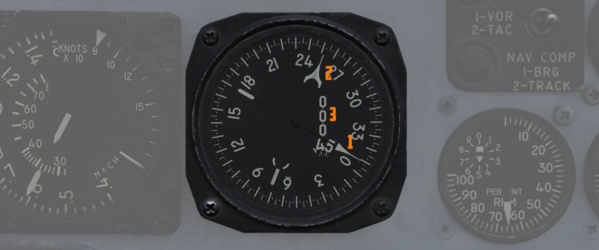

# 飞行指引指示器组

飞行指引指示器组可为飞行员提供准确的航线导航，其中包括飞行指引计算机 (1)、水平状态显示器 (HSI) (2)
和导航功能选择面板 (3)、前座的姿态指引指示器 (ADI) (4)，以及后座的方位距离航向指示器 (BDHI) (5) 和
导航模式选择开关 (6)。

## 导航功能选择面板

导航功能选择面板位于前座仪表板上，有两个旋钮——一个方位/距离选择旋钮和一个模式选择旋钮。叠加在模式选
择钮上的是飞行指引开关。

### 方位距离选择钮 (BRG/DIST)

方位距离选择旋钮设置 HSI 中的方位指针和距离指示。有几个档位分别为：VOR/TAC、TAC、ADF/TAC 和 NAV
COMP。

在 VOR/TAC 模式下，HSI 方位指针和距离指示器上会显示 VOR 台的及磁方位和 [TACAN](tacan.md) 台的距离。

在 TAC 模式下，将显示 TACAN 台的距离及磁方位。

在 ADF/TAC 模式下，显示选定 ADF 台的距离和磁方位以及 TACAN 台的距离。

在 NAV COMP 模式下，将提供导航计算机中设定的目标的磁方位及距离。

### 模式选择旋钮（MODE）和飞行指引开关

模式选择旋钮控制 HSI 上的其余信息显示（外侧旋钮），以及 ADI 上的俯仰和坡度转向杆（写有 FD 标签的内
侧旋钮）。模式选择旋钮的操作独立于方位指针和距离指示器，档位
为[VOR/ILS](vor_ils.md)、[TAC](tacan.md)、NAV COMP 和 HDG。当仪表板指示灯亮起时，通过该旋钮设置的导
航模式将以亮起的文字消息表示；可用的模式文字消息有 TAC（塔康）、NAV（导航计算机）、[UHF](uhf.md)
（ADF）模式、MAN（HDG 输入模式）、ILS（仪表着陆系统）和 TGT（目标模式）。TGT 灯亮表示 WSO 已使用目
标插入并按下光标控制面板上的 TGT 按钮。

飞行指引开关可切换飞行指引计算机俯仰和坡度转向杆，飞行员可在
[ADI](../../cockpit/pilot/flight_director_group.md#attitude-director-indicator) 中看到转向杆。选择
OFF 则将禁用这些转向杆。

在 VOR/ILS 模式下，如果选择了 VOR 频率，那么 HSI 航线设置旋钮用来设置 VOR 径向。设置完成后，HSI 偏
差指示器将显示当前与所选航线的偏差。如果选择的是 ILS 频率，偏差指示器将显示航向信标的信号。

TACAN 模式提供向当前选定的塔康信标导航的信息。如需获取完整的信息，应将方位/距离开关设置为 TAC 档位
。使用航线设置旋钮将 HSI 航线箭头和航线选择窗口设置到所需的 TACAN 航线。设置完成后，HSI 偏差指示器
和飞机符号将以俯视视角显示设置航线的相关信息，最大显示偏差为 ±5 度。HSI 航向设置旋钮用于设置所需的
塔康航线，ADI 中将显示坡度转向杆引导飞向航线。由于坡度转向基于航向标记位置，如果设置不当，按 ADI 上
的坡度转向指示飞行将无法正确截取所需的航线。当模式选择处于 TACAN 或 VOR/ILS 模式时，一旦调谐并接收
到信号，向-背台指示器将提供转向信息；一旦截获航线，指示器就会显示当前航线是引导飞机向或背离调谐的地
面台。

NAV COMP 模式将在 HSI 航线箭头和 HSI 航线选择窗口上显示相对于当前导航计算机定位点的磁地面航迹。ADI
坡度转向杆将提供转向信息，引导飞向指令的航向。

启用 HDG 模式后，HSI 航线箭头和偏差将隶属至准线和飞机磁航向。HSI 航线选择窗口显示当前选定的磁航向，
可使用航向设置旋钮进行调整。设置的航线信息将用于 ADI 坡度转向指令。

## 水平状态显示器（HSI）

水平状态显示器根据当前导航模式以俯视平面视角，并根据导航模式选择旋钮的当前档位提供提示。它与
VOR、TACAN、ADF 和飞机导航计算机（NAV COMP）等助航设备密切协同。

HSI 上的方位指针和距离指示器，根据方位距离选择旋钮择的档位显示助航设备的方位和距离。导航模式选择旋
钮控制航向标记、航向箭头和偏差指示器的功能，其中包括一个向-背台箭头。方位距离选择旋钮和导航模式选择
钮这两个控制旋钮都直接影响 HSI 中的特定模式指示灯是否亮起。

HSI 界面中的罗盘由 AJB-7 系统的航向输入来驱动工作。如果接收到的信号准确可靠，方位圈将转动并对准位于
仪表顶部的准线来显示飞机的磁航向。

根据 BRG/DIST 开关的选择，方位指针指示到指定 VOR、TACAN 或 NAV COMP 台的磁航向。如果方位圈提供的信
息正确，方位指针也将提供准确指向。但是，如果磁航向不准确，要导航到所选目标，则不应将箭头对准准线，
而应使用磁罗盘按照箭头指示的航向飞行。如果调谐到 UHF（ADF）信号，方位指针将始终显示相对航向。

指令航向标记为飞行指引指示器提供所需的航向基准。要正确进行转向，必须在除 NAV COMP 模式（之后该标记
将被自动设置）外的所有模式下手动设置标记。在 ADI 坡度转向杆上可以看到转向提示。

在 VOR 和 TACAN 模式下，偏差指示器偏转表示飞机偏离所选航线的（可在航线滚筒和航线箭头上看到）。它表
示飞机偏离所选航迹的程度。 每个点对应 2.5 度，最大 5 度。

在 ILS 模式下，HSI 显示与航向信标信号的偏差。在 ILS 模式下指示更为精确，因为在该模式下指针对偏差更
为敏感。值得注意的是，该读数与所选航线无关，而是直接反映飞机对准 ILS 进场路径的情况。

## 姿态指引指示器（ADI）

ADI 提供转向指令，以拦截选定的航向、[TACAN](tacan.md) 台、航迹、[VOR](vor_ils.md) 径向或导航计算机
目标。ADI 使用坡度转向杆来提供坡度转向引导，最大可在 90 度航向偏差时提供最高 35 度坡度指示。航向偏
差小于 90 度时，坡度修正指示都将小于 35 度。如果需要快速拦截或使用超过 35 度坡度，则必须在转弯时忽
略坡度转向杆。

在飞机与航线偏差小于 15 度以内之前，系统开始将以大约 50 度的直线飞向所需航线。偏差小于 15 度后，系
统过渡至使用渐进接近来方便对准航线。若要更快地拦截，飞行员可能需要忽略坡度转向信号。

当使用航向设置旋钮输入正确的目标航向时，在 TACAN 航线偏差小于 60 度弧线以及 VOR 径向线偏差 90 度弧
线内，ADI 将提供可靠的转向信息。此外，在 ILS 进近过程中，ADI 还提供一个下滑道指针，用于在 ILS 进近
时指示相对下滑道位置。

💡 飞行员必须手动将航向标记对准所需航向（NAV COMP 模式除外）以确保坡度转向信息正确。然而，由于风漂
，坡度转向可能无法始终使飞机准确地保持在塔康或 VOR 航迹上。在这种情况下， 飞行员需要手动修正风偏，
以保持正确的弧线。

在启动 ADI 时，OFF 旗将在 AN/AJB-7 陀螺仪对准完成前显示在仪表中。断电或信号故障也会导致出现这种情况
。如果系统故障发生在 AN/AJB-7 之外，则不会显示 OFF 旗。

## 方位距离航向指示器 (BDHI)

方位距离航向指示器 (BDHI) 通过两个指针（1 号和 2 号指针）显示导航信息，这两个指针指示的信息由 WSO
导航模式选择开关所选档位来决定。

选择上方 [TACAN](tacan.md)/ADF/UHF 档位时，1 号指针指示 UHF 方位，2 号指针表示 TACAN 方位。如果没有
TACAN 信号，则两个指针均指示 ADF 方位。

选择中间档位——[VOR](vor_ils.md)/TAC 时，1 号指针指示 VOR 方位，2 号指针指示 TACAN 方位，距离指示器
显示与 TACAN 台的距离。在没有 TACAN 信号的情况下，两个指针均指示 VOR 台方位。

选择下方的 NAV COMP 档位，1 号指针指示导航计算机中目标坐标的方位，2 号指针指示磁地面航迹。距离指示
器显示目标坐标的距离。
