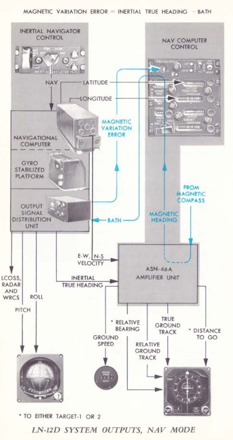

# AN/ASN-63 惯性导航系统

AN/ASN-63 惯性导航系统为 F-4E 机组人员和一体化武器投放系统提供精确的实时位置、速度、姿态和航向信息
。当系统在陀螺罗盘模式下完成精对准后，惯性导航系统的圆概率误差（CEP）为 3 海里/小时。

💡 这意味着飞行一小时后，精度误差会不断累积，有 50%的概率其精度误差小于或大于 3 海里。

## 惯性测量平台

该系统使用四环式（外横滚环、俯仰环、内横滚环、方位环）惯性导航平台，使用双横滚环架用作冗余，以消除
外横滚环/俯仰环环架对准时的环架锁定问题。

平台上安装了一对 G-200 双轴陀螺仪，上部陀螺仪的轴对准南北轴旋转，而下部陀螺仪的轴对准东西轴旋转；每
个陀螺仪的扭矩感测都将对垂直轴进行跟踪——因此，高位陀螺测量东/西旋转，而低位陀螺仪测量北/南旋转。这
样，所有三个维度的旋转都能测量到。平台采用的是液浮陀螺仪，只有在液体达到工作温度（华氏 160 度）后才
能正常工作；系统可在鬼怪的升限内有效地控制温度。一整套精密的磁力矩器将提供位移信息，而加速度则在一
个独立的电磁场环境中获取陀螺仪位移的实际数据来实现拾取功能。

在平台上，正交设置（各成 90 度）了三组 A-200D 加速度计。这些加速度计与陀螺仪类似，都为液浮式，并配
有类似的力矩器和位移传感器来记录运动情况。音叉共振有效消除了运动捕捉组件中的所有静摩擦，从而提高了
设备的精度。

## 导航计算机和输出信号分配

LN-12D 导航计算机将放大从陀螺仪和加速度计捕捉到的运动信号，然后计算机将进行地球参考系积分。LN-12D
可对所有经度进行补偿，并能能够在 80 度纬度内有效进行跟踪，对设备来说，超出 80 度纬度进行计算超出了
机械限制。

AN/ASN-63 通过 OSDU（输出信号分配装置）向 "鬼怪 "中的其它系统提供信息。OSDU 提供地速、南北和东西速
度、总速、惯性稳定高度、爬升角、惯性真航向、地面航迹和漂移角。WRCS 为其弹道计算机接收惯性真航向、地
面航迹、漂移修正角和漂移角。漂移角将提供给
[BDHI](../../cockpit/wso/upfront_indicators.md#bearing-distance-heading-indicator-bdhi)、HSI 和
FDC。漂移修正角还提供给雷达和 LCOSS。

## 对准选项

LN-12 在飞机起动时有三种对准模式：BATH、预存航向（HDG MEM）和陀螺罗盘对准。在进行任何对准之前，基准
系统必须选择 STBY 档位，将导航计算机控制面板调至 STBY，并将位置更新开关调至 NORMAL。WSO 应将当地磁
差输入至磁差计数器中，并将位置计数器调整至当地经纬度。这样做将大幅加快陀螺罗盘对准的速度。此外，机
组不应在机翼折叠时进行对准，因为提供罗盘同步的磁通传感器将超出正常位置 60 度。

如果机组人员注意到系统与已知的位置有较大偏差，INS 还可以进行飞行位置更新。

### 指示灯

INS 面板上有两个指示灯：HEAT 和 ALIGN。

在任何对准模式下（包括 STBY 模式下的粗对准），HEAT 灯都将被激活，表示系统正在加热。指示灯在大约 110
秒后熄灭，熄灭表示陀螺仪已达到 160 华氏度工作温度。

ALIGN 灯在专门用于 ALIGN 模式，亮起表示对准完成。ALIGN 灯常亮表示已完成 BATH（快速）校准。如果系统
没有遇到任何错误，并且陀螺仪已在 STBY 模式下完成预热（HEAT 灯熄灭即为证明），系统则将继续执行陀螺罗
盘对准。ALIGN 灯闪烁表示完成了陀螺罗盘对准或预存航向对准。

### 最佳可用真航向

为避免 INS 不正常工作，应短暂拨至 STBY 档位。设置到 ALIGN 档位后（可忽略 HEAT 灯），ALIGN 灯将在约
75 秒后常亮，表明 BATH 对准已经完成。进入 BATH 后，INS 的 CEP 精度大约为每小时 5.5 海里，但也可能出
现更高的误差。BATH 完成后，即可选择 NAV 模式，并在遵守上述注意事项的前提下飞行。

### 预存航向对准

如果先前已预存对准并且飞机没有移动过，则可以使用该对准选项。如需使用预存航向对准，请在将 INS 旋钮从
OFF 切换到 ALIGN 之前，选择位于控制面板红色保护盖下方的 HDG MEM。预存航向对准大幅度缩短了对准所需的
时间，提供的相对圆误差概率 (CEP) 可达到 BATH 的最佳值（5.5 海里），或如果在 2 小时内完成过对准，甚
至可以达到陀螺罗盘模式下的 CEP 精度（3 海里）。

如需进入快速 HDG MEM 对准模式，必须抬起保护盖并向上拨动开关，并将 INS 模式开关置于 ALIGN 档位，等待
ALIGN 灯开始闪烁。ALIGN 开始闪烁后，然后将 INS 置于 NAV 模式。如果时间允许，可在进入 ALIGN 模式之前
选择 STBY 模式，以便对陀螺仪正常进行加热（灯光会经历上述点亮/关闭循环）。

💡 航向信息可在 [任务编辑器](../../dcs/mission_editor.md#ins-reference-alignment-stored) 中预存。

### 陀螺罗盘对准

机组可通过让 INS 执行完整的陀螺罗盘对准来实现最大化系统精度。陀螺罗盘对准允许陀螺仪尽可能找到最精确
的真北参考，但可能需要大量时间，甚至因为在 INS 通电之前，磁差设置输入不准确或丢失，（该过程）可能花
费更长的时间。举例来说，罗盘航向误差为 1 度时，系统达到最高精度的时间约为 5 分钟，也就是 ±10 弧分对
准精度，从而实现前述的 3 海里 CEP。在完成相当于 BATH 或 HDG MEM 水平的对准后，完成陀螺罗盘对准的时
间最少需要 50 秒，而正常对准大约需要花费 5 分钟。如果飞机在 70 度纬度或更高位置执行对准，则需要花费
更多时间。

如需执行陀螺罗盘对准，在 HEAT 灯熄灭前，必须将 INS 保持在 STBY 模式。在 HEAT 灯保持亮起时调整到
ALIGN 模式，系统将无法执行完成陀螺罗盘对准，此时系统只能执行 BATH 对准。加热阶段的持续时间取决于环
境温度。系统以每分钟约 20°F 的速度升温，直到达到 160°F 工作温度。系统达到工作温度后，在 HEAT 灯熄灭
前还需要额外等待 50 秒。在过渡到 ALIGN 后，指示灯将在 75 秒后常亮，表示完成初始 BATH 对准，开始陀螺
罗盘对准进程。陀螺罗盘对准结束后，ALIGN 灯将闪烁，表明系统已完整对准。在陀螺罗盘对准过程中，对准灯
常亮后即可进入 NAV 模式，但只有在对准灯闪烁时才能达到最高精度。

在移动飞机之前的空闲时间可以将开关留在 ALIGN 档位来进一步提高系统精度。

### 空中应急对准

如果出现严重姿态误差或 STBY 姿态基准失效，可对 INS 执行应急空中对准。NAV SYS OUT 灯亮起可能表示出现
严重姿态误差或失效。此时飞机必须保持直线和水平飞行，并将基准系统选择开关设置为 STBY。在这种状态下，
应将 INS 模式旋钮切换至 OFF，然后再切换至 STBY，持续 15 秒。随后，在 15 秒间隔后，将模式恢复到 NAV
模式，并继续水平直线飞行。飞行员可在大约 40 秒后将基准系统选择开关拨回 PRIM，没有规定精确的对准时间
。

💡 在空中应急对准中姿态的精度取决于对准期间飞机是否平稳飞行，飞行员后续可能需要再次进行对准。应急对
准后，系统只提供姿态信息。速度、位置和导航计算机显示的信息不准确并且不能用于导航，同时 NAV SYS OUT
灯将亮起。

## 导航计算机

ASN-46A 导航计算机用于一般导航和战术路线规划。该系统包含大圆和恒向线两种计算能力，前者用于较远距离
的方位计算（超过 120 英里），后者用于较近距离的精确计算。导航计算机只使用飞机上的仪器，即 INS、大气
数据计算机和磁罗盘；它无法接收来自 [ILS](vor_ils.md)、[VOR](vor_ils.md) 或 [TACAN](tacan.md) 系统的
信息。

系统最多可同时保持两个特定航路点（分别为目标 1 和目标 2，其中目标 2 保存在存储器中）的相对方位和距
离，这些信息会实时显示在 BDHI 和 ADI 上。如需在 BDHI 上显示数据，必须将导航选择开关拨至 NAV COMP 档
位。

计算机还可通过一对标有 LAT 和 LONG 的指示灯以及磁差同步表确认当前 LN-12 的精度。当这些指示灯熄灭时
，当前显示的位置坐标精度在 1.5 弧分之内。通过 INS 陀螺仪探测到的磁差会与 INS 开机前通过磁差控制旋钮
手动输入的值进行比较，差值将显示在同步指示器中。同步指示器的偏差可以通过磁差控制旋钮进行修正，使同
步指针指向中间。虽然在大气数据模式下磁差控制旋钮不影响仪表，但在 INS 脱机前进行正修正可提高大气数据
模式下的精度。

导航计算机可在惯性或大气数据模式下工作。两种模式提供相同的输出，但惯性模式（默认）精度更高。

如果 INS 出现故障，导航计算机将恢复到大气数据模式。在大气数据模式下，WSO 必须持续监控和调整真风向和
风速、磁差，因为计算机可用的航位推算输入仅有真空速（来自大气数据计算机）和罗盘系统的磁航向。当系统
恢复到大气数据模式时，AIR DATA MODE 灯将亮起。

在起动时，位置控制旋钮、风向风速控制旋钮和磁差控制旋钮用于输入飞机当时所在位置的已知经度、纬度、风
向和风速以及磁差。

### 输入航路点

使用功能选择钮和两个目标控制钮（一个用于纬度，另一个用于经度）输入航点和目标信息。

| 名称     | 描述                                                             |
| -------- | ---------------------------------------------------------------- |
| OFF      | 系统关闭。                                                       |
| STBY     | 系统通电但经纬度位置集成关闭。                                   |
| TARGET 1 | 计算目标滚筒上选定坐标的距离和方位。                             |
| TARGET 2 | 显示先前目标窗口存储的距离和方位信息。                           |
| RESET    | 删除先前所有保存的目标窗口数值信息，存储当前输入的目标窗口数值。 |

由于目标 2 有记忆功能，机组人员在实际操作中可以根据任务需要灵活处理目标。举例来说，如果“鬼怪”机组人
员的任务是在已知位置（靶眼）执行 CAP 或防御任务，则可将该位置的坐标值载入存储器中，只需将功能选择旋
钮转至 RESET 档位，然后返回目标 2 即可。从目标 2 到目标 1 或 STBY，再返回目标 2 时将保持使用存储的
坐标，以便于访问。转动至 RESET 后将把输入的位置存储到目标 2 中，只需随时将旋钮切换回目标 2，即可轻
松访问存储的坐标。

另一种常见的技术是“跳跃”：

1. 启动时，第二个航路点将存储在目标 2 存储器中（使用目标控制旋钮输入数据，功能选择旋钮设置为
   RESET，然后返回目标 2）。
2. 存储了第二个航路点位置后，WSO 接着将选择目标 1，来使用目标控制旋钮输入飞行计划中的第一个航路点。
3. 在飞往第一个航路点的过程中，在飞越前，选择目标 2 作为目标，并将下一航路点（3）输入至目标控制窗口
   中。
4. 飞越 2 号航路点后，将功能选择旋钮置于 RESET 档位，然后返回目标 2——现在将目标控制窗口中的数据载入
   为 3 号航路点。

这一过程将在飞行过程中持续进行，并允许 WSO 在需要时立即切换到目标 1 ，对比另外一个兴趣点的相对位置
，或在飞行中绕行（例如前往加油机跑道），接着返回到下一个存储的航路点。

## 空中更新

通过直接飞越已知目标点、使用目视或雷达定位点、通过 [塔康](tacan.md) 台或通过 GCI 的指令，来在飞行中
更新导航计算机。

### 惯性模式更新

当导航计算机处于惯性模式时，飞机需要在已知的固定位置上保持直线和水平飞行。

1. 到达后，将位置更新开关置于 SET 档位。设置到 SET 后将解锁经度和纬度位置计数器。
2. 经度和纬度计数器通过各自的旋钮设置到已知位置。
3. 在到达定位点之前，将位置更新开关保持在 FIX 档位。
4. 在到达定位点上空后，松开位置更新开关，让其退回 NORMAL 档位。

导航计算机的修正速度大约为每秒 3 分纬度或经度，WSO 必须将更新开关保持在 FIX 档位足够长的时间来完整
修正误差。例如，如果纬度偏差为 9 分，经度偏差为 4 分，则必须在飞机直接飞越定位点之前保持 FIX 档位至
少 3 秒。此外，必须平滑并直接地将开关从 SET 拨至 FIX，因为在通过 NORMAL 档位时计算机会有半秒的时间
延迟。

#### 大气数据模式更新

在大气数据模式下，导航计算机可通过像惯性模式一样使用 SET/FIX 法或直接转动位置控制旋钮进行更新。使用
后者需要将功能选择旋钮置于 STBY、TARGET 1 或 TARGET 2 位置。更推荐使用 SET/FIX 法，因为这样做可以在
抵达定位点上空，松开开关后立即更新位置。
