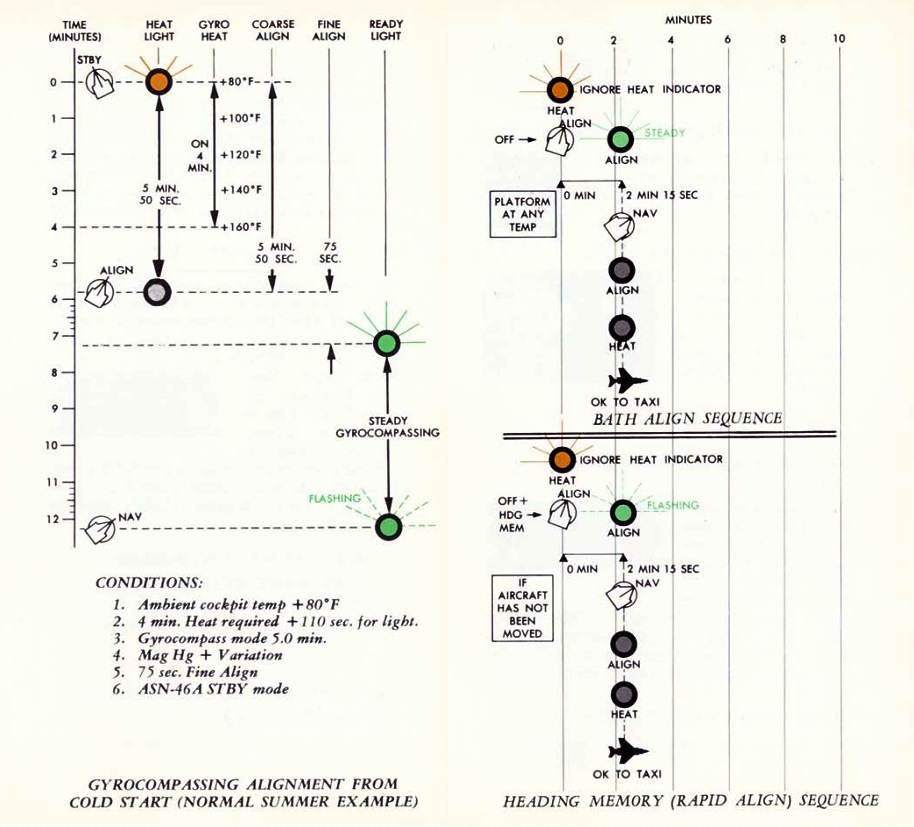

# AN/ASN-63 Inertial Navigation System

The AN/ASN-63 INS provides the F-4E aircrew and integrated weapons delivery
system with real time accurate positional, velocity, attitude, and heading
information. When the system is aligned to its most precise extent in
gyrocompass mode, the INS is accurate to 3 nautical miles per hour of circular
error probability (CEP).

## Inertial Measurement Platform

The system uses a four gimbal (outer roll, pitch, inner roll, azimuth) inertial
navigating platform, with the dual roll gimbals providing redundancy to
eliminate a gimbal lock in outer roll/azimuth gimbal alignment.

Installed on the platform are a pair of G-200 two-axis gyros, with the upper
gyro axis aligned for spin on the north-south axis while the lower gyro aligns
for east-west spin; torque detection in each gyro tracks the perpendicular axes -
ergo, the high gimbal detects east/west rotation, while the low gyro detects
north/south rotation. In this way, rotation in all three dimensions are
represented. The gyros are floated, and proper operation can only take place
once the fluid has attained operating temperature (160 degrees F); the system is
effectively climate controlled across the altitude operating range of the
Phantom. A series of precision magnetic torquers provide localization movement,
while acceleration pick-offs function within a separate electromagnetic field
perform the actual data capture from the displacements of the gyroscopes.

Along the platform, set orthogonally (at 90 degree respective positions) are a
trio of A-200D accelerometers. These accelerators, similarly floated to the
gyros, with a similar arrangement of torquers and displacement pickers to
provide velocity capture. Increasing the accuracy of these evaluations is the
inclusion of a tuning fork, the resonance from which eliminates effectively all
static friction in the motion capture assembly.

## Navigational Computer and Output Signal Distribution

The respective captured motion signals from the gyroscopes and accelerometers
are amplified in the LN-12D navigational computer, which then performs the earth
reference integration. The LN-12D compensates for all longitudes and can
effectively track as high as 80 degrees latitude, where the mechanical
limitations of calculating tangent relative to the equator is too high for the
device.

The AN/ASN-63 provides information to other systems in the Phantom from the
OSDU, or Output Signal Distribution Unit. The OSDU provides ground speed,
north-south and east-west velocity, total velocity, inertially stabilized
altitude, climb angle, true inertial heading, ground track, and drift angle. The
WRCS receives inertial true heading, ground track, drift correction angle, and
drift angle for its ballistics computer. Drift angle is captured for
the [BDHI](../../cockpit/wso/upfront_indicators.md#bearing-distance-heading-indicator-bdhi),
HSI, and FDC. Drift correction angle is also provided to the radar and LCOSS.

## Alignment Options

The LN-12 has three modes of alignment on aircraft start: BATH, Heading Memory
(HDG MEM), and Gyrocompass alignment. Prior to performing any alignment, STBY
Reference System must be selected, the Nav Computer Control Panel should be
turned on and its position update switch should be selected to NORMAL. Local
magnetic variation should be entered on the variation counter, and the position
counter should be set to local latitude and longitude. Doing so will greatly
expedite gyrocompass alignment. Further, alignment should not be performed with
the wings in their folded position, as the magnetic flux valve that provides
compass synchronization wil be 60 degrees outside of normal position.

The INS also includes an in-flight position update option, should the aircrew
note gross deviation from known location fixes.

### Best Available True Heading

STBY position must be placed momentarily to avoid an INS no-go.
Once set to ALIGN, the ALIGN lamp will illuminate steadily after 75 seconds
indicating BATH Alignment is ready. Once in BATH, the INS is accurate to roughly
5 and a half nautical miles per hour CEP, although higher inaccuracies can be
seen. Once BATH is achieved, NAV mode can be selected and the aircraft flown
with the above caveat.

### Heading Memory Alignment

This option becomes accessible if the alignment has been previously stored and
the aircraft has remained stationary. To access it, select HDG MEM located
beneath the red guard on the control panel before transitioning the INS knob
from OFF to ALIGN. This alignment method minimizes the alignment time, offering
a relative Circular Error Probability (CEP) at the optimal end of BATH (5.5
nautical miles), or even Gyrocompass Alignment (3 nautical miles) if the
previous alignment occurred within the last 2 hours.

To access the accelerated HDG MEM alignment mode, the guard must be raised and
the switch actuated up, and the INS mode switch placed to ALIGN until the ALIGN
lamp starts flashing. Then, the INS can be placed into NAV mode. If time allows,
STBY mode can be selected before going to ALIGN to allow proper heating of the
gyroscopes (which goes through the illumination/off cycle as above).

### Gyrocompass Alignment

Maximum system precision is found by allowing the INS to perform a full
Gyro-compassing alignment. This method permits the gyros to find the most
accurate true north reference possible, but can entail substantial amounts of
time- and even greater time based on inaccurate or missing magnetic variation
setting entry prior to powering the INS on. As an example - for a one degree
compass heading error, the time to achieve maximum accuracy on the system is
approximately five minutes, which attains an accuracy of ±10 minutes of arc
alignment, giving the aforementioned 3 nautical miles of deviation per hour. The
minimum amount of time to complete a Gyro-compassing alignment once BATH or HDG
MEM level alignment is achieved is 50 additional seconds, while a normal
alignment takes around 5 minutes. If the aircraft is aligned at 70 degrees of
latitude or more, additional time should be expected.

To conduct Gyrocompass Alignment, it's necessary to keep the INS in STBY mode
until the HEAT light turns off. Moving to ALIGN while the lights are still on
prevents achieving full Gyrocompass Alignment, resulting in only the BATH
process being performed. The duration of the heating phase depends on the
ambient temperature. The system heats up at a rate of approximately 20°F per
minute, reaching an operational temperature of 160°F. Once the system reaches
its operating temperature, an additional 50 seconds are required until the HEAT
light extinguishes. After transitioning to ALIGN, the light will illuminate
steadily after 75 seconds, signaling the completion of the initial BATH
alignment, initiating the gyro-compassing process. Once Gyrocompass alignment
concludes, the ALIGN indicator will flash, indicating the system has achieved
full alignment. While gyro-compassing (when the align light is steadily lit), NAV
mode can be entered at any time, though optimal accuracy will only be attained
when the ALIGN indicator flashes.

Any other available time prior to moving the aircraft can be spent in ALIGN to
further increase system accuracy.

### In-Flight Emergency Alignment

In the event of a significant attitude error or failure of the STBY Attitude
Reference, an emergency in-flight alignment of the INS can be executed. This is indicated by the NAV
SYS OUT LAMP illuminated. The aircraft must maintain straight and level flight, with the Reference
System Selector Knob set to STBY. Once in this configuration, the INS Mode Knob should
be switched to OFF, then to STBY for a duration of 15 seconds. Subsequently,
after the 15-second interval, return the Mode to NAV, and resume straight and
level flight. The process of resetting the Reference Selector to PRIM can be
performed approximately after 40 seconds, although the precise alignment time is
not specified.

It's important to note that the accuracy of the attitude in this alignment is
contingent upon how steadily the aircraft was flown during the alignment period
and subsequent alignments may be required. Following this emergency alignment,
only attitude information will be available. Velocities, position, and displays
on the navigation computer will be inaccurate and cannot be utilized for
navigation purposes.

## Navigation Computer

The ASN-46A Nav Computer is used for general navigation and tactical route
planning. The system contains both a great circle and rhumb line computational
capabilities, with the former being used for larger distance bearing
calculations (over 120 miles), and the latter for closer range accuracy. The Nav
Computer functions solely using aircraft-based instruments, ergo the INS, Air
Data Computer, and the magnetic compass; it can receive no information from the
[ILS](vor_ils.md), [VOR](vor_ils.md), or [TACAN](tacan.md) systems.

The system can maintain relative bearing and distance from up to two specific
waypoints at a time (identified as Target 1 and Target 2, with Target 2 being
held in memory), and this information is shown on
the [BDHI](../../cockpit/wso/upfront_indicators.md#bearing-distance-heading-indicator-bdhi) and ADI
in real time. For data to appear on the
[BDHI](../../cockpit/wso/upfront_indicators.md#bearing-distance-heading-indicator-bdhi), the
Navigation Selection Switch must be positioned in NAV COMP.

The computer also provides confirmation of current LN-12 precision, using a pair
of lights marked LAT and LONG, as well as the Variation Sync Meter. When these
lamps are off, the current displayed position coordinates are within 1 1/2 arc
minutes precision. Magnetic variation detected by way of the INS gyroscopes is
compared against the manual performed prior to INS power-up via the Magnetic
Variation Control knob, and displayed on the Variation Sync Meter. This
deviation can be corrected on the Magnetic Variation Control Knob to bring the
sync to center. Although the magnetic variation control knob has no effect on
the meter in air data mode, positive correction prior to INS loss increases the
air data mode precision.

The Nav Computer can function in either Inertial or Air Data mode. Both modes
provide the same outputs but the inertial mode (default) is more accurate.

In the event of an INS failure, the Nav Computer reverts to Air Data mode. In
Air Data mode, the rear pilot must continually monitor and adjust true wind
direction and speed, magnetic variation, as the only dead reckoning inputs
available to the computer is true airspeed (from the air data computer) and
magnetic heading from the compass system. When the system reverts to Air Data
mode, the AIR DATA MODE lamp will illuminate.

During startup, the Position Control Knobs, Wind Control Knobs, and Magnetic
Variation Control Knob are used to enter known latitude, longitude, wind
direction and speed, and magnetic variation for the location of the aircraft at
that time.

### Waypoint Entry

Entering waypoints and target information is performed using the Function
Selector Knob and the two Target Control Knobs, one for latitude, and the other
longitude.

| Name     | Description                                                                                               |
|----------|-----------------------------------------------------------------------------------------------------------|
| OFF      | System off.                                                                                               |
| STBY     | System powered, but no latitude or longitude reference performed versus the values in the Target windows. |
| TARGET 1 | Provides readouts of range and bearing on the currently entered Target window values.                     |
| TARGET 2 | Selects range and bearing information from previously stored Target window values.                        |
| RESET    | Deletes any previously saved Target window values, stores currently entered Target window values.         |

Because of the Target 2 memory function, in practice the aircrew has some
flexibility in process depending on the demands of the mission. As an example,
should the Phantom crew be tasked with a CAP or defensive role relative to a
known position (ie, bullseye), the coordinates of that location can be loaded
into the Target Control values, the Function Selector placed into RESET, and
then returned to Target 2. Any change from Target 2 to Target 1 or STBY, then
back to Target 2 will maintain said location value, easily accessed. This will memorize the entered
position into Target 2, from which it will be easily accessible by just switching the knob back to
Target 2 at any time.

The other common technique was "leapfrogging":

1. On startup, the second waypoint would be stored in Target 2 memory (entry on
   the Target Control values, Function to RESET, then back to Target 2).

2. Once the second waypoint location was stored, the rear pilot would then
   select Target 1 for live entry of the first in-flight waypoint on the Target
   Control values.

3. During flyout to the first waypoint, upon passing it over, Target 2 would be
   selected as the destination, and the next waypoint (3) would be entered on
   the Target Control Values.

4. Upon flyover of waypoint 2, the Function Knob would be positioned to RESET,
   then back to Target 2- now pulling the waypoint 3 values from the Target
   Control values.

This process would be continued over the course of the flight, and allow the
rear pilot the ability to immediately switch to Target 1 for a quick check of
relative position to another location of interest if required, or an in-flight
detour (such as to a tanker track), then return back to the next stored waypoint
for navigation.

## In Flight Updating

In flight updating with the Nav Computer is performed using direct overflight of
known target points, using a visual or radar fix, over a [TACAN](tacan.md) station, or via
instruction from GCI.

### Inertial Mode Update

With the Nav Computer in Inertial mode, the aircraft is flown straight and level
at a known fix location.

1. On arrival, the Position Update Switch is placed in the SET position. Doing
   so disengages the longitude and latitude position counters.

2. The position longitude and latitude counters are set using their respective
   knobs for the know location.

3. Prior to arrival at the fix point, the Position Update Switch is placed and
   held in the FIX position.

4. Upon direct flyover of the fix point, the Position Update Switch is released,
   allowing it to fall back into NORMAL.

The correction rate of the Nav Computer is roughly 3 minutes latitude or
longitude per second, and the Update Switch must be held in FIX long enough to
account for the largest value. As an example, if the deviation is 9 minutes in
latitude and 4 in longitude, the FIX position must be held at least 3 seconds
prior to the aircraft directly passing the fix location. Further, the switch
actuation from SET to FIX must be smooth and direct, as there is a half second
time delay in the computer in the pass-through of NORMAL.

### Air Data Mode Update

In Air Data Mode, the Nav Computer can be updated as in the Inertial Mode using
the SET/FIX method, or via direct rotation of the latitude and longitude
position knobs. Using the latter method requires the Function Select Knob to be
placed in STBY, TARGET 1, or TARGET 2. The SET/FIX method is preferred, as doing
so allows for instant update upon fix position flyover and release of the
switch.
