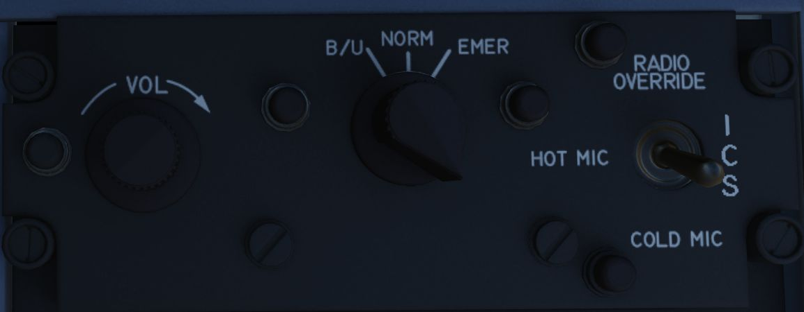

# Intercom System

The Intercom System provides communication between the pilot, WSO, and ground
crew, and functions with external power, or the aircraft battery once either
[Engine Master Switch](../../cockpit/pilot/left_console/front_section.md#engine-master-switches) is
in the ON position.

## Intercom Control Panel

Each cockpit has an Intercom Control Panel, providing a volume control knob, an
amplifier selector, and a function selector switch.

### Volume Control Knob

The Intercom Volume Control knob sets relative volume level for the given
cockpit; increasing volume is performed by turning the knob clockwise. The
Intercom Volume Control does not affect any other cockpit audio signal.

### Function Selector Switch

The function selector offers three options: COLD MIC, HOT MIC (enabling automatic
intercom operation), and RADIO OVERRIDE. While RADIO OVERRIDE operates similarly
to HOT MIC, it also attenuates all sounds except for crew communication, the pull-up
tone from the ARBCS, and the Shrike aural tone. For ground crew transmission to be
enabled, the WSOs switch must be set to HOT MIC.

### Amplifier Select Knob

The three position Amplifier Select Knob determines which amplification channel
is used: B/U for the backup, NORM for the normal amplifier, and EMER for a
parallel function, should both amplifiers in a cockpit fail. In EMER mode, only
audio from the other cockpit would be heard, and the volume control of all sounds
would be managed by that cockpit.

## Intercom Microphone Switch

The microphone switch for the Intercom System is the aft position on the inboard
throttle grip in both cockpits. When using the intercom, all audio sans the
pull-up tone, stall warning and ECM are reduced (same as RADIO OVERRIDE).
