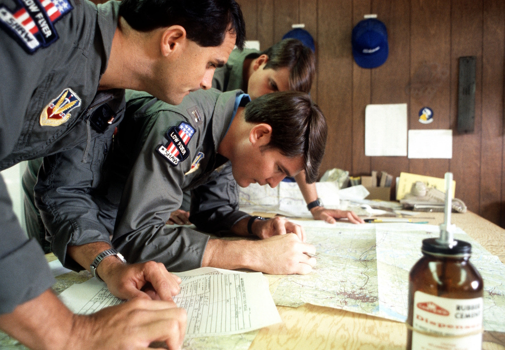

# Navigation & Communication

The [AN/ASN-63 Inertial Navigation System (INS)](./ins.md) equips the F-4E aircrew and integrated
weapons delivery system with real-time accurate positional, velocity, attitude, and heading
information.

The [UHF communication system](./uhf.md) in the aircraft is modified to support
both [crypto](./encryption.md) and conventional voice transmission and reception.
The [intercom system](./intercom.md) and [UHF transceiver](./uhf.md) are adapted for
operational compatibility with the [KY-28 speech security unit.](./encryption.md)

The [VHF Omnidirectional Range Instrument Landing System (VOR/ILS)](./vor_ils.md) furnishes accurate
bearing and course deviation information through a ground station transmitter. This system enables
the aircraft to utilize precision landing approach and descent capabilities at fields equipped with
a localizer.

The [Tactical Air Navigation (TACAN)](./tacan.md) system offers bearing and range information to
transmitting stations, with a reception range of up to 390 miles from ground stations and 200 miles
for air-to-air [TACAN-equipped](./tacan.md) aircraft.

*CPT Mark Wright, an F-4E Phantom II pilot of the 336th Tactical Fighter Squadron,
charts a map during the exercise Crested Cap*
<!--  -->
