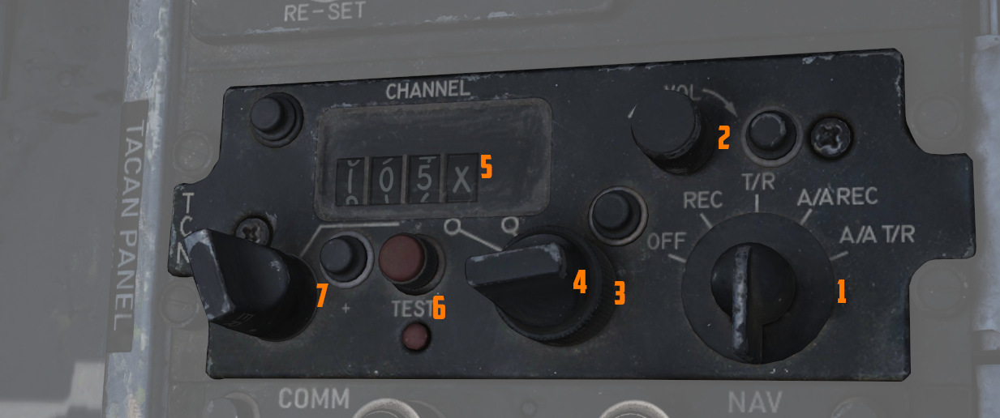

# TACAN (Tactical Air Navigation) System

Bearing and range information to transmitting stations is provided by the TACAN
system. The TACAN system can receive information from ground stations as far as
390 miles, and air-to-air TACAN equipped aircraft to 200 miles. The TACAN system
provides the identity of the transmitting station and the dependability of the
signal received. Course deviation is calculated and displayed on navigation
systems set in TACAN mode. If a TACAN signal is invalid, a warning is displayed.
In the event of a signal loss, the system continues providing range tracking for
15 seconds, and bearing tracking for 3 seconds. The system will perform a
self-test after a signal loss to confirm function on the control panel. Two
TACAN antennas are provided, and signal switching is automatic to maintain the
best signal.

## TACAN Controls

TACAN controls are found on the navigation control panel in each cockpit.

### Navigation Command Button and Indicator

The NAV CMD button and indicator performs a command authority switch between the
two cockpits, and are found in the upper right corner of the Communication
Control Panel. A green light illuminates to the left of the button in the
cockpit that has control of the navigation system.

- Mode Selector Knob,
- BRG/DIST Selector Switch, and
- Navigation Function Selector

As detailed in the Flight Director Group section, the Mode Selector, BRG/DIST
Selector, and Navigation Function Selector determine the presentation of TACAN
information on the HSI, the ADI, and the BDHI.

### Navigation Channel Control Knobs

On the TACAN Control Panel beneath the channel window, a pair of knobs set the
desired TACAN channel. The left knob controls the tens and hundreds digits of the
channel. The right knob selects the units of the operating channel, and the
outer knob sets the X or Y channel; both X and Y have 126 available channels.
While the indicator can show 127, 128, and 129, these values are nonfunctional.

### TACAN Function Selector Knob

- OFF: the TACAN system is de-energized
- REC: only the receiver is energized, and the system receives and decodes
  bearing signals from the TACAN station and provides bearing information for
  the HSI, BDHI, and ADI displays.
- T/R: the TACAN generates distance information along with bearing; the distance
  is then added to the HSI and BDHI, provided in nautical miles.
- A/A REC: the TACAN receives and displays bearing information for the HSI,
  BDHI, and ADI steering display from an aircraft providing a TACAN beacon
  signal. The channel selected must be 63 channels above or below the
  transmitting aircraft beacon, on the same X or Y channel range; for example, a
  tanker transmitting on 83X will be received on 20X.
- A/A TR: the TACAN interrogates the equipped aircraft beacon to add range
  information to the HSI and BDHI. The channel selection method remains the same
  as A/A REC.

### Navigation Volume Control Knob

The NAV VOL knob controls the headset audible volume of the received TACAN
station.

### TACAN Test Button

The Tacan test button may be used to test the TACAN System. For a detailed procedure see
the [Navigation Test Procedure](../../procedures/bit_tests/navigation_tests.md).
