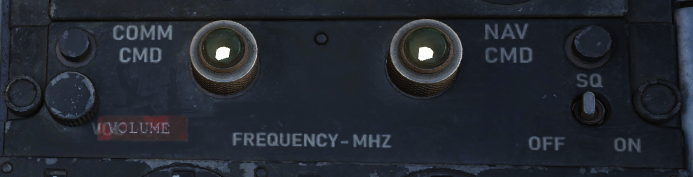

# UHF Radio

The UHF Radio provides voice and Automatic Direction Finding (ADF) capabilities
to the F-4E. The radio can receive and transmit on 3500 manually selected
frequencies, 18 preset channels, or on the standard 243.00 MHz guard channel.
The aux receiver covers an additional 20 preset channels or guard. Two blade
antennas, one upper and one lower, as well as an ADF antenna, are provided. Once
the antenna mode is set for the primary channel, the aux receives from the other
antenna.

## Comm Control Panel

Two Comm Control Panels are installed, found on the right console in the front
cockpit, and on the left console in the rear cockpit. These provide management
of the radio in either seat, with selectable priority.

### Comm Command Button and Light

Control authority of the UHF radio is set by the COMM CMD button. A green light
illuminates in the cockpit with control next to the button. Either cockpit can
take control, or if already in control, press the button to provide control of
the radio to the other seat.

### UHF Volume Control

Sets the listenable volume for the UHF radio for the given crew-member.
