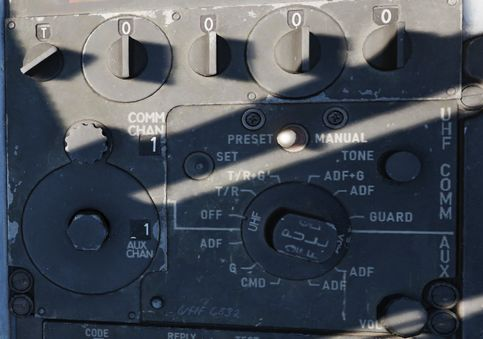
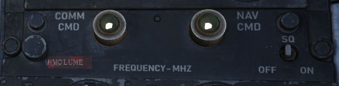

# UHF Radio

The UHF Radio in the F-4E provides both voice communication (AM) and Automatic Direction
Finding (ADF) capabilities. It comprises two main units: a radio transmitter-receiver
(referred to as 'comm'), an amplifier power supply-receiver unit (referred to as 'aux'),
and a guard receiver (at 243 MHz).
Control over these systems is facilitated by two Control Panels, one located in each cockpit.
The panel that is currently active assumes full command over the radio operations.

The comm unit is capable of receiving and transmitting on a wide range of manually
selected frequencies, totaling 3500, or it can operate on 18 preset channels. This
functionality covers a frequency range from 225.0 MHz to 399.95 MHz. On the other hand,
the aux unit is designed to receive signals on 20 preset frequency channels, ranging
from 265.0 MHz to 284.9 MHz. Both the comm and aux receivers have the capability to
process ADF signals, which can be displayed on the Horizontal Situation Indicator (HSI)
or Bearing Distance Heading Indicator (BDHI).

Two blade antennas, one upper and one lower, as well as an ADF antenna, are provided.
Once the antenna mode is set for the primary channel, the aux receives from the other
antenna.

> 💡 The COMM and AUX preset channels and ADF stations may be set in
> [mission editor](../../dcs/mission_editor.md#radio-options).

## Comm Control Panel

Two Comm 
[Control Panels](../../cockpit/pilot/right_console/front_section.md#communication-control-panel)
are installed, found on the right console in the front cockpit, and on the left console
in the rear cockpit. These provide management of the radio in either seat,
with selectable priority.

For Automatic Direction Finder (ADF) navigation to function effectively,
the appropriate receiver must be set to the ADF mode, as selected by the Mode Selector.

### Comm Command Button and Light

Control authority of the UHF radio is set by the COMM CMD button. A green light
illuminates in the cockpit with control next to the button. Either cockpit can
take control, or if already in control, press the button to provide control of
the radio to the other seat.

### UHF Volume Control

Sets the listenable volume for the UHF radio for the given crew-member.
