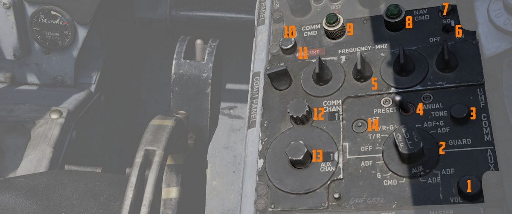

# UHF 电台

F-4E 的特高频电台拥有话音通信（AM）和自动测向（ADF）功能。UHF 电台由两个主要单位组成：无线电台发射
器-接收机（简称 _COMM_）、放大器电源-接收机装置（简称*AUX*）和救生接收机（在 243 MHz）。机组通过两
个控制面板即可便捷的控制这些系统，各驾驶舱各一个面板。当前使用的控制面板覆盖了所有电台操作。

COMM 单位能够在宽频带范围内接收和发射手动选择的频率，手动设置频率总计 3500 个可用频率，COMM 单位也
可以在 18 个预设波道上工作。COMM 的工作频率区间为 225.0 MHz 至 399.95 MHz。

另一方面，AUX 单位可接收 20 个预设频率波道的信号，区间为 265.0 MHz 至 284.9 MHz。

COMM 和 AUX 接收机都能处理 ADF 信号，ADF 信号可显示在水平状态显示器（HSI）或方位距离航向指示器
（BDHI）上。

UHF 电台总共使用两个刀状天线，一个位于上部一个位于下部，其中包括一根 ADF 天线。在为 COMM 单位选择了
一根天线后，AUX 将会接收来自另一个天线的信号。

💡 COMM 和 AUX 预设波道以及 ADF 电台可在 [任务编辑器](../../dcs/mission_editor.md#radio-options) 中
设置。

## 通信控制面板

在飞行员驾驶舱的右侧控制台和 WSO 驾驶舱的左侧控制台中分别装有通信
[控制面板](../../cockpit/pilot/right_console/front_section.md#communication-control-panel)。这些控
制面板可使得任意一名机组都能对电台进行管理，并可选择控制优先级。

如需使用自动测向（ADF）导航，必须使用通信功能旋钮将相应的接收机设置为 ADF 模式。

### 通信指令按钮和指示灯

UHF 电台的控制权由 COMM CMD 按钮进行设定。驾驶舱内的绿灯亮起，则表示拥有电台控制权。任意一名机组人
员都可以取得控制，或如果当前已有控制权，此时按下按钮将会把电台控制权交给另一名机组人员。

### UHF 音量控制旋钮

设置指定机组 UHF 电台的播放音量。
