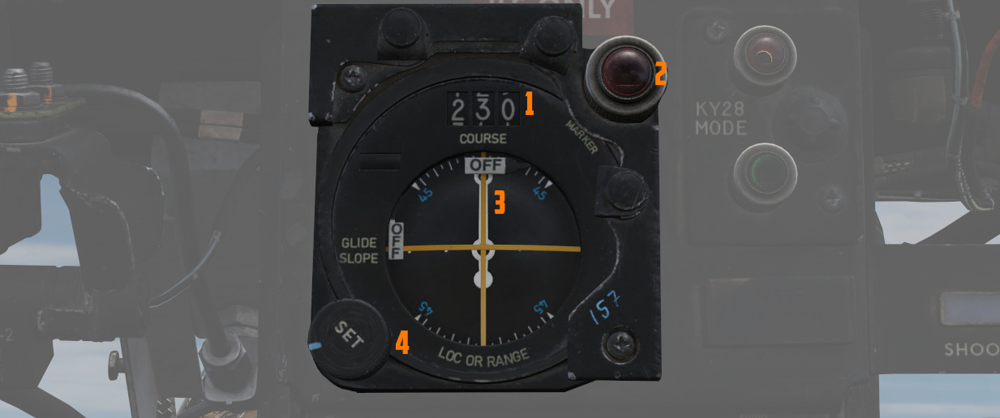

VOR/ILS 系统

甚高频全向信标仪表着陆系统（VOR/ILS）可从地面台获取精确的方位和航线偏差信息。此外，飞机能够在配备航
向信标的机场使用精确进近着陆和下降功能。VOR/ILS 系统的引导信息将通过 BDHI、ADI 和 HSI 提供给飞行员
。正确设置好方位/距离选择开关、导航模式选择旋钮和飞行指引旋钮，即可在这些显示器上启用 VOR/ILS 功能
。

## ILS 系统

ILS 系统旨在检测相对指定着陆进场路径的偏差，并将此信息传递给飞机上选定的航电设备。

当在导航功能选择面板上正确选择 ILS 模式后，数个仪表将为精确进场提供引导。其中包括水平状态显示器
（HSI）上的偏差指示器（显示与跑道的横向对准情况）和 ADI 上的下滑道指针——显示垂直方向上相对于理想下
滑道的下降角度。

此外，如果激活了飞行指引，姿态指引指示器（ADI）上的指针将提供转向提示，为俯仰和横滚提供视觉引导，以
保持正确的进近路径。

在 WSO 驾驶舱中，水平和垂直偏差都将显示在航线指示器上。

航向信标的典型最大偏差值为 ±2.5 度，下滑道的典型最大偏差为 ±0.7 度。

### 指点信标

如果指点信标沿着进近路径放置，飞机的系统将在经过每个信标时发出音频信号并使指点信标灯亮起。根据机场
的具体设置，可以有：

- 外指点标：通过连续低音来识别。 - 中指点标：通过更高交替音来识别。中指点标表示更接近跑道，通常位于
  着陆决断高度处。 - 内指点标：特点是发出非常高的音调或一系列高音点。内指点标并不总是存在，但如果存
  在，则表示飞机距离跑道末端更近了。

## VOR/ILS 控制面板

VOR/ILS 的控制面板位于飞行员驾驶舱的左侧控制台上；该面板包括一个频率指示器、两个频率选择旋钮、一个
音量控制（标记为 NAV VOL）、一个指点信标音量控制旋钮（MB VOL）和一个 VOL/MRK TEST 按钮。

### VOR/ILS 频率选择旋钮

频率选择旋钮是一个双动双层旋钮；外环选择频率指示器上小数点左侧的数字，而内环选择频率指示器小数点右
侧的数字。

在 DCS 中，要查找所需的目标 VOR/ILS 频率，请在地图上单击想要飞往的机场。如果机场配备的话，将列出
VOR 和 ILS 频率。

💡 并非每个机场都有 VOR 台或 ILS 系统。

系统可自动检测调谐至的频率对应的为 VOR 台还是 ILS 航向信标台。VOR 的工作频率范围为 108 MHz 至
117.95 MHz。 ILS 航向信标台频率范围为 108.1 MHz 至 111.95 MHz。

在共享频率区域中，VOR 台通常在小数点后一位为偶数的频率上运行（例如 108.2 MHz、108.4 MHz 等），而
ILS 航向信标台则使用奇数，包括 MHz 的后二位的频率 （例如 108.1 MHz、108.3 MHz、108.35 MHz 等）。

ILS 的下滑道组件工作频率区间为 329.3 MHz 至 335.0 MHz。下滑道频率与相应的航向信标台频率相结合，确保
无需单独手动设置。当选定了航向信标台频率后，系统将自动调谐至相关的下滑道频率，为精确进近提供一体化
的横向和垂直引导（如果可用）。结合 ILS 一同工作的指点标的工作频率为 75 MHz。

### VOR/MKR 测试按钮

在频率指示器上选择 ILS 频率后，按下 VOR/MKR 测试按钮会使指点信标灯亮起。如果选择了 VOR 频率、存在有
效的 VOR 信号、在 HSI 航线选择器上选择了 315° 航向且 HSI 模式处于 VOR/ILS，则可以开始测试。按下测试
按钮将使 HSI 上的航线偏差指示器移至中心（最大允许误差为 ±4°）、HSI 上的向-背台指示器指示 TO、指点信
标灯亮起、HSI 和 BDHI 上的方位指针摆动至 315°。

### NAV VOL 旋钮和 MB VOL 旋钮

NAV VOL 旋钮除了用于于激活 VOL/ILS 系统，还用来控制飞行员驾驶舱中系统播放的音频音量。顺时针旋转旋钮
可打开系统电源，然后进一步增大音量。 MB VOL 旋钮可调节飞行员驾驶舱中播放的指点信标音频的音量。

## WSO 航线指示器

后座的主仪表板中设有一枚航线指示器；在 ILS 进近期间，指示器显示相对航线窗口中设置的航线的航向，以及
相对于 ILS 航向信标以及飞行员输入的下滑道的水平和垂直位置。通过航线指示器，WSO 可以协助飞行员进入并
保持在下滑道上。该指示器的控制开关/按钮仅供 WSO 参考，不会影响到飞行员驾驶舱中的飞行指引指示器组。

航线指示器的组件包括向-背台指示器（不适用于 ILS）、航线偏差刻度标线、下滑道偏差刻度标线、航线选择窗
口、航线设置旋钮、航向指针和航向刻度、指点信标灯、下滑道指示器、航线偏差指示器（LOC 或 RANGE）以及
航向和下滑道 OFF 警示旗。

在飞行员选择了 ILS 频率后，WSO 必须使用 SET 旋钮设置一个向台航线，设置值将显示在航线选择窗口中。

仅与 ILS 系统一起使用（不适用于 VOR）。
