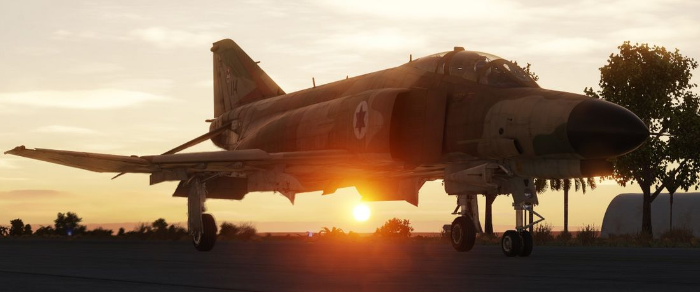

# Systems Overview

This chapter gives detailed in-sights and explanations into all major systems of the Phantom.

From the engine system to fuel flow, control surfaces, how to navigate, use the radar and
weapons effectively, or the insights of INS alignments and its gyro system.

