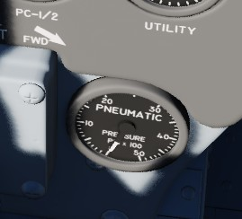

# Pneumatics

The pneumatic system provides high pressure air for the normal and emergency operation of the
canopies and the emergency operation of the landing gear as well as the slats and flaps. The
pneumatic system is driven by the utility hydraulics. It utilizes the 17th bleed
stage of the engine to feed into the Air Compressor. The pressurized air from the air compressor is
then fed into the different tanks. From the tanks initiators are used to move the forward canopy,
the rearward canopy and the landing gear. The Slats and Flaps are only controlled by the pneumatic
system when the emergency lever is used.

A Pneumatic Pressure
Indicator is found on the front cockpit pedestal panel to
confirm function, and indicates manifold pressure.

