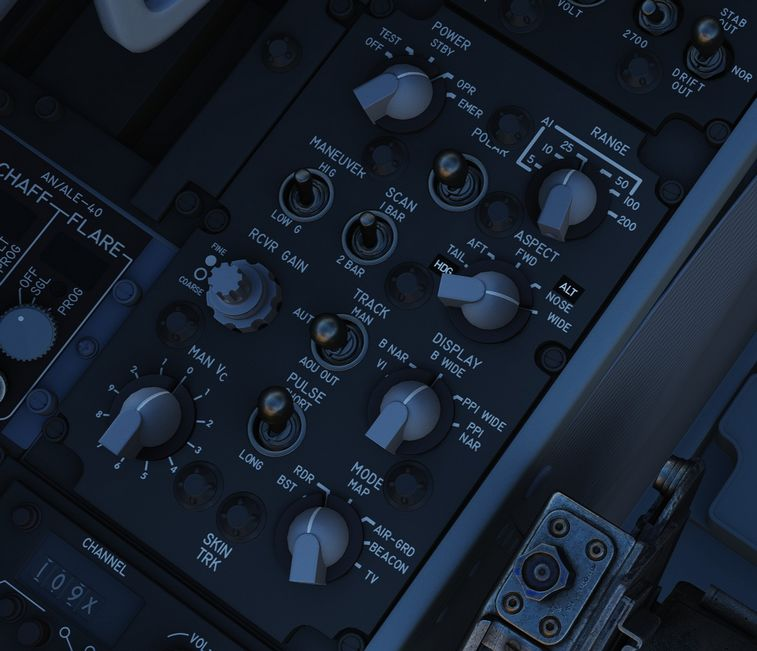
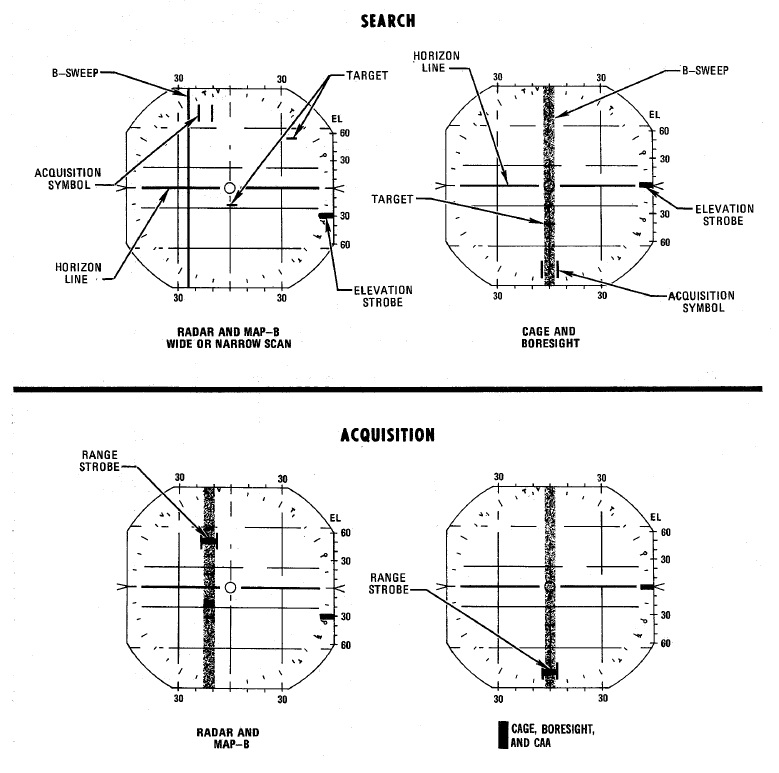
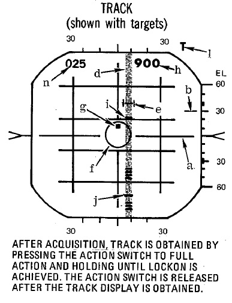
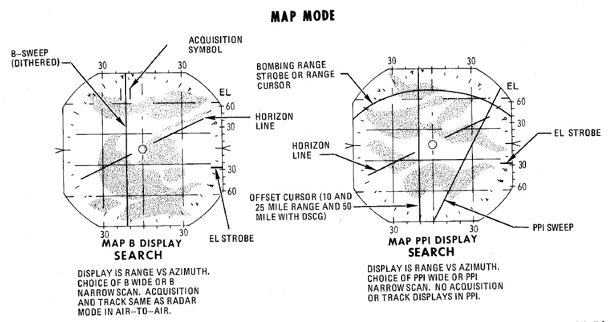
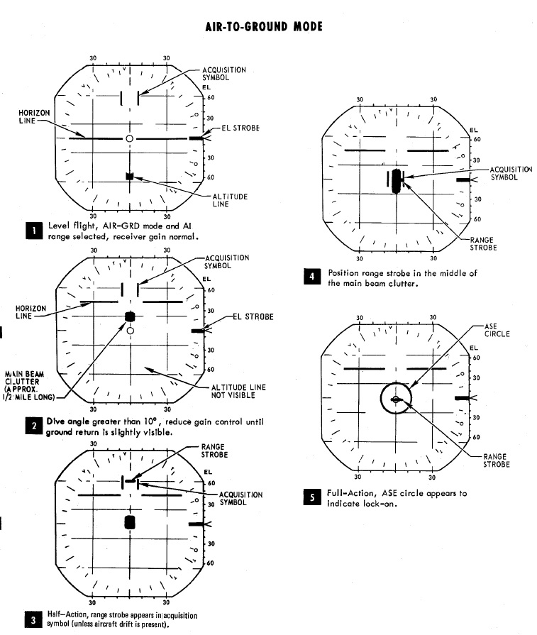

# Radar system

A continuation of the F-4C's -100 and the 4D's 109, the Westinghouse AN/APQ-120 Fire Control Radar
is a solid state pulse radar providing the F-4E with air to air intercept functionality, air to
ground mapping, ground target reference provision to the LABS and WRCS bombing systems, as well as
radar beacon capability. The APQ-120 also functions as the display system for TISEO and TV guided
weapon imagery, and is integrated with the APX-80 interrogation system.

The primary conversion from the APQ-109 to APQ-120 included a reduction in the number of field
replaceable units in the nose, as well as the reduction in their size; whereas the -109 had been a
hybrid in its movement towards solid state hardware (primarily in the low voltage processing
sections), the 120 was a fully solid-state system. While this update reduced the space overhead and
weight for the system, the modification of the F-4 nose to include
the [M61 cannon](../stores/guns.md#internal-cannon-m61a1-vulcan) required a
reduction in antenna size, causing a marginal decrease in overall detection range. However, when
taken with the increase in system reliability and reduced maintenance, the tradeoff was considered
acceptable.

Starting with production of the F-4E block 60, and retrofitted to selected earlier block aircraft,
was the addition of the Digital Scan Converter Group display. The inclusion of DSCG increased the
overall ease of handling the APQ-120 by adding additional information on the display directly,
including current radar range setting and the calculated range rate value against the current
acquired target. Further, clarity of the display in all lighting conditions was improved by
rendering the radar reference grids directly as part of the displayed image, rather than the
previously used markings on the DVST glass. In addition, DSCG provided the ability of the two crew
members to utilize the displays independently; previously, the WSO had control over which mode both
the DVST and front seat repeater display would show. With DSCG, the pilot could utilize TISEO or TV
air to ground weapons while the WSO maintained a scan pattern or found a ground reference point and
inserted it into the WRCS.

## Radar set Control Panel

### Power

Initial powering of the APQ-120 starts by placing the Radar Power Knob into TEST or STBY (Standby).
The warmup cycle requires 3 minutes from selecting either setting, and confirmation of this process
is shown via the Control Monitor Meter on the Monitor Panel; after 30 seconds from cycling power,
the gauge will display a value of roughly 250vdc; from the point the needle shows power at this
nominal value, the warmup procedure will be 2.5 minutes.

After 3 minutes, the radar can safely be placed into OPR (Operate) for employment of the radar, BIT
testing can be performed in TEST mode, or the radar can be left in STBY for the safety of crew and
others on the ground.

In the event of an emergency situation requiring immediate operation of the radar, EMER can be
selected; this performs a bypass of the 2.5 minute post-power warmup cycle. A red flag will display
behind the power knob confirming usage of the EMER mode, which requires servicing to clear up.

### Range

Range control of the APQ-120 is mode dependent, and in some circumstances restrict range or
functionality. Both scopes - the DSCG and the pilot's repeater window, both share indications (as
well as on-screen display) of 5, 10, 25, 50, 100, and 200 mile ranges. Values up to 50 miles are
indicated as air intercept (AI), which provide lock-on capability against airborne targets; 100 and
200 mile ranges can be used with the Spotlight function, allowing a target at longer distances to be
manually followed with the radar until they are at a range capable of a lock. Air to ground
functionality is available in the PPI modes higher than 5 miles.

Selecting any range will illuminate the respective indicator lamp, as well as display the numerical
value on the DSCG display in the upper left.

### Polarization Control

The WSO is afforded direct control of the APQ-120's waveform polarization at the antenna feed-horn
by using the Polar Switch. The default setting is LIN (Linear); in this setting, the waveform is
transmitted in a linear alignment to the feed-horn, oriented vertically. This is also the default
setting for employment of the [AIM-7 Sparrow](../stores/air_to_air/aim_7.md).

Also available are a pair of Circular polarization options, CIR 1 (clockwise) and CIR 2 (
counter-clockwise). Circular polarization is provided as it is less susceptible to
precipitation-related clutter, and can allow detection or tracking of a target in such weather when
a return is otherwise found to be marginal.

> 💡 Only clockwise polarization (CIR 1) is compatible with the
> Sparrow's receiving antenna, and thus can only be fired
> in said mode. A Sparrow launched with the APQ-120 in CIR 2 will not track.

### Maneuver Switch

The WSO can select APQ-120 system response to acceleration that can cause a track to be dropped for
air-to-air combat using the Maneuver Switch. By default, this switch is placed in LOW G, as to
provide resistance to countermeasures and clutter that would drive the range track loop off target
under normal maneuvering. In a combat situation, selecting HI G removes such limitations and allows
the range track loop to respond to said high accelerations. If the switch is not previously selected
prior to entry, activating CAA mode automatically engages the HI G response mode. LOW G provides the
velocity reject function whilst HI G allows tracking of a maneuvering target without breaking radar
lock-on.

### Scan

The APQ-120 can search in non-boresight AI modes with a 1 bar or 2 bar scan; the number of scan bars
is set by the respective switch position. In the 2 bar scan mode, the elevation between the two bars
is separated by 3.75 degrees. Upon entry to boresight or an air to ground mode, the radar will
revert to a 1 bar scan.

### Aspect

Using the Aspect knob the WSO can provide an [AIM-7](../stores/air_to_air/aim_7.md) with a simulated
Doppler signal rather than the
actual return signal to set the desired target speed-gate for the missile. Once a Sparrow has
been tuned, the NOSE, TAIL, FWD, and AFT options may be applied to set the speed-gate with respect
to
the expected target Doppler for the intercept. Once launched the speed-gate unlocks and sweeps the
narrowly applied frequency of this simulated Doppler value. The WIDE option is available to permit
the missile to search the full doppler spectrum for the target, rather than the limited width band
set here.

With the application of NOSE, FWD, or TAIL on the Aspect knob, the target's aspect angle, altitude,
and target heading are displayed in the upper right corner of the DSCG scopes in lieu of the range
rate. Aspect angle is selected by positioning the Aspect knob to FWD, with right aspect values being
positive (000 through 180) and left aspect negative (000 through -180). NOSE provides target
altitude readout in thousand foot increments, but displayed in hundreds of feet (with the last digit
always 0); as an example, 36,000' would be 360. TAIL provides target heading data.

### Receiver Gain (RCVR GAIN)

The stacked RCVR GAIN potentiometers FINE on top and COARSE on the bottom, provide the ability to
adjust the receiver gain for increased return visual definition, improving clarity and discernment
of the scopes during search routines. Further, when using MAP PPI, BEACON PPI, and AIR-GRD, their
command of the STC (Sensitivity Time Control) circuit controls how the receiver's gain applies as a
matter of range, which drives image intensity in the lower part of the scope. Gain knobs do not have
an effect on the radar picture when a lock-on exists.

### Track

The track switch determines whether the APQ-120 will attempt a lock-on against a selected track
automatically, or through manual means. In the default center AUTO position, full-action on the
antenna hand controller initiates an automatic lock-on attempt. In the MANUAL (up) position, the WSO
initiates a manual tracking attempt upon engaging full-action, which requires the range strobe to be
placed just inside of the bracketed contact and an adjustment of the Manual Vc knob to match
closure. The third (down) position, AOJ OUT, overrides the radar's acquisition on jamming function.
If jamming should occur during an attempt that precludes acquisition, the jamming source can be used
as a lock-on target for an angle track. Switching over to AOJ OUT returns the radar to a search
configuration.

### Display Modes

The DSCG can display returns as both as a B-Sweep or as a Plan Position Indicator (PPI) display.
Proper selection of the display for the situation is required for correct fire control and WRCS
target injection functionality, and the WIDE and NAR selection dictates the relative azimuth sweep
of the radar itself- 120 degrees in full width, or a 45 degree wide slice. The display can also be
directed to provide course guidance for a Vis Ident (VI) intercept profile against a locked target.

### Air to Air: B-Sweep- B WIDE, B NAR, and VI (Vis-Ident)

The B-Sweep modes are used for air-to-air detection, tracking, and engagement. The B-Sweep
presentation shows range as a function of height on the DSCG display (higher is further), and
projects the extents of the radar sweep field out to the sides of the display; in B WIDE, the width
of the display is 120 degrees across, thus 30 degrees across per column, whereas in B NAR the
display is 45 degrees in total width, and each column is 11.25 degrees wide. In this fashion, the
whole of the display is used, with the relative cone shape of the radar sweep being distorted to a
greater degree as range closes.

The Antenna Hand Control is able to drive the antenna's relative position for the sweep in both
modes; in B WIDE, this is achieved by activating Half Action on the trigger, then slewing the Hand
Control left or right. In B NAR, Half Action is not required - simply moving the Hand Control left
or right will shift the antenna in relative azimuth.

VI (Vis-Ident) is selectable with a radar lock-on against an airborne target achieved. By selecting
this mode, the radar provides pure pursuit steering to the locked target, via an aim dot in a
similar presentation to centering for an AIM-7 shot. To fly pure pursuit on the target, the dot
should be centered in the steering error circle. When the range to target is less than 1000', the
break X anti-collision warning will appear over the display.

### Air to Ground: PPI WIDE and PPI NAR

In the Plan Position Indicator modes, the described cone of the radar sweep is not projected out to
the sides of the display; in this way, the radar presentation is less distorted relative to the
ground, although closer ranges require adjustment of the radar range setting to provide visibility
on the display.

In PPI WIDE, the display is a 120 degree wedge presentation.

PPI NAR's display is 45 degrees wide, which can be swept using the Antenna Hand Control. The display
is drift compensated, and will shift as required to maintain relative position. The PPI NAR setting
provides a range cursor for ground mapping or bombing functions. While the range cursor is shown,
there is no target lock capability. Also inhibited is receiver gain function, as well as the 5 mile
range; the lowest available range option for PPI NAR is 10 miles.

### Manual Vc (MAN Vc)

The MAN Vc switch is used when manual mode tracking attempts are made to apply a range rate value
against the track for range estimating purposes. The knob is marked 2 to 0 to 9, in a clockwise
orientation, with values of 0 heading counter-clockwise signifying an opening target (gaining range
against the fighter), whereas values from 0 to 9 heading clockwise are for closing targets. The knob
is used in manual track mode by bracketing the desired track with the acquisition cursor, selecting
half-action to show the range strobe, adjusting the position of the cursor to place the strobe just
below the target, applying a Manual Vc rate that keeps the range strobe moving at the same rate as
the target, and then selecting full-action. The numbers are multiplied by 100 m/s while closure
means closing in to the F-4 and opening means the target is flying away from the F-4.

### Pulse Switch

Control of pulse width (duration) and frequency of the cycle (PRF) is managed using the Pulse
Switch. The switch provides three distinct settings, each useful under specific circumstances, and
in some instances automatically overridden by the radar mode employed.

Normal operation is performed in AUTO mode. Auto mode defaults to the LONG mode function, with wide
pulse width and low PRF. In the event a track is attained, power, pulse width and PRF are moderated
by the PLMS (Power Level Mode Switch) system for best lock stability; this function is only
available in AUTO mode.

In LONG pulse mode PRF is low and pulse width is wide, in general increasing detection range, with a
reduction in resolution and target discernment.

In SHORT pulse mode, a short pulse width is applied with a high, jittered PRF is applied, to
increase detection rate at close range and under maneuver.

In AIR-GRD mode, the pulse switch is disabled automatically and SHORT pulse is commanded.

## Radar Modes (MODE)

Radar mode selection with the APQ-120 is not necessarily discrete; each selection on the Radar Mode
Knob can involve multiple possible methods of employment of the radar. We will explain how these are
accessed in relation to the Radar Mode Knob positions, as well as the required Display Knob settings
for proper fire control interaction.

### RDR (Radar) Position

RDR Mode is used with the Display Mode selected as B WIDE or B NAR.

Used for long distance acquisition of airborne targets, RDR Mode can be used at any range, with the
capability to lock-on to a target removed in the 100 and 200 mile ranges. Detection and acquisition
of
airborne targets with the APQ-120 follow a general outline: the pilot positions the aircraft in the
general direction of the intended search, with the WSO defining the azimuth width (wide/120 degrees
or narrow/45 degrees) as required. The WSO then sets the antenna elevation to cover the desired
altitude, selecting 1 or 2 BAR scan paths to define overall scan height, and adjusts the receiver
gain controls for best resolution. Further adjustment can be performed depending on target altitude
or weather conditions by adjusting the antenna polarity, from the default LIN (Linear) transmission
to CIR 1 or 2 (Circular) for better performance in such situations.

Once a contact of interest is detected on the scope, the WSO brackets the target with the
acquisition symbol using the antenna hand controller, then selects and holds full action. The range
strobe will appear, and should be aligned directly over the target. If the WSO has selected the AUTO
TRACK mode, the radar will take over and perform the velocity gate tracking to complete the lock-on;
if MANUAL has been selected, the WSO will use the MAN Vc control knob to define the closure
direction and rate compared to the return, bringing the range strobe as close as possible to the
return, in-range (closer to the Fighter). Once the Vc is matched, the WSO selects half-action and
maneuvers the range strobe on the target, selects full-action (note range rate digit flashing), then
releases the trigger, maintaining the alignment of the target under the cursors with the hand
controller if full manual angle tracking is desired.

With a lock-on, the standard track display will appear, including the following information:

a. Horizon line
b. Elevation strobe
c. Acquisition cursor
d. B-sweep
e. Range sweep
f. ASE circle
g. Aim dot
h. Range rate
i. Rmax strobe
j. Rmin strobe
l. Track lamp illuminated
n. Radar range

### Acquisition on Jam (AOJ)

Should a jamming strobe be detected, the strobe can be acquired by the antenna for angle-only
tracking. Rather than bracketing the desired contact with the acquisition symbol and pressing
full-action, the WSO isolates the jamming strobe with the acquisition symbol and presses
full-action. The radar will then maintain angle tracking of the strobe, and, in the event
burn-through of the signal is achieved, the radar will attempt a normal lock-on. Should this attempt
fail, the WSO can press half-action, make the necessary range strobe adjustment with the Antenna
Hand Control, and then press full-action.

### Home on Jam (HOJ)

Should an acquired target attempt noise jamming to break a lock-on, the radar will revert to Home on
Jam mode. In this instance, the radar will revert to range and range rate data for distance, and
maintain an angle track against the jammer strobe. Should the jammer stop transmitting or
burn-through is achieved, the radar will automatically attempt to revert to a normal lock-on. Like
the failure mode of Acquisition on Jam, should the radar not acquire the target again, the WSO
should press half-action, adjust the range strobe position on the return, and press full-action.

### Spotlight

In the 100 and 200 mile ranges, a procedure known as Spotlight can be used to maintain radar
monitoring of a target manually. Spotlighting entails placing the acquisition cursor over the
desired return, then selecting and holding the full action trigger position of the Antenna Hand
Controller. Doing so, the antenna will nutate and revert to the chosen Polar switch selection to
increase target definition, but without attempting the automatic lock-on. The target can be
maintained in a well-observable state by holding full action and following the target return with
the Antenna Hand Controller until it reaches a range that lock-on can be achieved (with the
applicable change in range setting; the radar cannot attempt a lock at an incompatible range
setting).

### BST (Boresight) Position

BST can be used with any Display Knob position.

### Default

Boresight mode with the APQ-120 is used by the WSO to immediately access the short range "dogfight"
presets of the radar. Initial selection of BST slaves the radar to 0 degrees in azimuth and -2
degrees in elevation relative to the Fuselage Reference Line (FRL). This position, with an A/A mode
selected on the gun-sight, automatically applied depression of 35 mils provides the pilot with the
boresight reference.

Lock-on in Boresight is not automatic; the B-Sweep presentation of the target still requires the WSO
to position the acquisition cursor and range strobe over the target and activate the full action
trigger on the Antenna Hand Controller. Once the lock is achieved, the lock-on presentation with
steering and aspect indications will be shown on the display. At this time, the pilot can maneuver
as necessary, and the radar will attempt to retain the lock out to its antenna gimbal limits.

In the event lock-on is not achieved, the WSO can apply an aspect instruction to the current
priority
[AIM-7](../stores/air_to_air/aim_7.md) and perform a launch against the simulated Doppler applied to
the missile guidance circuit.

### CAGE Mode

In the event that an [AIM-7](../stores/air_to_air/aim_7.md), [AIM-9](../stores/air_to_air/aim_9.md),
or [M61A1](../stores/guns.md#internal-cannon-m61a1-vulcan) must be employed against an airborne
target with the
sight in A/G mode (for example, the flight is bounced by opposing aircraft), the optical sight
reticle can immediately be slewed to the Radar Boresight Line using the Cage Button, found on the
inboard (right) throttle handle. Cage mode commands the radar into BST mode with a five-mile range,
and short pulse, and sets the firing circuit for the currently selected air-to-air weapon relative
to the Pinky Switch. For the optical sight, the command activates the respective elevation and
azimuth tracking, roll mark, and range functions of the reticle for the chosen weapon, without the
pilot having to remove a hand from throttle or stick to swap the sight mode or weapon control panel
functions.

Should a track condition exist prior to pressing Cage and the Pinky switch is in Radar or Heat
position, the lock is broken when the button is pressed, and the antenna slaves to boresight when
released. If the Pinky Switch is in the Gun position, the lock is not broken.

Cage mode can be exited from either cockpit, by placing Weapon Select knob in the pilot cockpit to
the B position momentarily, or by the WSO pressing the Air to Air button on the rear cockpit
panel. If the pilot leaves the Weapon Select knob in B, it does not preclude a later entry into Cage
mode.

### Computer Automatic Acquisition Mode (CAA)

Once in Cage mode, the radar can be selected in to Computer Automatic Acquisition using the Nose
Gear Steering button. In CAA, the radar enters a vertical-oriented scan pattern 78 degrees in height
by 15 degrees high. Actual radar lock capability within this scan pattern is from +45 degrees above
the horizon line to -9 degrees below the horizon line due to APQ software limitation. In the event
that the radar finds a suitable target within the scan volume, the target will be locked. Should the
flight crew find the locked target not be the one intended, the Nose Gear Steering button can be
pressed on either stick grip to return the radar back to the search pattern.

In CAA mode, the radar’s search pattern can be shifted left or right utilizing the Pinky Switch.
While this actuation will change the illuminated weapon indicated on the Head Up Display, the actual
selected weapon from the point of Cage mode entry does not change:

- Guns
- Radar Focus Left
- Heat
- Radar Focus Center
- Radar
- Radar Focus Right

To exit CAA, the pilot can select position B on the Weapon Select Knob, or the WSO can push the Air
to Air button. Should a radar lock be in place at the time of mode exit, it will be retained.

## MAP Position

### MAP PPI

MAP PPI mode is used with the Display Mode selected as PPI WIDE or PPI NAR.

Used for radar bombing, MAP PPI provides ranging and azimuth information to the WRCS against a
designated target return, or a designated Radar Initial Point (RIP) offset as programmed into the
WRCS. MAP PPI targeting is limited to ranges between 10 and 50 miles in DSCG aircraft; with 5 miles
selected, the presentation reverts to a B-Scope display.

In MAP PPI, the application of the Along Track and Cross Track cursors and Target Injection do not
apply a target lock-on; instead, the action triggers the ground tracking interaction with the INS
and WRCS, and this is referenced on the display with the cursors moving relative to the selected
reference point, or the programmed RIP offset.

### MAP B Mode

MAP B Mode is used with the Display Mode selected as B WIDE or B NAR.

MAP B Mode is a search option against low-level airborne targets in ground clutter situations. The
radar is defaulted to a 1-bar scan and linear polarization, to maximize the radar's resolution. When
attempting to acquire a track through selection of the full action trigger position of the Antenna
Hand Controller, the radar reverts to the current Polar switch selection, and the antenna feed-horn
nutates to increase acquisition probability.

Automatic acquisition is available in MAP B in all ranges below 100 miles, and the Spotlight
procedure as explained for RDR Mode can be used.

### AIR-GRD (Air to Ground) Position

Air-to-Ground Mode is a specialized boresight mode available at range selections of 5 to 50 miles,
used to provide accurate range information against targets in ground clutter, whether moving or
stationary, used with WRCS dive modes. Selection of this mode aligns the radar to the Radar
Boresight line, selects short pulse width transmission, and limits lock-on range to 20 miles.

The pilot initiates acquisition by selecting the A/G gun-sight mode and placing the pipper over the
intended target at a dive angle between 10 and 40 degrees. At this point, the WSO will adjust
receiver gain so that only one return is visible on the scope - the Main Beam Clutter return. The
WSO then activates half-action on the Antenna Hand Control, which displays the range strobe in the
center of the acquisition cursor. Moving the acquisition cursor/range strobe combination to the
center of the Main Beam Clutter return, the WSO presses full-action for automatic lock-on to be
attempted. Once achieved, the ASE circle will appear with the range strobe centered. Range data will
be supplied to the WRCS for release of munitions at the proper distance, and the current range is
also displayed on the gun-sight pipper range bar.

If a false lock occurs, the lock is broken with a selection of half-action. Reattempt can be
performed with another adjustment of receiver gain to maximize the center return, then selecting
full-action. Once the ASE circle is shown, full-action can be released.

### BEACON Position

BEACON may be used with any Display Knob position other than VI, as desired.

Derived from MAP, Beacon Mode is a navigational aid presentation of airborne or ground transponders.
Selecting BEACON and the desired range, the screen presentation removes all other and returns from
the display sans the aforementioned transponders. No acquisition cursor or lock function is
available in Beacon.

Beacons are displayed as a set of four hash (B Display modes) or crecent (PPI Display modes)
iconograpy; the first mark of the group on the display, being the one at the shortest relative
distance to the aircraft, is the actual position of the beacon.

### TV Position

The TV Radar Mode setting is not used on DSCG aircraft; this is superseded by the TV display
option on the DSCG panel itself, and the TV display option in the pilot's cockpit.

> 💡 [AIM-7](../stores/air_to_air/aim_7.md) missiles detune and cannot be re-tuned with the Radar
> Mode Knob in TV.

### Skin Track Lamp (SKIN TRK)

The Skin Track Lamp illuminates when an automatically achieved lock-on is established and held by
the
radar. This coincides with the T symbol being lit on the DSCG panel. A manually tracked, AOJ, or HOJ
track condition will not illuminate this lamp (or the DSCG panel T).

## FCS Control Monitor Panel

The Control Monitor Panel's primary purpose is to access the built-in diagnostics of the APQ-120.
Additionally, the panel mounts auxiliary controls for the system - the Vc Switch and Stab Switch,
and the Temp monitoring lamp.

### Coords Light

This lamp is not used with the APQ-120.

### Temp Lamp

The TEMP Lamp provides a visual indication of an overheat situation in the APQ-120 avionics bays.
Should the lamp illuminate, the radar must be powered off immediately to preclude damaging the
equipment. Should circumstances require the radar be used during a temperature warning, the lamp
should be monitored for continued illumination, and the radar shut off as soon as possible.

### Meter Selector Knob

A sixteen-position rotary knob used in conjunction with the Meter Switch to test various voltages,
currents, and signals generated by the internals of the radar, independently and in conjunction with
the Built-In-Test system. Each position is dual purpose, noted with two sets of values; when the
Meter Switch is in the VOLT position, the inner rim of the knob is active, delivering the specified
voltage of the selected position. In the SIGNALS position of the Meter Switch, the outer current or
signal value is tested.

### Monitor Meter

The Monitor Meter displays voltages, current, and signals relative to the current settings of the
Meter Selector knob in conjunction with the Meter Switch, or the current Built-In Test setting.

Voltages are confirmed beginning with the -250 position of the Selector knob and the Meter Switch in
VOLT, and will indicate in the "1" region of the gauge approximately thirty seconds after radar
power-on, signifying correct voltage delivery. After this power-up, the monitor meter will indicate
in the "1" region for nominal function if the voltages delivered are correct. The +35 selection is
an exception to this rule, as the value for correct function is 2.0 or greater.

In SIGNALS mode, the RX1-RX4 crystal current are functioning correctly with a return in the XTAL
region.

The EX1 and 2 test electrical frequency control crysals, and are also nominal when XTAL is returned.

The magnetotron, tested in MAG, long pulse operation is confirmed with a return of 1.4 to 1.8, and
short pulse operation is correct with a value of 0.9 to 1.15.

KLY, which tests the CW transmitter, should find a value of 0.25 to 1.25 when radiating correctly.

TP 1 tests the temperature and pressure interlocks, and indicates 1 when the interlocks are closed
and functioning.

TP 2 confirms waveguide pressure, and a value of 1 is correct.

In LOB, the meter needle will travel roughly between 1.5 to 2.8 as a function of antenna
nutation.  
Lastly, the LIN and CIR selectors confirm proper linear and circular pulse performance; they only
register a value of 1 for a transmission of vertical or clockwise-rotating polarity energy. That is,
they do not return a value in CIR pulse (counter-clockwise) mode.

## APQ-120 Built-In Test Knob

Confirmation of proper system performance is performed using the various options on the Control
Monitor Panel; specific test modes are defined using the Test Knob, and each is described here:

### Test 0

Test 0 provides function testing of the DSCG display itself, as well as aim dot balance and range
rate zeroing. Selecting Test 0 with the radar power knob in test provides a basic B-sweep display,
showing the sweep strobe, horizon line, acquisition symbol, range strobe, and elevation strobe to
confirm their proper usability.

The B-sweep will sweep 120 or 45 degrees based on the selection of B WIDE or B NAR. In B WIDE the
sweep should be approximately 3.5 inches wide, and the scan should fill the display to within 1/8th
of an inch of the edge. The WSO should select half-action to confirm visibility of the range strobe,
which should be aligned inside the acquisition symbol. The acquisition symbol should move vertically
to the limits of the display as directed with the antenna hand control, and should similarly move in
azimuth to the limits of the B-sweep.

The horizon line should be 3.5 inches long with the center blanked out, and level indicating 0
degrees of roll. The pilot confirms deflection by rotating the HOR LN control on the optical sight
control panel; rotation of the knob should deflect the line at least 3/8ths an inch. Once confirmed,
the horizon line should be returned to level.

The elevation strobe should be present. 1 and 2 bar scan function is confirmed by selecting the
applicable mode; in 1 BAR, the sweep will resolve with no jump; in 2 BAR the elevation strobe will
jump. Elevation control response can also be checked, but should be performed in 1 BAR mode. As the
elevation thumbwheel is rotated, check that the elevation strobe moves up and down at least 55
degrees in each direction.

Both scopes should be adjusted for subsequent test/usage visibility using the BRT, CONTR, and PER
controls.

The rear scope mode knob should be positioned to RDR BIT to display the test grid. The center
azimuth line of the grid should be aligned with the upper and lower zero azimuth scribe lines on the
scopes. Adjustment is performed using the grid control knob.

The DOT BAL position found to the left of TEST 0 is a momentary position used to validate a full
track display. Selecting power to STBY and holding DOT BAL, the aim dot is centered in the ASE
circle and the range rate is presented numerically in the upper right corner of the scopes as +/- 20
knots. The aim dot and range rate sensitivity test is performed with TEST on the power knob and DOT
BAL held. The aim dot is located down and left of center, within the gap of the first range scribe,
and the range rate readout is 900 +/- 50 knots.

### Test 1

Performing combined B-sweep and PPI gain and pulse mode
functionality, [AIM-7](../stores/air_to_air/aim_7.md) interlock function, and
range track memory testing, Test 1 should be initiated with B WIDE selected for the Display and in
AUTO Pulse mode. Upon selecting the test, the horizon line shifts up and right to provide visibility
of the main area.

The B-sweep scans, and will show a number of targets. Once the receiver gain settings are correct
for the AUTO Pulse test, a minimum of 11 targets will be visible. The WSO should initiate
half-action and position the acquisition symbol past the last visible target (in respect to range).
When full-action is initiated, the range strobe sweeps in and will lock on before passing the 7th
target from the top. Lock-on is initiated when the skin track (SKIN TRK) light illuminates and the
normal track display appears, consisting of the ASE circle, aim dot, the Rmax and Rmin strobes, and
the acquisition symbol following the range gate. While locked on, the WSO should confirm that the
number of targets does not change by turning the receiver gain full counter-clockwise. The WSO then
rotates the receiver gain full clockwise, then applies half-action and repeats the check- the number
of targets will decrease. The receiver gain should then be returned to the optimum setting found
prior.

The test can then be rerun using SHORT Pulse mode, which presents a minimum of eight targets when
gain is correctly set (may need adjustment from the prior sequence). Initiating half-action beyond
the last visible target will then lock prior to passing the 8th target from the top. From lock-on,
the test should be followed as above to confirm lack of changing targets, then continuing.

During the tests, the applicable range light appears based on selection, and displays on the scope
digitally as well in the upper left of the scopes. Target and noise video should be the same for all
ranges. The acquisition symbol is also checked for stabilization in all ranges by placing it between
the 2nd and 3rd scribe lines, and then confirming it remains in that position while selecting all AI
positions on the range knob.

Confirmation of the PPI scan and STC (Sensitivity Time Control) is confirmed by selecting MAP for
the Radar mode and PPI WIDE or NAR as the Display mode, with any range setting other than 5. The
resulting PPI scan will sweep 120 or 45 degrees, based on the selected setting and the acquisition
symbol removed. The PPI sweep length as displayed is 3.5 inches, is shifted 5 degrees right, and
targets are visible. The WSO should adjust the receiver gain fully counterclockwise, then fully
clockwise, to confirm the transition of noise from maximum range, then extending down. Selecting TGT
FIND will display the Range and Offset cursors, which can be adjusted for visibility using the RANGE
and OFFSET CURSOR INT knobs; should they still not be visible, the Along Track and Cross Track
wheels can be used to find them. Once displayed, the WSO should place the range cursor to exit the
display at the right side of the display at the 35 degree down position, and the offset cursor with
the first angle mark to the right of zero azimuth.

With the pilot selecting DT as the Weapon Release mode, the offset cursor should disappear. When the
WSO selects a range of 5, the scope will revert to a B-sweep presentation.

Computer functions can be checked with the WSO selecting RDR for mode, the pilot placing the
gun/missile switch to Radar, and selecting CW ON. Once an [AIM-7](../stores/air_to_air/aim_7.md) is
tuned with a RDR status light,
the third test target should be locked. The aim dot will be stationary and centered within the upper
calibration area, and the Vc gap will be at the 3 o'clock position, which is correct for the ASE
interlock/ranging of the simulated target.

Range track memory is confirmed by locking the second test target with AUTO Pulse enabled, then
switching to Test 0, and monitoring the time it takes the system to unlock. Break lock will occur
within 4 to 6 seconds after the SKIN TRK lamp goes off, and the range rate circle reduces in size.
Return to Test 1, and lock the same target. Select Test 0 for one second less than the time it took
for the first unlock, and return to Test 1. The SKIN TRK light should go off in Test 0, turn on in
Test 1, and remain for at least 5 seconds.

This track memory test can be performed with SHORT Pulse set, and the timing should be the same.

### Test 2

Beginning the pure air-to-air function sequences confirming break lock
and [AIM-7](../stores/air_to_air/aim_7.md) head aim, selection
of Test 2 positions the radar 20 degrees right of center, and elevation 40 degrees above center.
With the WSO selecting the SHORT pulse option and the radar locked on the second target, the system
will retain lock longer than 30 seconds of the skin track (SKIN TRK) light illuminating. Against the
tenth target, the radar will break lock within 30 seconds of the skin track light.

The Vc gap will position at 3 o'clock if the antenna has reached the correct gimbal position and are
within 6 degree tracking capabilities of the APQ-120 are confirmed against a series of test targets.
Upon selection, the B-sweep and levation strobe return to 0 degrees in azimuth and elevation, and
provides two opportunities to confirm proper range display position (fifth target and fifteenth).
The WSO proceeds through the sequence by performing a lock on each target.

After locking target 4, the elevation strobe will move down 30 degrees, the ASE circle will increase
1.9 inches in diameter, and the aim dot will rotate between the ASE circle and the segmented circle
on the test grid. The dot should exceed neither by more than a quarter inch. The aim dot should
rotate inside the segmented circle when locked on target 10. Range rate information during this
series is disregarded.

As mentioned, range display position is confirmed on target five and fifteen. When functioning
properly:

the Fifth target will align with the first scribe line from the bottom of the scope, and
the Fifteenth target will align with the third scribe line from the bottom of the scope.

Angle track testing can also be performed for boresight mode by selecting BST.

### Test 4

Test 4 validates Home on Jam (HOJ) and Acquisition on Jam (AOJ) functionality of the radar,
confirming simulated Doppler injection of an [AIM-7](../stores/air_to_air/aim_7.md), angle track
drift, as well as the elevation scan of CAA.

With a lock against a target from a prior test, upon selecting Test 4, all test targets on the
display should disappear, replaced with a locked target presentation, simulating HOJ. This will
illuminate the HOJ H indication and flash the range rate digits (which will also end in H). To
confirm re-lock from HOJ, the WSO holds half-action. The HOJ H indication will turn off, and the
display will change to the ASE circle/aim dot AOJ presentation. The range strobe can be shifted
using the antenna hand control, and the display resets back to a standard search by releasing
half-action. To confirm AOJ override, the WSO should then press full action, then positioning the
AOJ track switch to AOJ OUT; the track display should clear and return to search.

For simulated Doppler injection testing, the pilot should switch CW Power on and
select [AIM-7](../stores/air_to_air/aim_7.md) on the
guns/missile switch. The WSO should lock a test target, then observe the Vc display; the Vc gap on
the ccw edge should be found between 1 and 2 o'clock. This is the correct display area for the
simulated Doppler signal. The correct speed readout will fall between 550 +/-150 knots, and end in H
during the HOJ sequence.

Angle track drift is checked by locking a target in Test 3, switching into Test 4, and positioning
the B-sweep and El strobe to zero azimuth and elevation respectively. Switching the Power knob to
STBY, neither the B-sweep or elevation strobe should drift more than +/- 5 degrees before a break
lock. This should occur between 4 and 6 seconds of the switch to STBY.

CAA elevation is checked by switching the Display knob to VI; the El strobe will sweep between 57
and -21 degrees, while the B-sweep width will be two degrees wide.

### Test 5

Test 5 confirms proper function of range rate, lead angle error, CAA performance, and the Power
Level Mode Switching (PLMS) circuits. The test is initiated with B WIDE or B NAR, and the
acquisition
of a target. Range rate is indicated with the counter-clockwise edge of the Vc gap, which will
display at 12 o'clock when [AIM-7](../stores/air_to_air/aim_7.md) or (../stores/air_to_air/aim_9.md)
is selected. The aim dot and range rate circle display the
indications for a stationary target at 1-mile range, with a 0.56 inch diameter ASE circle,
representing a 12 foot per second radius. The range rate indicates 0 +/- 300 knots.

The CAA test sequence is entered with either crew-member actuating the nosewheel steering button.
Four test targets are in range, and the action switch can be used to break lock or acquire.

CAGE performance is validated by placing the Radar Power knob into STBY, the Radar Mode knob into
RDR, and selecting a range of 25. The Pilot activates the CAGE button, a B-sweep occurs at 0 degrees
in azimuth with the radar centered in elevation, and the air-to-air light in the rear cockpit
illuminates, along with the 5-mile indicator. The transmitter is confirmed on and in SHORT Pulse
mode with the MAG meter providing a value of 0.9 to 1.15. The WSO should press the Air to Air light,
and the radar wil return to the conditions prior to cage. The Radar Power knob should be placed in
OPR, and a lock-on performed. The Pilot selects Guns and actuates the CAGE button; under these
conditions the B-sweep and elevation do not shift to 0 degrees in each axis, and the SKIN TRK light
remains lit. The WSO can again press Air to Air, selecting 10 on the Range knob, and the pilot
deselects Guns. Actuating the CAGE button again, and the B-sweep and elevation strobes return to 0
in azimuth and elevation and the SKIN TRK light goes off. Placing the Radar Power knob to TEST, and
note the RDR MAG indication - which should be between 1.4 and 1.8, and the B-sweep and radar azimuth
should be 20 degrees.

Power Level Mode Switching (PLMS) function testing is performed by switching the Radar Mode to MAP,
range to 25, and LONG Pulse mode. The WSO locks the fifth target and confirms the MAG current value,
which should be between 1.4 to 1.8. The pulse setting should be then changed to AUTO, which will see
a MAG current value drop to 0.9 to 1.15, which is the operating value range for the PLMS system.
Next, the WSO should select AIR-GND mode. The MAG reading should maintain a value of 0.9 to 1.15,
which confirms automatic transition to SHORT Pulse mode, and the display switches to a 5 degree
offset B-sweep with the acquisition cursor centered horizontally on it, and the elevation strobe
at 0. The antenna hand controller should be moved fore and aft, confirming the correct transition
of the acquisition symbol along the B-sweep. The fourth target should then be locked to confirm the
ASE circle displays without a range rate circle.

One additional function in Test 5 is preparation for correct VI (Vis-Ident) mode performance. With
the Aspect knob in the TAIL position, selecting VI as the Display mode will switch to the VI
presentation, with fighter heading displayed in the Vc gap/range rate window. This value changes by
10 degree increments approximately every 1.5 seconds, and does not have an integrated reference, and
thus has a high probability of being incorrect by default. When the displayed heading value becomes
equal to the current fighter heading (rounded), select another mode other than VI. The heading
incrementing will stop changing, and the system will then track any further heading changes.

### Test 6

Test 6 checks [AIM-7](../stores/air_to_air/aim_7.md) display and interlock functionality. It will
begin by presenting reference of
the OFP version loaded in the Vc/Range window of the display. Launch zone parameters are pre-set
independently of the missiles loaded, and is set with Rmax between 13.5 and 16.5 miles, and Rmin
between 3.25 and 6.25 miles. The aim dot is placed within the upper calibration region, and the ASE
circle is fixed in size. The HOLD ALT light next to the pilot's radar scope illuminates.

To begin the sequence, the WSO should select half-action and position the range strobe past 14
miles. Having done so, the WSO then slowly pulls the range strobe back towards minimum range.

The HOLD ALT lamp will go off, and one of the two following indications will occur:

If [AIM-7F](../stores/air_to_air/aim_7.md) are loaded or simulated, the Vc indicator will show
3'o clock and 900 knots with Radar selected, and CW ON or STBY

If [AIM-7E](../stores/air_to_air/aim_7.md) are loaded or simulated, the Vc indicator will show
12'o clock and 000 knots with CW OFF.

With the range strobe between Rmax and Rmin, the IN RANGE light will be on and SHOOT lights will
flash. They will turn off when the range strobe passes below Rmin, and the break X indication will
display.

The last check confirms range and range rate indicator accuracy, and is initiated by selecting the
Display Knob to VI, selecting half-action, and positioning the range strobe at 5 miles. When VI is
selected, the aim dot will jump to the upper wright, with no Rmax or Rmin strobes present. Using
antenna hand control, the WSO will slowly range in towards zero range. Between 3 to 1.5 miles, the
display of the range meter will indicate 9000'.

### Meter Switch

Tied to the Meter Selector knob, the two position switch defines which value of the Meter Selector
Knob is being tested - VOLT for the inner ring voltage values, SIGNALS for the outer ring current
and signal values.

### Vc Switch

With selections of 900 and 2700, the switch is used to scale the Vc gap as displayed. In a DSCG
installed F-4E, the switch must remain in the 2700 position at all times for proper APQ-120 system
performance and monitoring.

### Stab Switch

The STAB switch controls the antenna pitch and roll stabilization modes. The default NOR (normal)
position maintains stabilization in both channels, and INS system drift compensation is further
applied. In STAB OUT the stabilization of pitch, roll, and INS drift is removed from the radar
antenna. DRIFT OUT maintains pitch and roll stabilization, while removing the INS drift
compensation.

## Digital Scan Converter Group

The Digital Scan Converter Group (DSCG) provides an integrated display system of the F-4E's radar
and electro-optical systems. The system is composed of the front and rear seat scopes, and is driven
by the Indicator Control Unit- which performs conversion of radar and video signals, along with the
application of information and fire control cueing symbology.

Because the ICU is a signal interpreter, and thus the DSCG panel the output of its work, the
overwhelming number of function controls on the DSCG panel are relative to controlling the display -
more aptly, what is being displayed, and its relative clarity for the WSO and pilot. In all
instances of display visibility control on the DSCG, clockwise increases the setting,
counter-clockwise reduces the setting.

### Grid Knob

The Grid knob controls brightness of the display field grid.

### HOJ Light (H)

The HOJ light illuminates to provide indication that the radar has transitioned to an angle tracking
HOJ operation, using only memorized range and range rate information.

### Scale

The Scale knob controls brightness of the angle and elevation scales surrounding the DSCG display
field.

### Track Light (T)

The Track light illuminates to confirm an angle and range-based lock-on against a target. Same as
the
SKIN TRK light.

### Contrast (CONTR)

The Contrast knob controls relative DSCG display contrast.

### Range (RNG)

The Range knob controls brightness of the range cursor in MAP, PPI, or Beacon mode.

### Brightness (BRT)

The Brightness knob controls the brightness of the overall DSCG display.

### Offset (OFS)

The Offset knob controls brightness of the offset cursor line in MAP, PPI, or Beacon mode.

### DSCG Mode Knob

The DSCG Mode knob is used to select the current mode of the display.

- OFF removes all power from the display, ceasing all DSCG functionality.

- STBY (Standby) places the DSCG in its warmup mode; no display occurs during this process.

- DSCG TEST displays a dest field to confirm proper display function. The DSCG display field shows a
  search display with eight shades of grey to confirm proper operation and contrast. Prior to entry
  of
  this mode for testing, Range 10 should be selected for correct sizing of the shaded fields.

- RDR BIT is a built-in test mode that functions in conjunction with the radar for calibration of
  the
  signals provided from the radar with the DSCG's ICU.

- RDR is the operational mode for use with the APQ-120.

- TV is the display mode used for EO weapons (Maverick/Pave Spike) and TISEO.

## Antenna Hand Controller

The Antenna Hand Controller is a joystick found only in the WSO cockpit on the right console; the
joystick integrates with the radar to perform range (fore and aft) and azimuth (left and right)
positional control of the acquisition symbol on the radar display in the air-to-air modes, as well
as seeker/EO sensor direction with Maverick and Pave Spike. Additionally, the joystick includes the
Antenna Elevation Control thumbwheel, which controls the elevation angle of the antenna, displayed
via the EL strobe on the DSCG display; this elevation scan is limited in both up and down movement
to 60 degrees.

In the index finger position of the Antenna Hand Controller is the Action Switch; a two-position
switch designated half-action in the first detent, and full-action with full engagement. In air-to-
air modes, half-action initiates visibility of the range strobe, allowing for proper range alignment
with a target return for automatic lock-on, or selection of MAN Vc rates required for a manual lock.
With proper bracketing and range strobe adjustment, full-action attempts the automatic lock-on, or
initiates manual angle tracking of the intended target.

The interaction of half- and full-action for Maverick is detailed in the section on AGM employment.

## Range VISIDENT Indicator

The Range Indicator is used for close range VID intercept profiles, providing range information out
to two miles and range rate information from inside of 9000'. The information is confirmed as
radar-accurate once the range indicator jumps to 9. The gauge functions in the VI, B NAR, and B WIDE
display modes; the indicator does not function in air to ground modes.

## Air to Air Light

The Air to Air light is a light plus switch with the primary function of confirming entry into CAGE
mode. When the crew desires to disengage CAGE mode, the WSO can press the light (which also
functions as a button) to exit CAGE mode and revert to the current selected settings from the Radar
Control Set.
