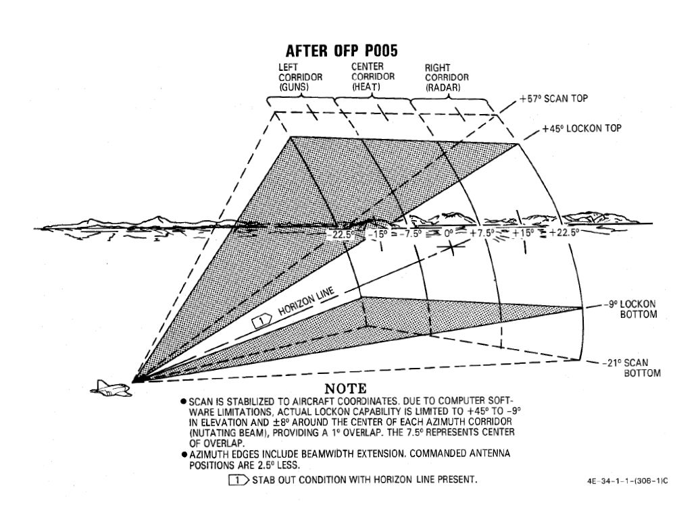

# Radar system

A continuation of the F-4C's -100 and the 4D's 109, the Westinghouse AN/APQ-120 Fire Control Radar
is a solid state pulse radar providing the F-4E with air to air intercept functionality, air to
ground mapping, ground target reference provision to the LABS and WRCS bombing systems, as well as
radar beacon capability. The APQ-120 also functions as the display system for TISEO and TV guided
weapon imagery, and is integrated with the APX-80 interrogation system.

The primary conversion from the APQ-109 to APQ-120 included a reduction in the number of field
replaceable units in the nose, as well as the reduction in their size; whereas the -109 had been a
hybrid in its movement towards solid state hardware (primarily in the low voltage processing
sections), the 120 was a fully solid-state system. While this update reduced the space overhead and
weight for the system, the modification of the F-4 nose to include the [M61
cannon](../stores/guns.md#internal-cannon-m61a1-vulcan) required a reduction in antenna size,
causing a marginal decrease in overall detection range. However, when taken with the increase in
system reliability and reduced maintenance, the tradeoff was considered acceptable.

Starting with production of the F-4E block 60, and retrofitted to selected earlier block aircraft,
was the addition of the Digital Scan Converter Group display. The inclusion of DSCG increased the
overall ease of handling the APQ-120 by adding additional information on the display directly,
including current radar range setting and the calculated range rate value against the current
acquired target. Further, clarity of the display in all lighting conditions was improved by
rendering the radar reference grids directly as part of the displayed image, rather than the
previously used markings on the DVST glass. In addition, DSCG provided the ability of the two crew
members to utilize the displays independently; previously, the WSO had control over which mode both
the DVST and front seat repeater display would show. With DSCG, the pilot could utilize TISEO or TV
air to ground weapons while the WSO maintained a scan pattern or found a ground reference point and
inserted it into the WRCS.

## Radar set Control Panel

### Power

| Name | Description |
|------|-------------|
| OFF  | Powers radar off. |
| TEST | Applies voltage to control monitor power and provides [BIT-test](../../../procedures/bit_tests/overview.md) functions 1 through 6. |
| STBY | Power applied to radar, remains in a non-transmitting standby state. |
| OPR  | System is fully operational. |
| EMER | Overrides the time delay, pressure, and temperature restrictions to allow radar operation. |

Initial powering of the APQ-120 starts by placing the Radar Power Knob into TEST or STBY (Standby).
The warmup cycle requires 3 minutes from selecting either setting, and confirmation of this process
is shown via the Control Monitor Meter on the Monitor Panel; after 30 seconds from cycling power,
the gauge will display a value of roughly 250vdc; from the point the needle shows power at this
nominal value, the warmup procedure will be 2.5 minutes.

After 3 minutes, the radar can safely be placed into OPR (Operate) for employment of the radar, BIT
testing can be performed in TEST mode, or the radar can be left in STBY for the safety of crew and
others on the ground.

In the event of an emergency situation requiring immediate operation of the radar, EMER can be
selected; this performs a bypass of the 2.5 minute post-power warmup cycle. A red flag will display
behind the power knob confirming usage of the EMER mode, which requires servicing to clear up.

### Range

Range control of the APQ-120 is mode dependent, and in some circumstances restrict range or
functionality. Both scopes - the DSCG and the pilot's repeater window, both share indications (as
well as on-screen display) of 5, 10, 25, 50, 100, and 200 mile ranges.

Values up to 50 miles are
indicated as air intercept (AI), which provide lock-on capability against airborne targets; 100 and
200 mile ranges can be used with the Spotlight function, allowing a target at longer distances to be
manually followed with the radar until they are at a range capable of a lock. Air to ground
functionality is available in the PPI modes higher than 5 miles.

Selecting any range will illuminate the respective indicator
[range lamp](../cockpit/pilot/dcsg_controls.md#range-lights), as well as display the numerical value
on the DSCG display in the upper left.

### Polarization Control

| Selection |  Description |
|-------|-------------|
| LIN   | RF energy is lineally polarized in a vertical orientation. [AIM-7](../../../stores/air_to_air/aim_7.md) default mode. |
| CIR 1 | RF energy is rotated clockwise from the vertical plane. [AIM-7](../../../stores/air_to_air/aim_7.md) can be fired. |
| CIR 2 | RF energy is rotated counterclockwise from the vertical plane. [AIM-7](../../../stores/air_to_air/aim_7.md) cannot be fired. |

The WSO is afforded direct control of the APQ-120's waveform polarization at the antenna feed-horn
by using the Polar Switch. The default setting is LIN (Linear); in this setting, the waveform is
transmitted in a linear alignment to the feed-horn, oriented vertically. This is also the default
setting for employment of the [AIM-7 Sparrow](../stores/air_to_air/aim_7.md).

Also available are a pair of Circular polarization options, CIR 1 (clockwise) and CIR 2 (
counter-clockwise). Circular polarization is provided as it is less susceptible to
precipitation-related clutter, and can allow detection or tracking of a target in such weather when
a return is otherwise found to be marginal.

> 💡 Only clockwise polarization (CIR 1) and Linear polarization are compatible with the Sparrow's
> receiving antenna, and thus can only be fired in said modes. A Sparrow launched with the APQ-120
> in CIR 2 will not track.

### Maneuver Switch

The maneuver switch is used to specify the tracking response to target accelerations.

| Selection| Description                                                                        |
|----------|------------------------------------------------------------------------------------|
| LOW G    | Default position. Limits tracking accelerations to reduce response to countermeasures and clutter.|
| HI G     | Allows track loop to respond with any acceleration. |

HI G is forced when [Computer Automatic Acquisition](#computer-automatic-acquisition-mode-caa) is used.

### Scan Switch

The scan switch specifies the number of elevation bars used in search.

| Selection | Description | Total Vertical Coverage (degrees) |
|-----------|-------------|------------------------|
| 1 Bar | Scans along radar plane. | 6.7 (3.7 without nutation) |
| 2 Bar | Scan alternates between 1.875 degrees above/below the radar plane. | 10.45 |

1 Bar Scan is automatically commanded when MAP is selected on the
[Radar Mode Knob](#radar-modes-mode). For BST, AIR-GND and CAGE conditions scan switch position
is not relevant.

### Aspect

The aspect knob is used to provide the [Sparrow](../stores/air_to_air/aim_7.md) with a simulated
doppler signal when **no lock** is achieved to aid with sparrow speed gate lockon when sparrow is
to be fired in boresight. When the radar is tracking, the calculated (or manual if in manual) closure
is
used to set a narrow sparrow speed gate +/- 150 kts around the closure for the sparrow to
search when launched.

The aspect knob also controls the display mode of the DSCG numeric output while the radar is is in
track.

See below the display and speed get settings for the various positions of the aspect knob, with Vc
indicating selected closure velocity for the speed gate, where TAS is the aircraft true airspeed.

| Selection | DSCG Display   | Sparrow Speed Gate Setting (Vc) |
|-----------|----------------|---------------------------------|
|  WIDE     |Closure Velocity| Entire Spectrum                 |
|  NOSE     |Altitude        | TAS + 450 +/- 150 kts           |
|  FWD      |Aspect          | TAS + 240 +/- 150 kts           |
|  AFT      |Closure Velocity| TAS - 240 +/- 150 kts           |
|  TAIL     |Heading         | 0 +/- 150 kts                   |

Closure Velocity - Displayed in knots with positive values indicating closing and negative values
indicating opening.

Altitude - Displayed in hundreds of feet (with the last digit always zero) for example 20,000 MSL
would be displayed as 200.

Aspect - Angle off the tail of the target aircraft to the shooter (ownship), this means if the
target is flying directly away is 0 degrees and directly towards is 180 degrees. Left is shown by
negative values and right by positive values.

Heading - Heading is displayed in degrees from 000 - 360 with the last digit always zero.

### Receiver Gain (RCVR GAIN)

The stacked RCVR GAIN potentiometers FINE on top and COARSE on the bottom, provide the ability to
adjust the receiver gain for increased return visual definition, improving clarity and discernment
of the scopes during search routines. Further, when using MAP PPI, BEACON PPI, and AIR-GRD, their
command of the STC (Sensitivity Time Control) circuit controls how the receiver's gain applies as a
matter of range, which drives image intensity in the lower part of the scope. Gain knobs do not have
an effect on the radar picture when a lock-on exists.

### Track Switch

The track switch determines whether the APQ-120 will attempt a lock-on against a selected track
automatically, or through manual means. In the default center AUTO position, full-action on the
antenna hand controller initiates an automatic lock-on attempt. In the MANUAL (up) position, the WSO
initiates a manual tracking attempt upon engaging full-action, which requires the range strobe to be
placed just inside of the bracketed contact and an adjustment of the Manual Vc knob to match
closure. The third (down) position, AOJ OUT, overrides the radar's acquisition on jamming function.
If jamming should occur during an attempt that precludes acquisition, the jamming source can be used
as a lock-on target for an angle track. Switching over to AOJ OUT returns the radar to a search
configuration.

### Display Knob

The DSCG can display returns as both as a B-Sweep or as a Plan Position Indicator (PPI) display.
Proper selection of the display for the situation is required for correct fire control and WRCS
target injection functionality, and the WIDE and NAR selection dictates the relative azimuth sweep
of the radar itself- 120 degrees in full width, or a 45 degree wide slice. The display can also be
directed to provide course guidance for a Vis Ident (VI) intercept profile against a locked target.

### Air to Air: B-Sweep- B WIDE, B NAR, and VI (Vis-Ident)

The B-Sweep modes are used for air-to-air detection, tracking, and engagement. The B-Sweep
presentation shows range as a function of height on the DSCG display (higher is further), and
projects the extents of the radar sweep field out to the sides of the display; in B WIDE, the width
of the display is 120 degrees across, thus 30 degrees across per column, whereas in B NAR the
display is 45 degrees in total width, and each column is 11.25 degrees wide. In this fashion, the
whole of the display is used, with the relative cone shape of the radar sweep being distorted to a
greater degree as range closes.

The Antenna Hand Control is able to drive the antenna's relative position for the sweep in both
modes; in B WIDE, this is achieved by activating Half Action on the trigger, then slewing the Hand
Control left or right. In B NAR, Half Action is not required - simply moving the Hand Control left
or right will shift the antenna in relative azimuth.

VI (Vis-Ident) is selectable with a radar lock-on against an airborne target achieved. By selecting
this mode, the radar provides pure pursuit steering to the locked target, via an aim dot in a
similar presentation to centering for an AIM-7 shot. To fly pure pursuit on the target, the dot
should be centered in the steering error circle. When the range to target is less than 1000', the
break X anti-collision warning will appear over the display.

### Air to Ground: PPI WIDE and PPI NAR

In the Plan Position Indicator modes, the described cone of the radar sweep is not projected out to
the sides of the display; in this way, the radar presentation is less distorted relative to the
ground, although closer ranges require adjustment of the radar range setting to provide visibility
on the display.

In PPI WIDE, the display is a 120 degree wedge presentation.

PPI NAR's display is 45 degrees wide, which can be swept using the Antenna Hand Control. The display
is drift compensated, and will shift as required to maintain relative position. The PPI NAR setting
provides a range cursor for ground mapping or bombing functions. While the range cursor is shown,
there is no target lock capability. Also inhibited is receiver gain function, as well as the 5 mile
range; the lowest available range option for PPI NAR is 10 miles.

### Manual Vc (MAN Vc)

The MAN Vc switch is used when manual mode tracking attempts are made to apply a range rate value
against the track for range estimating purposes. The knob is marked 2 to 0 to 9, in a clockwise
orientation, with values of 0 heading counter-clockwise signifying an opening target (gaining range
against the fighter), whereas values from 0 to 9 heading clockwise are for closing targets. The knob
is used in manual track mode by bracketing the desired track with the acquisition cursor, selecting
half-action to show the range strobe, adjusting the position of the cursor to place the strobe just
below the target, applying a Manual Vc rate that keeps the range strobe moving at the same rate as
the target, and then selecting full-action.

The numbers are multiplied by 100 m/s while closure means closing in to the F-4 and opening means
the target is flying away from the F-4.

### Pulse Switch

Control of pulse width (duration) and frequency of the cycle (PRF) is managed using the Pulse
Switch. The switch provides three distinct settings, each useful under specific circumstances, and
in some instances automatically overridden by the radar mode employed.

Normal operation is performed in AUTO mode. Auto mode defaults to the LONG mode function, with wide
pulse width and low PRF. In the event a track is attained, power, pulse width and PRF are moderated
by the PLMS (Power Level Mode Switch) system for best lock stability; this function is only
available in AUTO mode.

In LONG pulse mode PRF is low and pulse width is wide, in general increasing detection range, with a
reduction in resolution and target discernment.

In SHORT pulse mode, a short pulse width is applied with a high, jittered PRF is applied, to
increase detection rate at close range and under maneuver.

In AIR-GRD mode, the pulse switch is disabled automatically and SHORT pulse is commanded.

## Radar Modes (MODE)

Specific radar operating modes are dependent on the radar mode knob but also several other
conditions and switches. For a comprehensive description of the radar operation see the
[Radar Operation (General)](#radar-operation-general),
[Radar Operation (Air-To-Air)](#radar-operation-air-to-air), [Radar Operation (Air-To-Ground)](#radar-operation-air-to-ground)

This section will briefly cover each of the positions of the radar mode knob and link to the
relevant sections below.

### BST (Boresight) Position

BST forces the radar into the [boresight](#boresight-and-cage-condition) state. This is used when
the target is spotted visually or a [Sparrow](#todo) is to be fired without radar tracking.

### RDR (Radar) Position

RDR position puts the radar in [Automatic Search](#automatic-search).

## MAP Position

MAP position is identical to the RDR position puts the radar in
[Automatic Search](#automatic-search), with the exception that nutation is disabled and the 2 bar
search pattern is not available.

### AIR GRD (Air to Ground) Position

AIR-GRD position is similar to the boresight position with the following exceptions:

- Angle Track is Disabled while Tracking.
- Antenna is Always Fixed to the boresight with drift stabilization.

### BEACON Position

BEACON may be used with any Display Knob position other than VI, as desired. BEACON does not display
radar echos and instead listens for transponder responses from specific beacon equipement.

### TV Position

The TV Radar Mode setting is not used on DSCG aircraft; this is superseded by the TV display option
on the DSCG panel itself, and the TV display option in the pilot's cockpit.

> 💡 [AIM-7](../stores/air_to_air/aim_7.md) missiles detune and cannot be re-tuned with the Radar
> Mode Knob in TV.

### Skin Track Lamp (SKIN TRK)

The Skin Track Lamp illuminates when an automatically achieved lock-on is established and held by
the radar. This coincides with the T symbol being lit on the DSCG panel. A manually tracked, AOJ, or
HOJ track condition will not illuminate this lamp (or the DSCG panel T).

## FCS Control Monitor Panel

The Control Monitor Panel's primary purpose is to access the built-in diagnostics of the APQ-120.
Additionally, the panel mounts auxiliary controls for the system - the Vc Switch and Stab Switch,
and the Temp monitoring lamp.

### Coords Light

This lamp is not used with the APQ-120.

### Temp Lamp

The TEMP Lamp provides a visual indication of an overheat situation in the APQ-120 avionics bays.
Should the lamp illuminate, the radar must be powered off immediately to preclude damaging the
equipment. Should circumstances require the radar be used during a temperature warning, the lamp
should be monitored for continued illumination, and the radar shut off as soon as possible.

### Meter Selector Knob

A sixteen-position rotary knob used in conjunction with the Meter Switch to test various voltages,
currents, and signals generated by the internals of the radar, independently and in conjunction with
the Built-In-Test system. Each position is dual purpose, noted with two sets of values; when the
Meter Switch is in the VOLT position, the inner rim of the knob is active, delivering the specified
voltage of the selected position. In the SIGNALS position of the Meter Switch, the outer current or
signal value is tested.

### Monitor Meter

The Monitor Meter displays voltages, current, and signals relative to the current settings of the
Meter Selector knob in conjunction with the Meter Switch, or the current Built-In Test setting.

Voltages are confirmed beginning with the -250 position of the Selector knob and the Meter Switch in
VOLT, and will indicate in the "1" region of the gauge approximately thirty seconds after radar
power-on, signifying correct voltage delivery. After this power-up, the monitor meter will indicate
in the "1" region for nominal function if the voltages delivered are correct. The +35 selection is
an exception to this rule, as the value for correct function is 2.0 or greater.

In SIGNALS mode, the RX1-RX4 crystal current are functioning correctly with a return in the XTAL
region.

The EX1 and 2 test electrical frequency control crysals, and are also nominal when XTAL is returned.

The magnetotron, tested in MAG, long pulse operation is confirmed with a return of 1.4 to 1.8, and
short pulse operation is correct with a value of 0.9 to 1.15.

KLY, which tests the CW transmitter, should find a value of 0.25 to 1.25 when radiating correctly.

TP 1 tests the temperature and pressure interlocks, and indicates 1 when the interlocks are closed
and functioning.

TP 2 confirms waveguide pressure, and a value of 1 is correct.

In LOB, the meter needle will travel roughly between 1.5 to 2.8 as a function of antenna nutation.  
Lastly, the LIN and CIR selectors confirm proper linear and circular pulse performance; they only
register a value of 1 for a transmission of vertical or clockwise-rotating polarity energy. That is,
they do not return a value in CIR pulse (counter-clockwise) mode.

### APQ-120 Built-In Test Knob

Confirmation of proper system performance is performed using the various options on the Control
Monitor Panel; specific test modes are defined using the Test Knob.

### Meter Switch

Tied to the Meter Selector knob, the two position switch defines which value of the Meter Selector
Knob is being tested - VOLT for the inner ring voltage values, SIGNALS for the outer ring current
and signal values.

### Vc Switch

With selections of 900 and 2700, the switch is used to scale the Vc gap as displayed in F-4Es with
the DVST installed, with the newer DSCG installed, the switch must remain in the 2700 position at
all times for proper APQ-120 system performance and monitoring.

### Stab Switch

The STAB switch controls the antenna pitch and roll stabilization modes. The default NOR (normal)
position maintains stabilization in both channels, and INS system drift compensation is further
applied in specific modes (AIR-GND). In STAB OUT the stabilization of pitch, roll, and INS drift is
removed from the radar antenna. DRIFT OUT maintains pitch and roll stabilization, while removing the
INS drift compensation in modes which use it.

## Digital Scan Converter Group

The Digital Scan Converter Group (DSCG) provides an integrated display system of the F-4E's radar
and electro-optical systems. The system is composed of the front and rear seat scopes, and is driven
by the Indicator Control Unit- which performs conversion of radar and video signals, along with the
application of information and fire control cueing symbology.

Because the ICU is a signal interpreter, and thus the DSCG panel the output of its work, the
overwhelming number of function controls on the DSCG panel are relative to controlling the display -
more aptly, what is being displayed, and its relative clarity for the WSO and pilot. In all
instances of display visibility control on the DSCG, clockwise increases the setting,
counter-clockwise reduces the setting.

### Grid Knob

The Grid knob controls brightness of the display field grid.

### HOJ Light (H)

The HOJ light illuminates to provide indication that the radar has transitioned to an angle tracking
HOJ operation, using only memorized range and range rate information if a jamming condition is
detected.

### Scale

The Scale knob controls brightness of the angle and elevation scales surrounding the DSCG display
field.

### Track Light (T)

The Track light illuminates to confirm an angle and range-based lock-on against a target. Same as
the SKIN TRK light.

### Contrast (CONTR)

The Contrast knob controls relative DSCG display contrast.

### Range (RNG)

The Range knob controls brightness of the range cursor in MAP, PPI, or Beacon mode.

### Brightness (BRT)

The Brightness knob controls the brightness of the overall DSCG display.

### Offset (OFS)

The Offset knob controls brightness of the offset cursor line in MAP, PPI, or Beacon mode.

### DSCG Mode Knob

The DSCG Mode knob is used to select the current mode of the display.

- OFF removes all power from the display, ceasing all DSCG functionality.

- STBY (Standby) places the DSCG in its warmup mode; no display occurs during this process.

- DSCG TEST displays a dest field to confirm proper display function. The DSCG display field shows a
  search display with eight shades of grey to confirm proper operation and contrast. Prior to entry
  of this mode for testing, Range 10 should be selected for correct sizing of the shaded fields.

- RDR BIT is a built-in test mode that functions in conjunction with the radar for calibration of
  the signals provided from the radar with the DSCG's ICU.

- RDR is the operational mode for use with the APQ-120.

- TV is the display mode used for EO weapons (Maverick/Pave Spike) and TISEO.

## Antenna Hand Controller

The Antenna Hand Controller is a joystick found only in the WSO cockpit on the right console; the
joystick integrates with the radar to perform range (fore and aft) and azimuth (left and right)
positional control of the acquisition symbol on the radar display in the air-to-air modes, as well
as seeker/EO sensor direction with Maverick and Pave Spike. Additionally, the joystick includes the
Antenna Elevation Control thumbwheel, which controls the elevation angle of the antenna, displayed
via the EL strobe on the DSCG display; this elevation scan is limited in both up and down movement
to 60 degrees.

In the index finger position of the Antenna Hand Controller is the Action Switch; a two-position
switch designated half-action in the first detent, and full-action with full engagement. In air-to-
air modes, half-action initiates visibility of the range strobe, allowing for proper range alignment
with a target return for automatic lock-on, or selection of MAN Vc rates required for a manual lock.
With proper bracketing and range strobe adjustment, full-action attempts the automatic lock-on, or
initiates manual angle tracking of the intended target.

The interaction of half- and full-action for the [AGM-65
Maverick](../stores/air_to_ground/missiles/maverick.md) is detailed in the section on AGM
employment.

## Range VISIDENT Indicator

The Range Indicator is used for close range VID intercept profiles, providing range information out
to two miles and range rate information from inside of 9000'. The information is confirmed as
radar-accurate once the range indicator jumps to 9. The gauge functions in the VI, B NAR, and B WIDE
display modes; the indicator does not function in air to ground modes.

## Air to Air Button

The Air to Air button is a button and a light with the primary function of confirming entry into
CAGE mode. When the crew desires to disengage CAGE mode, the WSO can press the light (which also
functions as a button) to exit CAGE mode and revert to the current selected settings from the Radar
Control Set.

## Radar Operation (General)

### Magnetron and Klystron

The magnetron and klystron are the two methods for producing radio frequency energy in the APQ-120
radar set. Both the magnetron and klystron radiation is fed through the antenna and emitted from the
feedhorn. 

#### Magnetron

The magnetron is the main radio frequency emitter for the radar. It produces pulsed energy which is
used to detect and track targets.

Magnetron emission is only present when 

The magnetron is protected by a wave guide pressure switch and a temperature interlock. If either of
these interlocks are open (possibly because of damage or malfunction) the [Radar Power Knob](#power)
can be moved into EMER to return operation, however operation of the magnetron without adequate
pressure or cooling, may damage the magnetron and can burn the feedhorn.

The magnetron is not powered until 3 minutes after radar turn on. This can be overriden by moving the
[Radar Power Knob](#power) into EMER, however operating the magnetron without sufficient warm up may
result in incorrect pulse width and timing and/or degraded pulse power.

#### Klystron

The klystron produces continous wave radio frequency energy, which is used to tune and guide the sparrows.

The klystron is powered when

The klystron is protected by two temperature switches, a pressure switch and a surge current switch.
If any of these interlocks (with the exception of the surge current switch) are open the
[Radar Power Knob](#power) can be moved into EMER to return operation, however damage to the
klystron and feedhorn may result.

The klystron is not powered until 100 seconds after radar turn on. This can be overriden by moving
the [Radar Power Knob](#power) into EMER, however operating the klystron without sufficient warm up
may result in degraded power.

### Feedhorn Nutation

Feedhorn nutation is required for automatic tracking. The feed horn nutates to rotate the radiated
energy around the antenna axis. This modulates the radar echos. Where the echo is strongest the the
antenna will steer if tracking, this drives the antenna back onto a tracked target.

A side-effect of this nutation is increasing the beamwidth, from 3.7 degrees (half power) to 6.7
degrees (half power) while reducing the average intensity of the beam.

Below describes the nutation settings for the action switch.

| Mode Knob | Range Knob | Action Switch | Nutation |
|-----------|------------|---------------|----------|
| RDR, BST, AIR-GND | ALL | Release | Yes |
| MAP | ALL | Release | No |
| MAP-PPI      | ALL | Half or Full Action | No |
| RDR, MAP-B, BST, AIR-GND | AI | Half or Full Action | Yes |
|              | Not AI | Half Action | Yes |
|              |    | Full Action | No |

### Antenna Stabilization

### Pulse Setting

The pulse setting determines several characteristics of the radar set. These include the length of
the transmitted pulse, which amplifier is used to amplify the signals, the frequency at which the
pulses are emitted (pulse repetition frequency).

The [Pulse Switch](#pulse-switch) controls the pulse setting. The LONG and SHORT settings force the
pulse setting into that mode. With the exception of AIR-GND, and Automatic Acquisition which force
the mode into the SHORT setting.

| Mode | Amplifier | Pulse Repetition Frequency (PRF) Setting (Hz) | Pulse Length (microseconds) |
|------|----------|-----------------------------------------------|-----------------------------|
| LONG | Narrow Band |  | 370 | 2.0 |
| SHORT| Back Bias | 1060| 0.4 |

The AUTO setting enables the power-level mode switching (PLMS) described below.

#### Power Level Mode Switching

Power Level Mode Switching automatically selects the LONG or SHORT, and Narrow Band or Back Bias,
amplifiers depending on several conditions such as target range, echo strength, noise signal.

### Gain Control

The amplfication of the signals that enter the receiver is called the gain. The gain setting is
important to both search and tracking operations.

#### Main Gain Control

The gain can be altered manually. This changes how returns are displayed.
Higher gain settings amplify all echos but can result in noise and saturation resulting in degradged
image. Lower gain settings will result in better target contrast, however weaker returns will not be
visible, this can degrade detection range. When radar locks on the gain control is switched to the
[Automatic Gain Control Circuit](#automatic-gain-control) and manual gain control no longer is used.

Getting the correct gain is a balance and comes with experience, as a general rule of thumb for
search the gain should be increased until a small amount of noise (random specks) begins to show.

Along with receiever gain the display also has image levelling, after adjusting the gain it may take
a few scans for the image to adjust the level correctly.

#### Automatic Gain Control

The automatic gain control takes control of the gain setting once the radar is in track. The gain
is adjusted automatically using the target within the range tracking gate to provide a consistant
target signal for tracking.

### Sensitivity Time Control (STC)

The strength of a radar echo falls off with 1/r^4 where r is the range. This means on a normal
display the brightness of the radar returns will get dimmer with distance. For ground mapping the
APQ-120 counteracts this effect. With the [Radar Mode Knob](#radar-modes-mode) in MAP and the
[Display Knob](#display-knob) in a PPI mode. Sensitivity Time Control is enabled. This exponentially
increases the receiver gain with range to counteract the echo power fall off with range. This
provides an approximately even brightness with increasing range.

## Radar Operation (Air-To-Air)

Radar operation air-to-air includes RDR-B and MAP-B modes along with the BST mode. RDR-B and MAP-B
can be used with automatic search and BST mode can be used as a close range mode to cue a target on
the boresight.

### Automatic Search

During automatic search, the antenna moves back and forth in the radar plane. The limits of this
search are determined by the [Display Knob](#display-knob). Search is normally 120 degrees wide with
the display knob in WIDE positions, in NAR positions the search is limited to 45 degrees wide. Only
Display Knob positions with B are usuable with Air-To-Air operations.

The [Radar Mode Knob](#radar-modes-mode) knob is used to select automatic search by selecting either
RDR or MAP. In RDR the number of bars can be selected by the [Scan Switch](#scan-switch). In MAP
only 1 bar is used regardless of scan switch. Feed horn nutation is used with RDR but not MAP
leading to an estimated beamwidth of approximately 6.7 degrees in RDR and 3.7 degrees in MAP.

Selecting BST or AIR-GND on the Radar Mode Knob antenna scan is boresighted along the radar boresight
line.

Below shows the usual symbology present in Automatic Search and Boresight Modes.

| Item | Name | Description |
|------|------|-------------|
| a | Range Display | Shows Current Selected or Forced Range |
| b | Radar Cursor | The radar cursor is used to select targets and displays the current selected range and azimuth. It is moved by the antenna hand control.
| c | Antenna Elevation | Shows Antenna elevation (in degrees) relative to the radar plane, or aircraft if the [Stab Switch](#stab-switch) is in OUT. This can be moved with the antenna hand control elevation wheel. |
| d | Radar Grid | Left and Right Vertical Lines show 30 degrees left and 30 degrees right. This measurement is relative to the radar plane with the [Stab Switch](#stab-switch) in NOR or DRIFT OUT and relative to the aircraft with the [Stab Switch](#stab-switch) in OUT. Each horizontal line marks a scale where the gaps are 1/5 of the current range setting of the display.
| e | Horizon Line | Shows the Horizon Line, Only present with [Stab Switch](#stab-switch) in NOR or DRIFT OUT |

### Acquisition

Acquisition can be used with any radar mode which uses B-Scope and is used to achieve tracking condition.

With the [Radar Mode Knob](#radar-modes-mode) in RDR or MAP, Half Action can held
on the antenna hand control trigger. This begins acquisition, in RDR or MAP the antenna azimuth will
follow the acquisition symbol. In all modes where acquisition can be used the range of the
acquisition symbol will set the desired range for lock-on.

| Item | Name | Description |
|------|------|-------------|
| a    | B-Sweep | The B-Sweep displays the current radar echos along the azimuth of the antenna, these are displayed in both acquisition and track. |
| c    | Acquisition Symbol | Like the Radar Cursor the acquisition symbol shows the current selected azimuth and range. It is moved with the antenna hand control. It is also displayed in track to indicate target range and azimuth. |
| c    | Target Echo | Target Return Displayed Along the Azimuth

### Track

Automatic tracking can be commanded by first entering acquisition and then once the target has been
bracketed by the acquisition symbol Full Action can be depressed. The radar will enter automatic track.

The type of track entered depends on the selected mode. There are two types of tracking circuits
available, angle tracking and range tracking. These will both be described below.

| Item | Name | Description |
|------|------|-------------|
| a    | Display Readout | Display Readout depends on the position of the [Aspect Switch](#aspect) |
| b    | Allowable Steering Error | Describes Max off Angle Launch Envelope, See [Allowable Steering Error](#allowable-steering-error-ase-circle) |
| c and e  | Range Strobes | Indicates Launch Envelope, See [Range Strobes](#range-strobes) Description |
| d    | Aim Dot | Provides pilot steering, See [Aim Dot](#aim-dot) |

In the WSO Cockpit there is an engraved T which illuminates if a range track condition present.

#### Angle Track

Angle tracking circuit steers the antenna to keep the target centred. It does by making use of
feedhorn nutation (conical scan). The antenna steers towards the direction of highest amplitiude in
the nutation scan pattern. As a result angle tracking cannot be achieved without nutation (MAP-B
begins nutation when using acquisition).

Angle Tracking has two settings set by the [Maneuver Switch](#maneuver-switch), HI and LOW. These set
limits on the acceleration in the angle tracking circuits.

Antenna steering has several important functions:

- Tracking Target Location in elevation and azimuth
- Providing head aiming angles to the sparrow for sparrow lockon.
- Illuminating the target with continous wave radio frequency energy for sparrow guidance.

#### Range Track

The radar uses a range gate to select a target in range. The uses only radar returns within the
range gate for its circuits. This helps eliminate clutter and other targets, and allows angle
tracking circuits to accurately track the target of interest without erroneous signals.

In range track the range gate uses the radar echos to automatically correct any error between the
range gate and the target echo. This causes the range gate to move, the rate at which the range gate
moves is the closure velocity and displayed on the screen, this is also used to supply the sparrow
with a closure velocity to set the sparrow speed gate for target tracking.

Range track can operate in memory mode. When in memory mode the range gate will continue to move
down at the last calculated closure velocity. When this occurs the SKIN TRK light and T light on the
DSCG will go out, the range rate digits will begin to flash at 4 Hz. If memory mode was entered
because the target was lost the system will drop lock if the target does not reapear within 5 seconds.

Memory Mode will be Entered under several conditions:

- Manual Search is Selected ([Track Switch](#track-switch))
- Target is lost.
- Jamming condition is detected.

#### Home On Jam

The back bias amplifier in the radar produces a noise signal based on the overall strength of the
echos. Once this noice signal exceeds some threshold the system will consider it a jamming condition
and enter home on jam. The range track circuit goes into memory mode, the angle track circuit
continues to operate and track the jamming target in elevation and azimuth.

The Home On Jam condition is also indicated by the engraved H on the DSCG and the last zero of the
closure velocity is replaced by a H along with the closure rate flashing.

### Spotlight

In the 100 and 200 mile ranges, a procedure known as Spotlight can be used to maintain radar
monitoring of a target manually. Spotlighting entails placing the acquisition cursor over the
desired return, then selecting and holding the full action trigger position of the Antenna Hand
Controller. Doing so, the antenna will nutate and revert to the chosen Polar switch selection to
increase target definition, but without attempting the automatic lock-on. The target can be
maintained in a well-observable state by holding full action and following the target return with
the Antenna Hand Controller until it reaches a range that lock-on can be achieved (with the
applicable change in range setting; the radar cannot attempt a lock at an incompatible range
setting).

### Intercept Computations

The LRU-1 intercept computer can calculate firing envelopes for the
[Sparrow](../stores/air_to_air/aim_7.md) and [Sidewinder](../stores/air_to_air/aim_9.md) Missiles.

#### Range Strobes

The DSCG can display two range strobes at any given time representing the missile envelope. There
are three possible strobe types.

| Range Indication | Description |
|------------------|-------------|
| Rmax             | Maximum range of the missile provided the target continues flying on current heading and course. |
| Rmax2 | Maximum range of the missile if the target performs the shortest high g turn to tail aspect. |
| Rmin | Minimum range capability of the missile. |

| Missile Selected | Strobes Displayed |
|------------------|-------------------|
| Sparrow          | Rmax and Rmax2    |
| Sidewinder       | Rmax and Rmin     |

All ranges are calculated for valid pilot pickle not weapon away. This means if the missile envelope
is met on the display then pickle can be pressed and envelope will be valid for missile launch.

#### Allowable Steering Error (ASE) Circle

The allowable steering error indicates the maximum lead or lag at which the missile can be launched
and still retaining a high probability of hit. The circle diameter gradually increases in size once
Rmax is reached and gradually begins decreasing in size as the target range approaches Rmin.

With the Sparrow selected the max ASE Circle size is 25 degrees for an AIM-7E and 35 degrees for an AIM-7F.

With the Sidewinder selected the ASE Circle size is fixed at 1.2 degrees with the Sidewinder caged.
With the sidewinder un-caged the ASE Circle dynamically changes size as described above, with the
max diameter representing 25 degrees.

#### Aim Dot

The aim dot provides steering commands to the pilot. There are three different types:

1. Collision Steering, this minimizes time to intercept by putting the fighter on an intercept course.
2. Transition steering. This begins 2 nmi outside Rmax and steers the aircraft towards the next
steering type.
3. Lead pursuit, inside Rmax lead pursuit minimizes the missile's post-launch maneuvers.

#### Shoot/In Range Lights

Shoot Lights illuminate provided the following conditions are met:

- Aim Dot is Inside the ASE Circle
- Target is within Rmax and Rmin

If sparrows are selected then shoot lights are also inhibited when the target aspect is
90 degrees +/- 9 degrees (left or right) and the target is lower than 5 degrees above the horizon.
This prevents shooting a sparrow into the main lobe clutter.

#### Hold Altitude Light

Hold Altitude Light illuminates provided the following conditions are met:

- Range is greater than the computed snap-up range.
- Altitude is greater than 32,000 ft.
- The target is more than 8000 feet above the fighter.

When the light is illuminated the azimuth error in the aim dot should be corrected only when the
light goes out the fighter should snap up to center the aim dot.

#### Break X

In all modes (except VI) when the target is lower in range than the calculated Rmin the Break X
symbol will be displayed to indicate minimum range condition.

In Visual Intercept (VI) break X is displayed when range is less than 1000 ft.

When break X is displayed ASE Circle is also removed.

### Firing Interlocks

There are several interlocks to prevent firing missiles in unfavourable conditions.

For the Sidewinder the only interlock prevents the missile being fired with the flaps in the down position.

For the Sparrow there are several conditions:

- The aim dot must be within the ASE Circle
- The in range and shoot lights must be on
- There must be no break X condition
- The selected mode must not be Visual Intercept

The interlocks are overriden automatically with a HOJ condition or when the Sparrow is to be fired
in boresight mode. The interlocks can be overriden manually with the interlock switch.

### Boresight and Cage Condition

#### Boresight

Boresight can be entered either by selected [Mode Knob](#radar-modes-mode) to BST or by depressing
the cage switch on the throttle. The latter enters a cage condition which is very similar to
boresight entered through BST with the exception that the cage condition limits the range to 5 nmi
and forces the manuever setting into the HI position.

When in boresight the antenna is fixed along the radar boresight line and the radar returns are
displayed on the scope as in an acquisition mode. Acquisition can be commanded with half action as
in automatic search to acquire and then full action can be used to initiate track, range and angle
tracking will begin as normal.

[Sparrows](../stores/air_to_air/aim_7.md) can be fired without tracking the target. Instead the pilot
must position the target in the on the gunsight pipper, the WSO can select and appropriate [aspect
setting](#aspect) then Sparrow can be fired.

#### Cage Condition

The cage condition is an close combat mode which can be entered at any time by depresing the cage
button on the pilot throttle. This by default puts the radar into boresight as described above.

When the cage condition is present the following changes happen:

- Air-To-Air light in the rear pit illuminates.
- Trigger control is transfered to the air-to-air weapons (including when ARM and TV are selected)
- Optical sight switches into the A/A mode.
- Computer Automatic Acquisition becomes available.

If a track condition exists before the cage button and the pinky switch is in radar or heat the
radar breaks track and returns to boresight. If pinky switch is in guns lock is not broken.

Cage mode can be exited from either cockpit, by placing Weapon Select knob into or out of the B
position. If the pilot leaves the Weapon Select knob in B, it does not preclude a later entry into
Cage mode.

#### Computer Automatic Acquisition Mode (CAA)

Once in Cage mode, the radar can be selected in to Computer Automatic Acquistion using the Nose Gear
Steering button. In CAA, the radar enters a vertical-oriented scan pattern 78 degrees in height by
15 degrees wide, the scan is 3 vertical bars wide. Actual radar lock capability within this scan
pattern is from +45 degrees above the horizon line to -9 degrees below the horizon line due to APQ
software limitation. In the event that the radar finds a suitable target within the scan volume, the
target will be locked. Should the flight crew find the locked target not be the one intended, the
Nose Gear Steering button can be pressed on either stick grip to return the radar back to the search
pattern.

In CAA mode, the radar’s search pattern can be shifted left, right, center utilizing the Pinky Switch.

| Pinky Selection | Scan Center    |
|-----------------|----------------|
| Guns            | Left (-15 deg) |
| Heat            | Center (0 deg) |
| Radar           | Right (+15 deg)|

To exit CAA, the pilot can select position B on the Weapon Select Knob, or the WSO can push the Air
to Air button. Should a radar lock be in place at the time of mode exit, it will be retained.

## Radar Operation (Air-To-Ground)

Radar operation air-to-ground includes the AIR-GRD mode and RDR-PPI and MAP-PPI. AIR-GRD mode is
used as a form of radar ranging for WRCS DT. RDR-PPI and MAP-PPI are used for WRCS offset bomb and
target find modes.

### Air-To-Ground Ranging

AIR-GRD mode is available when the [Mode Knob](#radar-modes-mode) is positioned in the AIR-GRD
position. AIR-GRD is used for air-to-ground ranging and is available only in AI ranges. In this mode
the antenna is fixed to the radar boresight while also being stabilized in drift, this drift correction
can be removed by setting Drift Out on the [Stab Switch](#stab-switch) in-case of INS malfunction.

AIR-GRD mode disables [Angle Track](#angle-track) operation and only uses
[Range Track](#range-track). Once locked on the main lobe clutter (ground radar echo) will be
tracked in range.

To use AIR-GRD 5 or 10 nmi range should be selected. Once the target has been identified the pilot
should make a 10 - 40 degree dive towards the target. The receiever gain should be reduced to
produce a clutter signal of approximately 1/2 nmi. This is done to prevent erroneous track of
sidelobes which would result in incorrect ranging information.

AIR-GRD Acquisition Procedure is as follows:

1. Adjust Receiver Gain to Reduce Clutter Signal to 1/2 nmi.
2. Position Range Strobe over Clutter Signal.
3. Press Action Switch to Half and Then Full Action. Release after ASE Circle is Visible.
4. Confirm Lockon.

> ⚠ The radar can track ground clutter from beyond 25,000 ft however the max value that can be fed
> into the WRCS is 25,000ft.

Sometimes false tracking can occur, this can be indicated by a rapid decrease in slant range
displayed on either the optical sight or radar.

To correct this condition the following actions can be taken:

1. Press Action Switch to Half Action, Release.
2. Begin Acquisition process again.

### Map Mode (PPI)

Radar Map mode PPI (position plan indicator) is a display which shows radar returns plotted with
their real position relative to the aircraft. The aircraft position is at the bottom center of the
display, lines parallel to the vertical axis of the display are parallel to the aircraft track.
Lines parallel to the horizontal axis of the display are offset from the track up to a maximum of
half the current display range.

PPI Mode can be accessed by changing the [Display Knob](#display-knob) into PPI-WIDE or PPI-NAR.
With the exception of 5 nmi which is always displayed in B-Scope interpretation.

The range cursor is an arc of constant range from the aircraft. The offset cursor is an offset
parallel to the drift of the aircraft, which can be offset left or right of the aircraft's current
track. Offset Cursor and Range Cursor can only be displayed in PPI modes.

Both Range and Offset Cursor are displayed if [Weapon Delivery Mode](#weapon-delivery-link?) is set
to TGT FIND or OFFSET, or [Radar Mode Knob](#radar-modes-mode) is set to BEACON. If this is not the
case then only Range Cursor is displayed at a fixed range which can be adjusted by the ground crew.

The [Along Track Control](#along-track-link?) is used to increase and decrease the current setting
for the range cursor. The
[Cross Track Control](#cross-track-link?) is used to move the offset cursor to the left and right of
the aircraft's track.

