# Air to Air Radar Operation

Radar operation for Air-To-Air includes the RDR-B and MAP-B modes, along with
the BST mode. RDR-B and MAP-B can be used with automatic search and BST mode can
be used as a close range mode to cue a target on the boresight.

## Automatic Search

During automatic search, the antenna moves back and forth in the radar plane.
The limits of this search are determined by the
[Display Knob](interface.md#display-knob). Search is normally 120 degrees wide
with the display knob in WIDE positions, and limited to 45 degrees in the NAR
position. Only Display Knob positions with B are usable in Air-To-Air
operations.

The [Radar Mode Knob](interface.md#radar-modes-mode) knob is used to select
automatic search by choosing either RDR or MAP. In RDR the number of bars can be
selected by the [Scan Switch](interface.md#scan-switch). In MAP only 1 bar is
used regardless of the switch. Feedhorn nutation is used with RDR but not MAP;
leading to an estimated beam-width of approximately 6.7 degrees in RDR and 3.7
degrees in MAP.

Selecting BST or AIR-GND on the Radar Mode Knob, the antenna scan is boresighted
along the radar boresight line.

Below shows the usual symbology present in Automatic Search and Boresight Modes.

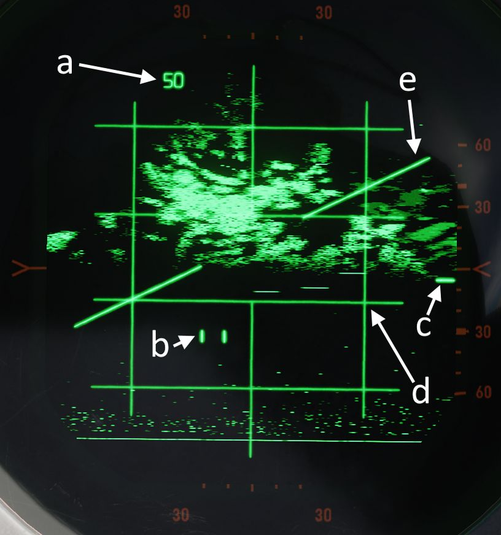

| Item | Name              | Description                                                                                                                                                                                                                                                                                                                                                                                        |
|------|-------------------|----------------------------------------------------------------------------------------------------------------------------------------------------------------------------------------------------------------------------------------------------------------------------------------------------------------------------------------------------------------------------------------------------|
| a    | Range Display     | Shows current selected or forced range                                                                                                                                                                                                                                                                                                                                                             |
| b    | Radar Cursor      | The radar cursor is used to select targets and displays the current selected range and azimuth. It is moved by the Antenna Hand Control.                                                                                                                                                                                                                                                           |
| c    | Antenna Elevation | Shows antenna elevation (in degrees) relative to the radar plane, or aircraft if the [Stab Switch](interface.md#stab-switch) is in OUT. This can be moved with the Antenna Hand Control elevation wheel.                                                                                                                                                                                           |
| d    | Radar Grid        | Left and right vertical lines show 30 degrees left and 30 degrees right. This measurement is relative to the radar plane with the [Stab Switch](interface.md#stab-switch) in NOR or DRIFT OUT and relative to the aircraft with the [Stab Switch](interface.md#stab-switch) in OUT. Each horizontal line marks a scale where the gaps are \\( 1/5 \\) of the current range setting of the display. |
| e    | Horizon Line      | Shows the horizon line, only present with [Stab Switch](interface.md#stab-switch) in NOR or DRIFT OUT                                                                                                                                                                                                                                                                                              |

## Acquisition

Acquisition can be used with any radar mode that uses B-Scope and is used to
achieve a tracking condition.

With the [Radar Mode Knob](interface.md#radar-modes-mode) in RDR or MAP, Half
Action can be held on the Antenna Hand Control trigger to begin acquisition. In
RDR or MAP the antenna azimuth will follow the acquisition symbol. In all modes
where acquisition can be used the range of the acquisition symbol will set the
desired range for lock-on.

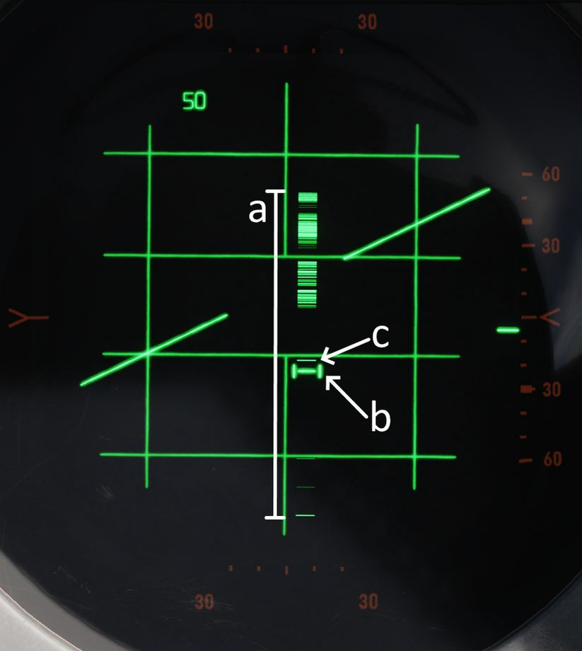

| Item | Name               | Description                                                                                                                                                                                                |
|------|--------------------|------------------------------------------------------------------------------------------------------------------------------------------------------------------------------------------------------------|
| a    | B-Sweep            | The B-Sweep displays the current radar echoes along the azimuth of the antenna, these are displayed in both acquisition and track.                                                                         |
| b    | Acquisition Symbol | Like the radar cursor, the acquisition symbol shows the current selected azimuth and range. It is moved with the Antenna Hand Control. It is also displayed in track to indicate target range and azimuth. |
| c    | Target Echo        | Target Return displayed along the azimuth                                                                                                                                                                  |

## Track

Automatic tracking can be commanded by first entering acquisition and then, once
the target has been bracketed by the acquisition symbol, Full Action can be
depressed to enter automatic track.

The type of track entered depends on the selected mode. There are two types of
tracking circuits available, angle tracking and range tracking. These will both
be described below.

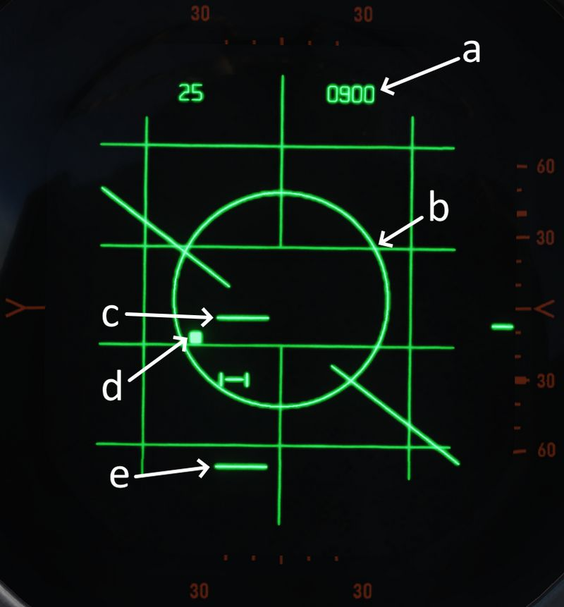

| Item    | Name                     | Description                                                                                                           |
|---------|--------------------------|-----------------------------------------------------------------------------------------------------------------------|
| a       | Display Readout          | The readout depends on the position of the [Aspect Switch](interface.md#aspect)                                       |
| b       | Allowable Steering Error | Describes the maximal Off-Angle-Launch-Envelope, see [Allowable Steering Error](#allowable-steering-error-ase-circle) |
| c and e | Range Strobes            | Indicates Launch Envelope, see [Range Strobes](air_to_air.md#range-strobes) Description                               |
| d       | Aim Dot                  | Provides pilot steering, see [Aim Dot](#aim-dot)                                                                      |

On the top right corner of the radar screen is an
[engraved T](interface.md#track-light-t) symbol which illuminates if a range
track condition is present. This is only found on the WSO Screen.

### Angle Track

The Angle Tracking circuit steers the antenna to keep the target centered. It
does so by making use of feedhorn nutation (conical scan). The antenna steers
towards the direction of highest amplitude in the nutation scan pattern. As a
result, angle tracking cannot be achieved without nutation (MAP-B begins
nutation when using acquisition).

Angle Tracking has two settings set by the
[Maneuver Switch](interface.md#maneuver-switch), HI G and LOW G. These set
limits on the acceleration in the angle tracking circuits.

Antenna steering has several important functions:

- Tracking target location in elevation and azimuth
- Providing head aiming angles to the Sparrow for a seeker lock-on.
- Illuminating the target with continuous wave radio frequency energy for
  Sparrow guidance.

### Range Track

The radar uses a range gate to select a target in range. This uses only radar
returns within the range gate for its circuits. This helps eliminate clutter and
other targets, and allows angle tracking circuits to accurately track the target
of interest without erroneous signals.

In Range Track, the range gate uses the radar echoes to automatically correct
any error between the range gate and the target echo. This causes the range gate
to move; the rate at which the gate moves is the closure velocity and displayed
on the screen. This is also used to supply the Sparrow with a closure velocity
to set its speed-gate for target tracking.

Range Track can operate in memory mode. When in memory mode the range gate will
continue to move down at the last calculated closure velocity. When this occurs
the SKIN TRK and T light on the DSCG will go out and the range rate digits will
begin to flash at 4 Hz. If memory mode was entered because the target was lost,
the system will drop the lock if the target does not reappear within 5 seconds.

Memory Mode will be entered under several conditions:

- Manual Search is selected ([Track Switch](interface.md#track-switch))
- Target is lost
- Jamming condition is detected

### Home On Jam

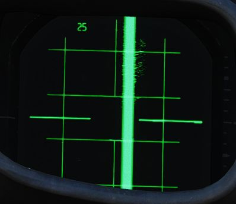

The back bias amplifier in the radar produces a noise signal based on the
overall strength of the echoes. Once this noise signal exceeds some threshold,
the system will consider it a jamming condition and enter Home On Jam. The range
track circuit goes into memory mode, the angle track circuit continues to
operate and track the jamming target in elevation and azimuth.

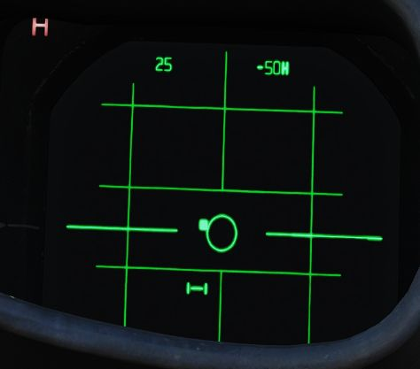

The Home On Jam condition is also indicated by the engraved H on the WSO DSCG and
the last zero digit of the closure velocity is replaced by a H along with the
closure rate flashing.

## Spotlight

In the 100 and 200 mile ranges, a procedure known as Spotlight can be used to
maintain radar monitoring of a target manually.

Spotlighting entails placing the acquisition cursor over the desired return,
then selecting and holding the full action trigger position of the Antenna Hand
Controller. Doing so, the antenna will nutate and revert to the chosen Polar
Switch selection to increase target definition, but without attempting the
automatic lock-on.

The target can be maintained in a well-observable state by holding full action
and following the target-return with the Antenna Hand Controller until it
reaches a range at which lock-on can be achieved (with the applicable change in
range setting; the radar cannot attempt a lock at an incompatible range
setting).

## Intercept Computations

The LRU-1 Intercept Computer can calculate firing envelopes for the
[Sparrow](../../stores/air_to_air/aim_7.md) and
[Sidewinder](../../stores/air_to_air/aim_9.md) Missiles.

### Range Strobes

The DSCG can display two range strobes at any given time representing the
missile envelope. There are three possible strobe types.

| Range Indication | Description                                                                                      |
|------------------|--------------------------------------------------------------------------------------------------|
| Rmax             | Maximum range of the missile provided the target continues flying on current heading and course. |
| Rmax2            | Maximum range of the missile if the target performs the shortest high g turn to tail aspect.     |
| Rmin             | Minimum range capability of the missile.                                                         |

| Missile Selected | Strobes Displayed |
|------------------|-------------------|
| Sparrow          | Rmax and Rmax2    |
| Sidewinder       | Rmax and Rmin     |

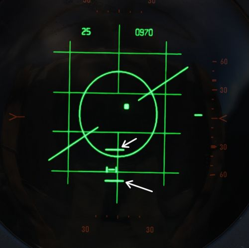

All ranges are calculated for the point the Trigger is pressed and hold down
for release, not the point where the actual release signal is send a few seconds
later. This means if the missile envelope is met on the display, then the Trigger can be
pressed and
the envelope will be valid for missile launch.

### Allowable Steering Error (ASE) Circle

The allowable steering error indicates the maximum lead or lag at which the
missile can be launched and will still retain a high probability of hit. The
circle diameter gradually increases in size once Rmax is reached and gradually
begins decreasing in size as the target range approaches Rmin.

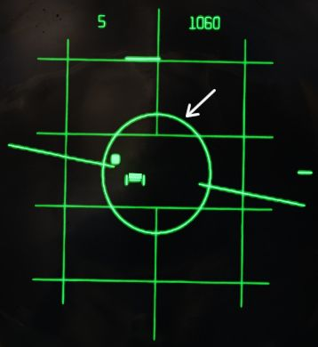

With the Sparrow selected, the max ASE Circle size is 25 degrees for an AIM-7E
and 35 degrees for an AIM-7F.

With the Sidewinder selected, if caged, the ASE Circle size is fixed at 1.2
degrees. With it un-caged the ASE Circle dynamically changes size as described
above, with the max diameter representing 25 degrees.

### Aim Dot

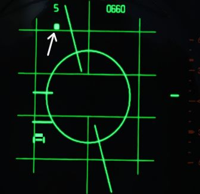

The aim dot provides steering commands to the pilot. There are three different
types:

1. Collision Steering, this minimizes time to intercept by putting the fighter
   on an intercept course.
2. Transition steering, this begins 2 nmi outside Rmax and steers the aircraft
   towards the next steering type.
3. Lead pursuit, inside Rmax lead pursuit minimizes the missile's post-launch
   maneuvers.

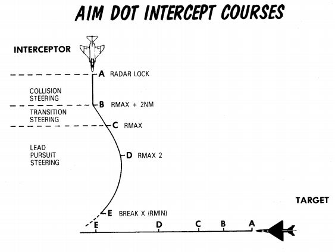

### Shoot/In Range Lights

Shoot Lights illuminate provided the following conditions are met:

- Aim Dot is Inside the ASE Circle
- Target is within Rmax and Rmin

If Sparrows are selected then shoot lights are also inhibited when the target
aspect is 90 ±9 degrees (left or right) and the target is lower than 5 degrees
above the horizon. This prevents shooting a Sparrow into the main lobe clutter.

> 💡 With the Flight Instrument Brightness Knob out of its fully CCW position -
> such as during flights at night, all SHOOT lights will remain off.

### Hold Altitude Light

The Hold Altitude Light illuminates provided the following conditions are met:

- Range is greater than the computed snap-up range.
- Altitude is greater than 32,000 ft.
- The target is more than 8000 feet above the fighter.

When the light is illuminated the azimuth error in the aim dot should be
corrected only when the light goes out. The fighter should snap up to center the
aim dot.

### Break X

In all modes (except VI) when the target is lower in range than the calculated
Rmin the Break X symbol will be displayed to indicate minimum range condition.

In Visual Intercept (VI) break X is displayed when range is less than 1000 ft.

When break X is displayed, the ASE Circle is also removed.

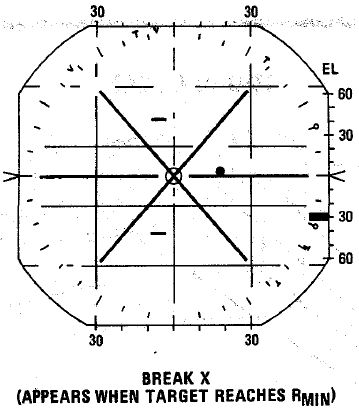

## Firing Interlocks

There are several interlocks to prevent firing missiles in unfavorable
conditions.

For the Sidewinder the only interlock preventing the missile from being fired is with the
flaps in the down position.

For the Sparrow there are several conditions:

- The aim dot must be within the ASE Circle
- The in range and shoot lights must be on
- There must be no break X condition
- The selected mode must not be Visual Intercept

> 💡 Note that SHOOT lights remain off with the Flight Instrument Brightness
> Knob out of its fully CCW position. The firing interlocks are not influenced
> by this.

The interlocks are overridden automatically with a HOJ condition or when the
Sparrow is to be fired in boresight mode. The interlocks can be overridden
manually with the Interlock Switch.

## Boresight and Cage Condition

### Boresight

Boresight can be entered either by moving the
[Mode Knob](interface.md#radar-modes-mode) to BST or by depressing the CAGE
button on the throttle. The latter enters a cage condition which is very similar
to boresight entered through BST, with the exception that the cage condition
limits the range to 5 nmi and forces the maneuver setting into the HI position.

When in boresight, the antenna is fixed along the radar boresight line and the
radar returns are displayed on the scope as in an acquisition mode. Acquisition
can be commanded with half action as in automatic search to acquire, and then
full action can be used to initiate track. Range and angle tracking will begin
as normal.

[Sparrows](../../stores/air_to_air/aim_7.md) can be fired without tracking the
target. If that is the case, the pilot must position the target on the gunsight pipper and
the WSO can select an appropriate [aspect setting](interface.md#aspect). The
Sparrow can now be fired.

### Cage Condition

The cage condition is a close combat mode which can be entered at any time by
depressing the CAGE Button on the pilot throttle. This by default puts the radar
into boresight as described above.

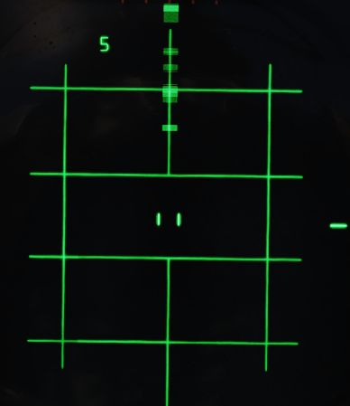

When the cage condition is present the following changes happen:

- Air-To-Air light in the rear pit illuminates.
- Trigger control is transferred to the air-to-air weapons (including when ARM
  and TV are selected)
- Optical sight switches into the A/A mode.
- Computer Automatic Acquisition becomes available.

If a track condition exists before the CAGE Button is pressed and the pinky
switch on the throttle is in RADAR or HEAT, the radar breaks track and returns
to boresight. If pinky switch is in GUNS, the lock is not broken.

Cage mode can be exited from either cockpit. The pilot can place the Weapon
Select Knob into or out of the B position. If the pilot leaves the Weapon Select
Knob in B, it does not preclude a later entry into Cage mode. The WSO can exit
cage mode by pressing the [Air To Air Button](interface.md#air-to-air-button).

### Computer Automatic Acquisition Mode (CAA)

Once in Cage mode, the radar can be selected in to Computer Automatic
Acquisition using the Nose Gear Steering button on the stick.

In CAA, the radar enters a vertical-oriented scan pattern 78 degrees in height
by 15 degrees wide, the scan is 3 vertical bars wide. Actual radar lock
capability within this scan pattern is from +45 degrees above the horizon line
to -9 degrees below the horizon line due to APQ software limitation. In the
event that the radar finds a suitable target within the scan volume, the target
will be locked. Should the flight crew find the locked target not be the one
intended, the Nose Gear Steering button can be pressed on either stick grip to
return the radar back to the search pattern.

In CAA mode, the radar’s search pattern can be shifted left and right utilizing
the pinky switch on the throttle.

| Pinky Selection | Scan Center     |
|-----------------|-----------------|
| Guns            | Left (-15 deg)  |
| Heat            | Center (0 deg)  |
| Radar           | Right (+15 deg) |

To exit CAA, the pilot can select position B on the Weapon Select Knob, or the
WSO can push the Air-To-Air button. Should a radar lock be in place at the time
of mode exit, it will be retained.
