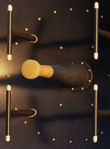
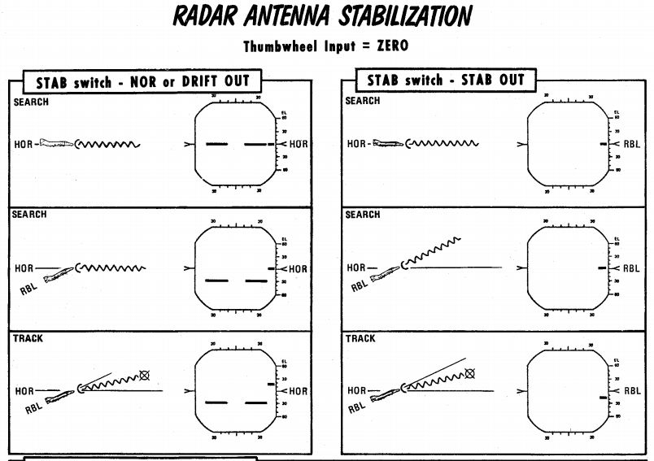
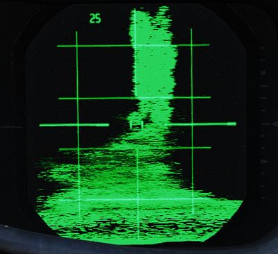
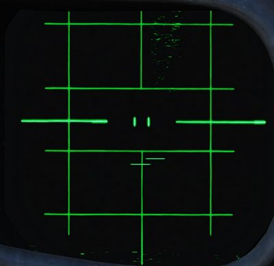

# General Radar Operation

## Magnetron and Klystron

The magnetron and klystron are the two methods for producing radio frequency
energy in the APQ-120 radar set. Both, the magnetron and klystron radiation is
fed through the antenna and emitted from the feedhorn.

### Magnetron

The magnetron is the main radio frequency emitter for the radar. It produces
pulsed energy which is used to detect and track targets.

Magnetron emission is only present when the
[Radar Power Knob](interface.md#power) is in OPER or EMER and all interlocks
described below are satisfied.

The magnetron is protected by a wave guide pressure switch and a temperature
interlock. If either of these interlocks are open (possibly because of damage or
malfunction) the [Radar Power Knob](interface.md#power) can be moved into EMER
to return operation; however, operation of the magnetron without adequate
pressure or cooling, may damage the magnetron and can burn the feedhorn.

The magnetron is not powered until 3 minutes after radar is turned on. This can
be overridden by moving the [Radar Power Knob](interface.md#power) into EMER;
however, operating the magnetron without sufficient warm up may result in
incorrect pulse width and timing and/or degraded pulse power.

### Klystron

The klystron produces continuous wave radio frequency energy, which is used to
tune and guide the Sparrows.

The klystron emissions are present when the
[Radar Power Knob](interface.md#power) is in STBY, OPER or EMER, the
[Radar Missile Power Switch](../../cockpit/pilot/weapon_management.md#radar-missile-power-switch)
is in CW and all interlocks described below are satisfied.

The klystron is protected by two temperature switches, a pressure switch and a
surge current switch. If any of these interlocks (with the exception of the
surge current switch) are open, the [Radar Power Knob](interface.md#power) can
be moved into EMER to return operation; however, damage to the klystron and
feedhorn may result.

The klystron is not powered until 100 seconds after the radar is turned on. This
can be overridden by moving the [Radar Power Knob](interface.md#power) into
EMER; however, operating the klystron without sufficient warm up may result in
degraded power.

## Feedhorn Nutation

Feedhorn nutation is required for automatic tracking. The feedhorn nutates to
rotate the radiated energy around the antenna axis. This modulates the radar
echoes. Where the echo is strongest the antenna will steer if tracking, this
drives the antenna back onto a tracked target.

A side-effect of this nutation is increasing the beam-width, from 3.7 degrees
(half power) to 6.7 degrees (full power) while reducing the average intensity of
the beam.

Below describes the nutation settings for the action switch.

| Mode Knob                | Range Knob | Action Switch       | Nutation |
| ------------------------ | ---------- | ------------------- | -------- |
| RDR, BST, AIR-GND        | ALL        | Release             | ✅       |
| MAP                      | ALL        | Release             | ❌       |
| MAP-PPI                  | ALL        | Half or Full Action | ❌       |
| RDR, MAP-B, BST, AIR-GND | AI         | Half or Full Action | ✅       |
|                          | Not AI     | Half Action         | ✅       |
|                          |            | Full Action         | ❌       |

## Antenna Stabilization

There are three antenna stabilization modes. Two apply to
[Air-To-Air Operation](air_to_air.md) and the other to
[Air-To-Ground Operation](air_to_ground.md).

### NOR

Normal operation of the antenna stabilization.

In [Automatic Search](air_to_air.md#automatic-search), the antenna is stabilized
in pitch and roll to the horizon (radar plane). The center of the radar scan is
along the heading of the aircraft. In this mode the zero degree mark on the
display indicates the horizon.

In [Air-To-Ground Ranging](air_to_air.md#air-to-ground-ranging), the antenna is
boresighted to the radar boresight line but stabilized in drift.

### DRIFT OUT

The same as NOR, but drift stabilization is removed.

### STAB OUT

In [Automatic Search](air_to_air.md#automatic-search) the antenna does not
stabilize to the horizon, but instead th aircraft reference.

With [Air-To-Ground Ranging](air_to_air.md#air-to-ground-ranging), the antenna
is boresighted to the radar boresight line without drift stabilization. In this
mode the zero degree mark on the display indicates the radar boresight line.

## Pulse Setting

The pulse setting determines several characteristics of the Radar Set. These
include the length of the transmitted pulse, which amplifier is used to amplify
the signals, the frequency at which the pulses are emitted (i.e. the pulse
repetition frequency).

The setting is controlled with the [Pulse Switch](interface.md#pulse-switch)
into either LONG or SHORT modes.

| Mode  | Amplifier   | Pulse Repetition Frequency (PRF) Setting (Hz) | Pulse Length (microseconds) |
| ----- | ----------- | --------------------------------------------- | --------------------------- |
| LONG  | Narrow Band | 370                                           | 2.0                         |
| SHORT | Back Bias   | 1060                                          | 0.4                         |

> 💡 The AIR-GND and Automatic Acquisition mode force the pulse setting into
> SHORT.

The AUTO setting enables the power-level mode switching (PLMS) described below.

### Power Level Mode Switching

Power Level Mode Switching automatically selects the LONG or SHORT, and Narrow
Band or Back Bias amplifiers depending on several conditions such as target
range, echo strength or noise signal.

## Gain Control

The amplification of the signals that enter the receiver is called the gain. The
gain setting is important to both search and tracking operations and is the main
means for the crew to pickup targets on the display.

### Manual Gain Control

The gain can be altered manually. This changes how returns are displayed. Higher
gain settings amplify all echoes but can result in noise and saturation
resulting in degraded image. Lower gain settings will result in better target
contrast; however, weaker returns will not be visible, this can degrade detection
range.

| Too much gain                                       | Perfect gain (2 targets)                          |
| --------------------------------------------------- | ------------------------------------------------- |
|  |  |

When the radar locks on a target, the gain control is switched to the
[Automatic Gain Control Circuit](#automatic-gain-control) and manual gain
control no longer is used.

> 💡 Getting the correct gain is a balance and comes with experience, as a
> general rule of thumb for search the gain should be increased until a small
> amount of noise (random specks) begins to show.

Along with receiver gain the display also has image levelling, after adjusting
the gain it may take a few scans for the image to adjust the level correctly.

### Automatic Gain Control

The Automatic Gain Control takes control of the gain setting once the radar is
in track. The gain is adjusted automatically using the target within the range
tracking gate to provide a consistent target signal for tracking.

## Sensitivity Time Control (STC)

The strength of a radar echo falls off with `1 / r^4` where **r** is the
range. This means on a normal display the brightness of the radar returns will
get dimmer with distance.

For ground mapping the APQ-120 counteracts this effect. With the
[Radar Mode Knob](interface.md#radar-modes-mode) in MAP and the
[Display Knob](interface.md#display-knob) in a PPI mode, Sensitivity Time
Control is enabled.

When enabled, it exponentially increases the receiver gain with range to
counteract the echo power fall off with range. This provides an approximately
even brightness with increasing range.
