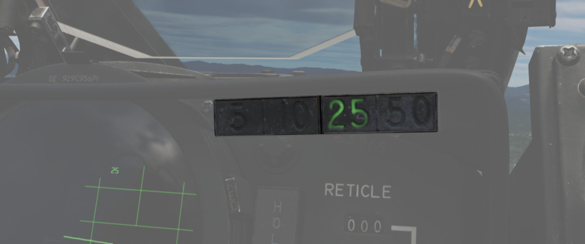

# Radar Interface

The radar system can be setup by the WSO with two panels on the left console,
the Radar Set Control Panel and the Control Monitor Panel.

Radar returns are displayed on the DSCG screen, while the Antenna Hand Control
stick on the right console of the WSO cockpit can be used to operate the radar.

## Radar Set Control Panel

### Power

| Name | Description                                                                                                                     |
| ---- | ------------------------------------------------------------------------------------------------------------------------------- |
| OFF  | Powers radar off.                                                                                                               |
| TEST | Applies voltage to control monitor power and provides [BIT-test](../../procedures/bit_tests/overview.md) functions 1 through 6. |
| STBY | Power applied to radar, remains in a non-transmitting standby state.                                                            |
| OPR  | System is fully operational.                                                                                                    |
| EMER | Overrides the time delay, pressure, and temperature restrictions to allow radar operation.                                      |

Initial powering of the APQ-120 starts by placing the Radar Power Knob into TEST
or STBY (Standby). The warmup cycle requires 3 minutes from selecting either
setting, and confirmation of this process is shown via the Control Monitor Meter
on the Monitor Panel; after 30 seconds from cycling power, the gauge will
display a value of roughly 250Vdc; from the point the needle shows power at this
nominal value, the warmup procedure will be 2.5 minutes.

After 3 minutes, the radar can safely be placed into OPR (Operate) for
employment of the radar, BIT testing can be performed in TEST mode, or the radar
can be left in STBY for the safety of crew and others on the ground.

In the event of an emergency situation requiring immediate operation of the
radar, EMER can be selected; See the
[Magnetron and Klystron](operation.md#magnetron-and-klystron) section for more
details.

### Range

Range control sets the range of the radar, note there are some modes where the
range settings available are restricted or forced to a specific setting.

Current Radar Set range will illuminate the respective indicator
[range lamp](../../cockpit/pilot/dscg_controls.md#range-lights), as well as
display the numerical value on the DSCG display in the upper left.

Values up to 50 nmi are indicated as Air-Intercept (AI) are available for
[Automatic Tracking](operation.md#track) and, 100 nmi and 200 nmi settings are
available for [Spotlight](operation.md#spotlight).

### Polarization Control

The polarization of the radio frequency energy can be changed using the
polarization control. In normal operation the LIN setting is used which produces
linearly polarized light in the vertical direction relative to the antenna, this
minimizes ground returns as many types of ground clutter are less reflective to
vertically polarized light. However because the antenna is not roll stabilized
increased return intensity may be seen when rolling the aircraft.

Both CIR 1 and CIR 2 are circularly polarized positions. Precipitation is less
reflective to circularly polarized light, so CIR 1 and CIR 2 can aid in
minimizing clutter in rain or fog.

The polarization is set using the quarter waveplate in the feedhorn which causes
the [continuous wave emissions](operation.md#klystron) to be polarized as
described above. This makes only CIR 1 compatible with launching sparrows as the
sparrow rear antenna cannot receive counterclockwise polarized light.

| Selection | Description                                                                                                        |
| --------- | ------------------------------------------------------------------------------------------------------------------ |
| LIN       | RF energy is lineally polarized in a vertical orientation. [AIM-7](../../stores/air_to_air/aim_7.md) can be fired. |
| CIR 1     | RF energy is circularly polarized clockwise. AIM-7 can be fired.                                                   |
| CIR 2     | RF energy is circularly counterclockwise. AIM-7 cannot be fired.                                                   |

> 💡 Only LIN and CIR 1 modes can be used with the Sparrow, a Sparrow launched
> using CIR 2 will not guide.

### Maneuver Switch

The maneuver switch is used to specify the tracking response to target
accelerations.

| Selection | Description                                                                                        |
| --------- | -------------------------------------------------------------------------------------------------- |
| LOW G     | Default position. Limits tracking accelerations to reduce response to countermeasures and clutter. |
| HI G      | Allows track loop to respond with any acceleration.                                                |

HI G is forced when
[Computer Automatic Acquisition](operation.md#computer-automatic-acquisition-mode-caa)
is used.

### Scan Switch

The scan switch specifies the number of elevation bars used in search.

| Selection | Description                                                        | Total Vertical Coverage (degrees) |
| --------- | ------------------------------------------------------------------ | --------------------------------- |
| 1 Bar     | Scans along radar plane.                                           | 6.7 (3.7 without nutation)        |
| 2 Bar     | Scan alternates between 1.875 degrees above/below the radar plane. | 10.45                             |

1 Bar Scan is automatically commanded when MAP is selected on the
[Radar Mode Knob](#radar-modes-mode). For BST, AIR-GND and CAGE conditions scan
switch position is not relevant.

### Aspect

The aspect knob is used to provide the
[Sparrow](../../stores/air_to_air/aim_7.md) with a simulated doppler signal when
**no lock** is achieved to aid with sparrow speed gate lock-on when sparrow is
to be fired in boresight. When the radar is tracking, the calculated (or manual
if in manual) closure is used to set a narrow sparrow speed gate +/- 150 kts
around the closure for the sparrow to search when launched.

The aspect knob also controls the display mode of the DSCG numeric output while
the radar is is in track.

See below the display and speed get settings for the various positions of the
aspect knob, with Vc indicating selected closure velocity for the speed gate,
where TAS is the aircraft true airspeed.

| Selection | DSCG Display     | Sparrow Speed Gate Setting (Vc) |
| --------- | ---------------- | ------------------------------- |
| WIDE      | Closure Velocity | Entire Spectrum                 |
| NOSE      | Altitude         | TAS + 450 +/- 150 kts           |
| FWD       | Aspect           | TAS + 240 +/- 150 kts           |
| AFT       | Closure Velocity | TAS - 240 +/- 150 kts           |
| TAIL      | Heading          | 0 +/- 150 kts                   |

Closure Velocity - Displayed in knots with positive values indicating closing
and negative values indicating opening.

Altitude - Displayed in hundreds of feet (with the last digit always zero) for
example 20,000 MSL would be displayed as 200.

Aspect - Angle off the tail of the target aircraft to the shooter (own ship),
this means if the target is flying directly away is 0 degrees and directly
towards is 180 degrees. Left is shown by negative values and right by positive
values.

Heading - Heading is displayed in degrees from 000 - 360 with the last digit
always zero.

### Receiver Gain (RCVR GAIN)

The stacked RCVR GAIN potentiometers FINE on top and COARSE on the bottom,
provide the ability to adjust the receiver gain. FINE is used for small
adjustments and COARSE is used for large adjustments. For more information see
[Gain Control](operation.md#gain-control) section.

### Track Switch

Track switch alters [range tracking](operation.md#range-track) settings. The
default position is AUTO which operates normal range tracking with
[Home on Jam](operation.md#home-on-jam) if jamming is detected. Home on jam can
be disabled (if jamming is erroneously detected) by setting the track switch to
AOJ OUT. Lastly if required manual range tracking can be used by setting MANUAL
at which point the [MAN Vc](operation.md#manual-vc-man-vc) knob position will be
used to set the tracking gate closure velocity.

### Display Knob

The DSCG can display returns in B-Scope or Plan Position Indicator (PPI)
display.

In B-Scope the horizontal axis of the display indicates azimuth, and the
vertical axis represents slant range.

In PPI the horizontal axis is distance to the left and right of the aircraft,
with the vertical axis representing distance along the track of the aircraft.

There are also two Sweep Settings NAR and WIDE, NAR is a narrow 45 degree sweep
and WIDE is a full 120 degree sweep. See
[Automatic Search](operation.md#automatic-search) for more.

The display can also be directed to provide course guidance for a Vis Ident (VI)
intercept profile against a locked target.

### Manual Vc (MAN Vc)

The MAN Vc switch is a 12 position used to set a closure velocity for
[manual range tracking](operation.md#range-track). The 1,2 two positions
counter-clockwise set an opening velocity of 100 and 200 knots respectively. The
0 to 9 positions clockwise set a closure velocity from 0 to 900 knots.

Closing refers to an target decreasing in range and opening refers to a target
increasing in range.

### Pulse Switch

The pulse switch sets the pulse and pulse repetition frequency for the radar
set. See the [Pulse Setting](operation.md#pulse-setting) for more information.

In [AIR-GRD](#air-grd-air-to-ground-position) mode and
[Computer Automatic Acquisition](operation.md#computer-automatic-acquisition-mode-caa),
the pulse switch is disabled automatically and SHORT pulse is commanded.

## Radar Modes (MODE)

Specific radar operating modes are dependent on the radar mode knob but also
several other conditions and switches. For a comprehensive description of the
radar operation see the
[Radar Operation (General)](operation.md#radar-operation-general),
[Radar Operation (Air-To-Air)](operation.md#radar-operation-air-to-air),
[Radar Operation (Air-To-Ground)](operation.md#radar-operation-air-to-ground)

This section will briefly cover each of the positions of the radar mode knob and
link to the relevant sections below.

### BST (Boresight) Position

BST forces the radar into the
[boresight](operation.md#boresight-and-cage-condition) state. This is used when
the target is spotted visually or a [Sparrow](../../stores/air_to_air/aim_7.md)
is to be fired without radar tracking.

### RDR (Radar) Position

RDR position puts the radar in
[Automatic Search](operation.md#automatic-search).

### MAP Position

MAP position is identical to the RDR position puts the radar in
[Automatic Search](operation.md#automatic-search), with the exception that
nutation is disabled and the 2 bar search pattern is not available.

### AIR GRD (Air to Ground) Position

AIR-GRD position is similar to the boresight position with the following
exceptions:

- Angle Track is Disabled while Tracking.
- Antenna is Always Fixed to the boresight with drift stabilization.

### BEACON Position

BEACON may be used with any Display Knob position other than VI, as desired.
BEACON does not display radar echos and instead listens for transponder
responses from specific beacon equipment.

### TV Position

The TV Radar Mode setting is not used on DSCG aircraft; this is superseded by
the TV display option on the DSCG panel itself, and the TV display option in the
pilot's cockpit.

> 💡 [AIM-7](../../stores/air_to_air/aim_7.md) missiles detune and cannot be
> re-tuned with the Radar Mode Knob in TV.

### Skin Track Lamp (SKIN TRK)

The Skin Track Lamp illuminates when an automatically achieved lock-on is
established and held by the radar. This coincides with the T symbol being lit on
the DSCG panel. A manually tracked, AOJ, or HOJ track condition will not
illuminate this lamp (or the DSCG panel T).

## FCS Control Monitor Panel

The Control Monitor Panel's primary purpose is to access the built-in
diagnostics of the APQ-120. Additionally, the panel mounts auxiliary controls
for the system - the Vc Switch and Stab Switch, and the Temp monitoring lamp.

### Coords Light

This lamp is not used with the APQ-120.

### Temp Lamp

The TEMP Lamp provides a visual indication of an overheat situation in the
APQ-120 avionics bays. Should the lamp illuminate, the radar must be powered off
immediately to preclude damaging the equipment. Should circumstances require the
radar be used during a temperature warning, the lamp should be monitored for
continued illumination, and the radar shut off as soon as possible.

### Meter Selector Knob

A sixteen-position rotary knob used in conjunction with the Meter Switch to test
various voltages, currents, and signals generated by the internals of the radar,
independently and in conjunction with the Built-In-Test system. Each position is
dual purpose, noted with two sets of values; when the Meter Switch is in the
VOLT position, the inner rim of the knob is active, delivering the specified
voltage of the selected position. In the SIGNALS position of the Meter Switch,
the outer current or signal value is tested.

### Monitor Meter

The Monitor Meter displays voltages, current, and signals relative to the
current settings of the Meter Selector knob in conjunction with the Meter
Switch, or the current Built-In Test setting.

Voltages are confirmed beginning with the -250 position of the Selector knob and
the Meter Switch in VOLT, and will indicate in the "1" region of the gauge
approximately thirty seconds after radar power-on, signifying correct voltage
delivery. After this power-up, the monitor meter will indicate in the "1" region
for nominal function if the voltages delivered are correct. The +35 selection is
an exception to this rule, as the value for correct function is 2.0 or greater.

In SIGNALS mode, the RX1-RX4 crystal current are functioning correctly with a
return in the XTAL region.

The EX1 and 2 test electrical frequency control crysals, and are also nominal
when XTAL is returned.

The magnetron, tested in MAG, long pulse operation is confirmed with a return of
1.4 to 1.8, and short pulse operation is correct with a value of 0.9 to 1.15.

KLY, which tests the CW transmitter, should find a value of 0.25 to 1.25 when
radiating correctly.

TP 1 tests the temperature and pressure interlocks, and indicates 1 when the
interlocks are closed and functioning.

TP 2 confirms waveguide pressure, and a value of 1 is correct.

In LOB, the meter needle will travel roughly between 1.5 to 2.8 as a function of
antenna nutation.  
Lastly, the LIN and CIR selectors confirm proper linear and circular pulse
performance; they only register a value of 1 for a transmission of vertical or
clockwise-rotating polarity energy. That is, they do not return a value in CIR
pulse (counter-clockwise) mode.

### APQ-120 Built-In Test Knob

Confirmation of proper system performance is performed using the various options
on the Control Monitor Panel; specific test modes are defined using the Test
Knob.

### Meter Switch

Tied to the Meter Selector knob, the two position switch defines which value of
the Meter Selector Knob is being tested - VOLT for the inner ring voltage
values, SIGNALS for the outer ring current and signal values.

### Vc Switch

With selections of 900 and 2700, the switch is used to scale the Vc gap as
displayed in F-4Es with the DVST installed, with the newer DSCG installed, the
switch must remain in the 2700 position at all times for to ensure correct
reading on the display.

### Stab Switch

The STAB switch controls the antenna pitch and roll stabilization modes. The
default NOR (normal) position maintains stabilization in both channels, and INS
system drift compensation is further applied in specific modes (AIR-GND). In
STAB OUT the stabilization of pitch, roll, and INS drift is removed from the
radar antenna. DRIFT OUT maintains pitch and roll stabilization, while removing
the INS drift compensation in modes which use it.

## Digital Scan Converter Group

The Digital Scan Converter Group (DSCG) provides an integrated display system of
the F-4E's radar and electro-optical systems. The system is composed of the
front and rear seat scopes, and is driven by the Indicator Control Unit (ICU)
which performs conversion of radar and video signals, along with the application
of information and fire control cueing symbology.

### Grid Knob

The Grid knob controls brightness of the display field grid.

### HOJ Light (H)

The HOJ light illuminates to provide indication that the radar has transitioned
to an angle tracking HOJ operation, using only memorized range and range rate
information if a jamming condition is detected.

### Scale

The Scale knob controls brightness of the angle and elevation scales surrounding
the DSCG display field.

### Track Light (T)

The Track light illuminates to confirm an angle and range-based lock-on against
a target. Same as the SKIN TRK light. See [Track](operation.md#track) for more
information.

### Contrast (CONTR)

The Contrast knob controls relative DSCG display contrast.

### Range (RNG)

The Range knob controls brightness of the range cursor in PPI modes.

### Brightness (BRT)

The Brightness knob controls the brightness of the overall DSCG display.

### Offset (OFS)

The Offset knob controls brightness of the offset cursor line in PPI modes.

### DSCG Mode Knob

The DSCG Mode knob is used to select the current mode of the display.

- OFF removes all power from the display, ceasing all DSCG functionality.

- STBY (Standby) places the DSCG in its warmup mode; no display occurs during
  this process.

- DSCG TEST displays a dest field to confirm proper display function. The DSCG
  display field shows a search display with eight shades of grey to confirm
  proper operation and contrast. Prior to entry of this mode for testing, Range
  10 should be selected for correct sizing of the shaded fields.

- RDR BIT is a built-in test mode that functions in conjunction with the radar
  for calibration of the signals provided from the radar with the DSCG's ICU.

- RDR is the operational mode for use with the APQ-120.

- TV is the display mode used for EO weapons (Maverick/Pave Spike) and TISEO.

## Antenna Hand Controller

The Antenna Hand Controller is a joystick found only in the WSO cockpit on the
right console; the joystick integrates with the radar to perform range (fore and
aft) and azimuth (left and right) positional control of the acquisition symbol
on the radar display in the air-to-air modes, as well as seeker/EO sensor
direction with Maverick and Pave Spike. Additionally, the joystick includes the
Antenna Elevation Control thumbwheel, which controls the elevation angle of the
antenna, displayed via the EL strobe on the DSCG display; this elevation scan is
limited in both up and down movement to 60 degrees.

In the index finger position of the Antenna Hand Controller is the Action
Switch; a two-position switch designated half-action in the first detent, and
full-action with full engagement. In air-to- air modes, half-action initiates
visibility of the range strobe, allowing for proper range alignment with a
target return for automatic lock-on, or selection of MAN Vc rates required for a
manual lock. With proper bracketing and range strobe adjustment, full-action
attempts the automatic lock-on, or initiates manual angle tracking of the
intended target.

The interaction of half- and full-action for the
[AGM-65 Maverick](../../stores/air_to_ground/missiles/maverick.md) is detailed
in the section on AGM employment.

## Range VISIDENT Indicator

The Range Indicator is used for close range VID intercept profiles, providing
range information out to two miles and range rate information from inside of
9000'. The information is confirmed as radar-accurate once the range indicator
jumps to 9. The gauge functions in the VI, B NAR, and B WIDE display modes; the
indicator does not function in air to ground modes.

## Air to Air Button

The Air to Air button is a button and a light with the primary function of
confirming entry into CAGE mode. When the crew desires to disengage CAGE mode,
the WSO can press the light (which also functions as a button) to exit CAGE mode
and revert to the current selected settings from the Radar Control Set.
