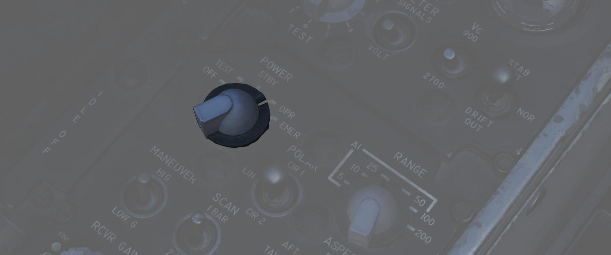
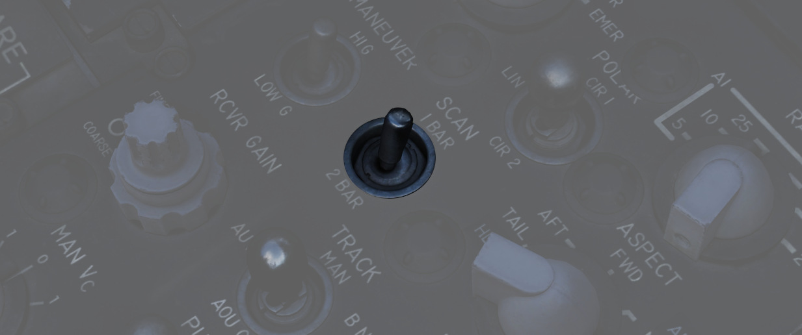
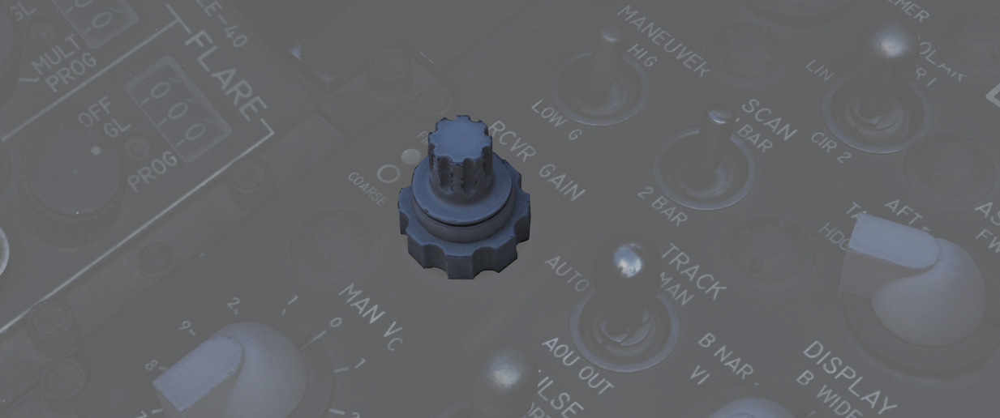
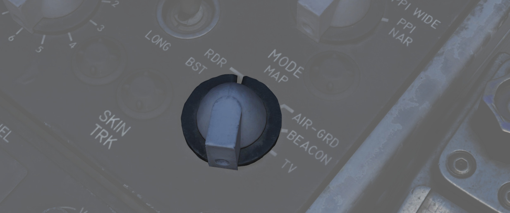

# 雷达界面

WSO 可以通过左侧控制台上的两个面板设置雷达系统，即雷达套件控制面板和控制监控面板。

雷达回波显示在 DSCG 屏幕上，而 WSO 驾驶舱右侧控制台上的天线手控杆可用于操作雷达。

## 雷达套件控制面板

### 电源旋钮

| 选项名称 | 描述                                                                             |
| -------- | -------------------------------------------------------------------------------- |
| OFF      | 雷达关闭。                                                                       |
| TEST     | 向控制显示器供电，并提供[BIT](../../procedures/bit_tests/overview.md) 功能 1-6。 |
| STBY     | 雷达通电，保持无发射待机状态。                                                   |
| OPR      | 系统完整工作。                                                                   |
| EMER     | 超控延时、压力和温度限制，允许雷达工作。                                         |

将雷达电源旋钮转至 TEST 或 STBY 档位，即会为 APQ-120 通电。在选择任意档位后，雷达将需要 3 分钟预热
周期，通过监控面板上的监控仪表显示来确认预热进程；在通电 30 秒后，仪表将显示大约 250 伏直流电数值；
从指针在此标称值上显示电流开始，预热程序剩下 2.5 分钟。

3 分钟后，雷达可以安全地进入 OPR（工作）来使用雷达，或者可以切换到 TEST 模式以进行 BIT，也可以将雷
达留在 STBY 模式来确保地勤人员安全或其它位于地面的人员。

在应急情况下需要立即操作雷达时，可以选择 EMER 档位；更多详细信息，请参阅
[磁控管和速调管](operation.md#磁控管和速调管) 部分。

### 距离旋钮

距离控制用于设置显示器的显示距离，请注意，在某些模式下，可用的距离设置被限制或强制为特定设置。

当前雷达距离设置将会使对应的 [距离灯](../../cockpit/pilot/dscg_controls.md#距离灯) 亮起，并在 DSCG
显示器左上角上显示数值。

雷达在 [自动跟踪](operation.md#跟踪) 下最远可设置为 50 海里，在这个距离内旋钮带有空空拦截（AI）标记
， 而在 [聚束](operation.md#聚束) 下则可以设置为 100 和 200 海里。

### 极化控制

WSO 可以使用极化控制来改变电磁波的极化。在正常操作中，使用 LIN 模式，线极化设置在相对天线垂直方向上
产生线性极化波束，来最大限度地减少地面回波，这是因为许多类型的地面杂波对垂直极化波的反射较小。然而
，由于天线无横滚稳定，在横滚时可以观察到地面杂波增大。

CIR1 和 CIR2 都是圆极化波。降水不易反射圆极化波，因此 CIR 1 和 CIR 2 可以帮助最大限度地减少雨或雾反
射的杂波。

使用喇叭馈源中的 1/4 波片来设置极化，这使得[连续波发射](operation.md#速调管) 能按照上述方式极化。这
种极化方式使得只有 CIR 1 能用于发射“麻雀”——因为“麻雀”尾部天线无法接收左旋极化。

| 选项  | 描述                                                                            |
| ----- | ------------------------------------------------------------------------------- |
| LIN   | 电磁波在垂直方向上线性极化。可以发射[AIM-7](../../stores/air_to_air/aim_7.md)。 |
| CIR 1 | 电磁波顺时针圆极化。可以发射 AIM-7。                                            |
| CIR 2 | 电磁波逆时针圆极化。无法发射 AIM-7。                                            |

💡 只有 LIN 和 CIR 1 模式可以使用 AIM-7 “麻雀”导弹。当在 CIR 2 模式下发射“麻雀”时，导弹不制导。

### 机动开关

机动开关用于指定对目标加速度的跟踪响应。

| 选项  | 描述                                                                |
| ----- | ------------------------------------------------------------------- |
| LOW G | 默认档位。限制跟踪加速度，以减少对对抗措施和杂波的反应。            |
| HI G  | 移除 LOW G 限制功能并允许距离跟踪环路响应空战中可能出现的高加速度。 |

当使用 [计算机自动截获](operation.md#计算机自动截获模式-caa) 时，强制进入 HI G 模式。

### 扫描开关

扫描开关用于指定搜索中使用的扫描线数。

| 选项  | 描述                                       | 总垂直覆盖范围（度）     |
| ----- | ------------------------------------------ | ------------------------ |
| 1 Bar | 仅沿雷达平面扫描                           | 6.7 (在无章动情况下 3.7) |
| 2 Bar | 在雷达平面上方/下方 1.875 度之间交替扫描。 | 10.45                    |

当 [雷达模式旋钮](#雷达模式-mode-旋钮) 转至 MAP 时，自动指令进行 1 BAR 扫描。对于 BST、AIR-GND 和
CAGE 状态，扫描开关档位无功能。

### 态势旋钮

态势旋钮用于需要在瞄准轴 **无锁定** 的情况下向 [麻雀导弹](../../stores/air_to_air/aim_7.md) 提供模
拟多普勒信号来辅助导引头跟踪速度门预定信号并发射导弹。当雷达进行跟踪时，计算的（或手动的，如果是手
动模式下）接近率将被用于在接近率周围为麻雀设置一个 +/-150 节 窄速度门 ，来让麻雀在发射后进行搜索。

当雷达处于跟踪状态时，态势旋钮还可控制 DSCG 数字输出的显示模式。

请参阅下表中不同的态势旋钮档位所对应的显示和速度门设置，Vc 表示选定的速度门接近率，其中 TAS 是飞机
的真空速。

| 选项 | DSCG 显示内容 | 麻雀速度门设置(Vc)   |
| ---- | ------------- | -------------------- |
| WIDE | 接近率        | 全频谱               |
| NOSE | 高度          | TAS + 450 +/- 150 节 |
| FWD  | 态势          | TAS + 240 +/- 150 节 |
| AFT  | 接近率        | TAS - 240 +/- 150 节 |
| TAIL | 航向          | 0 +/- 150 节         |

接近 - 以节为单位显示，正值表示接近，负值表示离开。

高度 - 以百英尺为单位显示（最后一位数字始终为零），例如 20000 MSL 将显示为 200。

目标态势 - 目标飞机机尾与发射机（本机）的夹角，0 度表示本机处在目标正后方，180 度为正前方。处在目标
左边用负值表示，右边用正值表示。

航向 - 航向以 000-360 度为单位显示，最后一位数字始终为零。

### 接收机增益（RCVR GAIN）

RCVR 增益旋钮采用分层设计，下层粗调节，上层精调节，来调节接收器增益。精调节用于小幅调整，粗调节用于
大幅调整。有关更多信息，请阅读 [增益控制](operation.md#增益控制)部分。

### 跟踪开关

跟踪开关用于调整 [距离跟踪](operation.md#距离跟踪) 设置。默认档位为 AUTO，该档位下使用正常距离跟踪
，在探测到干扰后，将进入 [干扰源寻的](operation.md#干扰源寻的)。跟踪开关 设置到 AOJ OUT 后可以禁用
HOJ 模式（如果错误地探测到干扰）。最后，如果需要，可以通过设置到 MANUAL 来使用手动距离跟踪，此时
[MAN Vc](#手动接近率-man-vc) 旋钮将用于设置跟踪门接近率。

### 显示旋钮

DSCG 可以 B 显或平面位置显示器（PPI）显示回波。

在 B 显中，显示器的横轴表示方位，纵轴表示斜距。

在 PPI 中，横轴表示到飞机左右的横向距离，纵轴表示沿着飞机航迹的纵向距离。

还有两种扫描设置——NAR 和 WIDE，NAR 是窄 45 度扫描，WIDE 是全 120 度扫掠。有关详细信息，请参
阅[自动搜索](operation.md#自动搜索)。

显示器也可用于显示锁定目标的目视识别（VI）拦截剖面的航线引导。

### 手动接近率（MAN Vc）

MAN Vc 开关是一个 12 档位开关，用于设置 [手动距离跟踪](operation.md#距离跟踪) 的接近率。1、2 两个逆
时针档位分别设定 100 节和 200 节的离开速度。0 到 9 顺时针档位用来设置 0 到 900 节接近率。

接近是指距离缩短的目标，离开是指距离增加的目标。

### 脉冲开关

脉冲开关设置雷达套件的脉冲和脉冲重复频率。有关更多信息，请参阅 [脉冲设置](operation.md#脉冲设置)。

在 [AIR-GRD](#air-grd-空对地-档位) 和 [计算机自动截获](operation.md#计算机自动截获模式-caa) 模式下
，系统自动禁用脉冲开关，并指令使用 SHORT（短）脉冲。

## 雷达模式（MODE）旋钮

具体的雷达工作模式取决于雷达模式旋钮，以及其它几种条件和开关。有关雷达操作的全面介绍，请阅读
[雷达操作（整体）](operation.md#radar-operation-general)、[雷达操
作[空对空](operation.md#空对空操作) 、[雷达操作（空对地）](operation.md#空对地操作)

这部分将简要介绍雷达模式旋钮的各个档位，并链接到下面的相关部分。

### BST（瞄准轴）档位

BST 强制雷达进入[瞄准轴](operation.md#瞄准轴和锁定状态) 状态。当目视发现目标或在没有雷达跟踪的情况
下发射 [麻雀](../../stores/air_to_air/aim_7.md)时，使用 BST 模式。

### RDR（雷达）档位

RDR 档位将雷达置于 [自动搜索](operation.md#自动搜索)。

### MAP 档位

MAP 档位与 RDR 档位相同，将雷达置于 [自动搜索](operation.md#自动搜索)，但是章动被禁用，并且 2 线栅
状扫描不可用。

### AIR GRD（空对地）档位

AIR-GRD 档位与瞄准轴档位相似，但具有以下区别：

- 跟踪时禁用角跟踪。
- 天线始终固定在带有漂移稳定的瞄准轴上。

### BEACON 档位

BEACON 可根据需要与 VI 以外的任何显示旋钮档位一起使用。BEACON 不显示雷达回波，而是监听特定信标设备
的应答机响应。

### TV 档位

DSCG 飞机不使用 TV 雷达模式设置；该设置被 DSCG 面板上的 TV 显示选项和飞行员驾驶舱内的 TV 显示选项所
取代。

💡 [AIM-7](../../stores/air_to_air/aim_7.md) 导弹去调谐时，不能在雷达模式旋钮处于 TV 档位时重新调谐
。

### 蒙皮跟踪灯（SKIN TRK）

当雷达建立并保持自动锁定时，蒙皮跟踪灯亮起。跟踪灯与 DSCG 面板上的 T 符号灯一同亮起。手动跟踪、AOJ
或 HOJ 跟踪状态下灯光不会亮起（或 DSCG 面板 T）。

## FCS 控制监控面板

控制监控面板的主要用途是访问 APQ-120 的机内诊断。此外，面板中还安装了系统的辅助控制开关——Vc 开关、
稳定开关以及温度灯。

### Coords 灯

APQ-120 不使用该灯光。

### 温度灯

TEMP 灯提供 APQ-120 航电设备舱过热情况的视觉指示。如果指示灯亮起，必须立即关闭雷达电源，以防止设备
损坏。如果情况需要在温度告警期间使用雷达，应监控指示灯是否持续亮起，并尽快关闭雷达。

### 仪表选择旋钮

一个十六位旋钮，与仪表开关一起使用，独立地或与机内自检系统一起来测试雷达内部的各种电压、电流和信号
。每个档位都有两种功能，各档位标有两中数值；当仪表开关处于 VOLT（电压）档位时，使用旋钮的内圈功能，
提供选定档位的指定电压。在仪表开关处在 SIGNALS（信号）档位时，使用旋钮的外圈功能，测试电流或信号值
。

### 监控仪表

监控仪表提供电压、电流和信号指示，显示数值由仪表开关的档位和仪表选择选择旋钮的设置决定。

从选择旋钮的-250 档位开始，仪表开关设置为 VOLT 来确认电压，在雷达通电后约 30 秒后仪表指向“1”区域则
表示电压输送正确。通电后，如果提供的电压正确，监控仪表将指向“1”区域来提供标称功能。+35 为例外，正确
的值为 2.0 或更高。

在 SIGNALS 模式下，RX1-RX4 晶体电流正常工作，并返回 XTAL 区域。

EX1 和 2 测试电气频率控制晶体，标称值同样为返回 XTAL。

MAG 档位测试磁控管，长脉冲操作以返回 1.4 到 1.8 确认，短脉冲操作以 0.9 到 1.15 为准。

测试 CW 发射机的 KLY 档位在正确发射时应得到 0.25 到 1.25 读数。

TP 1 测试温度和压力互锁，并在联锁关闭时指示 1 区域。

TP 2 用来确认波导压力，正常时显示值为 1。

在 LOB 档位，随天线章动变化，表针将大致在 1.5 至 2.8 之间移动。最后，LIN 和 CIR 档位确认正常的线和
圆脉冲性能；在发射电磁波为垂直或右旋极化时，表针将指向 1 区域，也就是说，左旋极化下不返回值。

### APQ-120 机内自检旋钮

使用控制监控面板上的各种选项确认系统性能是否正常；使用测试旋钮来进入特定的测试模式。

### 仪表开关

仪表选择旋钮结合使用的二档位开关，用于定义仪表选择旋钮所选用的数值——VOLT 表示内圈电压值，SIGNALS 表
示外圈电流和信号值。

### Vc 开关

选择 900 和 2700 时，在安装 DVST 的 F-4E 中，开关用来缩放 Vc 间隙，在较新的 DSCG 机型中，开关必须始
终保持在 2700 档位，以确保显示器上的读数正确。

### stab 开关

STAB 开关控制天线仰角和横滚稳定模式。默认 NOR（正常）档位在两个通道中保持相对稳定，在特定模式
（AIR-GND）下将进一步使用 INS 系统漂移补偿。在 STAB OUT 下，系统消除雷达天线中的俯仰、横滚和 INS 漂
移的相对稳定。DRIFT OUT 保持俯仰和横滚相对稳定，但在使用 INS 漂移补偿的模式中移除漂移补偿。

## 数字扫描转换器组

数字扫描转换器组（DSCG）用作 F-4E 雷达和光电系统的一体化显示系统。该系统由前后座显示器组成，由指示
器控制装置（ICU）进行驱动——该装置执行雷达和视频信号的转换，以及应用信息和火控指引标识符。

### 方格旋钮

方格旋钮控制显示屏视野中显示方格的亮度。

### HOJ 灯（H）

如果探测到干扰条件，HOJ 指示灯亮起，表示雷达转换至角跟踪 HOJ 工作，仅使用记忆距离和接近率信息。

### 标度旋钮

位于 DSCG 右上方，旋钮控制 DSCG 显示屏周围板面距离标度的亮度。

### 跟踪灯（T）

跟踪灯亮起表示实现标准雷达跟踪。与 SKIN TRK 灯相同。有关详细信息，请参阅 [跟踪](operation.md#跟踪)
部分。

### 对比度（CONTR）旋钮

对比度旋钮控制 DSCG 显示的相对对比度。

### 距离旋钮（RNG）

距离旋钮控制 PPI 模式下距离光标的亮度。

### 亮度旋钮（BRT）

亮度旋钮控制 DSCG 显示屏的整体亮度。

### 偏置旋钮（OFS）

偏置旋钮控制 PPI 模式下偏置光标线的亮度。

### DSCG 模式旋钮

DSCG 模式旋钮用于选择当前显示的模式。

- OFF 将断开显示器的所有电源，停止所有 DSCG 功能。
- STBY（待机）将 DSCG 置于预热模式；在此过程中无显示。
- DSCG TEST 显示测试区域，以确认显示功能是否正常。DSCG 显示带有 8 种灰色阴影的测试搜索显示图，以确
  认正确工作和对比度。在进入该模式进行测试之前，应选择距离 10 来确保阴影区域的显示大小合适。
- RDR BIT 为机内自检模式，与雷达一起使用，用于校正雷达通过 DSCG ICU 提供的信号。
- RDR 档位是所有使用模式下雷达显示正常工作的所选档位。- TV 档位是显示光电武器（“幼畜”/Pave Spike）
  和 TISEO 的模式。

## 天线手控杆

天线手控杆是仅 WSO 驾驶舱安装的摇杆；雷达控制集成在了手控杆中来在空对空模式下，对雷达显示器上的截获
符号进行距离（前后）和方位（左右）定位控制，还可控制 AGM-65 “幼畜” 和 Pave Spike 导引头/EO 传感器的
指向。此外，手控杆包括天线仰角控制拨轮——用来控制天线的仰角——通过 DSCG 显示器中的 EL 射线显示；仰角
扫描的上下移动角度显示为 ±60 度。

天线手控杆的食指位置是一个动作开关；动作开关时一个二档位开关，一级限位为扳机第一段，完全按下为扳机
第二段。在空对空模式下，扳机第一段显示距离射线，允许将距离对准目标回波来实现自动锁定，或选择手动锁
定所要求的 MAN Vc 速率。通过调整号距离射线并围住目标回波后，扣动扳机第二段来取得自动锁定，或开始对
预定目标进行手动角跟踪。

关于 [AGM-65 “幼畜”](../../stores/air_to_ground/missiles/maverick.md)扳机第一段和第二段的交互在 AGM
使用部分中详细说明。

## 距离 (VISIDENT) 指示器

距离指示器用于近距离 VID 拦截剖面时使用，显示 2 英里（12000 英尺）以内的精确雷达距离信息和 9000 英
尺以内的接近率信息。一旦指示器跳到 9，即为准确接近率信息。仪表在 VI、B NAR 和 B WIDE 显示模式下工作
；指示器在空对地模式下无功能。

## 空对空按钮

空对空按钮是一个按钮和指示灯，主要功能是确认进入 CAGE 模式。当机组人员希望退出 CAGE 模式时，WSO 可
以按下指示灯（也可作为按钮）来退出 CAGE 模式，并恢复至当前雷达控制套件选定的设置。
