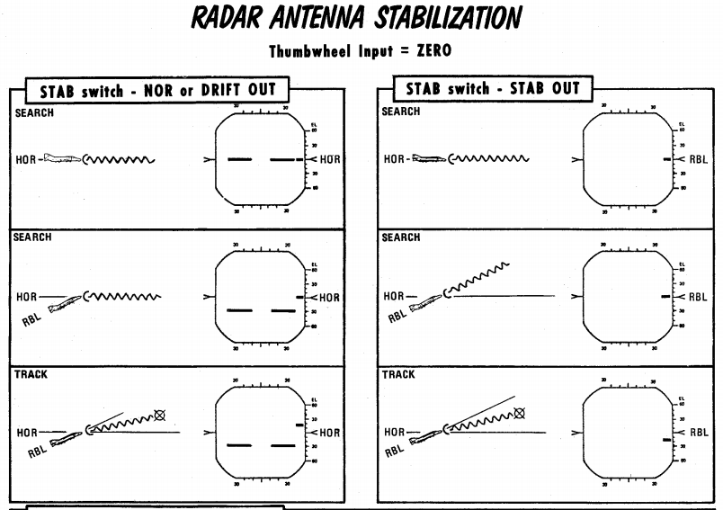

# 雷达操作

## 常规操作

### 磁控管和速调管

APQ-120 机载雷达套件通过磁控管和速调管两种方式来产生电磁能量。它们产生的辐射都通过天线馈入，并从喇
叭馈源发射。

#### 磁控管

磁控管是雷达主要的电磁波发射机。它负责产生用于探测和跟踪目标的脉冲能量。

当 [雷达电源旋钮](interface.md#电源旋钮) 位于 OPER 或 EMER 档位时，且满足下述所有互锁条件时，磁控管
才会发射脉冲能量。

磁控管受波导压力开关和温度互锁保护。如果其中任何一个联锁打开（可能是因为损坏或故障），可将
[雷达电源旋钮](interface.md#电源旋钮) 转至 EMER 档位来恢复运行，但在没有足够压力或冷却的情况下继续
使用磁控管可能会损坏磁控管并烧毁喇叭馈源。

磁控管在雷达开启 3 分钟后才开始通电。WSO 可以通过将 [雷达电源旋钮](interface.md#电源旋钮) 转至 EMER
档位来超控，但在没有充分预热的情况下使用磁控管可能会导致脉宽和时间不正确和/或脉冲功率下降。

#### 速调管

速调管负责产生连续射频信号，用来为半主动雷达制导的 AIM-7“麻雀”导弹提供调谐和制导。

当 [雷达电源旋钮](interface.md#电源旋钮) 处在 STBY、OPER 或
EMER，[雷达弹电源开关](../../cockpit/pilot/weapon_management.md#雷达弹电源开关) 处于 CW，并且满足下
述所有互锁条件时，速调管将发射信号。

速调管受两个温度开关、一个压力开关和一个浪涌电流开关保护。如果这些互锁中的任何一个（浪涌电流开关除
外）处在打开状态，可通过将 [雷达电源旋钮](interface.md#电源旋钮) 转到 EMER 即可以恢复工作，但可能会
损坏速调管和喇叭馈源。

速调管在雷达开启 100 秒后才开始通电。WSO 可以通过将 [雷达电源旋钮](interface.md#电源旋钮) 转至 EMER
档位来超控，但在没有充分预热的情况下使用速调管可能会导致功率降低。

### 馈源喇叭章动

要实现自动跟踪需要馈源喇叭章动，章动则通过绕天线轴转动射频能量来实现。章动将对雷达回波进行调制，在
跟踪时，天线将转向回波最强的地方，这将驱使天线持续对准被跟踪的目标。

这种章动的副作用是将雷达波束宽度从 3.7 度（半功率）增加到 6.7 度（半功率），但同时降低了波束的平均
强度。

下面介绍动作开关的章动设置。

| 档位旋钮                 | 距离旋钮 | 动作开关       | 章动 |
| ------------------------ | -------- | -------------- | ---- |
| RDR、BST、AIR-GND        | 全部     | 松开           | 是   |
| MAP                      | 全部     | 松开           | 否   |
| MAP-PPI                  | 全部     | 第一段或第二段 | 否   |
| RDR、MAP-B、BST、AIR-GND | AI       | 第一段或第二段 | 是   |
|                          | 非 AI    | 第一段或第二段 | 是   |
|                          |          | 第二段         | 否   |

### 天线稳定

系统有三种天线稳定模式。其中两项适用于 [空对空操作](#空对空操作)，另一项适用于
[空对地操作](#空对地操作)。

#### NOR

天线相对稳定正常工作。

在 [自动搜索](#自动搜索) 模式下，雷达天线在俯仰和横滚方向上相对地平线稳定（雷达平面）。雷达扫描的中
心朝飞机航向延伸，在自动搜索模式下，显示器上的 0 度标记指示地平线。

在 [空对地测距](#空对地测距) 中，天线将指向雷达瞄准轴线，但使用漂移补偿。

#### DRIFT OUT

与 NOR 大致相同，但移除漂移补偿。

#### STAB OUT

在 [自动搜索](#自动搜索) 模式中，天线并不会保持相对地平线稳定，而是相对飞机基准稳定。

在 [空对地测距](#空对地测距) 模式下，天线在移除漂移补偿的情况下瞄准雷达瞄准轴线。在此模式下，显示器
上的零度标记指示雷达瞄准轴线。

### 脉冲设置

脉冲设置将决定雷达套件的几个特性。这些特性包括发射脉冲的长度、用于放大信号的放大器、发射脉冲的频率
（脉冲重复频率）。

[脉冲开关](interface.md#脉冲开关) 用于控制脉冲设置。LONG 和 SHORT 设置将强制脉冲设置进入该模式
。AIR-GND 和自动截获例外，选择这些模式时将强制进入 SHORT 设定。

| 模式  | 放大器 | 脉冲重复频率（PRF）设置（Hz） | 脉宽 (微秒) |
| ----- | ------ | ----------------------------- | ----------- |
| LONG  | 窄带   | 370                           | 2.0         |
| SHORT | 背偏   | 1060                          | 0.4         |

AUTO 设置启用下述功率电平模式切换（PLMS）。

#### 功率电平模式切换

功率电平模式切换根据目标距离、回波强度、噪声信号等多种条件自动选择 LONG 或 SHORT、窄带或背偏放大器
。

### 增益控制

放大进入接收机的信号的称为增益。增益设置对搜索和跟踪操作都很重要。

#### 手动增益控制

WSO 可以手动调整增益设置，这将更改回波的显示方式。较高的增益设置会放大所有回波信号，但可能会产生大
量噪声和过饱和，从而导致雷达成像难以识别。较低的增益设置将提供更好的目标对比度，但较弱的回波将不可
见，这可能会降低雷达的探测距离。当雷达锁定时，增益控制切换到 [自动增益控制电路](#自动增益控制)，不
再使用手动增益控制。

正确的增益设置需要充分的经验以实现合适的平衡，根据搜索的一般经验法则，WSO 应逐渐增加增益，直到雷达
上开始出现少量噪声（随机斑点）。

除了接收机增益外，显示屏还具有图像矫正功能，调整增益后，图像可能需要扫描几次才能正确矫正。

#### 自动增益控制

一旦雷达进入跟踪状态，自动增益控制将接管增益设置。系统使用距离跟踪门内的目标自动调整增益，来保持目
标跟踪信号一致性。

### 灵敏度时间控制（STC）

雷达回波的强度以 1/r^4 递减，其中 r 是距离。这意味着在正常显示器上，雷达回波的亮度会随着距离的增加
而变暗。在地形测绘下，APQ-120 抵消了这种影响。[雷达模式旋钮](interface.md#雷达模式mode旋钮) 在 MAP
并且，[显示旋钮](interface.md#显示旋钮) 在 PPI 模式下以启用灵敏度时间控制。这将使接收机增益随距离增
加呈指数级增加，以抵消回波功率随距离增加而降低。这使得在远距离上也能得到接近一致的回波亮度。

## 空对空操作

雷达空对空操作包括 RDR-B 和 MAP-B 模式以及 BST 模式。RDR-B 和 MAP-B 可以与自动搜索一起使用，而 BST
模式可以用作近距离模式来截获瞄准轴上的目标。

### 自动搜索

在自动搜索过程中，天线在雷达平面内来回移动，搜索的限制由 [显示旋钮](interface.md#显示旋钮) 决定，当
旋钮位于 WIDE 档位时雷达搜索扇面为 120°，在 NAR 档位时搜索限制为 45 度。只有带 B 的旋钮档位可用于空
对空操作。

将 [雷达模式旋钮](interface.md#雷达模式mode旋钮) 旋钮转动至 RDR 或 MAP 档位来选择自动搜索。在 RDR
中，可以通过 [扫描开关](interface.md#扫描开关) 来选择扫描线数。在 MAP 中，无论扫描开关设置档位，都
只使用 1 线扫描。喇叭馈源章动与 RDR 一起使用，MAP 不使用，使用章动将导致在 RDR 中预计波束宽度约为
6.7 度，在 MAP 中波束宽约为 3.7 度。

在雷达模式旋钮选择 BST 或 AIR-GND 档位后，天线将沿雷达瞄准轴线扫描。

下面显示了自动搜索和瞄准轴模式中常见的符号。

| 项目 | 名称     | 描述                                                                                                                                                                                                                                                               |
| ---- | -------- | ------------------------------------------------------------------------------------------------------------------------------------------------------------------------------------------------------------------------------------------------------------------ |
| a    | 距离显示 | 显示当前选定或强制显示的距离                                                                                                                                                                                                                                       |
| b    | 雷达光标 | 雷达光标用于选择目标，并显示当前选择的距离和方位。使用天线手控来移动。                                                                                                                                                                                             |
| c    | 天线仰角 | 显示相对于雷达平面，或如果[Stab 开关](interface.md#stab-开关) 处在 OUT 档位，显示相对飞机的天线仰角（以度为单位）。使用天线手控仰角拨轮来移动仰角。                                                                                                                |
| d    | 雷达方格 | 左右垂直线显示左 30 度和右 30 度。该测量值当[Stab 开关](interface.md#stab-开关) 设置为 NOR 或 DRIFT OUT 时相对雷达平面以及将 [Stab 开关](interface.md#stab-开关) 设置为 OUT 时表示相对飞机。每条水平线划分一个刻度标记，刻度之间的间隔为显示器当前距离设置的 1/5。 |
| e    | 地平线   | 显示地平线，[Stab 开关](interface.md#stab-开关) 在 NOR 或 DRIFT OUT 档位时显示                                                                                                                                                                                     |

### 截获

WSO 可通过 B 显在任意雷达模式下截获目标。

[雷达模式旋钮](interface.md#雷达模式mode旋钮) 在 RDR 或 MAP 档位时，WSO 按下天线手控杆扳机第一段后
，系统将开始进行截获，在 RDR 或 MAP 中，天线方位将跟随截获符号移动。在可以使用截获的所有模式中，截
获符号的距离将用于设置锁定所需的距离。

| 项目 | 名称     | 描述                                                                                                                                       |
| ---- | -------- | ------------------------------------------------------------------------------------------------------------------------------------------ |
| a    | B-Sweep  | B-Swep 沿天线方位显示当前的雷达回波，截获和跟踪都将显示回波。                                                                              |
| c    | 截获符号 | 与雷达光标一样，截获符号显示当前选定的方位和距离。截获符号跟随天线手控杆一起移动。跟踪时截获符号也会显示在显示器中，以指示目标距离和方位。 |
| c    | 目标回波 | 沿方位显示的目标回波                                                                                                                       |

### 跟踪

WSO 可以通过首先进入截获状态，在截获符号包住目标后，按下扳机第二段来指令进入自动跟踪状态，此时雷达
将进入自动跟踪。

雷达采取的跟踪类型取决于所选模式。有两种类型的跟踪环路可用，角跟踪和距离跟踪。两者将在下文中进行描
述。

| 项目   | 名称         | 描述                                                                                     |
| ------ | ------------ | ---------------------------------------------------------------------------------------- |
| a      | 显示读数     | 显示读数取决于[态势旋钮](interface.md#态势旋钮) 的档位                                   |
| b      | 允许转向误差 | 显示最大离轴发射包线，见[允许转向误差](interface.md#allowable-steering-error-ase-circle) |
| c 和 e | 发射距离射线 | 指示发射包线，见[发射距离射线](interface.md#range-strobes) 描述                          |
| d      | 瞄准点       | 为飞行员转向引导，参见[瞄准点](interface.md#aim-dot)                                     |

在 WSO 驾驶舱中，有一个 [内嵌的 T](interface.md#跟踪灯t) 指示灯，在进入距离跟踪状态时将亮起。

#### 角跟踪

角度跟踪环路利用喇叭馈源章动（锥形扫描）来移动天线使目标居中。天线会朝向章动扫描路径中幅度最大的方
向。因此，如果不进行章动，就无法实现角跟踪（MAP-B 在使用截获时开始章动）。

使用 [机动开关](interface.md#机动开关) 来对角跟踪进行设置，HI 和 LOW 档位，这些设置将对角跟踪环路中
的加速度进行限制。

天线转向有几个重要功能：

- 在仰角和方位上跟踪目标位置。
- 为 AIM-7“麻雀”提供导引头瞄准角度来使其能够锁定目标。
- 用连续波射频能量照射目标为“麻雀”提供制导。

#### 距离跟踪

雷达使用距离门来选择距离内的目标，其环路只使用处在距离门内的雷达回波，这有助于消除杂波和其它目标，
并允许角跟踪环路在没有误差信号的情况下准确跟踪被选中的目标。

在距离跟踪状态下，距离门使用雷达回波自动修正距离门和目标回波之间的任何误差。误差修正将导致距离门移
动，距离门移动的速度为接近率并将显示在屏幕上，接近率还用于为麻雀导弹提供接近率，来设置导弹进行目标
跟踪的速度门。

距离跟踪可以在记忆模式下工作。当处于记忆模式时，距离门将继续以上次计算出的接近率向下移动。当进入记
忆模式后，DSCG 上的 SKIN TRK 灯和 T 灯将熄灭，接近率数字将开始以 4 Hz 的频率闪烁。如果由于目标丢失
而进入记忆模式，则如果目标未在 5 秒内重新出现，系统将解除锁定。

在以下几种情况下将进入记忆模式：

- 选择手动搜索（[跟踪开关](interface.md#跟踪开关)）。
- 目标丢失。
- 探测到干扰状态。

#### 干扰源寻的

雷达中的背偏放大器根据回波的整体强度产生噪声信号。一旦该噪声信号超过某个阈值，系统就会将其视为干扰
，并进入 HOJ 状态。距离跟踪环路进入记忆模式，角跟踪环路继续工作，在仰角和方位上跟踪干扰目标。

DSCG 上内嵌 H 灯亮起同样表示进入干扰源寻的状态，接近率的最后一位将被 H 替代并开始闪烁。

### 聚束

在 100 英里到 200 英里距离内，一种称为聚束的程序可以用于手动保持雷达照射目标。聚束需要将截获光标放
置在所需的回波信号上，然后选择并按住天线手控杆扳机第二段。之后，天线将开始章动并恢复到所选的极化开
关选项，以增加目标清晰度，但不尝试自动锁定。通过保持扳机第二段，并使用天线手控杆手动跟随回波，直到
目标进入可以锁定距离前（适当调整距离设置；雷达无法尝试锁定不兼容的距离设置），可以使目标保持在良好
的可观察状态。

### 拦截计算

LRU-1 拦截计算机可以计算[麻雀](../../stores/air_to_air/aim_7.md) 和
[响尾蛇](../../stores/air_to_air/aim_9.md) 导弹的发射包线。

#### 发射距离射线

DSCG 可以在任何时间显示两个表示导弹包线的发射距离射线。有三种可能的射线类型。

| 距离指示 | 描述                                                     |
| -------- | -------------------------------------------------------- |
| Rmax     | 如果目标继续按照当前航向和航线飞行，导弹的最大发射距离。 |
| Rmax2    | 如果目标立刻以高 G 机动掉头逃离，导弹的最大发射距离。    |
| Rmin     | 导弹允许的最小发射距离。                                 |

| 选定导弹 | 显示的射线    |
| -------- | ------------- |
| 麻雀     | Rmax 和 Rmax2 |
| 响尾蛇   | Rmax 和 Rmin  |

所有发射距离都是为从有效的按下发射开关，而非武器离架开始计算出的。这意味着，显示器显示进入导弹包线
，即可扣动扳机。

#### 允许转向误差（ASE）圆

允许的转向误差表示导弹可以发射并且仍然保持高命中概率的最提前或滞后的角度。一旦达到 Rmax，圆直径将逐
渐增大，并且随着目标距离接近 Rmin，圆直径开始逐渐减小。

在选择麻雀系列导弹的情况下，AIM-7E 的 ASE 圆最大尺寸为 25 度，AIM-7F 的 ASE 圆大小为 35 度。

在选择响尾蛇导弹的情况下下，当导引头处于锁定状态时，ASE 圆的大小固定在 1.2 度。在导引头解锁后，ASE
圆如上所述动态地变化大小，最大直径对应 25 度。

#### 瞄准点

瞄准点向飞行员提供转向指令。有三种不同的类型：

1. 碰撞转向，通过将战斗机置于拦截路线上，最大限度地缩短拦截时间。
2. 过渡转向。这从 Rmax 2 海里外开始，将飞机转向下一种转向类型。
3. 计算出的追踪转向，在 Rmax 内使用提前追踪将最大限度地减少导弹发射后所需的机动。

#### 发射/发射距离内灯

只要满足以下条件，发射灯将亮起：

- 瞄准点在 ASE 圆内
- 目标在 Rmax 和 Rmin 之间

如果选择了麻雀导弹，那么当目标态势为 90 度+/-9 度（左或右）且未高出地平线 5 度以上时，发射灯不会亮
起。这样可以防止将麻雀射向主瓣的杂波中。

#### 保持高度灯

如果满足以下条件，保持高度灯将亮起：

- 距离大于计算出的急跃升距离。
- 高度超过 32000 英尺。
- 目标高出战机 8000 英尺以上。

当指示灯亮起时，瞄准点的方位误差应在灯光熄灭后进行修正，此时，战斗机应当进行急跃升来使瞄准点居中。

#### 脱离 X

在所有模式下（VI 除外），当目标的距离低于计算出的 Rmin 时，将显示脱离 X 符号以指示到最小发射距离。

在目视拦截（ VI ）模式中，当距离小于 1000 英尺时，会显示脱离 X 符号。

当显示脱离 X 符号时，ASE 圆也将被移除。

### 发射互锁

系统设有几个互锁可以防止在不利条件下发射导弹。

对于响尾蛇来说，唯一的互锁为防止襟翼处于放下档位时发射导弹。

对于麻雀导弹，有几个条件：

- 瞄准点必须在 ASE 圆内
- 发射距离内和射击灯必须亮起
- 不得进入脱离 X 状态
- 所选模式不得为目视拦截

在 HOJ 状态下或当麻雀在瞄准轴模式下发射时，系统将自动超控互锁。互锁也可通过互锁开关来手动进行超控。

### 瞄准轴和锁定状态

#### 瞄准轴

机组可以通过选择 [模式旋钮](interface.md#雷达模式mode旋钮) 的 BST 档位或按下油门上的锁定按钮来进入
瞄准轴模式。后者进入一个与通过 BST 档位进入瞄准轴非常相似的锁定状态，只是锁定状态将距离限制在 5 海
里内，并强制使用机动开关 HI 档位设置。

当处于瞄准轴模式时，天线将固定在雷达瞄准轴线上，雷达回波将像截获模式一样显示在显示器中。WSO 可以像
在自动搜索中一样，扣动扳机第一段来截获目标，然后扣动第二段来进入跟踪，系统将正常开始距离和角跟踪。

[麻雀](../../stores/air_to_air/aim_7.md) 可以在无跟踪目标的情况下发射。但是，飞行员必须将目标置于瞄
准具准星内，WSO 需要调整到合适的 [态势设置](interface.md#态势旋钮)，然后即可发射麻雀。

#### 锁定状态

锁定状态是一种近距离格斗模式，飞行员可通过按下油门握把上的锁定按钮随时进入锁定状态。默认情况下会使
雷达进入上述瞄准轴模式。

当进入锁定模式时，会发生以下变化：

- 后座的空对空灯亮起。
- 扳机控制转换至空对空武器（包括选择 ARM 和 TV 时）
- 光学瞄准具切换到 A/A 模式。
- 计算机自动截获可用。

如果在按下锁定按钮并且小指开关处在雷达或红外档位前进入锁定状态，按下锁定按钮后雷达将脱锁并返回至瞄
准轴模式。如果小指开关处在航炮则不会脱锁。

前后座都可以退出锁定模式，飞行员可以通过将武器选择旋钮置于或移出 B 档位来退出。如果飞行员将武器选择
旋钮留在 B 档位，并不会禁止后续再次进入锁定模式。WSO 可以通过按下
[空对空按钮](interface.md#空对空按钮) 退出锁定模式。

#### 计算机自动截获模式（CAA）

一旦进入锁定模式，机组即可使用前轮转向按钮选择雷达的计算机自动截获模式。在 CAA 模式下，雷达将进入一
个 78 度高、15 度宽以及三线扫描宽的垂直指向栅状扫描。由于 APQ 软件的限制，栅状扫描内的实际雷达锁定
能力为从地平线上方+45 度到地平线下方-9 度。如果雷达在扫描区内找到合适的目标，系统将锁定这个目标。如
果机组人员发现锁定的不是预期目标，可以按下任意驾驶杆中的前轮转向按钮，使雷达返回搜索模式。

在 CAA 模式下，飞行员可以使用小指开关向左、向右或居中雷达的扫描区。

| 小指开关选择 | 扫描中心    |
| ------------ | ----------- |
| 航炮         | 左 (-15 度) |
| 红外         | 中 (0 度)   |
| 雷达         | 右(+15 度)  |

如需退出 CAA，飞行员可以通过将武器选择旋钮置于或移出 B 档位，或者由 WSO 按下空对空按钮来退出。如果
在退出模式时存在雷达锁定，系统将保留锁定。

## 空对地操作

雷达空对地工作包括 AIR-GRD、RDR-PPI 和 MAP-PPI 模式。AIR-GRD 模式被用作 WRCS DT 的一种雷达测距形式
。RDR-PPI 和 MAP-PPI 在 WRCS 偏置轰炸和目标搜寻模式下使用。

### 空对地测距

当 [模式旋钮](interface.md#雷达模式mode旋钮) 处在 AIR-GRD 档位时，AIR-GRD 模式可用。AIR-GRD 用于空
对地测距且仅在 AI 距离内可用。在这种模式下，天线固定在雷达瞄准轴线上，同时使用漂移补偿相对稳定，在
INS 故障时，可以通过将 [Stab 开关](interface.md#stab-开关) 设置到 Drift Out 档位来移除漂移修正。

AIR-GRD 模式禁用 [角跟踪](interface.md#角跟踪) 操作，仅使用 [距离跟踪](interface.md#距离跟踪)。锁定
后，系统将对主瓣杂波（地面雷达回波）进行距离跟踪。

如需使用 AIR-GRD，应选择 5 或 10 海里距离。一旦识别出目标，飞行员应以 10-40 度角向目标俯冲。应当减
小接收机增益来将主瓣杂波信号接收距离缩短至 1/2 海里。这样做是为了防止错误跟踪旁瓣，导致测距信息出错
。

AIR-GRD 截获程序如下：

1. 调整接收机增益以将杂波信号接收距离缩短到 1/2 海里。
2. 将距离射线置于杂波信号上。
3. 动作开关扣动扳机第一段，接着第二段。ASE 圆可见后松开。
4. 确认锁定。

💡 雷达可以跟踪 25000 英尺以外的地面杂波，但可以输入至 WRCS 的最大值为 25000 英尺。

有时会出现错误跟踪，机组可通过显示在光学瞄准具或雷达上的斜距快速缩短来观察到。

要纠正错误跟踪，可以采取以下措施：

1. 按下动作开关至扳机第一段，松开。
2. 再次开始截获程序。

### 地图模式（PPI）

雷达地图模式 PPI（平面位置显示器）是一种相对飞机，显示雷达回波图其真实位置的显示。飞机位置在显示器
的底部中央，与显示器纵轴平行的垂线和飞机航迹相平行。平行于显示器横轴的线将从航迹中偏置出去，最大偏
移量为当前显示距离的一半。

WSO 可以通过将 [显示旋钮](interface.md#显示旋钮) 转至 PPI-WIDE 或 PPI-NAR 来访问 PPI 模式。在 5 海
里距离时，始终使用 B 显显示模式（MAP B）。

距离光标为飞机延伸出去的恒定距离弧线。偏置光标则平行于飞机航迹向左或向右进行偏置。偏置光标和距离光
标仅在 PPI 模式下显示。

如果
[武器投放模式](../../systems/weapon_systems/multiple_weapons_system.md#模式选择---投放模式旋钮) 设
置为 TGT FIND 或 OFFSET，或 [雷达模式旋钮](interface.md#雷达模式mode旋钮) 设置为 BEACON，距离和偏置
光标都将出现在显示器中。除开前述三种模式，其它情况则仅在固定距离上显示距离光标，此时距离光标的位置
需由地勤调整。

[纵向距离拨轮](../../cockpit/wso/right_console/center_section.md#纵向距离拨轮) 用于增加和减少当前距
离光标的设置。[横向距离拨轮](../../cockpit/wso/right_console/center_section.md#横向距离拨轮) 用来沿
着飞机航迹向左或向右移动偏置光标。

