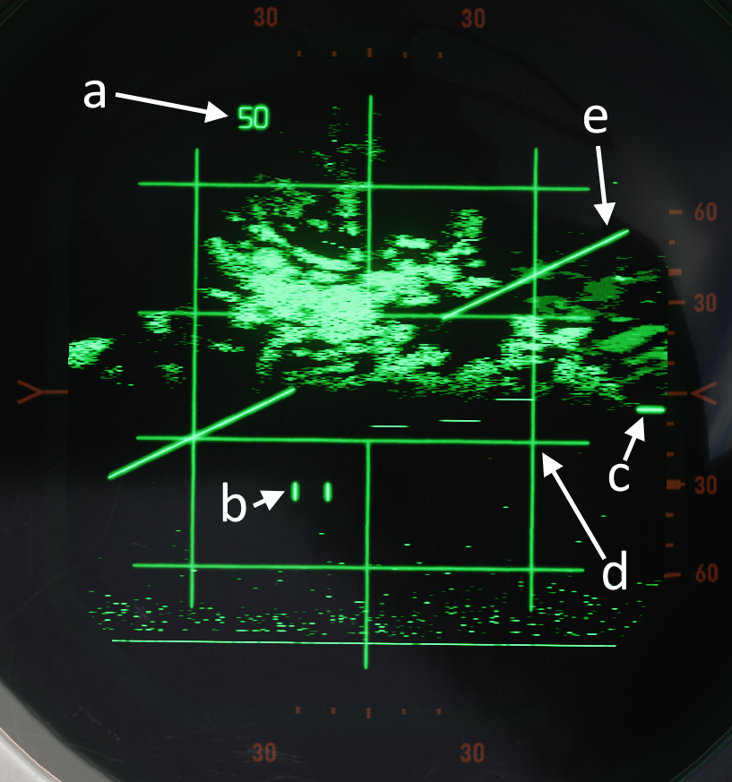
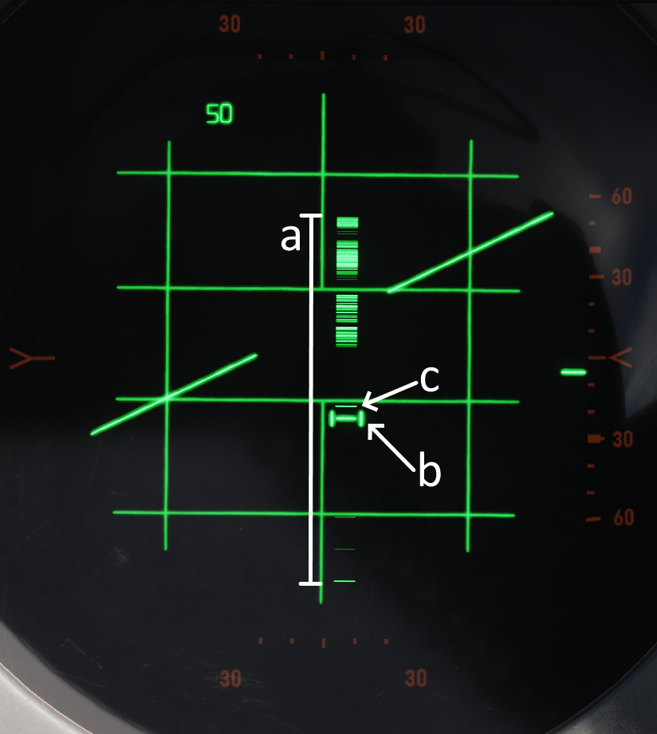
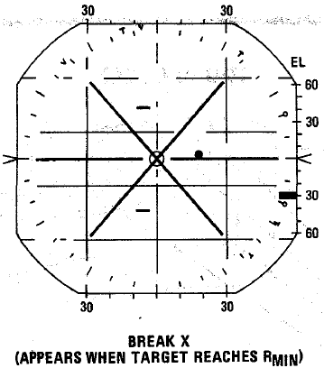
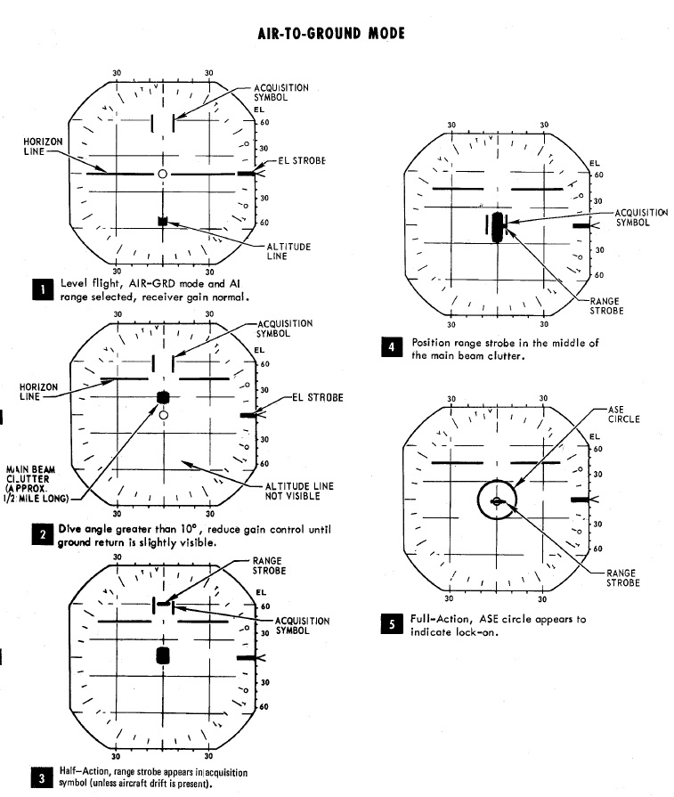
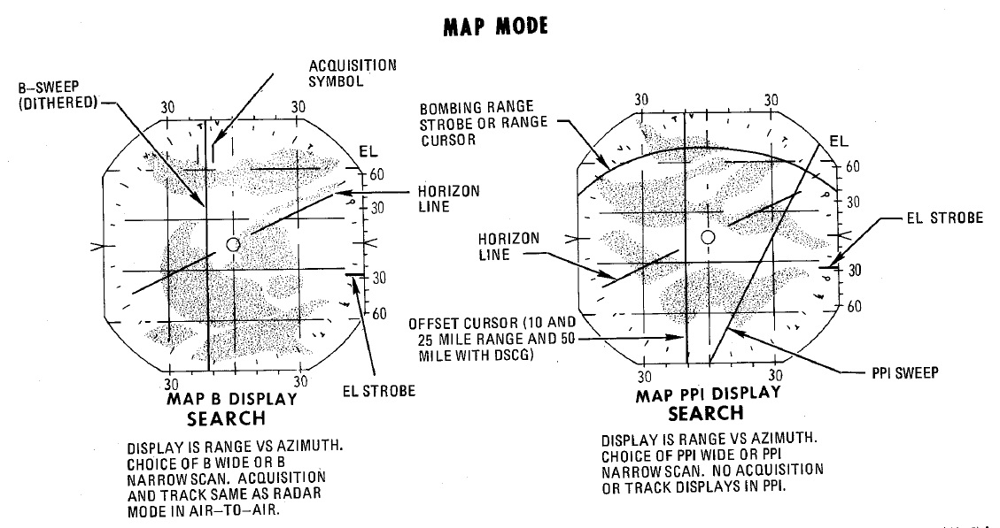

# Radar Operation

## General Operation

### Magnetron and Klystron

The magnetron and klystron are the two methods for producing radio frequency
energy in the APQ-120 radar set. Both the magnetron and klystron radiation is
fed through the antenna and emitted from the feedhorn.

#### Magnetron

The magnetron is the main radio frequency emitter for the radar. It produces
pulsed energy which is used to detect and track targets.

Magnetron emission is only present when the
[Radar Power Knob](interface.md#power) is in OPER or EMER and all interlocks
described below are satisfied.

The magnetron is protected by a wave guide pressure switch and a temperature
interlock. If either of these interlocks are open (possibly because of damage or
malfunction) the [Radar Power Knob](interface.md#power) can be moved into EMER
to return operation, however operation of the magnetron without adequate
pressure or cooling, may damage the magnetron and can burn the feedhorn.

The magnetron is not powered until 3 minutes after radar turn on. This can be
overridden by moving the [Radar Power Knob](interface.md#power) into EMER,
however operating the magnetron without sufficient warm up may result in
incorrect pulse width and timing and/or degraded pulse power.

#### Klystron

The klystron produces continuous wave radio frequency energy, which is used to
tune and guide the sparrows.

The klystron emissions are present when the
[Radar Power Knob](interface.md#power) is in STBY, OPER or EMER, the
[Radar Missile Power Switch](../../cockpit/pilot/weapon_management.md#radar-missile-power-switch)
is in CW and all interlocks described below are satisfied.

The klystron is protected by two temperature switches, a pressure switch and a
surge current switch. If any of these interlocks (with the exception of the
surge current switch) are open the [Radar Power Knob](interface.md#power) can be
moved into EMER to return operation, however damage to the klystron and feedhorn
may result.

The klystron is not powered until 100 seconds after radar turn on. This can be
overridden by moving the [Radar Power Knob](interface.md#power) into EMER,
however operating the klystron without sufficient warm up may result in degraded
power.

### Feedhorn Nutation

Feedhorn nutation is required for automatic tracking. The feed horn nutates to
rotate the radiated energy around the antenna axis. This modulates the radar
echos. Where the echo is strongest the antenna will steer if tracking, this
drives the antenna back onto a tracked target.

A side-effect of this nutation is increasing the beam-width, from 3.7 degrees
(half power) to 6.7 degrees (half power) while reducing the average intensity of
the beam.

Below describes the nutation settings for the action switch.

| Mode Knob                | Range Knob | Action Switch       | Nutation |
| ------------------------ | ---------- | ------------------- | -------- |
| RDR, BST, AIR-GND        | ALL        | Release             | Yes      |
| MAP                      | ALL        | Release             | No       |
| MAP-PPI                  | ALL        | Half or Full Action | No       |
| RDR, MAP-B, BST, AIR-GND | AI         | Half or Full Action | Yes      |
|                          | Not AI     | Half Action         | Yes      |
|                          |            | Full Action         | No       |

### Antenna Stabilization

There are three antenna stabilization modes. Two apply to
[Air-To-Air Operation](#radar-operation-air-to-air) and the other to
[Air-To-Ground Operation](#radar-operation-air-to-ground).

#### NOR

Normal operation of the antenna stabilization.

In [Automatic Search](#automatic-search) Antenna is stabilized in pitch and roll
to the horizon (radar plane). The center of the radar scan is along the heading
of the aircraft. In this mode the zero degree mark on the display indicates the
horizon.

In [Air-To-Ground Ranging](#air-to-ground-ranging) Antenna is boresighted to the
radar boresight line but stabilized in drift.

#### DRIFT OUT

The same as NOR but drift stabilization is removed.

#### STAB OUT

In [Automatic Search](#automatic-search) Antenna does not stabilize to the
horizon, but instead th aircraft reference.

In [Air-To-Ground Ranging](#air-to-ground-ranging) Antenna is boresighted to
radar boresight line without drift stabilization. In this mode the zero degree
mark on the display indicates the radar boresight line.

### Pulse Setting

The pulse setting determines several characteristics of the radar set. These
include the length of the transmitted pulse, which amplifier is used to amplify
the signals, the frequency at which the pulses are emitted (pulse repetition
frequency).

The [Pulse Switch](interface.md#pulse-switch) controls the pulse setting. The
LONG and SHORT settings force the pulse setting into that mode. With the
exception of AIR-GND, and Automatic Acquisition which force the mode into the
SHORT setting.

| Mode  | Amplifier   | Pulse Repetition Frequency (PRF) Setting (Hz) | Pulse Length (microseconds) |
| ----- | ----------- | --------------------------------------------- | --------------------------- |
| LONG  | Narrow Band | 370                                           | 2.0                         |
| SHORT | Back Bias   | 1060                                          | 0.4                         |

The AUTO setting enables the power-level mode switching (PLMS) described below.

#### Power Level Mode Switching

Power Level Mode Switching automatically selects the LONG or SHORT, and Narrow
Band or Back Bias, amplifiers depending on several conditions such as target
range, echo strength, noise signal.

### Gain Control

The amplification of the signals that enter the receiver is called the gain. The
gain setting is important to both search and tracking operations.

#### Manual Gain Control

The gain can be altered manually. This changes how returns are displayed. Higher
gain settings amplify all echos but can result in noise and saturation resulting
in degraded image. Lower gain settings will result in better target contrast,
however weaker returns will not be visible, this can degrade detection range.
When radar locks on the gain control is switched to the
[Automatic Gain Control Circuit](#automatic-gain-control) and manual gain
control no longer is used.

Getting the correct gain is a balance and comes with experience, as a general
rule of thumb for search the gain should be increased until a small amount of
noise (random specks) begins to show.

Along with receiver gain the display also has image levelling, after adjusting
the gain it may take a few scans for the image to adjust the level correctly.

#### Automatic Gain Control

The automatic gain control takes control of the gain setting once the radar is
in track. The gain is adjusted automatically using the target within the range
tracking gate to provide a consistent target signal for tracking.

### Sensitivity Time Control (STC)

The strength of a radar echo falls off with 1/r^4 where r is the range. This
means on a normal display the brightness of the radar returns will get dimmer
with distance. For ground mapping the APQ-120 counteracts this effect. With the
[Radar Mode Knob](interface.md#radar-modes-mode) in MAP and the
[Display Knob](interface.md#display-knob) in a PPI mode. Sensitivity Time
Control is enabled. This exponentially increases the receiver gain with range to
counteract the echo power fall off with range. This provides an approximately
even brightness with increasing range.

## Air-To-Air Operation

Radar operation air-to-air includes RDR-B and MAP-B modes along with the BST
mode. RDR-B and MAP-B can be used with automatic search and BST mode can be used
as a close range mode to cue a target on the boresight.

### Automatic Search

During automatic search, the antenna moves back and forth in the radar plane.
The limits of this search are determined by the
[Display Knob](interface.md#display-knob). Search is normally 120 degrees wide
with the display knob in WIDE positions, in NAR positions the search is limited
to 45 degrees wide. Only Display Knob positions with B are usable with
Air-To-Air operations.

The [Radar Mode Knob](interface.md#radar-modes-mode) knob is used to select
automatic search by selecting either RDR or MAP. In RDR the number of bars can
be selected by the [Scan Switch](interface.md#scan-switch). In MAP only 1 bar is
used regardless of scan switch. Feed horn nutation is used with RDR but not MAP
leading to an estimated beam-width of approximately 6.7 degrees in RDR and 3.7
degrees in MAP.

Selecting BST or AIR-GND on the Radar Mode Knob antenna scan is boresighted
along the radar boresight line.

Below shows the usual symbology present in Automatic Search and Boresight Modes.

| Item | Name              | Description                                                                                                                                                                                                                                                                                                                                                                                |
| ---- | ----------------- | ------------------------------------------------------------------------------------------------------------------------------------------------------------------------------------------------------------------------------------------------------------------------------------------------------------------------------------------------------------------------------------------ |
| a    | Range Display     | Shows Current Selected or Forced Range                                                                                                                                                                                                                                                                                                                                                     |
| b    | Radar Cursor      | The radar cursor is used to select targets and displays the current selected range and azimuth. It is moved by the antenna hand control.                                                                                                                                                                                                                                                   |
| c    | Antenna Elevation | Shows Antenna elevation (in degrees) relative to the radar plane, or aircraft if the [Stab Switch](interface.md#stab-switch) is in OUT. This can be moved with the antenna hand control elevation wheel.                                                                                                                                                                                   |
| d    | Radar Grid        | Left and Right Vertical Lines show 30 degrees left and 30 degrees right. This measurement is relative to the radar plane with the [Stab Switch](interface.md#stab-switch) in NOR or DRIFT OUT and relative to the aircraft with the [Stab Switch](interface.md#stab-switch) in OUT. Each horizontal line marks a scale where the gaps are 1/5 of the current range setting of the display. |
| e    | Horizon Line      | Shows the Horizon Line, Only present with [Stab Switch](interface.md#stab-switch) in NOR or DRIFT OUT                                                                                                                                                                                                                                                                                      |

### Acquisition

Acquisition can be used with any radar mode which uses B-Scope and is used to
achieve tracking condition.

With the [Radar Mode Knob](interface.md#radar-modes-mode) in RDR or MAP, Half
Action can held on the antenna hand control trigger. This begins acquisition, in
RDR or MAP the antenna azimuth will follow the acquisition symbol. In all modes
where acquisition can be used the range of the acquisition symbol will set the
desired range for lock-on.

| Item | Name               | Description                                                                                                                                                                                               |
| ---- | ------------------ | --------------------------------------------------------------------------------------------------------------------------------------------------------------------------------------------------------- |
| a    | B-Sweep            | The B-Sweep displays the current radar echos along the azimuth of the antenna, these are displayed in both acquisition and track.                                                                         |
| c    | Acquisition Symbol | Like the Radar Cursor the acquisition symbol shows the current selected azimuth and range. It is moved with the antenna hand control. It is also displayed in track to indicate target range and azimuth. |
| c    | Target Echo        | Target Return Displayed Along the Azimuth                                                                                                                                                                 |

### Track

Automatic tracking can be commanded by first entering acquisition and then once
the target has been bracketed by the acquisition symbol Full Action can be
depressed. The radar will enter automatic track.

The type of track entered depends on the selected mode. There are two types of
tracking circuits available, angle tracking and range tracking. These will both
be described below.

| Item    | Name                     | Description                                                                                                               |
| ------- | ------------------------ | ------------------------------------------------------------------------------------------------------------------------- |
| a       | Display Readout          | Display Readout depends on the position of the [Aspect Switch](interface.md#aspect)                                       |
| b       | Allowable Steering Error | Describes Max off Angle Launch Envelope, See [Allowable Steering Error](interface.md#allowable-steering-error-ase-circle) |
| c and e | Range Strobes            | Indicates Launch Envelope, See [Range Strobes](interface.md#range-strobes) Description                                    |
| d       | Aim Dot                  | Provides pilot steering, See [Aim Dot](interface.md#aim-dot)                                                              |

In the WSO Cockpit there is an [engraved T](interface.md#track-light-t) which
illuminates if a range track condition present.

#### Angle Track

Angle tracking circuit steers the antenna to keep the target centred. It does by
making use of feedhorn nutation (conical scan). The antenna steers towards the
direction of highest amplitude in the nutation scan pattern. As a result angle
tracking cannot be achieved without nutation (MAP-B begins nutation when using
acquisition).

Angle Tracking has two settings set by the
[Maneuver Switch](interface.md#maneuver-switch), HI and LOW. These set limits on
the acceleration in the angle tracking circuits.

Antenna steering has several important functions:

- Tracking Target Location in elevation and azimuth
- Providing head aiming angles to the sparrow for sparrow lock-on.
- Illuminating the target with continuous wave radio frequency energy for
  sparrow guidance.

#### Range Track

The radar uses a range gate to select a target in range. The uses only radar
returns within the range gate for its circuits. This helps eliminate clutter and
other targets, and allows angle tracking circuits to accurately track the target
of interest without erroneous signals.

In range track the range gate uses the radar echos to automatically correct any
error between the range gate and the target echo. This causes the range gate to
move, the rate at which the range gate moves is the closure velocity and
displayed on the screen, this is also used to supply the sparrow with a closure
velocity to set the sparrow speed gate for target tracking.

Range track can operate in memory mode. When in memory mode the range gate will
continue to move down at the last calculated closure velocity. When this occurs
the SKIN TRK light and T light on the DSCG will go out, the range rate digits
will begin to flash at 4 Hz. If memory mode was entered because the target was
lost the system will drop lock if the target does not reappear within 5 seconds.

Memory Mode will be Entered under several conditions:

- Manual Search is Selected ([Track Switch](interface.md#track-switch))
- Target is lost.
- Jamming condition is detected.

#### Home On Jam

The back bias amplifier in the radar produces a noise signal based on the
overall strength of the echos. Once this noise signal exceeds some threshold the
system will consider it a jamming condition and enter home on jam. The range
track circuit goes into memory mode, the angle track circuit continues to
operate and track the jamming target in elevation and azimuth.

The Home On Jam condition is also indicated by the engraved H on the DSCG and
the last zero of the closure velocity is replaced by a H along with the closure
rate flashing.

### Spotlight

In the 100 and 200 mile ranges, a procedure known as Spotlight can be used to
maintain radar monitoring of a target manually. Spotlighting entails placing the
acquisition cursor over the desired return, then selecting and holding the full
action trigger position of the Antenna Hand Controller. Doing so, the antenna
will nutate and revert to the chosen Polar switch selection to increase target
definition, but without attempting the automatic lock-on. The target can be
maintained in a well-observable state by holding full action and following the
target return with the Antenna Hand Controller until it reaches a range that
lock-on can be achieved (with the applicable change in range setting; the radar
cannot attempt a lock at an incompatible range setting).

### Intercept Computations

The LRU-1 intercept computer can calculate firing envelopes for the
[Sparrow](../../stores/air_to_air/aim_7.md) and
[Sidewinder](../../stores/air_to_air/aim_9.md) Missiles.

#### Range Strobes

The DSCG can display two range strobes at any given time representing the
missile envelope. There are three possible strobe types.

| Range Indication | Description                                                                                      |
| ---------------- | ------------------------------------------------------------------------------------------------ |
| Rmax             | Maximum range of the missile provided the target continues flying on current heading and course. |
| Rmax2            | Maximum range of the missile if the target performs the shortest high g turn to tail aspect.     |
| Rmin             | Minimum range capability of the missile.                                                         |

| Missile Selected | Strobes Displayed |
| ---------------- | ----------------- |
| Sparrow          | Rmax and Rmax2    |
| Sidewinder       | Rmax and Rmin     |

All ranges are calculated for valid pilot pickle not weapon away. This means if
the missile envelope is met on the display then pickle can be pressed and
envelope will be valid for missile launch.

#### Allowable Steering Error (ASE) Circle

The allowable steering error indicates the maximum lead or lag at which the
missile can be launched and still retaining a high probability of hit. The
circle diameter gradually increases in size once Rmax is reached and gradually
begins decreasing in size as the target range approaches Rmin.

With the Sparrow selected the max ASE Circle size is 25 degrees for an AIM-7E
and 35 degrees for an AIM-7F.

With the Sidewinder selected the ASE Circle size is fixed at 1.2 degrees with
the Sidewinder caged. With the sidewinder un-caged the ASE Circle dynamically
changes size as described above, with the max diameter representing 25 degrees.

#### Aim Dot

The aim dot provides steering commands to the pilot. There are three different
types:

1. Collision Steering, this minimizes time to intercept by putting the fighter
   on an intercept course.
2. Transition steering. This begins 2 nmi outside Rmax and steers the aircraft
   towards the next steering type.
3. Lead pursuit, inside Rmax lead pursuit minimizes the missile's post-launch
   maneuvers.

#### Shoot/In Range Lights

Shoot Lights illuminate provided the following conditions are met:

- Aim Dot is Inside the ASE Circle
- Target is within Rmax and Rmin

If sparrows are selected then shoot lights are also inhibited when the target
aspect is 90 degrees +/- 9 degrees (left or right) and the target is lower than
5 degrees above the horizon. This prevents shooting a sparrow into the main lobe
clutter.

#### Hold Altitude Light

Hold Altitude Light illuminates provided the following conditions are met:

- Range is greater than the computed snap-up range.
- Altitude is greater than 32,000 ft.
- The target is more than 8000 feet above the fighter.

When the light is illuminated the azimuth error in the aim dot should be
corrected only when the light goes out the fighter should snap up to center the
aim dot.

#### Break X

In all modes (except VI) when the target is lower in range than the calculated
Rmin the Break X symbol will be displayed to indicate minimum range condition.

In Visual Intercept (VI) break X is displayed when range is less than 1000 ft.

When break X is displayed ASE Circle is also removed.

### Firing Interlocks

There are several interlocks to prevent firing missiles in unfavorable
conditions.

For the Sidewinder the only interlock prevents the missile being fired with the
flaps in the down position.

For the Sparrow there are several conditions:

- The aim dot must be within the ASE Circle
- The in range and shoot lights must be on
- There must be no break X condition
- The selected mode must not be Visual Intercept

The interlocks are overridden automatically with a HOJ condition or when the
Sparrow is to be fired in boresight mode. The interlocks can be overridden
manually with the interlock switch.

### Boresight and Cage Condition

#### Boresight

Boresight can be entered either by selected
[Mode Knob](interface.md#radar-modes-mode) to BST or by depressing the cage
switch on the throttle. The latter enters a cage condition which is very similar
to boresight entered through BST with the exception that the cage condition
limits the range to 5 nmi and forces the manuever setting into the HI position.

When in boresight the antenna is fixed along the radar boresight line and the
radar returns are displayed on the scope as in an acquisition mode. Acquisition
can be commanded with half action as in automatic search to acquire and then
full action can be used to initiate track, range and angle tracking will begin
as normal.

[Sparrows](../../stores/air_to_air/aim_7.md) can be fired without tracking the
target. Instead the pilot must position the target in the on the gunsight
pipper, the WSO can select and appropriate [aspect setting](interface.md#aspect)
then Sparrow can be fired.

#### Cage Condition

The cage condition is an close combat mode which can be entered at any time by
depressing the cage button on the pilot throttle. This by default puts the radar
into boresight as described above.

When the cage condition is present the following changes happen:

- Air-To-Air light in the rear pit illuminates.
- Trigger control is transferred to the air-to-air weapons (including when ARM
  and TV are selected)
- Optical sight switches into the A/A mode.
- Computer Automatic Acquisition becomes available.

If a track condition exists before the cage button and the pinky switch is in
radar or heat the radar breaks track and returns to boresight. If pinky switch
is in guns lock is not broken.

Cage mode can be exited from either cockpit, the pilot can place the Weapon
Select knob into or out of the B position. If the pilot leaves the Weapon Select
knob in B, it does not preclude a later entry into Cage mode. The WSO can exit
cage mode by pressing the [Air To Air Button](interface.md#air-to-air-button).

#### Computer Automatic Acquisition Mode (CAA)

Once in Cage mode, the radar can be selected in to Computer Automatic
Acquisition using the Nose Gear Steering button. In CAA, the radar enters a
vertical-oriented scan pattern 78 degrees in height by 15 degrees wide, the scan
is 3 vertical bars wide. Actual radar lock capability within this scan pattern
is from +45 degrees above the horizon line to -9 degrees below the horizon line
due to APQ software limitation. In the event that the radar finds a suitable
target within the scan volume, the target will be locked. Should the flight crew
find the locked target not be the one intended, the Nose Gear Steering button
can be pressed on either stick grip to return the radar back to the search
pattern.

In CAA mode, the radar’s search pattern can be shifted left, right, center
utilizing the Pinky Switch.

| Pinky Selection | Scan Center     |
| --------------- | --------------- |
| Guns            | Left (-15 deg)  |
| Heat            | Center (0 deg)  |
| Radar           | Right (+15 deg) |

To exit CAA, the pilot can select position B on the Weapon Select Knob, or the
WSO can push the Air to Air button. Should a radar lock be in place at the time
of mode exit, it will be retained.

## Air-To-Ground Operation

Radar operation air-to-ground includes the AIR-GRD mode and RDR-PPI and MAP-PPI.
AIR-GRD mode is used as a form of radar ranging for WRCS DT. RDR-PPI and MAP-PPI
are used for WRCS offset bomb and target find modes.

### Air-To-Ground Ranging

AIR-GRD mode is available when the [Mode Knob](interface.md#radar-modes-mode) is
positioned in the AIR-GRD position. AIR-GRD is used for air-to-ground ranging
and is available only in AI ranges. In this mode the antenna is fixed to the
radar boresight while also being stabilized in drift, this drift correction can
be removed by setting Drift Out on the [Stab Switch](interface.md#stab-switch)
in-case of INS malfunction.

AIR-GRD mode disables [Angle Track](interface.md#angle-track) operation and only
uses [Range Track](interface.md#range-track). Once locked on the main lobe
clutter (ground radar echo) will be tracked in range.

To use AIR-GRD 5 or 10 nmi range should be selected. Once the target has been
identified the pilot should make a 10 - 40 degree dive towards the target. The
receiver gain should be reduced to produce a clutter signal of approximately 1/2
nmi. This is done to prevent erroneous track of sidelobes which would result in
incorrect ranging information.

AIR-GRD Acquisition Procedure is as follows:

1. Adjust Receiver Gain to Reduce Clutter Signal to 1/2 nmi.
2. Position Range Strobe over Clutter Signal.
3. Press Action Switch to Half and Then Full Action. Release after ASE Circle is
   Visible.
4. Confirm Lock-on.

> 💡 The radar can track ground clutter from beyond 25,000 ft however the max
> value that can be fed into the WRCS is 25,000ft.

Sometimes false tracking can occur, this can be indicated by a rapid decrease in
slant range displayed on either the optical sight or radar.

To correct this condition the following actions can be taken:

1. Press Action Switch to Half Action, Release.
2. Begin Acquisition process again.

### Map Mode (PPI)

Radar Map mode PPI (position plan indicator) is a display which shows radar
returns plotted with their real position relative to the aircraft. The aircraft
position is at the bottom center of the display, lines parallel to the vertical
axis of the display are parallel to the aircraft track. Lines parallel to the
horizontal axis of the display are offset from the track up to a maximum of half
the current display range.

PPI Mode can be accessed by changing the
[Display Knob](interface.md#display-knob) into PPI-WIDE or PPI-NAR. With the
exception of 5 nmi which is always displayed in B-Scope interpretation.

The range cursor is an arc of constant range from the aircraft. The offset
cursor is an offset parallel to the drift of the aircraft, which can be offset
left or right of the aircraft's current track. Offset Cursor and Range Cursor
can only be displayed in PPI modes.

Both Range and Offset Cursor are displayed if
[Weapon Delivery Mode](../../systems/weapon_systems/multiple_weapons_system.md#mode-selection---delivery-mode-knob)
is set to TGT FIND or OFFSET, or
[Radar Mode Knob](interface.md#radar-modes-mode) is set to BEACON. If this is
not the case then only Range Cursor is displayed at a fixed range which can be
adjusted by the ground crew.

The
[Along Track Control](../../cockpit/wso/right_console/center_section.md#along-track-wheel)
is used to increase and decrease the current setting for the range cursor. The
[Cross Track Control](../../cockpit/wso/right_console/center_section.md#cross-track-wheel)
is used to move the offset cursor to the left and right of the aircraft's track.

