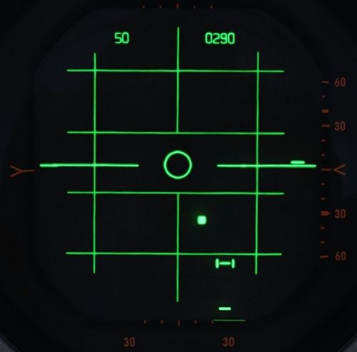

# Radar system

The Westinghouse AN/APQ-120 Fire Control Radar, a continuation of the F-4C's
-100 and the 4D's 109, is a solid state pulse radar providing the F-4E with air
to air intercept functionality, air to ground mapping, ground target reference
provision to the LABS and WRCS bombing systems, as well as radar beacon
capability. The APQ-120 also functions as the display system for TISEO and TV
guided weapon imagery, and is integrated with the
[APX-80 interrogation system](../identification_systems.md#interrogator-systems).

The primary conversion from the APQ-109 to APQ-120 included a reduction in the
number of field replaceable units in the nose, as well as the reduction in their
size; whereas the -109 had been a hybrid in its movement towards solid state
hardware (primarily in the low voltage processing sections), the 120 was a fully
solid-state system. While this update reduced the space overhead and weight for
the system, the modification of the F-4 nose to include the
[M61 cannon](../../stores/guns.md#internal-cannon-m61a1-vulcan) required a
reduction in antenna size, causing a marginal decrease in overall detection
range. However, when taken with the increase in system reliability and reduced
maintenance, the tradeoff was considered acceptable.

Starting with production of the F-4E block 60, and retrofitted to selected
earlier block aircraft, was the addition of the Digital Scan Converter Group
display. The inclusion of DSCG increased the overall ease of handling the
APQ-120 by adding additional information on the display directly, including
current radar range setting and the calculated range rate value against the
current acquired target. Further, clarity of the display in all lighting
conditions was improved by rendering the radar reference grids directly as part
of the displayed image, rather than the previously used markings on the DVST
glass. In addition, the DSCG provided the ability of the two crew members to
utilize the displays independently; previously, the WSO had control over which
mode both the DVST and front seat repeater display would show. With DSCG, the
pilot could utilize TISEO or TV air to ground weapons while the WSO maintained a
scan pattern or found a ground reference point and inserted it into the WRCS.

## Principle

The APQ-120 is a pulse radar. The antenna transmits a radio pulse focused in one
direction.

Any obstacle in that direction, for example another aircraft or simply ground,
will reflect part of the energy back, which the antenna then receives and
evaluates. Based on the time it took for the signal to travel back, the radar
can compute the distance to the obstacle.

All radar returns are then displayed on the screen **based on their distance**,
resulting in a **direct** and **unfiltered** representation of the world in
front of the aircraft.

However, since the emitter is not perfect device, energy is transmitted into all
directions, with the main focus being the direction in which the antenna is
pointing at. This is referred to as the **main lobe** of the antenna, while any
other unwanted returns from different directions are called **side lobe**s.

| Label | Description                    |
| :---: | ------------------------------ |
|   a   | Targets from main-lobe         |
|   b   | Ground clutter from main-lobe  |
|   c   | Ground clutter from side-lobes |

The same situation from outside roughly looks as follows.

| Label | Description                    |
| :---: | ------------------------------ |
|   a   | Own aircraft                   |
|   b   | Antenna direction              |
|   c   | Targets from main-lobe         |
|   d   | Ground clutter from main-lobe  |
|   e   | Ground clutter from side-lobes |
