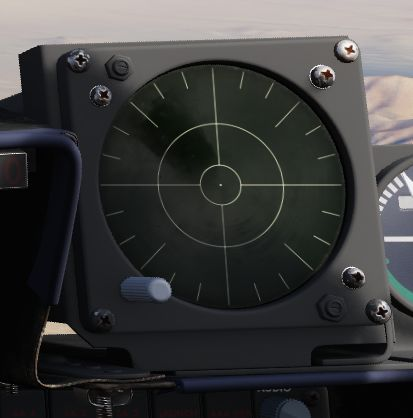

# Radar warning receiver

## Introduction

The ALR-46 Radar Warning Receiver (subsequently RWR) is the F-4E's passive situational awareness
system for detection of airborne and surface-to-air radar threats. The system captures signals from
a pair of directional antennas installed at the aft of the fuselage; the difference in relative
timing of detection and angle by the antennas is used by the system to define a relative bearing to
the emitting radar. Further processing of the received radiation references the stored threat
catalog to ascertain emitter type, as well as to define a relative threat range as a function of
received power versus known output.

The resulting processed threat signal is then presented on the RWR's CRT display, with bearing to
the emitter shown on the display with the top relative to the nose (12 o'clock) and the bottom the
tail (6 o'clock), and with proximity to center relative to the system's calculation of the level of
threat - with closer indications being of higher danger, and those within the middle ring being
classified within engagement range. In normal operation, the ALR-46 can present 16 threats on the
CRT concurrently. The highest priority threat as computed by the ALR-46's threat and range catalog
is presented on the display with a diamond superimposed by its symbol; this is considered "floating"
diamond functionality, with the ALR-46 defining priority. In the event of possible engagement by a
threat emitter (concurrent with the illumination of the ACTIVITY and/or MISSILE LAUNCH buttons), the
event is signified by a circle around the emitter symbol.

## ALR-46 Controls

### RWR Display Intensity Knob

Found adjacent to the RWR situation display in the lower left corner of the panel, the Intensity
Knob functions as a dimmer to control the brightness of the displayed RWR returns. Clockwise raises
the brightness, counter-clockwise lowers the brightness.

### ALR-46 Control Panel

The ALR-46 Control Panel consists of ten multipurpose, illuminated buttons, along with a pair of
rotary knobs for controlling the system's volume and panel brightness.

### Priority/Open

The ALR-46 defaults on powerup to OPEN mode, which presents up to 16 threats on the display at one
time, depending on how many emitters are visible and current system settings (Search, LOW ALT,
etc.). In the event the crew requires immediate prioritization of the most pressing threats in a
saturated environment, the PRIORITY button can be pressed to display the five emitters the system
deems the most dangerous. When pressed, the OPEN illumination will swap to the PRIORITY position,
and revert back upon selection back to OPEN.

### S (Search)

By default, the ALR-46 is programmed to prioritize and display emitters tied to weapons that can
engage and destroy the aircraft. However, missions will require monitoring of early warning and
search radar systems working with longer pulsewidths for extended range detection and tracking of
possible intruders- ie, the F-4. These emitters can be displayed using the Search mode, which
presents them on the RWR with the S symbol to signify their function as a long range search radar.
Entry into Search mode is displayed on the button with an illuminated "S".

Because of their low threat priority, is important to note that search radar symbology may often
fall off the display due to their reduced importance- especially when the ALR-46 is placed into
PRIORITY mode.

### Handoff (H with <> Diamond)

The Handoff button provides the opportunity for the flight crew to define the priority emitting
threat. By default, the ALR-46 defines the highest priority threat as a function of range, current
transmitting mode, and the threat catalog. This priority threat is visualized with a diamond
superiposed around the emitter's symbol. In the event the pilot wishes to define a different emitter
as the target, the Handoff button is pressed and held to cycle the priority diamond through the
various emitters. Once the desired emitter is focused upon and surrounded with the diamond, the
button can be released, and the priority symbol will remain latched with that emitter, with audio
from the selected emitter played through the intercom, and the double carat (<>) symbol on the
button illuminated to signify latched mode. With a latched diamond focus emitter, the system will
remain focused on said emitter until the signal is either lost, the crew elects another focus
emitter with the Handoff button, or the button is pressed momentarily to return to normal floating
diamond threat priority mode.

In the event that the emitter is tight grouping of other symbols on the display, the TGT SEP mode
will be applied.

### Missile Launch

In the event a missile launch is detected by way of discrete SAM guidance commands being received,
the MISSILE LAUNCH indications in this button will illuminate, and a circle is superimposed around
the threat emitter defined as guiding the inbound weapon. Pressing the button while illuminated will
provide launch audio through the intercom.

### Low Altitude (LOW ALT)

The ALR-46 utilizes ownship altitude as a defining aspect of threat priority, thus causing low
altitude AAA and SAM threats to lose priority in the event the aircraft is at an altitude that is
estimated to place it outside of their threat envelope. Activating LOW ALT mode removes this
envelope estimate from the threat prioritization and places low altitude threats back into priority,
useful for circumstances such as a high to low dive attack or target ingress profile, and is
confirmed as the active mode with the illuminated LOW ALT descriptor on the button.

### Target Separate (TGT SEP)

In the event of a number of emitters being detected at such close proximity that the symbology
overlaps on the RWR display, the Target Separation button provides the option to expand symbology on
the display from emitters in the same area to allow for clarity on the type and number of radars
being detected. Pressing the button triggers the lower TGT SEP illumination on the button, and any
emitter groups the system defines as being elegible for the expanded presentation will do so for
three seconds on the RWR display before reverting back to the standard view.

### System Test (ON/SYS TEST)

The system power on test provides a three band (1 low, 2 mid, 3 high) check in all four quadrants
for proper sensitivity, along with a three angle (45, 135, and 315) confirmation of relative bearing
for diagnostic purposes. The test sequence begins with 1s in all four quadrants, with the upper left
value in a diamond (signifying a heading of 45, which is displayed on the panel); the second and
third continue this process, cycling band 2 with the lower right in the diamond (for 135), and band
3 with the upper left 3 in the diamond (for 315). The tests are accompanied with a sequence of tones
for adjustment of audio monitoring level.

### Unknown (U)

When an emitter is detected that does not have a catalog entry, but is recognized by received power,
duration, and pulse as being a possible threat, the U indicator on the Unknown button will flash.
Pressing the button will provide a U symbol on the RWR CRT at the correct azimuth position for
reference and monitoring.

The default condition of the Unknown button is with the U symbol illuminated, but steady.

### Activity Power

In the event SAM guidance commands are detected, the ACTIVITY button will illuminate. This button's
function is similar to the MISSILE LAUNCH indication insofar as that it responds to a guidance
directive to a SAM, but does not respond to descrete changeover signals. Thus, an illuminated
ACTIVITY warning may in fact indicate a launch, depending on the system engaging the F-4 and the
circumstances surrounding it. The indication will provide a circle around the threat emitter.

### System Power

The System Power button is the on/off switch for the ALR-46. When pressed to activate the system,
the RWR control panel and display will cycle through their initial 9-second warmup, with the display
and illuminated buttons undergoing rapid flashing as the system is prepared for use and proper
functioning is confirmed. Search mode is deactivated by default upon startup, and if in the event
the aircraft was powered down and restarted, the altitude priority mode (LOW ALT or normal) will be
in the same state it was left prior to shut down.

In the event of a system power failure, the ALR-46 has an automatic restart function. Once power is
recovered, the receiver will restart after a fifteen second delay, in addition to its 9-second power
on self test. The system will resume state in the same fashion as a normal restart - with Search
mode deactivated and the altitude priority as when power was lost.

### Excess Noise Strobe Indicators

During normal operation, a trio of three T shaped indicators appear in the 9, 12, and 3 o'clock
positions near the center of the RWR CRT. These indicators signify the absence of excess noise in
the low (9), mid (12), and high (3) band amplifier detection. In the event noise becomes too
significant in a given amplifier channel, the indicator for the respective band will disappear.
Should this occur, a SYS TEST can be performed to confirm the channel is still functioning; in the
event of a pass, the channel can be considered working at a reduced detection capacity.

A fourth indicator may appear as part of the SYS TEST or power up cycle. This fourth indicator in
the 6 o'clock position does not signify any function.

### Audio Knob

The AUDIO Knob is the direct volume control for the situational audio from the ALR-46. Turning the
knob clockwise increases the audio volume, turning counter-clockwise lowers the audio volume.

### DIM Knob (Dimmer)

The DIM knob on the ALR-46 control panel manages the brightness setting of the illuminated control
buttons; turning the knob clockwise increases the brightness, counter-clockwise reduces the
brightnes.
