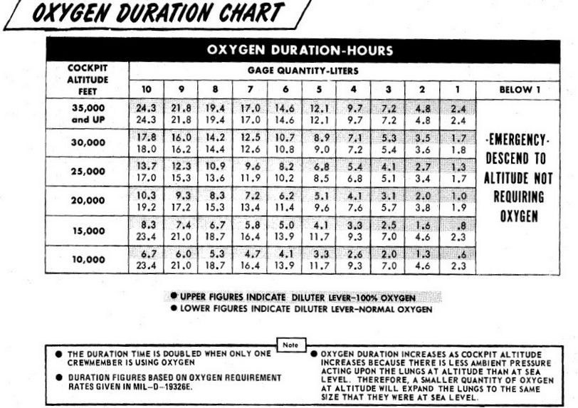
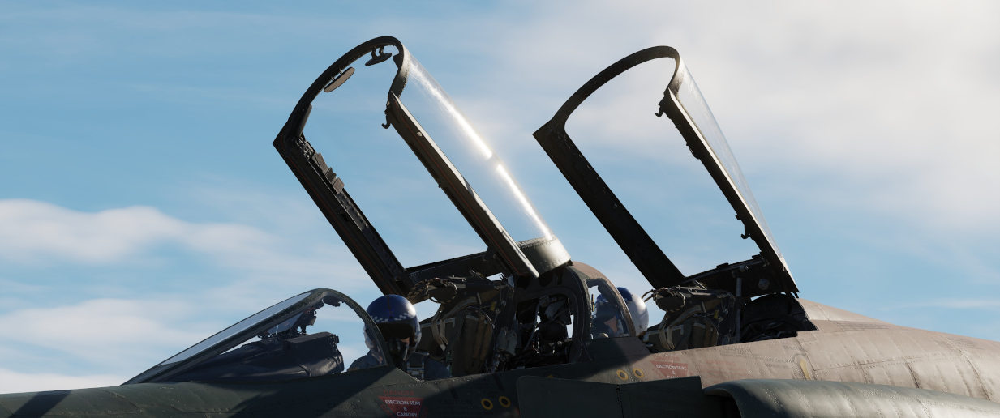
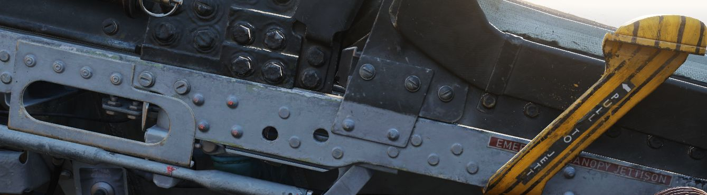
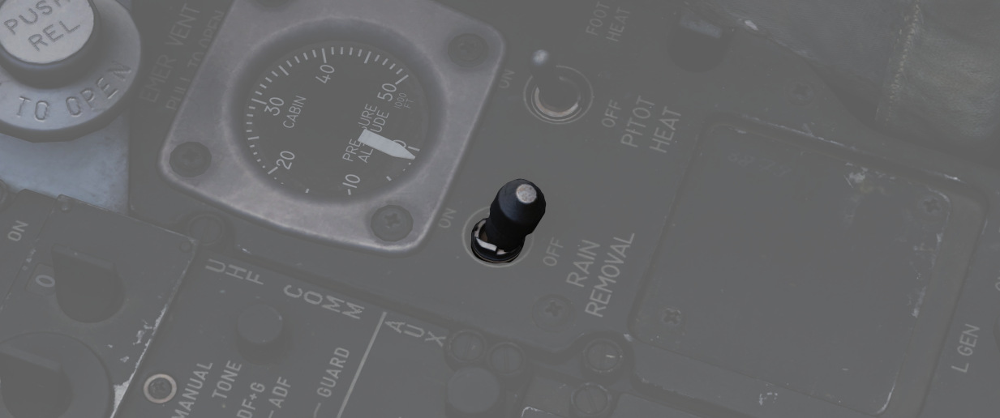

# Utility Systems

## Oxygen System

Aircrew breathing oxygen is provided with a 10-liter liquid oxygen bottle. A
regulator panel is found on the left side in each cockpit - on the console in the
front cockpit, and the left sub-panel in the rear. Flow is initiated in each
cockpit using the Supply Lever (<num>6</num>) found on the regulator panel. Oxygen flow is
confirmed using the Flow Indicator (<num>3</num>), which alternates from black to white
for each breath (white indicates inhalation). Supply pressure and remaining
volume is confirmed using the Oxygen Pressure (<num>7</num>) and Oxygen Quantity gauges
(<num>2</num>)
found in both cockpits.

A detailed chart of the Oxygen duration is provided here:

## Canopies

The canopies are actuated by the [pneumatic system](pneumatics.md).
They are controlled independently between the two cockpits; handle for
standard opening and closing is found on the left side of each cockpit,
next to it there is the yellow and black emergency jettison handle.
On the right side of the cockpit, in the same relative position,
is the manual unlock lever which can be used to unlock the canopy
in case of pneumatic system failure.

Each cockpit employs an inflatable
canopy seal to seal the canopies for cockpit pressurization.
The canopy seals are automatically inflated and deflated
upon opening and closing of the canopies by using [bleed air system](bleed_air.md).

## Windshield Rain Removal

To clear precipitation, placing the Rain Removal Switch to ON will direct bleed
air from the air conditioning system to an external vent below the windshield,
breaking up rain water into smaller drops and blowing them off of the
windshield. The system does increase the temperature of the windscreen, and may
cause a WINDSHIELD TEMP HI lamp along with the MASTER CAUTION to illuminate. In
this situation, the temperature is nearing that of optical distortion, and must
be set to OFF immediately.

Due to high Mach frictional heating of the windscreen, the WINDSHIELD TEMP HI
lamp can also illuminate with the system off; in that event, the warning can be
disregarded.
