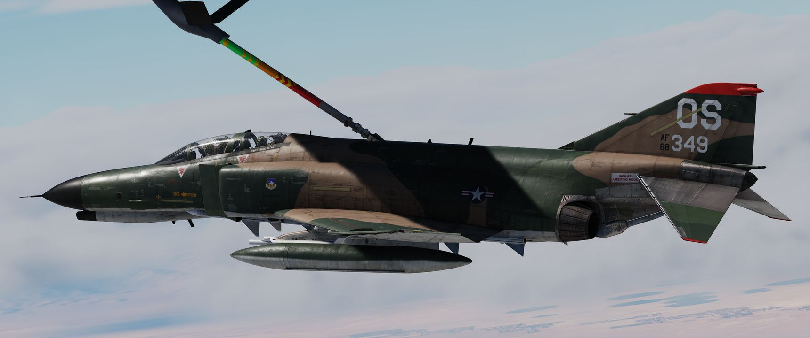
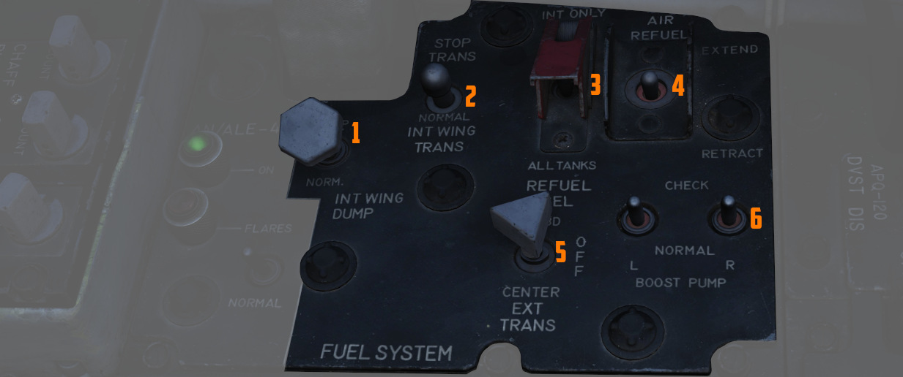

# Utility Systems

## Oxygen System

Aircrew breathing oxygen is provided with a 10-liter liquid oxygen bottle. A
regulator panel is found on the left side in each cockpit - on the console in the
front cockpit, and the left sub-panel in the rear. Flow is initiated in each
cockpit using the Supply Lever (6) found on the regulator panel. Oxygen flow is
confirmed using the Flow Indicator (3), which alternates from black to white
for each breath (white indicates inhalation). Supply pressure and remaining
volume is confirmed using the Oxygen Pressure (7) and Oxygen Quantity gauges (2)
found in both cockpits.

A detailed chart of the Oxygen duration is provided here:

## Canopies

The canopies are actuated by the [pneumatic system](pneumatics.md).
They are controlled independently between the two cockpits; handle for
standard opening and closing is found on the left side of each cockpit,
next to it there is the yellow and black emergency jettison handle.
On the right side of the cockpit, in the same relative position,
is the manual unlock lever which can be used to unlock the canopy
in case of pneumatic system failure.

Each cockpit employs an inflatable
canopy seal to seal the canopies for cockpit pressurization.
The canopy seals are automatically inflated and deflated
upon opening and closing of the canopies by using [bleed air system](bleed_air.md).

## Air Refueling System

For air-to-air refueling, the F-4E uses a receptacle system compatible with high
pressure USAF-style boom refueling. With this system, fuel can be delivered to
the Phantom at a rate of up to 3900 lbs per minute. Fuel received is delivered
into fuselage cell 2, then equalized through the rest of the aircraft cells,
wing tanks, and, if installed and selected, external tanks.

> 💡 Fully refueling takes roughly between one and three minutes.

### Air Refuel Switch

Preparation for air refueling is performed by toggling the Air Refuel Switch (4) to
EXTEND; doing so extends the receptacle, illuminates the receptacle visual
lamps, depressurizes the fuel cells, activates the transfer pumps to
redistribute received fuel for CG maintenance, and activates the air refuel
READY lamp. RETRACT is used to lower the receptacle and return pressurization
and normal function to the tanks.

If, during AAR, the boom disconnects and the DISENGAGED light illuminates, this
switch has to be flipped to RETRACT and back to EXTEND to reset the system and
allow the boom to connect again.

### Refuel Selection Switch

The two-position Refuel Selection Switch (5) provides options for two modes of
refueling: internal fuselage and internal wing tanks (INT ONLY), and ALL TANKS,
used to include external tanks in the refueling operation.

### Ready Light

With the receptacle extended and tanks depressurized, the READY lamp illuminates
to notify the pilot refueling can begin. The lamp will turn off when the boom is
connected to the receptacle, or the receptacle is lowered by the RETRACT command
on the Air Refuel Switch.

### Disengaged Light

Should the boom separate from the receptacle, the DISENGAGED lamp will
illuminate. In the event of a DISENGAGED signal, the system must be reset to
continue refueling.

### Air Refueling Release Button

On the front seat control stick is the Air Refueling Release Button. Its primary
purpose is to release the receptacle from the boom in the event of a manual
refueling cycle (one in which the boom operator cannot force a disconnect
remotely), or perform a disengagement on demand based on flight conditions or
emergency situation. Pressing the button will disengage the boom, and illuminate
the DISENGAGED lamp.

### AIR REFUEL RECPT Circuit Breaker

In the event of a DISENGAGED situation during air refueling, the system is reset
either by cycling the Air Refuel Switch or by using the AIR REFUEL RECPT circuit breaker,
found on the No 2 circuit breaker panel in the rear cockpit - right side, fourth column,
top breaker.

### External Tanks Full Lights

Three indicators- L.H. FULL, CTR. FULL, and R.H. FULL (Left Hand, Center, Right
Hand) lamps provide confirmation that the external tanks have been filled during
the air refueling process. The lamps will remain lit until the air refueling
receptacle retracted.

## Windshield Rain Removal

To clear precipitation, placing the Rain Removal Switch to ON will direct bleed
air from the air conditioning system to an external vent below the windshield,
breaking up rain water into smaller drops and blowing them off of the
windshield. The system does increase the temperature of the windscreen, and may
cause a WINDSHIELD TEMP HI lamp along with the MASTER CAUTION to illuminate. In
this situation, the temperature is nearing that of optical distortion, and must
be set to OFF immediately.

Due to high Mach frictional heating of the windscreen, the WINDSHIELD TEMP HI
lamp can also illuminate with the system off; in that event, the warning can be
disregarded.
