# Weapons and Employment Systems

## Multiple Weapons System

The Multiple Weapons System is designed to provide a single point of management
for all stores deliverable by the F-4 with regards to arming, pylon activation,
delivery mode, and selective jettison. While specific weapons may have
additional controls elsewhere in the cockpit on a case by case basis, all of the
noted functions are driven by this panel on the left forward console in the
front cockpit.

### Nose/Tail ARM Switch

Beginning from the top of the panel, the four way Nose/Tail ARM switch selects
the solenoids for arming wire capture on MERs and TERs, which then arm the fuzes
at the point of release. Additionally, the switch position can also dictate
in-flight high/low drag release mode for retarded bombs such as the Mk 82
Snakeye.

| Name      | Description                                                                       |
| --------- | --------------------------------------------------------------------------------- |
| SAFE      | No arming solenoids activate; bombs release without fuzing enabled.               |
| NOSE      | Forward and center position solenoids activate to hold arming lanyards.           |
| TAIL      | Aft position solenoids activate to hold arming lanyards.                          |
| NOSE/TAIL | Forward, center, and aft position solenoids all activate to hold arming lanyards. |

MER-10 and TER-9 racks include an automatic stepper mode function to
automatically bypass stations that have already released munitions. To set this
function, when the BOMBS mode of the Weapon Select Knob is chosen, the Nose/Tail
switch must be in the NOSE or the NOSE & TAIL position for release signals to be
delivered through installed MERs and TERs and bypass empty positions; if the
system is set in TAIL, an additional release pulse(s) must be applied using the
bomb switch to cycle through the empty stations. Usage of the MER-10A and TER-9A
circumvent this requirement.

RKTS and DISP bypass empty stations automatically.

### Station Select Buttons

### Mode Selection - Delivery Mode Knob

Release mode is set using the Delivery Mode Knob. Values to the left of OFF
employ the AN/AJB-7 Attitude Reference and Combing Computer Set (ARBCS), whereas
values to the right of DIRECT employ the Weapon Release Computer Set (WRCS).
DIRECT is the manual release mode. TGT FIND functions as a navigational mode,
and cannot provide a weapon release signal to the fire control, thus can be
considered in practice a "safe" position.

The values, clockwise from the left, are as follows:

| Name     | Description                            | System |
| -------- | -------------------------------------- | ------ |
| INST O/S | Instantaneous Over the Shoulder        | ARBCS  |
| LOFT     | Loft                                   | ARBCS  |
| O/S      | (Timed) Over the Shoulder              | ARBCS  |
| T LAD    | Timed LADD (Low Angle Drogue Delivery) | ARBCS  |
| TL       | Timed Level                            | ARBCS  |
| OFF      | Off                                    |        |
| DIRECT   | Manual                                 |        |
| TGT FIND | Target Find (Navigation only)          | WRCS   |
| DT       | Dive Toss                              | WRCS   |
| DL       | Dive Laydown                           | WRCS   |
| L        | Laydown                                | WRCS   |
| OFFSET   | Offset Bomb                            | WRCS   |
| AGM-45   | AGM-45 Delivery                        | WRCS   |

### Weapon Selector Knob

The Weapon Selector Knob is used to designate the type of weapon to be used

| Name        | Description                                                               |
| ----------- | ------------------------------------------------------------------------- |
| RKTS & DISP | Rockets and dispensers. Arms AWRU release circuitry.                      |
| ARM         | AGM-45 Shrike                                                             |
| TV          | AGM-65 Maverick and other EO guided weapons.                              |
| C           | Open/unused. May be utilized as an OFF selection.                         |
| B           | Same function as AIR-TO-AIR button in rear cockpit.                       |
| A           | Munitions with internally-set intervalometers (CBUs or spray containers). |
| AGM 12      | AGM-12 Bullpup.                                                           |
| BOMBS       | Bombs. Arms AWRU release circuitry.                                       |

### Centerline Tank Aboard Light

The forward AIM-7 missiles can be inhibited from launch under certain centerline
conditions due to possible separation issues or chance of igniting the contents
of the centerline position. The CL tank light will illuminate if such a possible
condition exists. The conditions that can cause this are as follows:

1. Fuel Tank or MER; the forward Sparrows cannot be launched. The CL tank light
   will shut off if the tank or MER is jettisoned, allowing launch or jettison.

2. BRU-5/A with single bomb; the CL tank light will illuminate. Forward position
   Sparrows can be launched or jettisoned, however, attention should be paid to
   eliminate lateral roll movements until the launched weapon is clear.

3. Aero-27/A with Centerline Arming Unit. The CL tank light will illuminate,
   however the forward position AIM-7s cannot be jettisoned or released until
   this is removed post-flight.

### Interlock Switch

The fire control system provides an inhibitor option for AIM-7 launches to
confirm valid parameters are met, and is accessed with the INTLK switch. With IN
selected, the missile will not release upon trigger down should any of the
following not be the case:

1. The IN RANGE lamp illuminated
2. The target aim dot within the ASE (Allowable Steering Error) circle
3. The radar knob is not in VI mode

With the INTLK switch in OUT, the AIM-7 can be launched at any time, no matter
the condition of the current parameters against the target.

The INTLK switch provides no function for AIM-9 launch.

## Aircraft Weapons Release Unit (AWRU)

Used in the BOMBS and RKTS & DISP weapon modes, the AWRU provides interval and
quantity controls for munition delivery. The AWRU has both a manual and
automatic mode, and the resulting function is accessed with the appropriate
settings.

The Interval Knob contains 14 values, providing base interval timing of release
pulses while the bomb release button is held from 1/20th of a second (.05) to 1
second. This value can have a 10x multiplier applied to it using the INTRVL
Switch. In the NORM mode of the INTRVL switch, the release will apply as on the
Interval Knob, whereas when selected to x10, the 10x multiplier will apply- for
example, 1 second in NORM would become an interval of 10 seconds in x10 mode.

The Quantity Knob sets the total number of munitions dropped during a bomb
release hold, and applies the manual or automatic release functions based on the
value selected.

### Single-Manual: 1

In the 1 position, the AWRU is placed into manual mode. One munition will be
dropped on each bomb release press, with releases across multiple selected
stations dropping in a left-right-left pattern. The bomb release button must be
released, then pressed a subsequent time, to release another round.

### Single-Ripple: 2-18

In numerical positions 2-18, up to the total number of selected munitions will
be dropped according to the Interval setting. As an example, with a QTY of 6 and
an interval of .20, six bombs will be dropped, one every 2/10ths of a second
from the press of the bomb release button. The sequence will reset upon button
release, allowing subsequent ripples of the same quantity to be dropped.

### Single-Continuous: C

In position C, the quantity of weapons is dictated by how long the bomb release
button is held. The ripple will apply the set interval, releasing one munition
each pulse, until the bomb button is released.

### Pairs-Manual: P

Position P places the AWRU into pairs mode. With multiple stations selected,
each time the bomb button is pressed, a weapon will be released from each
station.

### Salvo: S

In the S position, the AWRU enters into salvo mode, functioning like
Pairs-Manual with single rounds released from each station, but using the set
interval value to release multiple salvos until the bomb button is released.

## Weapon Release Computer Set (WRCS)

Provision for the F-4E to perform accurate level and dive munition delivery is
provided by the AN/ASQ-91 WRCS. The WRCS inputs are set with the associated
panels in the cockpits, and these commands, along with INS data and radar target
ranging, are used by the ballistic computer to provide the release signal.

### Target Range Controls

The Computer Control Panel found in the rear cocpit has three TARGET entry
controls, two RELEASE entries, and a bomb DRAG COEFFICIENT entry setting, as
well as a BIT control knob for system function check. Target entry is relative
to the predetermined IP.

The upper range control input is for North/South, and selection of relative
bearing is noted by the N or S prefix at the start.

The middle range control input is for East/West, and like the previous, the E or
W prefix on the range sets the relative bearing direction.

The final ALT RANGE entry is for target altitude- whether the target or RIP
(Radar Identification Point) elevation as MSL, or the target/RIP's pressure
altitude.

Entries for North/South and East/West are in 100 foot increments, and a maximum
value of up to 99,900 feet may be entered for these distances. The ALT RANGE
entry has a maximum of 24,900 in 100 foot increments. Note that the WRCS can be
damaged if the ALT RANGE entry is greater than the aircraft's current MSL (x100)
in TGT FIND and OFFSET BOMB modes.

### Release Range Control

The Release Range control is used to manually set bomb range in tens of feet,
and is accessible in the Laydown, Dive Laydown, and Offset Bombing modes. The
maximum setting is 9990 feet (999x10), and when used in a WRCS/AJB-7 integrated
delivery, the actual range can be as high as 99,900'.

The Rg control should not be set to the same value as the target range control.
Otherwise, the bomb rack delay may may relase late, or not at all.

### Release Advance Control

Operative in all WRCS and WRCS/LABS integrated motes, the Release Advance
Control works in conjunction with the AWRU to advance the release signal in
milliseconds. Whereas the AWRU Intervalometer setting triggers the release pulse
sequence from the moment the bomb release button is pressed, when the Release
Advance Control is applied in a WRCS driven delivery, the specific bomb location
in a multiple ripple sequence can be calculated in advance, allowing the most
effective spread possible across a given target.

As an example, an AWRU single-ripple quantity release of 4 is selected with an
interval of 120 miliseconds. To place the third bomb in the ripple on target,
the following equation is used:

\\[ RA = I_R \cdot (N_{Tgt} - 1) \\]

where

- \\( RA \\) = Release Advance Setting, milliseconds
- \\( I_R \\) = ARWU Release Intervalometer setting, milliseconds
- \\( T\_{Tgt} \\) = Impact Sequence number of bomb desired on target

\\[ RA = 120 \cdot (3 - 1) \\]

Thus, for this release, we would set the value of RA to 240 msec. This would
produce a spread of two bombs ahead of target, one on the calculated target
point, and one behind.

The maximum setting for the Release Advance Control is 999 milliseconds.

### Drag Coefficient Control

Used only in the Dive Toss Mode, this entry is a bias factor prepared for the
ballistic computer to compensate for actual bomb trajectory. The maximum setting
for this value is 9.99.

#### Ballistic Computer

The ballistic computer is not directly accessed by the flight crew, but instead
pre-set based on the configured loadout by the ground crew to add the necessary
ejection bias factors. The computer uses these pre-set bias factors in
conjunction with a coeficient setting for munition drag in the Dive Toss mode to
calculate accurate delivery.

### WRCS Built-In-Test (BIT)

The BIT control is used to confirm go/no-go status of the WRCS. The BIT system
checks individual bomb modes individually, and effectivity of the given setting
is confirmed by selecting the desired mode, pushing the center of the knob PUSH
FOR BIT for five seconds, then pressing the FREEZE button in conjunction wih the
PUSH FOR BIT button. Confirmation of mode performance will be displayed as GO or
NO-GO. Should a mode be checked a subsequent time during a flight and a NO-GO
response is received, it can be disregarded.

### Cursor Control Panel

The Cursor Control Panel provides the controls needed for TARGET FIND and OFFSET
bombing modes. The panel has two thumbwheels named ALONG TRACK and CROSS TRACK,
which is used in the MAP-PPI mode to position their respective cursors over the
Radar Identification Point (from this point denoted as RIP). The ALONG TRACK
control, which presents relative range to the RIP, also includes an internal
switch enabling the cursor instructions to be acknowledged by the WRCS ballistic
computer, and must therefore be the first applied command in the target
insertion sequence.

Once the ALONG TRACK (range hemisphere) and CROSS TRACK (vertical line) cursors
are aligned over the RIP, the FREEZE button is pressed to initiate WRCS ground
path tracking of the specified point. The button remains illuminated until the
RESET button is pressed or another bombing mode is selected.

With WRCS ground tracking initiated, the TARGET INSERT button is pressed for the
ALONG TRACK and CROSS TRACK cursors to shift from the RIP to the offset target.
Once selected, target steering information is provided from the WRCS to the
BDHI, ADI, HSI, and optical sight. In the AGM-45 missile mode, the AoA Indexers
will provide maneuver commands for level, dive, or climb requirements to align
for seeker acquisition. Further, unless the WRCS Tone switch is disabled on the
ARBCS panel, an audio tone will be triggered from the point of bomb release
button press until the first bomb releases from the aircraft; this function is
nominally for training purposes, as it can preclude other system audio volume.

### Weapon Delivery Panel

The Weapon Delivery Panel permits the aircrew to use the WRCS TGT FIND functions
in LABS (ARBCS) modes- those found on the left side of the pilot's Delivery Mode
Knob.

The TGT FIND switch on the panel functions the same as the TGT FIND mode on the
Delivery Mode Knob. The Delivery Mode Knob overrides this switch in any mode
outside of TGT FIND, and should be set back to NORM. The HOLD position energizes
the target finding circuts in conjunction with any LABS or DIRECT mode the pilot
selects.

The RANGE Switch is functional in any WRCS mode requiring a Release Range
setting. The NORM position applies the noted x10 multiplier on the displayed
Release setting, whereas selecting x100 applies a multiplier of 100 to the
counter value.

The ACTIVATE Switch triggers the prerequisite activation signals to the LABS
circuits once the aircraft has passed within the Release Range. The switch
should only be placed in ON after target insert has been pressed and the ALONG
TRACK and CROSS TRACK cursors have transitioned to the target.

## Attitude Reference and Bombing Computer Set (ARBCS)

The AN/AJB-7 ARBCS is the automated release control system for time or
pitch-relative bombing. Interfacing wihth the Multiple Weapon Controls, Pedestal
Panel weapon settings, and bomb, laser guided, or the AGM-45, the system
releases the selected munition once the respective Bombing Timer or respective
Bomb Release Angle Computer pitch angle (gyro) target has been achieved.

The left side of the Delivery Mode Knob selects the ARBCS release modes. Both
LOFT and T LAD modes provide weapons release in a pull-up, with LOFT selecting a
4.0 G pullup schedule and weapon release on achieving a set gyro angle value,
whereas T LAD assumes a 3.5 G pullup schedule and release at the end of the
Bombing Timer setting. Necessary values for Low and High angle, as well as the
Bombing Timer are found on the provided tables.

### Bomb Release Angle Computer

The Bomb Release Angle Computer provides entry of the necessary target pitch
angles for ARBCS bombing modes. The values of HIGH (70 to 179.9 degrees) and LOW
(0 to 89.9 degrees) are controlled using their respective entry knobs.
Internally, the computer contains the release switches, as well as the resolver
to transmit the target angle values to the ADI director pointers.

### Bombing Timers

Timers for ARBCS bombing modes are available for PULLUP (0 to 60 seconds) and
RELEASE (0 to 30 seconds). Both can be set in increments of 0.1 second, with 0.1
second as the minimum setting. The reference windows do not count down during
the bomb run.

When the PULLUP timer is complete, required PULLUP signaling will initiate,
along with any ADI director programming to show proper flight path. RELEASE
timing is mode dependent, and will occur once PULLUP is complete, if required.

In LOFT and O/S modes, only PULLUP timing is activated, and a value must be set
to energize the ADI pullup flight path program.

In T LAD and TL, PULLUP and RELEASE are both activated, in sequence, and both
require a value entry- PULLUP to energize the flight path programming, and
RELEASE to generate the munition release signal.

In integrated LABS (ARBCS)/WRCS bombing, the above requirements are the same,
however the WRCS initiates the bomb run timing, rather than pressing the bomb
button. When the WRCS initiates timing, a audio tone is applied to signal timer
start.

### ARBCS Indicators

During ARBCS weapons delivery, a number of indicators are available to confirm
run initiation and at what step of the given run the aircraft is in:

1. Upon run initiation (bomb button press/WRCS initiation) and PULLUP timer
   start, the Pullup light turns ON.

2. At PULLUP timer completion, the Pullup light turns OFF, the reticle light
   turns OFF, and a steady Pullup Tone (if switched ON) occurs.

3. As release pitch angle is attained, the Pullup light turns ON, the reticle
   light turns ON, and the Pullup Tone stops.

4. When the bomb button is released, Pullup light turns OFF.

This indication sequence can occur with the master arm in SAFE for training
purposes.

### Gyro Fast Erect

Due to rapid maneuvering during a bombing run, gyro deviation can occur due to
fluid migration. While this deviation will resolve naturally at a rate of 1 to 2
degrees correction perminute over time, it can quickly be corrected by using the
FAST ERECT switch found in the front pilot cockpit on the left side console, at
a rate of 15 degrees per minute. This switch should not be held for more than 60
seconds, or damage can occur to the gyro.

## Pave Spike

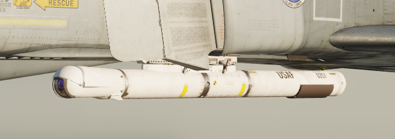

The AN/AVQ-23 Pave Spike targeting pod is the successor of the AN/AVQ-10 Pave
Knife and predecessor of the AN/AVQ-26 Pave Tack pod. It entered service in 1974
and was replaced from 1982 to 1989 by the Pave Tack pod. It provides a slewable
TV image for spotting ground targets and can fire laser for determining range
information and to guide laser guided weapons.

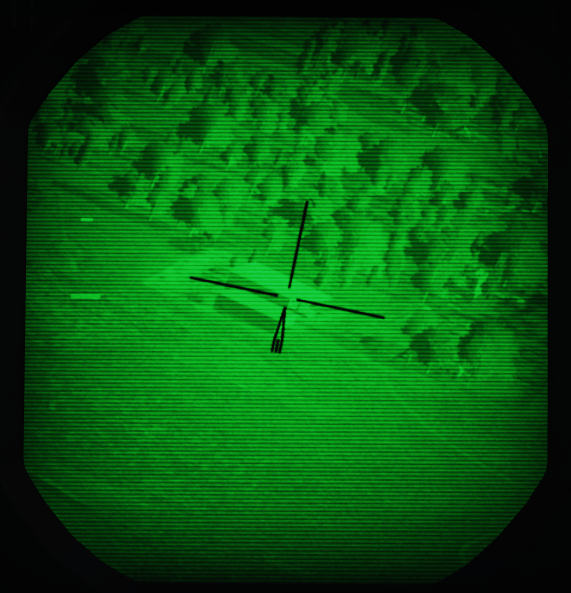

The line of sight can be controlled by the WSO, using the Antenna Hand Control.
The camera image is displayed on the DSCG scope and can be viewed by both, the
Pilot and the WSO independently.

### Targeting Pod

The system has an optical camera for daylight operation with one level of
optical zoom, for a wide and narrow (4x) field of view.

Limitations for the pods gimbals are

- Roll: -160 to +110 degrees
- Pitch: -160 to +15 degrees
- Yaw: -15 to +15 degrees

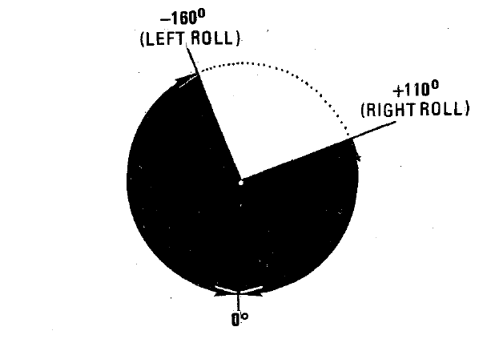
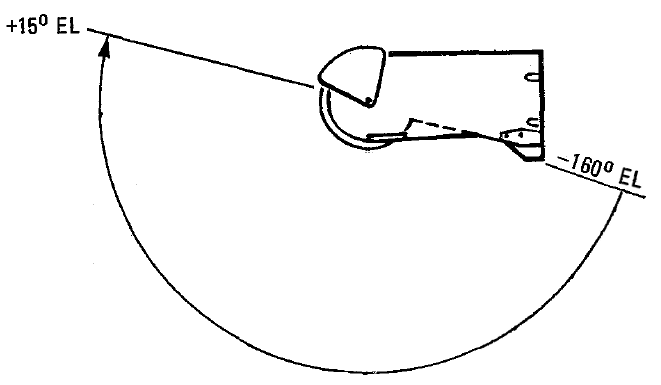

### Symbology

The TV image mainly consists of a reticle. The reticle rotates clockwise to
indicate the pods current elevation. At a 90 degree rotation, the pod is looking
straight down. If the reticle is almost upside down, the pod reached its gimbal
limit for the elevation (160 degrees).

The wide field of view is indicated by a circle around the reticle.

On the left, the image displays two cues:

- Time To Go Cue (TTg)
- Release Cue (T0)

During weapon operation, TTg moves down until it intersects T0, indicating the
time to release.

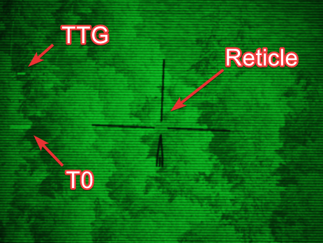

The cues also indicate various situations related to laser operation.

| Indication    | T0                                    | TTG                                     |
| ------------- | ------------------------------------- | --------------------------------------- |
| not shown     | not in TRACK mode                     | not in TRACK mode                       |
| steady        | commanded to fire laser (full action) | firing laser, accepted range            |
| flashing fast | not commanded to fire laser           | not firing laser or target too far away |
| flashing slow |                                       | firing laser, but range rejected        |

### Controls

The Pave Spike is mostly interacted with by the WSO, while the Pilot has
indicators assisting in keeping the pods line of sight within its limits.

The entire system, known as AN/ASQ-153 Electro-Optical Target Designator System,
consists of:

- Range Indicator (Pilot)
- Azimuth-Elevation Indicator (Pilot)
- Laser Coder Control (WSO)
- Target Designator Set Control (WSO)

While the display is shown on the DSCG screens in both cockpits.

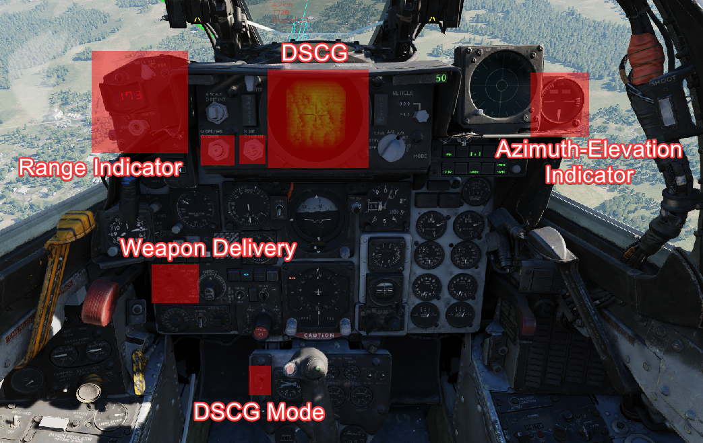
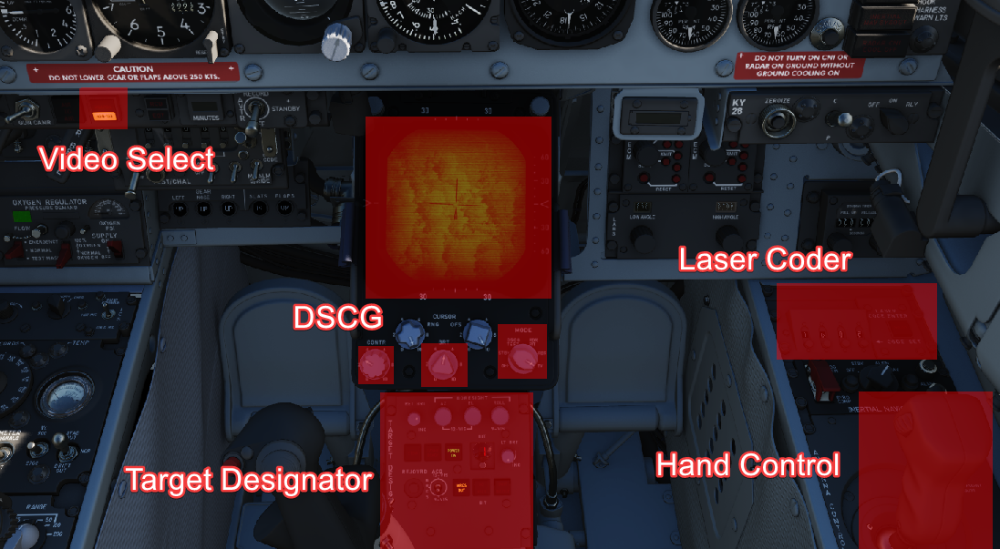

### Azimuth-Elevation Indicator

The Azimuth-Elevation Indicator is the main instrument for the pilot to assess
the pods current attitude in order to keep the line of sight within the
operational limits.

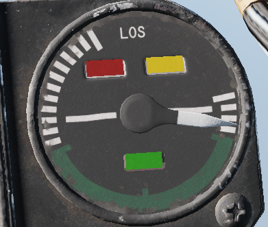

The needle shows the pods roll position from -160 (CW) to +110 (CCW) degrees.

Three flags indicate the elevation:

- green: -120 to -155 degrees
- yellow: -155 to -160 degrees
- red: -160 or beyond degrees

If the needle is kept within the green labelled range and neither the yellow or
red flag are shown, the view will not be obstructed by the pod or the aircraft.

### Range Indicator

This panel provides the pilot with a readout of the slant range measured by the
Pave Spike (x100 ft).

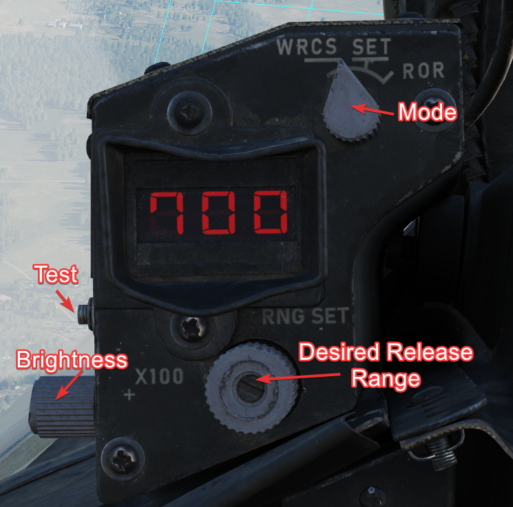

When the Test-Button is pressed, the display shows 888, the knob underneath it
controls the brightness of the readout.

The Mode-Knob allows the pilot to select one of two weapon delivery modes
available with the pod:

- WRCS - Automatic Delivery
- ROR - Release on Range

In the SET position, the display shows the desired release range used in the ROR
mode. The knob below the readout can be used to adjust this range.

### Laser Coder Control

The WSO can set the laser code used by the targeting pod by using the four small
push-buttons on this panel. Each press will advance the corresponding digit by
one. Once a code has been set, it can be transferred to the Pave Spike by
pressing the Enter-Button to the right.

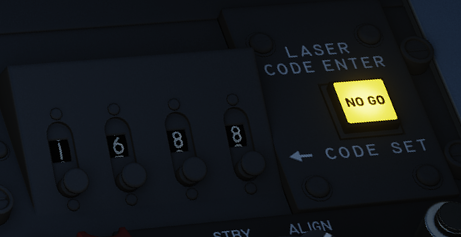

The Laser Coder system starts validating the entered code, this process takes
about 5 seconds. If the NO-GO lamp is lit, the code is invalid.

Codes directly relate to lasers frequencies, resulting in them having to be
between 1111 and 1788 and not use digits 0 or 9 in order to be valid.

When power is applied to the system, it automatically initiates a transfer of
the currently set code.

### Target Designator Control Set

This is the main panel to interact with the targeting pod.

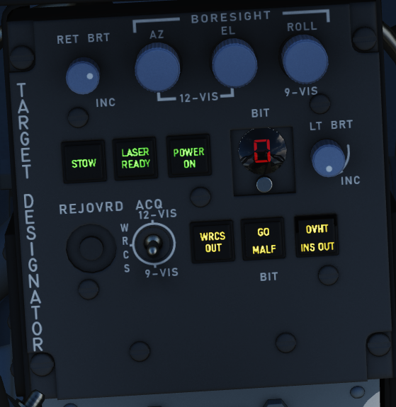

From left to right, top to bottom, it provides the WSO with:

- Reticle Brightness Knob - change the reticle from black to green
- Az/El/Roll Boresight Knobs - adjust the boresight position of the pod within
  ±2.5 degrees
- Stow Button - Stow or Unstow the pod
- Laser Ready Button - Arm or Disarm the laser
- Power On Button - Turn the pod on or off
- Currently selected BIT, with push button to advance the BIT
- Light Brightness Knob - adjust brightness of all lights on this panel (except
  the Overheat lamp)
- Reject/Override Button - Force the use of the laser slant range
- Acquisition Mode Switch - Select the Acquisition Mode (12-VIS, WRCS or 9-VIS)
- WRCS Out Button - Toggle WRCS integration with the pod
- GO/MALF Lamp - Indicates BIT results
- INS Out Button (and Overheat lamp) - Toggle INS integration with the pod

The lamps generally indicate the current status, while the push buttons can be
used as a manual command. For example, pressing the Laser Ready Button is not
enough for the laser to actually be ready. The lamp will only be lit if all
other conditions, such as a valid laser code being set, are met.

### Antenna Hand Control

During Track mode, the WSO can manually slew and correct the pods line of sight
with the Antenna Hand Control, or Antenna Stick.

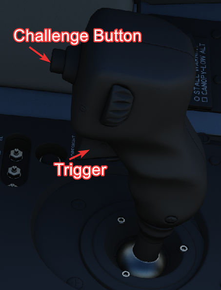

The Challenge Button is used to zoom in or out, while the 2-stage trigger is
used to switch between modes and fire the laser.

### Electrics

The Pave Spike draws its power through 4 circuit breakers on the No. 4 CB Panel
(WSO, left wall). They forward current from the left main AC bus and the main DC
bus.

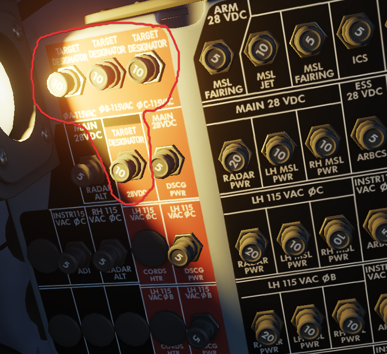

All panels of the system are powered directly through the pod, and hence will be
turned off if the Pave Spike targeting pod is not equipped.

It is not required to turn on the pod itself in order for power to be routed
through the pod to the panels.

### INS integration

During normal operation, the pod is connected with the INS. This can be disabled
manually by pressing the INS OUT push button.

With INS disabled, the following functions are not available:

- Automatic target stabilization during Track-mode
- Roll-stabilization during 12-VIS Acquisition-mode
- Slant range computation
- WRCS integration

### WRCS integration

During normal operation, the pod is connected with the WRCS. This can be
disabled manually by pressing the WRCS OUT push button.

Also, the WRCS is disabled automatically without INS integration, or if
currently not in DIRECT or TGT FIND weapon mode.

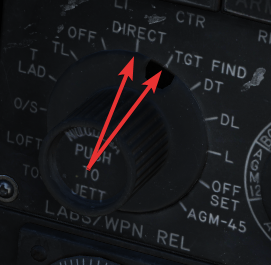

With WRCS disabled, the following functions are not available:

- WRCS Acquisition mode
- Memory mode
- WRCS Automatic Weapon Release

And some functions are degraded, but still available:

- Slant range computation
- Automatic target stabilization during Track-mode

### Modes

Prior to being able to designate a target, one has to visually aquire the
general target area and put the LOS in the vicinity. This is done by using one
of three acquisition modes:

- 12-VIS
- 9-VIS
- WRCS

The modes can be selected by the WSO, using the Acquisition Mode Switch.

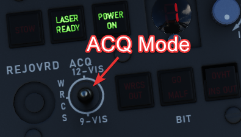

### Visual modes

In 12-VIS and 9-VIS, the LOS is set to a fix position.

- 12-VIS: 0 degrees roll, -2 degrees elevation, looking slightly nose down
- 9-VIS: -90 degrees roll (CW), -90 degrees elevation (down), looking left

12-VIS can be a great way to find targets of opportunity, as it allows the pilot
to put a target directly on the nose. The position also corresponds to the caged
HUD reticle. Additionally, if the INS is integrated with the pod, 12-VIS is
roll-stabilized.

The use of 9-VIS is very limited. It is intended to aid in acquiring a target
while observing an area in a turn. The target has to be put on the extension of
the left wing. However, in practice it is very difficult to maintain a turn in
such an attitude.

### WRCS mode

The main mode to acquire targets is the WRCS mode, in which the LOS is set to
the current WRCS target. This usually corresponds to the cursor on the radar
screen,but can also be set manually by the WSO. This enables the crew to spot a
target, or general target area, by using the radar or entering known coordinates
and then slewing the pod to this destination. If no specific target has been
inserted, the WRCS usually defaults to the aircraft position, resulting in the
pod looking straight down.

The WRCS mode automatically falls back to the 12-VIS mode in case the WRCS
integration is deactivated.

### Track mode

Once the target, or general target area, has been found using the acquisition
modes, the WSO can enter Track-mode by pressing the trigger on the Antenna Hand
Control to either Half or Full Action.

In this mode, the Antenna Stick can be moved to slew the pod LOS. Operating the
laser is only available in this mode, and can be activated by pressing the
trigger on the Antenna Stick to Full Action.

Track mode is indicated by the T0 and TTG cues becoming visible on the display.
They also indicate the status during laser operation.

If the INS is integrated with the pod, the image will automatically be space
stabilized on the computed target position. Be aware that the stabilization is
rudimentary and needs constant correction with the stick for the target to be
kept centered.

The stabilization is mostly based on the measured slant range. Accurate slant
range can be obtained by firing the laser. Alternatively, it is computed based
on the aircraft barometric altitude and the target altitude, which can be set by
the WSO on the WRCS panel.

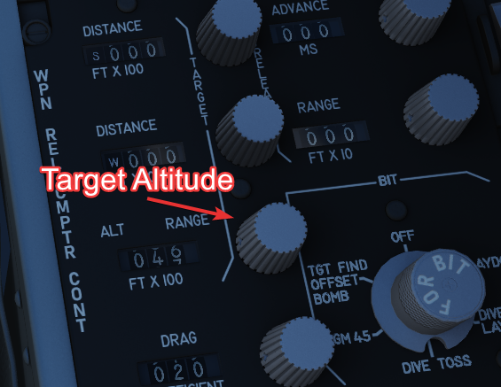

Without a WRCS integration, a target altitude of 0 is assumed, degrading the
stabilization.

Note that the pod is not capable of computing a slant range for targets above
the own aircraft altitude (for example when attacking up-hill). Since that is
measured using the barometric altitude, depending on the pressure-setting, this
can lead to erratic behavior during hot days when flying low. Problematic
situations like this were commonly referred to as Idiot mode, as the tracking
system started to behave very odd and it was very difficult to restore proper
behavior. The crew often had to deactivate the INS integration temporarily in
order to disable the automatic tracking.

### Memory Mode

Whenever a target-insert signal is send, the system activates the Memory-mode,
provided it is currently in Track-mode and the WRCS integration is active.

In this mode, the line of sight is slaved to the current WRCS target, even if it
is outside of the pods gimbal limits and cannot be displayed currently. The mode
acts very similar to the WRCS-Acquisition mode.

The memory mode has to be left explicitly again, by either pressing half or full
action on the Antenna Stick.

### Target Insert

A target-insert signal is usually initiated by the WSO pressing the
target-insert button.

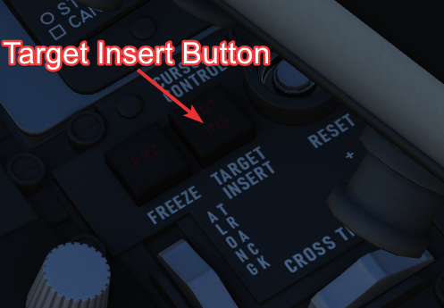

However, when the pod is currently in Track-mode and is maneuvered outside of
its gimbal limits, it will automatically initiate a target-insert signal and
send its current target position to the WRCS. Note that, if the laser is
currently firing, it will automatically be stopped when hitting a limit.

This signal then also causes the pod to enter Memory-mode, in which case it will
continue to follow the position now memorized by the WRCS.

Additionally, the signal will also be send if the pod is deselected, i.e.

- Video Select Switch - Weapon, or
- WSO DSCG Mode - not TV (for example switching to Radar)

### Laser System

The laser can only be operated in the Track-mode and serves two purposes:

- Guiding laser guided weapons on a target,
- and accurate slant range measurement.

Slant range is, besides weapon impact calculations, used for the automatic
target stablization in Track-mode. If not measured with the laser, it is
computed based on inaccurate INS and WRCS data, resulting in a degradation of
the system.

The laser can be used when the LASER READY lamp is illuminated.

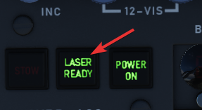

To setup the laser, a valid code has to first be entered on the Laser Coder
Control panel and transferred to the pod by pressing the Enter-Button. Make sure
that the NO GO light is not illuminated.

The LASER READY push button has to be pushed in for the laser to be armed.

Additionally, the laser is guarded by the nose gear position, which has to be
fully retracted to prevent accidental use on the ground.

Once ready, the laser is fired during track mode by pressing full action on the
Antenna Stick. The status of the laser operation is indicated by the cues on the
display being steady or flashing.

| Indication    | T0                                    | TTG                                     |
| ------------- | ------------------------------------- | --------------------------------------- |
| not shown     | not in TRACK mode                     | not in TRACK mode                       |
| steady        | commanded to fire laser (full action) | firing laser, accepted range            |
| flashing fast | not commanded to fire laser           | not firing laser or target too far away |
| flashing slow |                                       | firing laser, but range rejected        |

The T0 cue indicates intention to fire the laser, while the TTG cue represents
the outcome of the laser usage.

The slant range measured by the laser is compared to the slant range computed
based on INS and WRCS data. If it is not within ±20% percent of that value, it
is rejected. This is indicated by TTG flashing slow.

The system can be forced to use the laser range regardless, by pressing the
Reject/Override Button.

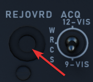

In practice, laser measured range is much more accurate than the slant range
computed by the system. Hence, pilots developed a habit of always hitting the
button whenever they fired the laser.

### Weapon Release Modes

The pod offers two additional weapon release modes:

- WRCS Auto Mode
- ROR (Release on Range)

### Auto Mode

The main method of weapon delivery with the pod is the WRCS automatic release
mode.

The WRCS has to be integrated with the pod for it to be available, and the pilot
must select TGT FIND as delivery mode, as well as WRCS on the range indicator.

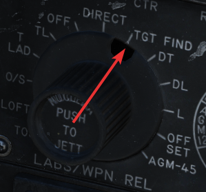
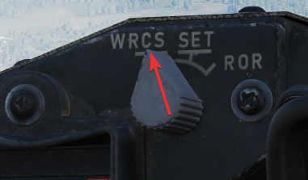

This mode works the same as the Dive Toss mode of the WRCS, just that it will
use the pods computed slant range and target instead.

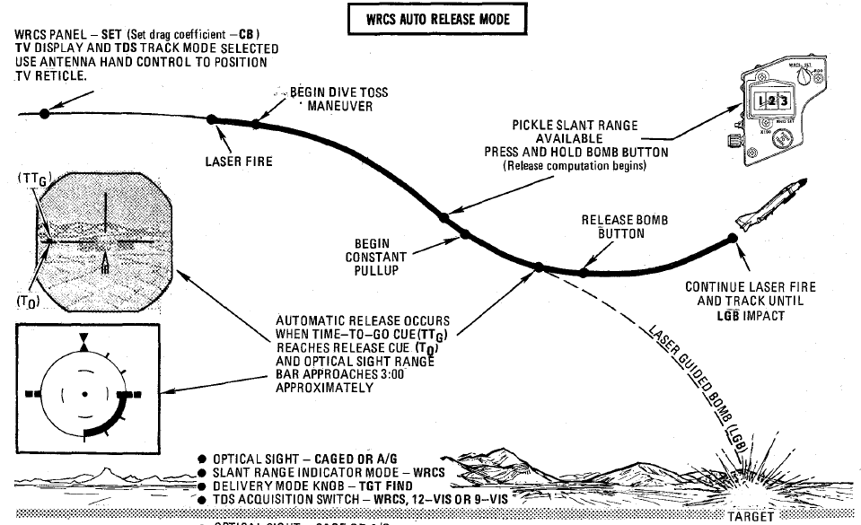

The TTG cue will move down and meet the T0 cue to indicate the time to release.

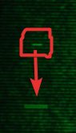

### ROR

Release on range is mostly a backup mode. The pilot must select TGT FIND as
delivery mode, and ROR on the range indicator.

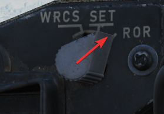

Weapons will be released automatically, as soon as the computed slant range is
less than the set desired release range. The range is configured on the range
indicator, by setting the mode to SET and rotating the knob below the display.

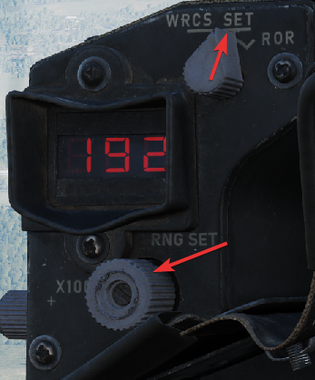

Best results are achieved during level flight.

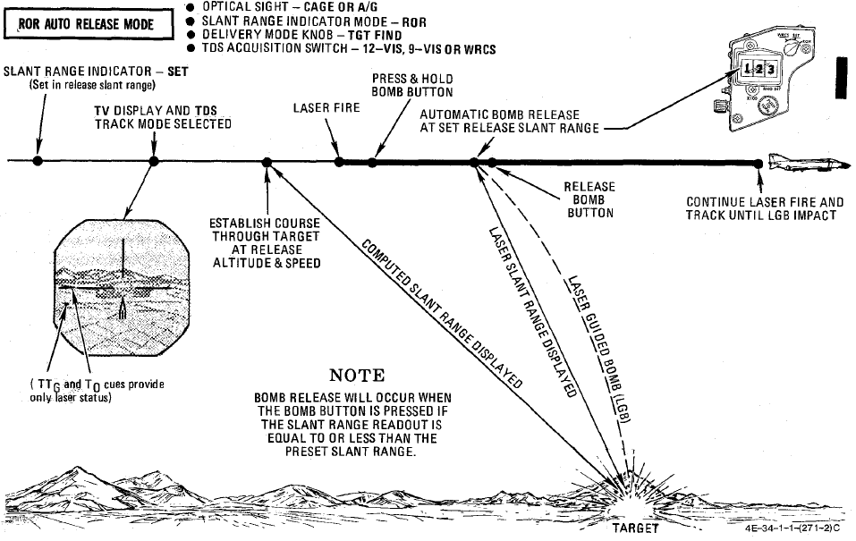

### Stow

After turning on the system, the pod can be unstowed by pressing the STOW push
button.

When unstowed, the pod moves according to the current selections and
automatically goes into the WIDE FOV.

In the stowed position, the camera is rotated upwards and a cover is moved in
front of it. This protects the camera from stones and other hazards during taxi,
takeoff or low level flight.

The stow-procedure takes about 5 seconds, with the light indicating the current
status.

Note that the stow-position is held electrically and can not be held without
power. Unpowered, the pod swings freely with force. Taking off without first
applying power to the pod, or flying with the pod being powered off, will cause
the pod to leave the stow position. Outside of the stow position, the system
will get damaged through hazards and whenever it is forcefully moved into its
gimbal limits. Damage will not only offset the boresight position, but also
affect other properties, such as movement speed and similar.

### Cooling

The targeting pod has a cooling system installed in the rear section, which
automatically cools the pod by external airflow.

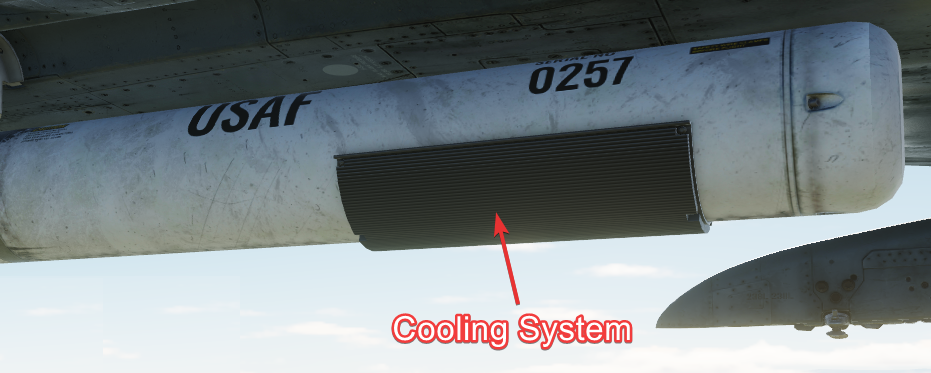

In general, the system is capable of keeping the pods temperature within limits
during all normal operation.

However, if the temperature gets out of control, the Overheat lamp will
illuminate.

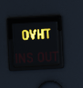

In this case, make sure to turn off the pod immediately and give it some time to
cool down first. Ignoring the lamp will cause parts of the pod to melt, damaging
it irreparably.

A broken pod is generally indicated by the MALF lamp going on and the display
being all black.

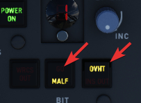

To prolong use of the pod and prevent overheating, limit slow and low-level
flight, as well as continuous use of the laser. As a rule-of-thumb, do not use
the laser for longer than 15 minutes without allowing for cooling between uses.
Limit continued slow and low level flight while operating the pod to 30 minutes.
For extreme outside temperatures, adjust the limits accordingly.

### BITs

The pod has 5 built-in tests, with BIT 1 being the actual mode used during
normal operation. They can be activated and switched through by clicking the BIT
button below the display. The GO/MALF lights show the result of the BIT:

- GO - test was successful
- MALF - test detected a failure

During normal operation, activated through BIT 1, neither of the lights are
illuminated.

### BIT 0

All lights on the Target Designator Set Control illuminate with full brightness.
The pod does not need to be powered up for this test.

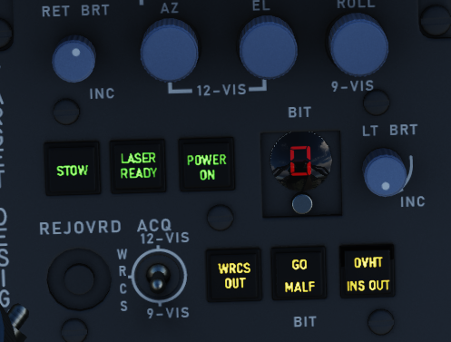

GO/MALF do not indicate test results in this mode.

### BIT 1

The circuits are energized and monitored. If any voltage reading is abnormal,
MALF illuminates.

GO does not illuminate in this mode.

This is the standard operational mode. The pod can be used normally and the
system will continuously monitor the status.

### BIT 2

The system simulates track functionality, simulating all inputs, altitude and
range data.

After about 15 seconds, the test is finished with either GO or MALF
illuminating.

For the test to be successful, the aircraft must not be moving, the pod must be
unstowed and INS must be integrated.

### Bit 3

This tests the laser energy level. The pod moves to a special position where it
looks inside itself, such that the laser fires against a special sensor mounted
inside the pod.

The pod must be unstowed and a valid laser code must have been entered, as well
as the LASER READY button being pushed in. The nosegear guard is ignored during
the test, allowing the use of the laser on ground.

Once the pod has reached the test position, the WSO must press and hold the
Reject/Override button to start firing the laser. The laser stops firing when
the button is released.

When the laser fires, a 5 second test program starts, with the sensor measuring
the laser energy. After the 5 second test, either GO or MALF illuminate to
indicate whether the energy level was above the required minimum.

To pilot can assist in telling the WSO that the test position has been reached,
as indicated by the Azimuth-Elevation Indicator.

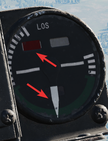

### Bit 4

The system tests the ranging computation by feeding a simulated laser slant
range of 2100 ft (±200). The pilot can confirm this using the Range Indicator
readout.

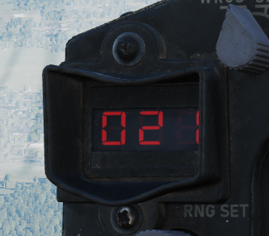

After about 8 to 14 seconds, the test is finished and either GO or MALF is lit.

### Upgrades

Based on crew feedback, the Pave Spike targeting pod received two major
upgrades, which are available as separate selectable weapon in DCS.

### Smart-Track

TCTO 518, known as the Smart-Track upgrade, aims at removing the requirement to
press the Reject/Override button to force the laser measured slant range in
situations in which the computed slant range was usually too inaccurate.

With the upgrade, the system will automatically accept the laser slant range
whenever the pods elevation gimbal is above -7.5 degrees. I.e. in shallow
angles, for example during 12-VIS mode.

### Fast-Track

The popular upgrade TCTO 519 overhauls the pods gimbal motors, increasing the
movement speed from 15 dps to 60 dps.

At this speed, the targeting pod is capable of tracking a target during low
altitude high speed flight, such as overflights at 1,000 ft with 500 knots.

### Checklists

### Turn On

- Ensure power to the aircraft (left main AC bus and main DC bus)
- Ensure corresponding CBs are not pulled (No. 4 CB Panel, WSO left wall)
- POWER ON Button (WSO, Target Designator Set Control) - confirm lamp lit
- BIT 1 - confirm MALF not lit
- Video Select Switch - ASQ-153 (WSO, main panel)
- DSCG Mode - TV (pilot or WSO)
- Unstow by pressing lit STOW button - wait 5 seconds and confirm lamp off
- Confirm DSCG on and displaying pod camera feed
