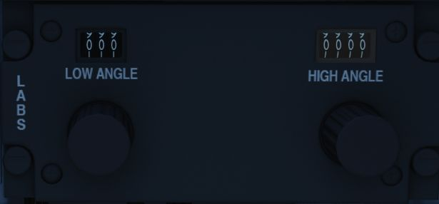
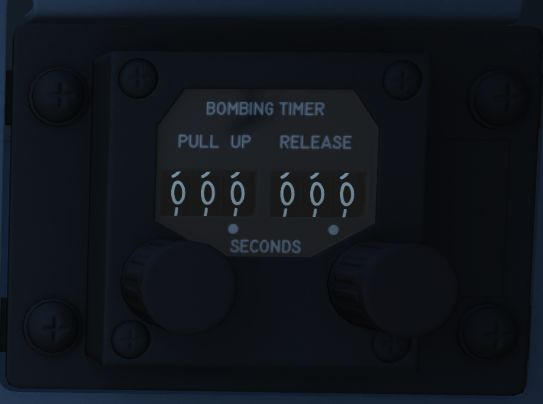
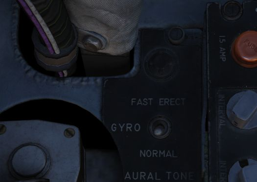

# Attitude Reference and Bombing Computer Set (ARBCS)

The AN/AJB-7 ARBCS is the automated release control system for time or
pitch-relative bombing. Interfacing with the Multiple Weapon Controls, Pedestal
Panel weapon settings, and bomb, laser guided, or the AGM-45, the system
releases the selected munition once the respective Bombing Timer or respective
Bomb Release Angle Computer pitch angle (gyro) target has been achieved.

The left side of the Delivery Mode Knob selects the ARBCS release modes. Both
LOFT and T LAD modes provide weapons release in a pull-up, with LOFT selecting a
4.0 G pull-up schedule and weapon release on achieving a set gyro angle value,
whereas T LAD assumes a 3.5 G pull-up schedule and release at the end of the
Bombing Timer setting. Necessary values for Low and High angle, as well as the
Bombing Timer are found on the provided tables.

## Bomb Release Angle Computer

The Bomb Release Angle Computer provides entry of the necessary target pitch
angles for ARBCS bombing modes. The values of HIGH (70 to 179.9 degrees) and LOW
(0 to 89.9 degrees) are controlled using their respective entry knobs.
Internally, the computer contains the release switches, as well as the resolver
to transmit the target angle values to the ADI director pointers.

A calculator for the input values in-game is provided by
the [bombing calculator](../../dcs/bombing_computer.md). You can open and close it by pressing
<kbd>RCTRL</kbd>+<kbd>B</kbd> in game.

## Bombing Timers

Timers for ARBCS bombing modes are available for PULL-UP (0 to 60 seconds) and
RELEASE (0 to 30 seconds). Both can be set in increments of 0.1 second, with 0.1
second as the minimum setting. The reference windows do not count down during
the bomb run.

When the PULL-UP timer is complete, required PULL-UP signaling will initiate,
along with any ADI director programming to show proper flight path. RELEASE
timing is mode dependent, and will occur once PULL-UP is complete, if required.

In LOFT and O/S modes, only PULL-UP timing is activated, and a value must be set
to energize the ADI pull-up flight path program.

In T LAD and TL, PULL-UP and RELEASE are both activated, in sequence, and both
require a value entry- PULL-UP to energize the flight path programming, and
RELEASE to generate the munition release signal.

In integrated LABS (ARBCS)/WRCS bombing, the above requirements are the same,
however the WRCS initiates the bomb run timing, rather than pressing the bomb
button. When the WRCS initiates timing, an audio tone is applied to signal timer
start.

A calculator for the input values in-game is provided by
the [bombing calculator](../../dcs/bombing_computer.md). You can open and close it by pressing
<kbd>RCTRL</kbd>+<kbd>B</kbd> in game.

## ARBCS Indicators

During ARBCS weapons delivery, a number of indicators are available to confirm
run initiation and at what step of the given run the aircraft is in:

1. Upon run initiation (bomb button press/WRCS initiation) and PULL-UP timer
   start, the Pull-up light turns ON.
   
2. At PULL-UP timer completion, the Pull-up light turns OFF, the reticle light
   turns OFF, and a steady Pull-up Tone (if switched ON) occurs.
3. As release pitch angle is attained, the Pull-up light turns ON, the reticle
   light turns ON, and the Pull-up Tone stops.
4. When the bomb button is released, Pull-up light turns OFF.

This indication sequence can occur with the master arm in SAFE for training
purposes.

## Gyro Fast Erect

Due to rapid maneuvering during a bombing run, gyro deviation can occur due to
fluid migration. While this deviation will resolve naturally at a rate of 1 to 2
degrees correction per minute over time, it can quickly be corrected by using the
FAST ERECT switch found in the front pilot cockpit on the left side console, at
a rate of 15 degrees per minute. This switch should not be held for more than 60
seconds, or damage can occur to the gyro.
