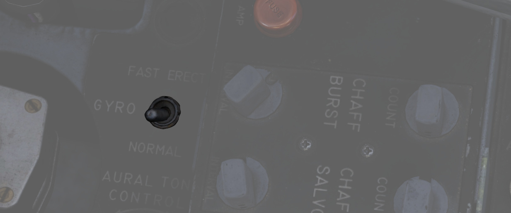

# 姿态基准和投弹计算机组（ARBCS）

AN/AJB-7 ARBCS 是与计时或俯仰相关的投弹的自动投放控制系统。ARBCS 连接到包括多武器控制、底座组面板上
的武器设置、还有各种武器如航弹、激光制导炸弹，又或者 AGM-45，该系统将在对应的轰炸计时器或对应的航弹
投放角度计算机的俯仰角（陀螺）达到设定值时投放选中的弹药。

投放模式旋钮左半边为 ARBCS 投放模式。LOFT 与 T LAD 模式可在拉起时投放武器，LOFT 将按照 4G 拉起制度
，在达到设定陀螺角度值时投放武器。T LAD 则假设以 3.5G 拉起方案，在轰炸计时器归零时投放武器。必要的
高低角度，还有轰炸计时器设置的数值都可在游戏中的表格中查到。

## 航弹投放角度计算机

航弹投放角度计算机为 ARBCS 投弹模式提供必要的目标俯仰角输入。WSO 可使用对应的输入旋钮控制高角度
（HIGH，70-179.9 度）与低角度（LOW，0-89.9 度）数值。计算机内置了投放开关以及解算器——来将目标角度数
值传输至 ADI 指引指针。

玩家可使用 [轰炸计算器](../../dcs/bombing_computer.md) 来在游戏内算出输入值。按
<kbd>RCTRL</kbd>+<kbd>B</kbd> 来在游戏中开关计算器。

## 轰炸计时器

ARBCS 投弹模式有拉起（PULL-UP，0-60 秒）与投放（RELEASE，0-30 秒）两个计算器。二者都能以 0.1 秒为增
量设置，最小值为 0.1 秒。在投弹过程中显示窗口中的值不会倒数。

拉起计时器倒数完毕后，将会发出所需的拉起信号，同时编程为显示正确飞行路径的 ADI 指引指针将一并开始工
作。投放计时则取决于模式，需要时会在拉起倒计时结束后开始。

上仰与越肩模式只使用拉起计时器，必须设置一个数值才能启用 ADI 拉起飞行路径程序。

计时低角度伞投与计时水平轰炸模式下依次用到拉起与投放计时器，两个计时器都要有输入值，拉起计时用来开
始飞行路径编程，投放计时用来生成武器投放信号。

在 LABS（ARBCS）/WRCS 一体化投弹模式下时，前文所述的需求不变，不过此时由 WRCS 而非投弹按钮开始轰炸
攻击计时。WRCS 开始计时的同时将响起一声音调提示。

玩家可使用 [轰炸计算器](../../dcs/bombing_computer.md) 来在游戏内算出输入值。按
<kbd>RCTRL</kbd>+<kbd>B</kbd> 来在游戏中开关计算器。

## ARBCS 指示器

在 ARBCS 武器投放过程中，将会依次出现多个指示，来帮助飞行员确认投弹程序开始以及飞机当前处在投弹的哪
个阶段：

1. 投弹开始（按下投弹按钮或 WRCS 启动）以及拉起计时器启动时，拉起灯亮起
   。
2. 拉起计时器归零后，拉起灯熄灭，准星灯熄灭，拉起音（若开启）持续播放。
3. 达到投放俯仰角时，拉起灯亮起，准星灯亮起，拉起音停止。
4. 松开投弹按钮后，拉起灯熄灭。

这一串指示在主军械开关在 SAFE 档位时也会出现，供训练使用。

## 陀螺仪快速调平

投弹过程中的快速机动会产生流体迁移，从而可能导致陀螺出现漂移。漂移将随时间以每分钟 1 到 2 度的速度
自然消除，但也可以使用位于前座左侧控制台的 FAST ERECT 开关来快速调平，速度可达每分钟 15 度。开关不
应接通超过 60 秒，否则陀螺仪可能受损。
