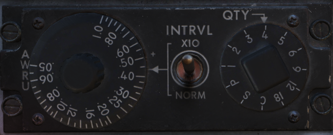

# Aircraft Weapons Release Unit (AWRU)

Used in the BOMBS and RKTS & DISP weapon modes, the AWRU provides interval and
quantity controls for munition delivery. The AWRU has both a manual and
automatic mode, and the resulting function is accessed with the appropriate
settings.

The Interval Knob contains 14 values, providing base interval timing of release
pulses while the bomb release button is held from 1/20th of a second (.05) to 1
second. This value can have a 10x multiplier applied to it using the INTRVL
Switch. In the NORM mode of the INTRVL switch, the release will apply as on the
Interval Knob, whereas when selected to x10, the 10x multiplier will apply- for
example, 1 second in NORM would become an interval of 10 seconds in x10 mode.

The Quantity Knob sets the total number of munitions dropped during a bomb
release hold, and applies the manual or automatic release functions based on the
value selected.

## Single-Manual: 1

In the 1 position, the AWRU is placed into manual mode. One munition will be
dropped on each bomb release press, with releases across multiple selected
stations dropping in a left-right-left pattern. The bomb release button must be
released, then pressed a subsequent time, to release another round.

## Single-Ripple: 2-18

In numerical positions 2-18, up to the total number of selected munitions will
be dropped according to the Interval setting. As an example, with a QTY of 6 and
an interval of .20, six bombs will be dropped, one every 2/10ths of a second
from the press of the bomb release button. The sequence will reset upon button
release, allowing subsequent ripples of the same quantity to be dropped.

## Single-Continuous: C

In position C, the quantity of weapons is dictated by how long the bomb release
button is held. The ripple will apply the set interval, releasing one munition
each pulse, until the bomb button is released.

## Pairs-Manual: P

Position P places the AWRU into pairs mode. With multiple stations selected,
each time the bomb button is pressed, a weapon will be released from each
station.

## Salvo: S

In the S position, the AWRU enters into salvo mode, functioning like
Pairs-Manual with single rounds released from each station, but using the set
interval value to release multiple salvos until the bomb button is released.
