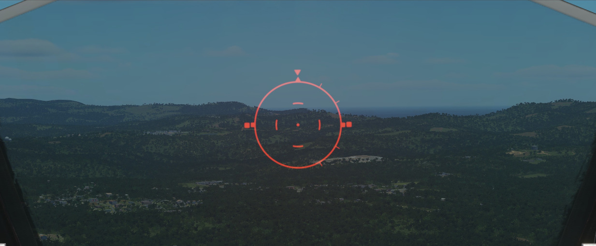
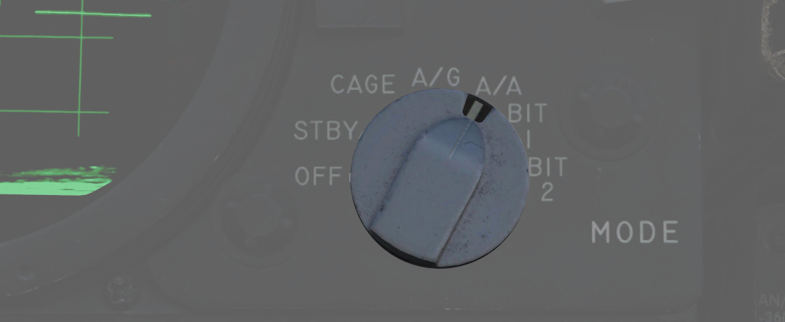
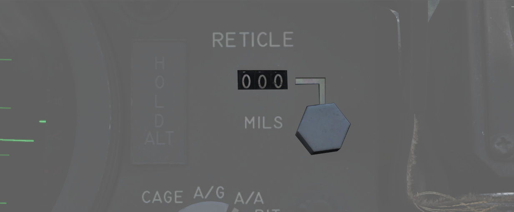
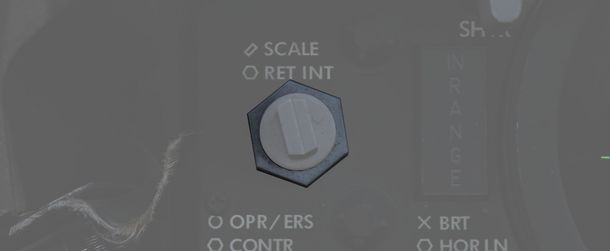
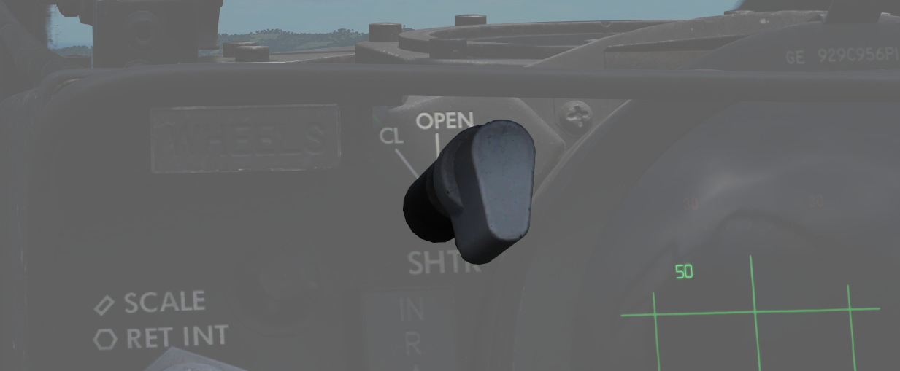
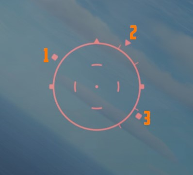
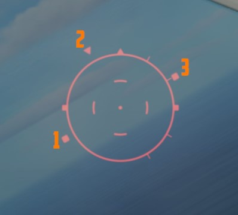
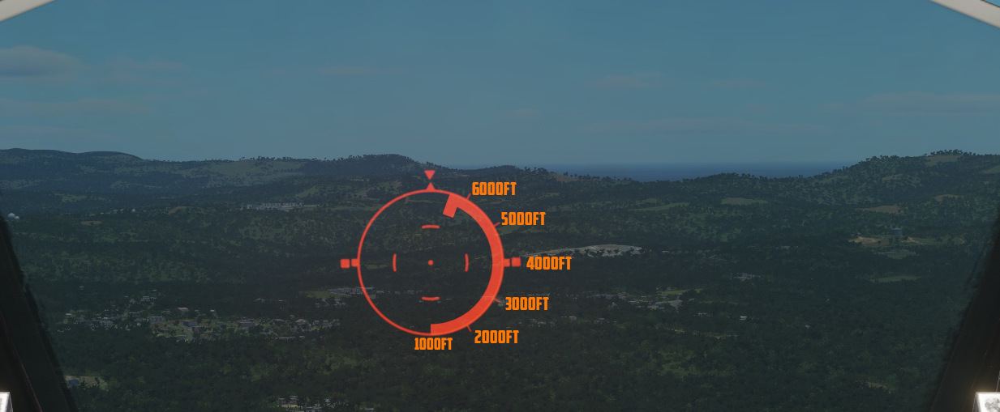

# Lead computing optical sight system (LCOSS)

The lead computing optical sight system or short LCOSS, is used to establish a visual
sight
reference to either air-to-air or air-to-ground weapons delivery. A red reticle is
projected on a
combining glass. The LCOSS features seven different modes that can be selected via the
Sight Mode
Knob.

## LCOSS Controls

### Sight mode knob

The sight mode knob selects the mode of operations which are the following:

| Sight mode knob     | Function                                                                                                                                                        |
|---------------------|-----------------------------------------------------------------------------------------------------------------------------------------------------------------|
| **OFF**             | De-energizes the sight system.                                                                                                                                  |
| **STBY**            | Energizes the sight system for warmup but does not display any reticle.                                                                                         |
| **CAGE**            | Reticle is displayed and caged at the radar boresight line (RBL).                                                                                               |
| **A/G**             | Selects the air-to-ground mode. The reticle is depressable from zero mils to 245 mils below the fuselage reference line (FRL).                                  |
| **A/A**             | Selects the air-to-air lead compute mode. The reticle position is governed by the sight gyro, radar range, the CADC Sensor and the cage button on the throttle. |
| **BIT 1 and BIT 2** | Energizes the lead computing amplifier relays so that fixed voltages are applied to the sight system for a self test. Displays self test pictures.              |

### Reticle depression control

The reticle can be depressed by rotating the reticle depression knob until the readout (in
one-mil
increments) shows the desired sight setting. The Reticle cannot be positioned manually in
azimuth.

### Reticle intensity control

Rotating the reticle intensity control knob changes the brightness of the reticle.

### Shutter lever control

The shutter control lever is a two position lever with positions of CL (closed) and OPEN.
In the CL
position a shutter is placed between the optical light source and the combining glass thus
preventing damage to the optics from bright sunlight. In the OPEN position the shutter is
removed
and the reticle will be displayed.

## Reticle Image

The reticle image that is projected onto the combining glass is composed of a fixed
reticle, roll
reference tabs, and a range bar. The fixed reticle consists of 2-mil diameter pipper
located in the
center of a 25-mil diameter segmented circle, and a 50-mil diameter completed circle.

The roll reference tabs rotate about the 50-mil circle. The roll reference tabs have two
seperate functions. During the offset bombing mode and the target finding mode the roll
tabs provide steering information from the WRCS. The position of the roll tabs, with
respect to the fixed index tabs, indicates the angle between the ground track and course
to the target. In every other mode of operation the roll tabs indicate the aircraft roll
attitude, supplied by the INS.

| Roll tab left roll                                          | Roll tab right roll                                           |
|-------------------------------------------------------------|---------------------------------------------------------------|
|  |  |
| _1 left roll tab, 2 center roll tab, 3 right roll tab_      | _1 left roll tab, 2 center roll tab, 3 right roll tab_        |

The range bar is semicircular and appears on the inside of
the 50-mil circle only when a target has been acquired by radar lockon. The instantaneous
length of the range bar, and the rate at which the length is changing indicates the actual
radar slant range and the range between the aircraft and the target. The minimum length of
the range bar (and minimum range indication) exists at the 6 o'clock position. With gun
selected the inside tab of the range bar at 6 o'clock, the actual radar range is 1000 ft.
At the 5 o'clock position the range bar is 2000ft continuing with 1000ft increments per
tab. The maximum range that can be shown is 6667ft with guns selected. When any other mode
than GUN is selected the range bar is 3000ft at the 6 o'clock position and 6000ft at the 5
o'clock position, with increments of 3000ft per tab. The maximum displayable range is then
20000ft.

| Range bar with guns                                              | Range bar in any other mode                                     |
|------------------------------------------------------------------|-----------------------------------------------------------------|
|  |  |

## Reticle Cage Function

The reticle cage function is applied through the CAGE button on the throttle. With the
sight operating in the (GUNS) A/A mode and with CAGE pressed (no radar lockon) the reticle
is caged at radar boresight line (RBL). When CAGE is released, a pseudo range of 1000ft is
supplied to the computer but the range bar is not displayed. With radar lockon the
stiffening function is applied as long as CAGE is pressed. The range bar continues to
indicate the actual radar range or the maximum displayable range. When CAGE is released
the reticle moves in azimuth elevation to display the lead required to a maximum of
4000ft. This will only happen with GUNS selected.
